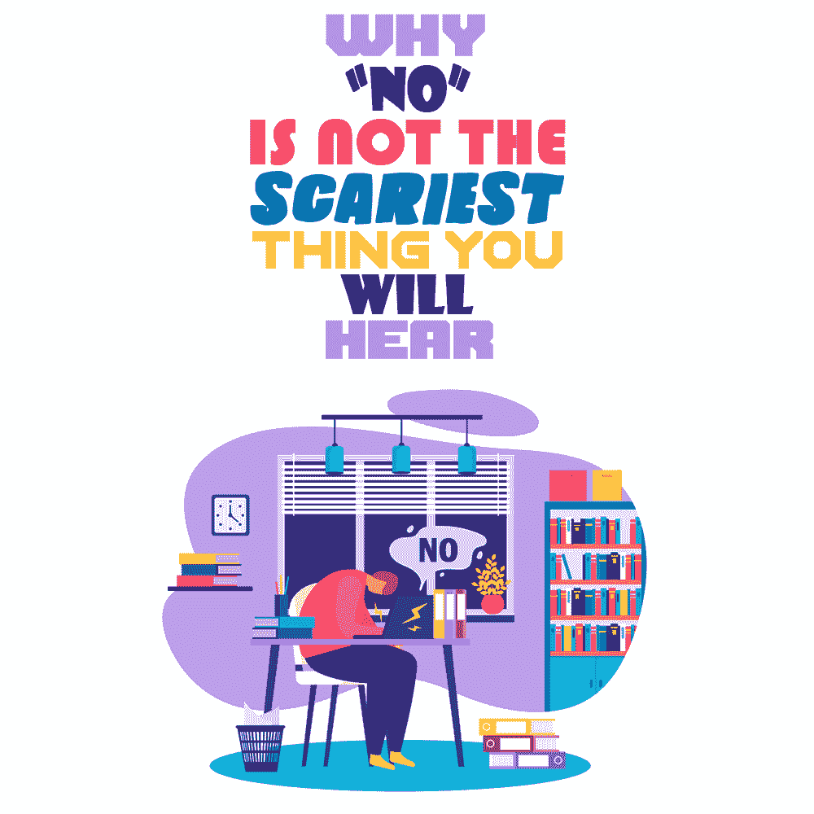

# 为什么“不”不是你听到的最可怕的事情

> 原文：<https://simpleprogrammer.com/no-isnt-scary/>

*剧透警报:简单程序员积极寻求 2021 写手和投稿人。想了解更多？查看我们的[为我们写的页面](https://simpleprogrammer.com/write-for-us)。对向我们提交内容感到紧张吗？继续阅读…*

许多人永远不会走出他们舒适和自满的盒子，因为他们害怕被拒绝。

## 他们害怕听到那个微小的字眼:**不**

I somehow missed that sequence in my DNA structuring.

**想知道怎么从你的里面消除？**

我的想法是，如果我已经没有做我想做的事情，那么无论如何我都会变得很老。

如果这是一个五年级的逻辑应用题，顺序应该是这样的:

> 伊莉莎想做事情 A，但她目前没有做事情 A。
> 
> 在决定如何达到将要做的事情 A 的最终结果时，Elisa 面临两种可能的行动方案:
> 
> 解决方案 1——坚持她目前的行动路线，希望她能做 a 件事。
> 
> 解决方案# 2——询问不祥的看门人她是否可以做事情 A
> 
> 如果 Elisa 想有更大的机会做 A 件事，她应该选择哪种解决方案？

人们经常问我如何开始自由职业生涯并得到工作，因为我曾经把它作为我一生的工作。我想说，我是一个才华横溢的战略家，人们真的会被自己绊倒，让我和他们通话。

可悲的是，事实并非如此。

事实是[你只需要成为一个超级固执的人](https://www.amazon.com/dp/B00N6PETVC/makithecompsi-20)完全不知道大多数情况下的正确“协议”。

想象一下:这是 2021 年的元旦(预示着“我们都在等待的 2020 年的结束！)和其他人一样，这一年你经历了异常疯狂的转折。

盯着你为自己设计的课程，其中包括编写一个全新的应用程序，或者最终学会如何演奏迪吉里杜管，你会感到身体上的折磨，想知道“这是我想要的吗？这会让我快乐吗？”

这正是十年前发生在我身上的事。

## 那是 2010 年，我想写作。

写博客是我喜欢的事情，人们似乎认为我还不太擅长，所以我只需要找到一种方法来支持我的人生决定，用切实的证据证明我可以通过写小文章和专栏来维持生活。评估辛迪加的前景，很明显，在线媒体是人们前进的方向。

我花了几个小时看了我熟悉的各种商店，认为我可能有机会在。

最后，我决定在缅因州最大的报纸和媒体网站上推出一个关于恋爱和约会的专栏。2010 年是我的爱情年(#protip:选择一个词来围绕长期目标，这样你会觉得你有方向和目标)，这似乎是一个专注于我的意图的好方法。

我对推销专栏一无所知。

我研究了大波特兰的单身人口统计数据，附近的媒体博客，并写了一篇样本。在浏览网站时，我在底部找到了一个给内容制作人发电子邮件的小链接，因为他们没有一整页详细说明如何为他们写作。

*(PS——我们有一个关于简单程序员的页面，告诉你 [**如何提交一篇我们会爱上并想发表的文章**](https://simpleprogrammer.com/write-for-us) 。)*

## 他们完全可以/可能应该对我说“不”。

事实上，我相当肯定他们会的。我有一个完整的理由清单，他们会是白痴雇用我这个演出。它们包括但不限于:

1.  我没有常规写作任务的经验
2.  我唯一的凭证是当地报纸的分类文章和我自己的博客
3.  我认为 T1 不知道如何“正确地”写一份推介
4.  十多年没有谈过恋爱，我是最没有资格写恋爱的人之一
5.  当(实际上)我是一家保险公司的中层经理时，我觉得自己没有资格冒充作家

但是我写的一些东西引起了那个疯狂的内容制作人的注意，她同意在周四和我见面。

我的推销已经完成了它需要的工作:

*   实际上，我对出版物的内容非常熟悉，并解释了我的专栏将如何为其增添内容
*   我知道风格指南，并写了一个适合他们声音的样本
*   我花了时间为这本刊物写了一些非常个性化和策划的东西
*   我解释了我想与读者分享的故事，以及它如何为读者带来价值和有趣的新视角
*   我结束了我确实拥有的经历，记下了什么是伟大的，以及我认识到我可能缺乏但有韧性和动力的地方。

我确信我犯了错误。

但在会议开始后的 30 分钟内，我就带着一份合同走出了报社的办公室，这份合同是为他们最新的在线专栏《The Single Slice》撰写文章。

## 你可以说我是一个潜在的拒绝迷

有些人从飞机上跳下或骑山地车翻越悬崖获得肾上腺素刺激，而我从失败中获得刺激。

你问这有什么好激动的？

我喜欢看着一个不可能的情况，然后想办法把它变成可能。然后我收集所有我需要的数据和信息来实现它。最后，我把我所有的发现以一种现在不可能不给我我的方式呈现出来。

问问我的任何一个朋友，他们都会告诉你我对此有多可笑。我经常要求一些正常人想都不敢想的事情。

## 你不要求就已经得到了拒绝。

So why not ask and see what happens.

你已经在拒绝自己了，让别人去做还能更糟吗？

当然，当你把决定权交给别人的时候，你并不在掌控之中。但是，当你完全避免这种情况时，你只是在欺骗自己，让自己认为一切都在你的掌控之中。

那不是控制。

那就是逃跑。

## 当你要求得到你想要的东西时，“不”并不是你会听到的最可怕的话。

你将听到的最可怕的事情是你脑海中的那个小小的声音。

带着它的思想和遗憾在寂静中翻腾。

因为你从来没有给自己机会。

**_ _ _ _ _ _ _ _ _ _ _ _ _ _ _ _ _ _ _ _ _ _ _ _ _ _ _ _ _ _ _ _ _ _ _ _ _ _ _ _ _ _ _ _ _ _ _ _**

## **为我们写简单的程序员**

我刚才偷偷放在上面的那张 PS 不是开玩笑的。我们在 Simple Programmer 接受新的贡献者和作者。

甚至还有 [**一个完整的为我们写的页面**](https://simpleprogrammer.com/write-for-us) ，上面有我们正在寻找的文章的确切主题和例子，这样你就不用做我十年前第一个在线专栏的一半工作了！

仍然感到有点紧张，需要更多的指导吗？我写了一整篇关于[在 Simple Programmer](https://simpleprogrammer.com/simple-programmer-guest-post/) 上发表文章的注意事项。