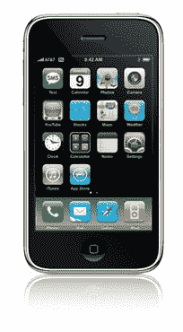

# 目标-我来了！

> 原文：<https://simpleprogrammer.com/objective-c-here-i-come/>

关于我为 Android 发布的[起搏器](https://simpleprogrammer.com/2011/01/04/introducing-pacemaker-for-android/)应用程序，我已经说得够多了吗？

第一个月的销售结束了，比我预期的要好很多。前 30 天大约有 75 次购买。数量不是很大，但这几乎是在没有广告的情况下，大多数找到这款应用的人都是在市场上找到的。

那么起搏器的下一步是什么？

嗯，随着本月 iPhone 在威瑞森上市，我认为很明显是时候推出 iPhone 版本了。

唯一的问题是…

## 我对 iPhone 开发一无所知！

上周我没有，但我正在慢慢学习。

上周我买了我的第一台苹果电脑，一台 MacBook Air。

我不得不说，自从我上次使用以来，MAC 上的操作系统已经有了很大的进步。(我有没有提到我甚至不知道如何正确操作 Mac 电脑？但我懂 Unix，所以应该没问题。)

我觉得 Mac 的界面比 Windows 更加精致和统一，但是当你考虑到所有低级的 C 和客观的 C 代码时，它的内部相当可怕。

然后你又不得不考虑。NET CLR 就写在一个非常复杂的 win32 API 层之上，这是一堆大约有 20 年历史的可怕的 C 代码。

因此，我开始了一个勇敢的新探索，学习 Mac、iPhone 和 Objective-C，并以某种方式将我的应用程序移植到这个平台上。

## 目标 C 有点像另一个世界

我在努力思考如何描述 Objective-C，以下是我得出的结论:

> Objective-C 就像那些电影中的一个，在另一个宇宙中，同样的人存在于这个宇宙中，但在某些领域，他们的技术真的很先进，但在其他领域，它真的很古老。就像一堆人开着飞行汽车飞来飞去，但他们的武器还是弓箭。

我曾经是一名 C++程序员，所以没有太多的东西吓到我，但 Objective-C 中的一些神奇构造确实非常可怕。

我今天刚刚读到一个奇怪的构造，它允许你基本上创建一个 C#接口的等价物，但是在 Objective-C 中它被称为“协议”这看起来很好，很正常，直到我读到一段话，说你可以定义一些方法为“可选的”什么？

让我用 C#术语来表达，这样你就能理解了。在 C#中，它看起来像这样:

这不是开玩笑。我还是不太明白这是做什么用的，但是有点意思。

我发现的另一件有趣的事情是 Objective——C 有一个叫做“选择器”的东西。它不是一个函数指针，而是一个引用方法名的变量。

这和函数指针有什么不同？

它实际上是被引用的方法的名称。因此，如果您有一个具有“Wag”方法的类 Dog，并且您有一个具有“Wag”方法的类 WildGuesser，那么向它们传递“Wag”选择器将导致非常不同的结果。多么奇怪。

## 被吸进 Mac 世界的感觉很奇怪

实际上有点好笑。我们这些 Java 和 C#程序员基本上做着同样的事情；创建我们的界面，争论依赖注入，嘲笑我们的单元测试，这些戴着领结，穿着名牌牛仔裤的 Mac 极客正走向一个完全不同的方向。

我们的两个平行宇宙发生剧烈碰撞只是偶然的。iPhone 出来了，突然所有这些奇怪的“Mac 男孩”都在教我们这种新的旧语言，并提醒我们再次释放自己的内存。

看在上帝的份上，我 10 年来第一次导入了 C 头文件！这太疯狂了。

但是，我不得不承认这真的很有趣。

## 有时候改变一下节奏会让人精神焕发

我并不是说我刺耳的语言是对你们 Mac 头的贬损。你知道你很酷，你的儿子史蒂夫正在引领本世纪的计算机革命。

我是真心的。干得好，伙计们，你们可能会接管世界。

实际上，我很享受这种经历，并开始认为如果我活着出来，我将会获得一些关于 C#和 Java 编程的非常有价值的见解。有时候从一个完全不同的角度看待事物是有好处的。

谁知道呢，也许我会写一篇我梦寐以求的关于 C、Java 和 C#的文章。

但是关于……

## MonoTouch？

咩。如果我要为一个平台编程，我就要为那个平台编程。我不打算一半学习如何为 iPhone 编程，一半学习 C#拐杖。我没有为 Android 这么做，也不会为 iPhone 这么做。

为什么？

因为我固执暴躁？部分原因，但我也有一些合理的理由:

1.  MonoDroid 和 [MonoTouch](http://monotouch.net/) 都在手机框架上实现了另一层。增加这一额外的层使得做低层次的东西变得更加困难，对于像电话这样的低层次的东西，做低层次的东西通常是重要的。
2.  你仍然在使用 Android 或 iPhone 的底层框架。这并不像在幕后使用 C#代码允许你写一个 Silverlight UI，你可以在任何移动平台上使用。你仍然需要学习整个手机开发框架，这与第三点相吻合…
3.  原始 Android 或 iPhone 开发比 MonoX 开发更容易获得帮助和找到资源。这里并不是要抨击 Mono 项目，但是大部分移动编程都是花在如何做事的谷歌搜索上的。坚持使用 C#你实际上是在限制自己寻找答案。
4.  改变和学习不同的东西是好的。我不确定你能完全欣赏一个框架或平台的设计，除非你按照它被设计的方式去开发它。我可能是错的，但我认为在 iPhone 或 Android 平台上使用 C#存在潜在的“迷失在翻译中”的问题。

在我学会 iPhone 开发之后，我可能会尝试 MonoTouch，看看它是否会让我的生活更轻松，但我首先需要一个良好的基线。

好了，我要上路了。去衣柜后面的“备用房间”我得去见图姆纳斯先生，我们正在和沃兹尼亚克先生和乔布斯先生喝茶。

