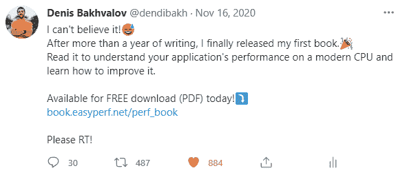

# 为什么提供你的产品为“支付你想要的”可能是一个更好的选择？

> 原文：<https://simpleprogrammer.com/offering-pay-what-you-want/>

你在准备未来占领世界的产品吗，你还没有决定定价方案吗？那就考虑默认免费吧！

你可能在想:“胡说，荒谬！我为什么要这么做？”好吧，也许这篇文章会给你一些你以前没有想过的视角。

我创建的第一个免费产品是 2020 年 11 月发布的免费书籍,并且非常成功:迄今已有 7000 多名读者。对于一本书在一个非常狭窄的利基，这是相当大的成就。我的邮件列表增长了 10 倍以上(到目前为止有 5000 多人),并且仍然能够通过在[亚马逊](https://www.amazon.com/dp/B08R6MTM7K/makithecompsi-20)上销售平装本赚很多钱。

我最近推出了我的[在线课程](https://products.easyperf.net/perf-ninja)，采用了同样的货币化方案，我预计它会像第一个课程一样成功。

在这篇文章中，我将与你分享我的经验——提及利弊——我将向你展示提供基于捐赠的产品如何能够带来显著的长期好处。

## 我创造免费产品的经验

坦白地说，让我的产品免费的想法并没有立即出现在我的脑海中。这件事在我脑海里酝酿了几个月。像大多数人一样，我想采用传统的方案，即以固定价格提供我的产品。只有在我定义了我的实际目标和我想通过推出我的产品来实现的目标之后，我才能够正确地评估每个选项。

我真正想要的不是挣钱然后离开。我的主要目标是[建立个人品牌](https://simpleprogrammer.com/personal-brand-reputation/)，为自己建立一个名字，并得到关注，这在当时对我来说比赚几千美元重要得多，如果你住在加利福尼亚，这很容易解散。

让我重申，明确定义你的目标是至关重要的！如果你这样做了，选择就会容易得多。我以长期利益为目标，并据此采取行动。这里的短期目标只是赚些快钱，然后再找一份工作，而不是真正与客户建立关系。如果你还同意我的观点，我准备了一份免费产品的利弊清单。先说积极的一面。

## 提供免费产品的好处

一个免费的产品可以接触到更多的人,因为这是一个显而易见的事情。是免费的吧？患有 FOMO 的人会特别喜欢它。更多的人会了解你和你的好东西。对于我的书，我的主要目标是最大限度地增加读者数量，并与他们建立关系。根据各种资源，一般技术书籍在其一生中的销量远低于 1000 本。我显然能够超越平均水平。

如果你认为每个人都会买你的东西，因为它太棒了，我可能会让你失望。如果营销不善，即使是最伟大的产品也会被忽视。如果你还没有为自己建立一个名字，不要从一开始就期待大量的销售。定向广告可能有助于推动销售，但它们不会与你的受众建立长期关系。

我相信你需要首先给那些以后会成为你顾客的人很多价值。你赢得了你的信用，这样下次人们就会渴望购买你的产品。每一个新产品都会比前一个卖得好得多。我收集了近 5000 封电子邮件，来自对我的工作感兴趣的人。赢得观众是关键！你牺牲了一些钱去接触更多的人和建立你的品牌。

让他人参与到免费产品中来更容易。这对我来说是最重要的事情。当人们知道产品将会是免费的，他们会愿意为之做出贡献，因为他们知道他们的工作不会被默默地用来赚钱。没有附加条件。他们追随你的想法，并想成为其中的一部分。

这个事实让我能够利用许多伟大人物的作品。我的书有 45 位书评人，还有其他五位对我的书有重大贡献的人。我怀疑出版商会带来那么多劳动力。让来自不同背景和不同行业的人参与进来，可以做出质量更好的产品，因为它要经过数百人的检验。

你把自己从愤怒的顾客中释放出来。人们再也不会发来充满仇恨的电子邮件，抱怨产品不符合他们的期望。产品是免费的吧？你不喜欢吗？没关系。但是没有人会给你发信息要求退款，因为他们没有支付任何费用。从这个意义上说，你的因果报应受到了保护。

以上所有听起来肯定很棒，但让我们面对现实:这个世界被传统的付费产品所主宰。我听到的最常见的反对你生产免费产品的理由是这样的:“丹尼斯，如果你免费提供一切，你怎么赚钱？

## “按需付费”定价

First of all, there are people earning thousands of dollars on donations, so this is definitely a viable option to build passive income. Donation-based products usually provide the so-called “Pay What You Want” option where the buyer determines the price of your product. Some of the most popular ways of getting donations are via Patreon, Paypal, Github Sponsors, and even cryptocurrency wallets.

当你允许你的顾客为你的作品选择价格标签时，你实际上是让他们根据他们从中获得的价值来付费。“支付你想要的”计划反映了它给人们带来的价值。

例如，我的免费书籍的一笔捐款是 100 美元。想象一下，有人花 100 美元买了一本可以免费下载的书！对这个人一定很有用吧？通过贴上固定的 30 美元的价格标签，你限制了那些真正喜欢你作品的人的优雅。

此外，灵活的价格使贫困国家更容易获得该产品。加州人可以花 30 美元买一本书，没问题，但在其他国家，可能就没那么容易了。

### 意想不到的机会

第二，我认为人们在这里忽略了一个事实，那就是你可以将你的社会资本转化为实际的金钱，但反过来并不总是可能的。这就像一个鹅送金蛋的故事:你不杀它的时间越长，发薪日就越好。在某些时候，你可以决定:“好吧，我已经建立了足够的声誉，我现在可以用它来赚钱了”。

有很多方法可以在你的个人品牌上赚钱。你可以通过提供贴有价格标签的传统产品来做到这一点。现在你有了忠诚的顾客，销售就容易多了。此外，你可以通过在你的平台上做广告或参与联盟计划来赚钱。最后，你可以接受一份薪水更高的工作，因为你有良好的声誉。

但它真正的美妙之处在于意想不到的机会向你走来。你可能会突然发现一群人力资源人员在敲你的 LinkedIn 账户，邀请你加入播客和其他合作。你永远不知道这个世界可能带给你的所有惊人的机会。所以要有耐心，并且[相信过程](https://simpleprogrammer.com/trust-the-process/)。

在他广受欢迎的书《百万富翁浪子》中，MJ·德马科写道:“影响数百万人，你就会赚到数百万。”所以，我认为你真正应该关注的是如何给尽可能多的人带来尽可能多的价值。金钱会随之而来。

但是好吧，你肯定想听听免费产品的其他缺点是什么。没有它，我们不会有一个完整的画面。

## 提供免费产品的坏处

这就是为什么你可能不想免费提供你的产品。

有些人认为如果一个产品是免费的，它一定是低质量的。真的，而且很难反。你真的要做出好的产品；没有解决办法。做好你的工作，让口碑来做剩下的事情。此外，您可以通过提供产品的试用版和高级版来区分您的产品。很多公司都是这么营销产品的。

“想买什么就买什么”可能对实物产品或高价产品不起作用。的确，卖一辆价格从 1000 美元到 20000 美元的汽车是无利可图的，你会遭受巨大的损失。在食品行业有一些[实验](https://www.fastcompany.com/40582757/why-paneras-experiment-with-pay-what-you-want-dining-failed)并不成功。但在信息产品和软件等领域，由于价格低于 100 美元，它完全有意义。

## 如何让基于捐赠的产品更有效

不要忘记要求付款或捐赠！不问当然得不到。你还应该让用户容易捐赠。在你的博客或销售页面上添加一个 Paypal 按钮是一种方法，但你也可以让人们去你的 Patreon 和 Github 赞助商页面。此外，秘密捐赠也越来越受欢迎。

请人们在消费你的产品后付款。你的顾客在尝试之前是没有办法知道这个东西好不好的，对吧？但是一旦他们有了，他们就能真正评估它的价值。当人们发现它有用时，他们会更愿意捐赠。

说出钱会去哪里。这可能是支付你的费用或慈善活动；两者都是很好的理由。如果人们知道他们的钱将如何被花掉，他们就更有可能付钱。尽可能透明。

表明你有一个远大的目标。有抱负和远见的人就像磁铁一样，每个人都想追随他们。还记得阿甘正传跑步吗？只是跑跑步，没什么特别的，对吧？尽管如此，每个人都认为他在执行一项追求大目标的任务。所以人们开始加入他，因为他们想成为一个更大的想法的一部分。这里也一样，你需要表明你正在努力实现某些目标。

## 一个被忽视的有潜力的想法

Free products are definitely not a new way of marketing, but it’s a frequently overlooked idea that can provide more long-term benefits.

通过让你的产品默认免费，你可以接触到更多的人，更快地建立你的个人品牌。此外，让其他人参与到你的项目中来也容易得多。而且，你也不用担心愤怒的付费客户。

与此同时，肯定会有挑战:你需要确保你的产品是高质量的，因为免费通常意味着平庸。此外，某些产品可能不太适合这种模式，因为它们可能会导致亏损。

然而，一般来说，提供免费产品会有意想不到的机会。仅仅是你能接触到许多人，看到各种各样的门打开这一事实就绝对值得你去努力。试试看！