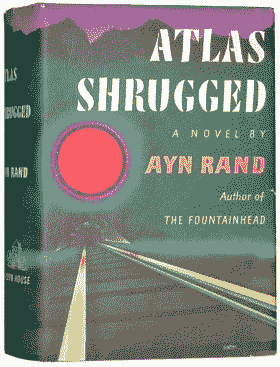

# 通往成功的道路不止一条

> 原文：<https://simpleprogrammer.com/one-path-success/>

很长一段时间，我很难调和牛仔程序员和一丝不苟的软件工匠都能取得非凡的成果。

我从来不想相信直接部署到生产的编码器是有效的。我总是试图找到一些方法来证明这种行为或方法总是产生低劣的结果。

但是，虽然这些牛仔编码员中的一些人撞上了墙，崩溃了，但其他人确实成为了他们项目的英雄，并且能够一次又一次地将他们的公司从灾难中拯救出来。

虽然我不愿意承认，但这些叛逆者往往是他们工作的公司中最有价值的员工。

## 成功的不仅仅是牛仔编码员

这并不是说牛仔编码员是唯一取得优异成绩的人。也有与牛仔编码员完全相反的开发人员；那些遵循当时最佳实践的人，一丝不苟地测试他们的代码，编写单元测试，将他们的工作视为手艺，并以最大的专业精神对待一切。

我们期望这些人写出最好的代码并产生最多的结果——有时他们确实如此——但是，我们经常看到这些软件工匠类型的产品价值接近于零。他们知道如何编写代码，如何漂亮地完成，但所有的仪式和一丝不苟都妨碍了性能。

现在，在你拿出你的干草叉之前，虽然这听起来像是我站在牛仔程序员一边，但实际上我更认同软件工匠的方法。我相信编写可靠、优雅的代码并“正确地”做事这就是为什么我对那些似乎能取得非凡成果的牛仔编码员感到如此困惑。

在我心目中，他们对董的一切都完全错了。我经常试图合理化为什么他们的选择和方法论是错误的；为什么这种想法和“马虎”最终会咬他们，他们会结束平均不到平庸的结果。

而且，就像我说的，虽然直接部署到产品肯定会有一些可怕的后果，并且通宵熬夜独自编写一个应该在一个晚上花两个星期的完整功能可能会产生一些难以维护的代码，但事实证明，这些叛逆者中的一些人实际上获得的结果远远超过了“正确的方法”

## 相互矛盾的想法

很长一段时间，我很难调和这两种相互冲突的观点。我想相信我的方式更好。我想找到一个确凿的证据，证明捷径和深夜编码狂欢总是导致可怕的失败和壮观的爆炸。但是，证据太多了，不容忽视…两种方法都有效。

尽管牛仔程序员和软件工匠在编写代码方面有完全不同的方法和完全不同的哲学，尽管一个人一丝不苟，另一个人有时完全不顾后果，但他们都可以获得极大的成功。

有太多的数据可以忽略。一次又一次，我看到整个公司把他们的成功归功于一个掌握生产关键的坏脾气的程序员。事实上，当我回想并试图找出那些拥有臭名昭著的糟糕代码和编码实践，但获得巨大成功的公司时，我可以列出一个相当大的列表:Twitter、脸书、WordPress——hell 4Chan。但是，当我试图列出一个非常成功的公司的列表，它们的成功归功于一丝不苟的严格的软件开发实践和测试驱动的开发时，我知道它们就在那里，但是我真的不能说出任何一个。

我花了几个月的时间思考复杂的数据库迁移方法，以确保代码版本与数据库版本完全匹配。我开发了复杂的系统，以确保部署尽可能顺利和自主地进行，但我惊恐地看到我的客户向我演示他们的数据库迁移过程，其中包括使用 SQL 比较工具手动“频繁地”将更改从开发推向生产

但是，到了最后，他们的系统运行良好，很少出现问题。如果有，他们会想办法解决，然后继续前进。当我的系统失败时，几乎总是灾难性的失败。恢复通常非常困难。当然，当事情成功时，很容易说我选择以正确的方式做事是正确的——总的来说，我仍然相信这是最好的方式——但是，很难告诉一直使用 SQL compare 来迁移数据库更改的公司，他们需要投资数千美元和数月的时间来修复对他们来说非常好的东西。

从这里只能得出一个合理的结论。只有一个明确的方法来解决这个矛盾。正如弗朗西斯科在《阿特拉斯耸耸肩》中所说，“矛盾是不存在的。每当你认为你正面临一个矛盾时，检查你的前提。你会发现其中有一个是错的。”

那么，不存在开发软件的“正确”方法，或者说有许多开发软件的正确方法*肯定是真的——尽管它们中的许多看起来令人厌恶。*

*我不敢相信我花了多长时间才明白这个简单的道理。我相信这是一个真理，你必须靠自己，用自己的方式去领悟。当我写下这些文字时，我意识到正在阅读这篇文章的你可能不同意我的观点。我只能说，我曾经和你想的一样。在某些方面，我仍然如此。我只是慢慢开始接受我花在寻找正确方法上的时间是浪费。*

*深深地，我们愿意相信只有一个真理。我们愿意相信我们能找到正确的道路，因为认为没有人知道答案的想法太令人沮丧了；可能不存在正确的 T2 路径。*

## *不仅仅是软件开发*

*这不仅仅适用于软件开发。在生活的许多领域，有多条、有时是相互冲突的道路通向同一个目的地。我见过股票交易者和房地产投资者，他们有着完全不同的策略，完全矛盾的观点，他们通过选择做他们认为正确的事情而忽略其他事情，获得了巨大的成功。*

*我见过在饮食、营养、锻炼甚至基础生理学上有着完全不同理论的健美运动员和运动员，取得了惊人的成绩。从各方面来看，一种方式应该比其他方式优越得多——然而，事实并非如此。*

*现在，这并不是说你可以做任何你想做的事情，如果你坚持足够长的时间，你就会成功。有一种东西叫做普遍真理。我坚信这一点。我只是认为我们对它的看法是如此模糊，如此模糊，以至于我们被迫对同一现象提出不同的解释。这就像牛顿物理学和量子物理学。在许多领域，他们似乎完全矛盾，但我们知道这只是因为我们无法看到更深层次的真相。*

*在几乎不透明的玻璃背后，牛仔程序员和软件工匠之间有着相似之处，这使得他们都获得了成功。这两种方式都行得通是有原因的，只是我们还不知道而已——我们可能永远也不会知道。*

## *但是，这有什么意义呢？*

*那么，从这一切中你能收集到什么？为什么要提起这个？*

*因为，我认为重要的是要明白，你对某事越有把握，你就越不可能是对的。我已经被证明错了无数次，因为我坚信成功只有一条路，而且我就在这条路上。*

*相比之下，我发现我最大的成功来自于我放下自己的观点和信念的时候——哪怕只是一会儿——看到即使我不同意甚至不理解别人的观点，但往往还是有东西可以从中学习。*

*很难释怀。很难接受我们永远找不到答案；真相可能是不可知的。但是，如果你想尽你所能做到最好，如果你想在别人的旅程中帮助他们，而不是阻碍他们，你必须意识到有多种成功的途径。*

****要获得对软件开发心理学的更深入的见解，对个人进步和生产力的随意漫谈，以及偶尔有价值的见解，[在这里注册](https://simpleprogrammer.com/email)，我会将这些帖子直接发送到你的收件箱。****