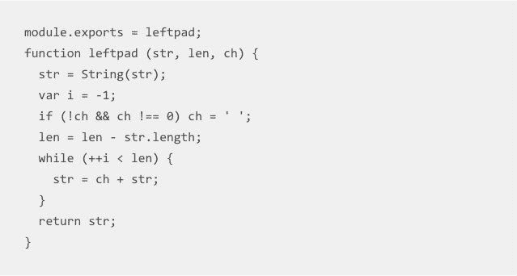

# 一个程序员如何破坏互联网

> 原文：<https://simpleprogrammer.com/one-programmer-broke-internet/>

2016 年 3 月发生了一系列令人惊讶的事件，一名来自加利福尼亚州奥克兰的男子删除了一段代码，让数千名网络开发人员措手不及。

尽管现在新闻传播速度极快，而且很快就过时了，但这个主题仍然值得一写，因为它包含的信息对程序员来说在未来几年都很重要。

## 故事

当 Azer Koç ulu 决定删除只有 11 行代码的 left-pad 包时，他中断了数千个项目。他之前将其发布到了 [npm](https://www.npmjs.com/) ，这是一个流行的平台，用于查找和安装用 JavaScript 编写的开源软件。

Azer 为程序员创建了一个包，帮助他们轻松地设置模板。问题的出现是因为他将他的开源包命名为“kik”，这是一个流行的信使应用程序的名字，它的开发者也使用 npm。

Kik 的代表担心用户会被 Azer 软件包的名字与他们自己的名字混淆。这就是为什么该公司决定联系程序员，请他重新命名他的软件包。

由于 npm 是一个开源社区，Azer 认为他们没有权利也没有权力让他改变他的包的名字。但他错了。国家预防机制站在 Kik 一边，强迫 Azer 离开该社区。

Npm 认为支持 Kik 符合其社区成员的利益，因为该公司拥有庞大的用户群。因此，他们认为 Azer 更改其软件包的名称更明智。但是程序员一点也不喜欢这样。

Kik 聘请了一名专利律师联系 Azer，目的是更改其软件包的名称。在电子邮件交换之后，承包商鲍勃·斯特拉顿意识到 Azer 不会让步。土耳其开发人员坚信开源哲学，不想合作。该公司随后直接联系了 npm。

阿泽的最后一条信息表明了他的失望。

“艾萨克；我对你在这里的决定非常失望。我认识你多年，绝不会想象你会站在企业专利律师一边，威胁开源贡献者。”

Koç ulu 不想改变他的一揽子计划的名称，所以他决定从国家预防机制中删除他的所有贡献。他说，他不想再成为国家预防机制的成员，并要求他们拿走他的包裹或教他自己如何做。

## 然后是一片混乱

就在科丘鲁发出最后一封邮件的两天后，npm 意识到他们遇到了问题。但不幸的是，他们不是唯一的。来自世界各地的数千名程序员在试图运行他们的代码时，开始收到一个神秘的错误。

这个错误使得开发者无法更新某些应用和服务。有一行代码最突出。

从这个错误消息中可以明显看出，如果没有名为“left-pad”的包，代码就无法运行，而 npm 的注册表中没有这个包。大多数程序员不知道这个包，直到它出现在他们的显示器上。

所有的软件都是建立在其他软件之上的，而其他软件又依赖于其他软件，如此等等。加载应用程序可能需要来自 npm 的软件包，这些软件包也依赖于其他软件包。

Npm 之所以受欢迎，是因为它们通过在一个可靠的地方维护这些依赖关系来帮助管理它们。但是，当一段关键的代码被删除时，这种可靠性很快就变成了一片混乱。

这种情况本可以通过更好的沟通、群聊、[员工日程安排](https://www.shiftplanning.com/)或其他一些项目管理应用程序或软件来解决。不幸的是，损害太大了，无法用技术来修复。

## 臭名昭著的左翼联盟

由于包丢失的情况并不常见，开发人员开始在维护 left-pad 的 GitHub 存储库中讨论这个问题。如您所见，这个包只包含 11 行代码，这使得情况更加荒谬。

尽管大多数程序员都依赖它，但 left-pad 是一个任何程序员都可以自己编写的单一用途函数。代码仅仅用于在一串文本的开头添加字符:例如，在一串代码的开头添加一个零。

代码的缺失在国际层面上影响了开发者。来自澳大利亚、捷克共和国、德国和安大略省的程序员都在左 pad 的 GitHub 页面上发表评论。左翼联盟的缺席对许多企业巨头都是有害的，讽刺的是，其中一个就是 Kik。

Kik 的开发人员注意到他们无法开发他们的软件，因为他们丢失了一个他们一无所知的软件包。脸书开发的一个名为 [React](https://facebook.github.io/react/) 的软件包也受到了影响。该软件包被科技巨头脸书、DropBox 和许多其他服务使用。

由于它的程序员可以很容易地编写出与原始结构的 left-pad 类似的代码，React 当然不需要那 11 行代码。相反，它的编码依赖于一组包，而这些包又依赖于另一组包，依此类推。在某种程度上，React 开发人员依赖于 left-pad，但由于 Azer 将其取消，它现在已经不存在了。

## 有害的依赖

有趣的是，所有现代软件通常都依赖于一小段代码，比如 left-pad。即使是脸书也依赖于开源开发者写的代码。这使得[在线社区被激怒了](https://www.reddit.com/r/programming/comments/4bjss2/an_11_line_npm_package_called_leftpad_with_only/)。

很明显，国家预防机制的基础设施并不像曾经认为的那样安全可靠。程序员还批评 npm 屈服于 Kik 的要求。他们认为像那样拿走某人的模块是不公平的。

一些开发人员取笑这样一个事实，即如果程序员自己编写这 11 行代码，就不会发生这种情况。他们甚至创建了一个名为 [leftpad.io](http://left-pad.io/) 的有趣网站，以防止此类未来的失败。但是现在，开源社区面临风险。似乎大公司对社区有影响。

## 史无前例的再版

很明显，开源社区并不关心人们的需求；相反，它很容易受到企业巨头的影响。

Azer Koç ulu 意识到了这一点，并拆除了他所有的 273 个模块以示抗议。他在一篇名为“[我刚刚解放了我的模块](https://medium.com/@azerbike/i-ve-just-liberated-my-modules-9045c06be67c)”的博客文章中解释了三方之间的误解，其中之一就是臭名昭著的左垫。

在造成如此大的破坏之后，npm 决定重新发布这个包。这是一个前所未有的决定，他们的首席技术官劳里·沃斯在推特上写道。他解释说，npm 必须在一个用户的需求和许多用户的需求之间做出选择，所以为了方便起见，他们支持后者。

## 我们已经忘记如何编程了吗？

一些程序员倾向于认为整个软件生态系统就像一个纸牌屋，整个结构相当脆弱。这个想法得到了 left-pad 事件的支持，因为互联网“崩溃”所需要的只是一个开发者和一个消息应用程序之间的小纠纷。

具有讽刺意味的是，该系统因为一个社区成员的包而崩溃，然后由同一个社区通过快速响应的组织重新组装起来。开源社区就像一个高性能的有机体。

但是 Stack Overflow 的工程经理 David Haney 提出了一个问题:“我们是否已经忘记了如何编程？

他指出，将 API 串在一起并不构成编程。他认为这是云中的一种依赖黑客形式，它过度设计了程序的生产，使过程比必要的复杂得多。

根据 Haney 的说法，最糟糕的事情是，如果你不知道如何编程，你将无法修复代码中的错误。每个理性的程序员都知道，你无法避免修复错误。

## 这是一个 JavaScript 世界

这种情况其实是 JavaScript 自己造成的。这是一种很难的编程语言，可能需要数年才能完善。其他编程语言包括使程序员的生活更容易的函数，但 JavaScript 不是。

一些程序员可能会把这种情况归咎于开发人员，但是开发人员不应该受到责备，因为他们只是尽力做到收支平衡。JavaScript 的[复杂性和随之而来的开发者需求是创建 npm 注册中心的原因。](https://simpleprogrammer.com/2016/06/06/javascript-execution-stack-key-learning-language/)

但是这里有一个问题。一些 Azer 未发布的模块只包含一行代码。这不是一个人不能对他/她自己编程的东西，也不是你想要依赖的东西。

如果像脸书和 Kik 这样的公司使用这些开源模块，那么将来会有问题的不仅仅是这些小代码。相反，他们必须认真考虑他们正在使用的所有单功能模块，这些模块是由第三方开发人员创建的。他们可能会发现他们的建筑实际上类似于纸牌搭的房子。

## NPM 对微型包装的迷恋

问题是，许多程序员，尤其是 npm 社区中的程序员，已经明确放弃了编码，而是用一堆相互关联的依赖项来代替它。他们似乎已经对微型包装产生了迷恋。看起来 npm 社区的程序员只是编写了很小的代码片段，用来将所有可用的库调用串在一起。

这绝不是长久之计。在编写简单代码时，程序员应该始终依靠自己。如果我们只使用别人创建的依赖，我们将会失去我们的编码技能，这将最终导致失败。

## 功能不等于包

纯函数是代码的随机部分，除此之外别无其他。它们不够大，不足以成为一个依赖项或包。没有人需要余弦依赖关系。相反，程序员真正需要的是三角依赖。

关键是我们需要依赖于那些很难创建并且有很多复杂功能的东西。我们大多数人都想避免在个案的基础上创建它们。[。NET](https://en.wikipedia.org/wiki/.NET_Framework) 和许多其他框架都有一个基本功能库，包含了所有的基本要素。这些类型的库是由专业人员创建的，并保证没有错误，因此它们可能对程序员有用。

## 第三方问题和依赖黑客

自己编写代码是保证其效率的主要部分。只有您可以修改代码，使其成为最佳解决方案。这并不是说别人写的代码没有价值，但是对于你的特殊需求来说，它可能是一个糟糕的选择，这就是它有趣的地方。

***你实际上知道怎么编码吗？*T3】**

令人惊讶的是，这种情况的发生是因为许多程序员懒得不写 11 段代码。如果你写一个像 left-pad 那样的函数有困难，你可能要考虑学习如何编码。

你不能把 API 串在一起，然后称之为编程。你可以给这类事情起的最好的名字是“依赖黑客”，它是完全不必要的，因为它与过度工程化的事情和创造多余的复杂性有关。

## 从根本上限制依赖性

每个包都会带来另一个依赖。没有它们，您的代码将无法运行。如果您有少量的依赖项，那么您的代码中就会有较少的失败点。如果你确实使用了少量的依赖，想想你是否审查过编写代码的程序员。

只对最复杂的功能使用依赖关系，这将花费太多的时间和资源来自己编码。例如，数据库层或缓存客户端可以使用依赖项，因为它们值得效率和节约。

像 left-pad 这样的函数你可以自己写。不要痛苦地吸取教训。

Azer Koç ulu 确实让编程社区思考了几件事。例如，为什么一个公司可以影响一个开源社区的行为？JavaScript 依赖有什么问题？我知道如何编码吗？

我们必须明白，捷径有时会让我们误入歧途，而编写 11 段代码可以为你或你的公司节省一大笔钱。尽管这影响了多家公司和数千名开发人员，但从中吸取的经验教训对任何初露头角的程序员都是至关重要的。