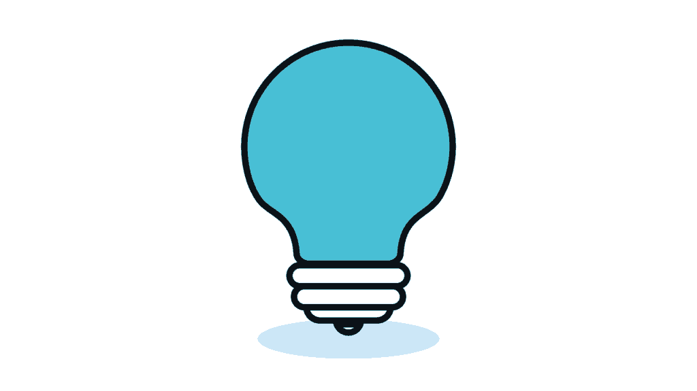
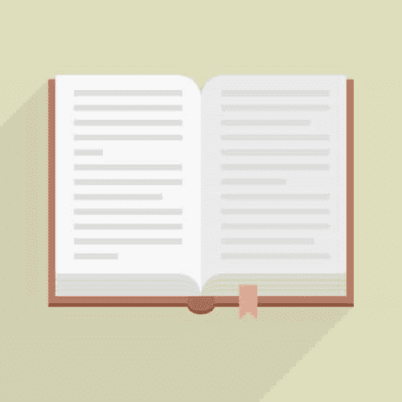

# 你需要的一项技能

> 原文：<https://simpleprogrammer.com/one-skill-thinking/>

在过去的几周里，简单程序员免费发布了约翰新书的部分章节。如果你一直在关注，你会知道他给了我们很多有用的技能去学习和掌握。但是，我没见他提过一个我认为是关键技能的。这是一项独特的技能，它会给你清晰和平静的心灵。你将对自己的生活有更大的掌控力，并有能力处理你周围的世界和你所处的情况；这个技能就是思考。

关于这个话题，我最喜欢的一本书是 P. M .福尼的《思考的生活》 。这篇简短而深刻的阅读构成了我思考的基础，也是我每年都要读的。在开头，福尼引用了前总统奥巴马 2008 年在伦敦与大卫·卡梅伦的谈话。奥巴马说，

> “但我同意你的说法，有人，有人曾在白宫工作过，不是克林顿本人，而是某个接近这一过程的人，说如果我们成功，你能做的实际上最重要的事情是在一天中有大量的时间，你所做的一切都是在思考。”

奥巴马接着指出，如果没有这个时间，“你就会开始犯错误，或者失去大局。”

最后一句话告诉我们为什么思考如此重要。每天，在我们的工作、家庭和朋友之间，我们都经历了大量的时间需求，我们必须做出回应。我们很容易被这些要求所困扰，从而失去我们生活的全貌。我们是谁？我们要去哪里？我们是否按照自己的原则生活？我们有足够的技能和资源为未来做好准备吗？我们应该从过去吸取哪些宝贵的教训？

说你以前没想过是骗人的。每天，我们的大脑都在不停地思考，处理数据，制定对策。也许，像很多人一样，你会和自己对话。

然而，就像任何技能一样，只是在持续的基础上使用思想只会让你胜任。要成为大师，你必须刻意练习。在这里，我打算给你一些好的工具，你可以用它们来练习，以掌握你的大脑，并充分利用你最有价值的资产。

### 准备:基础

一个好的工具需要维护。例如，任何一个拥有扫雪机的人，通常都会做年度调整，包括更换机油和火花塞；你的大脑没什么不同。然而，与扫雪机不同的是，你不能拆开你的大脑并清洗它。但是有很多方法可以保护你的大脑。

基础应该是显而易见的。充足的睡眠和锻炼，吃对你健康有益的食物。睡眠对大脑清除神经毒素的过程至关重要，而且身体和精神健康之间有很强的相关性。虽然每个人都是不同的，可能需要不同的具体事情，但总的来说，大多数人需要八小时的睡眠和富含适当营养的健康饮食。

经常锻炼有巨大的好处。有氧运动和 T2 阻力训练对心理健康和功能都很重要。

这些事情对于培养有效的思维习惯也是至关重要的。没有强大的基础，你的大脑很难休息，也很难集中注意力。

尽管这些基础知识已经涵盖，但是你仍然需要在其他方面训练你的大脑。

### 准备:中间产品

说我们生活在一个注意力分散的时代是一种保守的说法。在写这篇文章的时候，我收到了不下五条来自我手机的通知。请记住，我已经关闭了大多数通知！

我们都经历过。你坐下来解决一个困难的设计任务或研究一个具有挑战性的 bug，接下来你知道的是，你在脸书与你妻子的叔叔争论政治，或者你在 Reddit 上点击刷新按钮希望有新的帖子。

人类以我们目前的形态在这个星球上已经存在了 20 万年；社交媒体还不到 20 年。进化没有跟上。你大脑的主要功能是寻找突如其来的威胁并做出反应，而不是研究你周围的世界。结果呢？注意力不集中。

幸运的是，你可以做一些事情来提高你的注意力。冥想在《简单的程序员》中已经出现了很多，我可以亲自证明它在培养耐心、自制力、专注力和意志力方面的有效性。

如果你很难抽出时间做 10 到 20 分钟的练习，试着在办公桌前做一个简单的五分钟冥想练习。垂下眼睑，深呼吸五分钟。当你冥想的时候，你可能会经历很多想法和感觉，但是简单地让它们过去。如果你发现自己在追逐一个想法或经历强烈的情绪，只需将注意力转移回你的呼吸。

你可以做的另一件事是多读小说。阅读小说和大脑功能之间有很强的相关性。具体来说，[小说可以帮助提升你的同理心和创造力。](https://www.scientificamerican.com/article/novel-finding-reading-literary-fiction-improves-empathy/)既然你可能会花很多时间在屏幕上阅读，那就让你的眼睛和大脑休息一下，去读一些传统的纸质小说。

### 用法:日志

关于准备和维护，我还想分享一些想法，但首先我想谈谈有目的地使用你的大脑的方法。

首先，写日记是你能做的最基本的练习之一。它只是简单地写下你脑子里的东西。

有很多关于写日记的技巧和最佳时间的文献。我更喜欢把写日记作为我开始工作的第一件事，因为它有助于理清我的思绪，让我从繁忙的早晨过渡到更安静的工作环境。

选择一个主题来写日记很容易——写下你头脑中最重要的东西。设置一个五到七分钟的计时器，简要描述你的想法或感受，然后写下对它的见解和反思。不一定要有很深的哲理，想怎么写就怎么写。目标是简单地把你的想法和感受写在纸上。

当你简单地描述你的感受和原因时，你会惊讶地发现你变得如此清晰。当我详述一个已经在我脑海中思考了几天的问题时，我通常会发现一种新的能量和目标感。

另一个策略是感恩日记。我发现自助圈有点过于迷恋积极的想法，但我可以证明，当事情看起来不妙时，写下你感激的事情可以改变你的性情。这反过来可以帮助你从自我怜悯或悲伤中转移注意力，进入一种可以专注于解决问题的精神状态。至少，它可以提醒你，这一切都会过去的。

### 用法:思考

我们终于到了谈论思考本身的时候了。这需要一些时间和工作，但是准备是值得的。你休息好了，吃饱了，平静了。现在你可以控制你的大脑并积极使用它。

令人惊讶的是，尽管做了准备和戏剧性的构建，思考的行动还是有些虎头蛇尾。你所要做的就是简单地脱离这个世界(除了在紧急情况下)，拿着笔记本找一个安静的地方，然后开始。

你在想什么？任何你认为重要的事情。你需要为你的职业道路制定策略吗？也许你的财务问题需要一些检讨。你需要计划一个假期吗？你需要做一个关键的决定吗？你需要把这些宝贵的时间花在积极思考这个话题和该做什么(如果有的话)上。

笔记本是帮助你促进思考过程的工具。你应该把它用于诸如赞成/反对列表、写下备选方案、捕捉计划、画出一些有用的图表之类的技巧——但是不要沉迷于把所有事情都写下来。你的大部分时间应该花在思考上。

起初，你可能会发现很难专注于这个话题。你的思想可能会转移到其他想法或偏离路线，很难将它拉回正题。

思考就像锻炼:你用脑思考得越多，你就会做得越好。你将能够辨别哪些决定是重要的，你将能够对你周围的工作有一个全面的了解。

### 准备:高级

我想我应该以一些关于高级准备的想法来结束这篇文章。除了健康和专注，拓展你的思维会让你的思考更有成效。

我个人厌恶软件工程领域的一件事是你需要“永远在线”的信念有一群人认为，为了保持相关性，你的业余时间应该花在社区项目上，或者你需要阅读技术书籍，写博客，拍摄编程视频，或者在技术会议上发言。

这种推理的缺陷是，你的大脑开始压缩相似的经历和信息。换句话说，如果你所有的时间都花在技术上，你很快就会发现自己忘记了哪个想法来自哪个人，以及为什么你最近看的五本书似乎没有任何有用的信息。一切都开始变得模糊不清，直到你无法区分两者。

相反，你需要扩展你的经历。阅读不同主题的书籍，比如金融、生物、物理、心理学和投资。你不仅会有更广泛的知识范围，你会看到这些不同领域之间的联系，这将使你对你面临的问题有敏锐的洞察力。

最后也是最重要的一点，你需要走出去和人们在一起！没有什么比与亲密的朋友和家人共度时光更有意义和令人耳目一新的了，尤其是如果你把这段时间花在有趣的共同经历上。

思考很重要，但它可能是一项累人的、孤独的活动。为了让你的大脑休息，在潜意识层面处理你的想法，在某些情况下，体验所有这些思考的好处，和你关心的人在一起是很重要的。

那么，你需要思考什么？你有什么计划来进行更积极的思考？