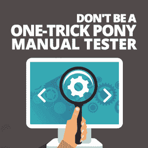

# 不要做“一招小马”手工测试者

> 原文：<https://simpleprogrammer.com/one-trick-pony-manual-tester/>

I remember seeing ponies when my parents took me to the circus. They were an important part of the show and impressed the audience with agility, jumping over obstacles and walking on two feet.

小马表演如此丰富多彩，即使你连续几天都在看，也很难感到厌倦。

但是让我们假设小马只能跳过障碍。如果观众不止一次看到这个把戏，他们会有多大兴趣？

随着观众越来越少，参与度越来越低，一招小马法案可能会从节目中删除，小马将“失去工作”。

**那么，这个小马把戏的故事和人工测试人员有什么关系呢？**

人工测试人员测试网站和移动/桌面应用程序。这几乎是他们唯一做的事情，虽然一些测试人员自己做得很好，但许多人却不是。

对于许多人来说，手工测试工作曾经是梦想成真。手工测试人员会发现他们的收入很高，市场上有需求，并且不需要教育。大多数大学为程序员提供多年制学位，但没有为测试员提供。

任何人都可以成为手工测试人员，只要读几本书，能够遵循说明，并且注意细节。没有多少其他的工作有如此高的报酬，并且不需要或只需要非常有限的知识和教育。

然而，在过去的几年里，事情发生了变化，找一份手工测试员的工作不再容易。开发实践已经朝着敏捷开发、持续部署和持续集成的方向发展。一切都越来越以发展为导向，并且发生得很快。

公司想要的是有才华(也更贵)的人，他们精通多项技能，能够身兼数职，而不是雇佣擅长一件事的人。

比如像 Jenkins 这样做单元测试和测试自动化并熟练使用持续集成工具的 Java 开发人员。

或者客户支持人员，他们可以与最终用户讨论技术问题，还可以解决问题、进行测试、生成报告、检查日志以及进行部署。

或者是懂编程的手动测试人员[测试自动化](https://simpleprogrammer.com/ultimate-automation-testing-guide/)。

这意味着是时候让那些一技之长的手工测试人员学习一些新的技巧并提升他们的技能了。

## 为什么我需要学习一项新技能？

就业市场为拥有多种技能的人做好了准备，这些人也被称为 T 型专业人士。他们正在取代只掌握一种技能的 I 型工人。

T 型个体和 I 型个体有什么不同？

与 I 型的人相比，T 型的员工在他们主要技能的左边和右边都有技能，在 I 型员工的单独技能的左边和右边也有技能。

单一技能的专业人士也有类似的经历。由于他们主要技能的高质量，他们暂时获得了成功。但随着时间的推移，这已经不够了。

这适用于许多其他领域。

例如，在混合武术(MMA)比赛中，隆达·罗西连续三年蝉联女子组冠军。在此期间，她彻底击败了所有对手，很多情况下都是在一分钟之内。

她凭借高超的柔道技巧做到了这一点，在 2008 年，她获得了奥运会铜牌。隆达是一个真正的“一招小马”，因为她的所有技能都是关于柔道。

后来有一天，她和一个真正的拳击手打了一场。尽管进行了大量的拳击训练，她还是戏剧性地输了。第一次失败后，她休息了一年，加强了拳击训练，希望能够复仇。下一次比赛，她又输了，但这次输了不到一分钟。

这里发生了什么？

当她正在享受她的“一招”时，世界变了，她却没有注意到。她的对手开始分析是什么让她如此优秀，并寻找利用她弱点的方法。最终，她打败了一个知道如何避开她强势一面的人，并在她没有真正准备好的地方开始战斗:拳击。

于是隆达两连败，从 MMA 退役(还没正式退役)。

与上面的例子不同，一些一招在手动测试中总是成功的。

他们的测试非常高效，因为他们不断地实践，不仅在工作中，而且在众包或开源测试项目中。

他们在聚会和研讨会上向他人教授测试，并从会议、博客和书籍中尽可能多地学习测试。

他们把他们的技巧发挥到了极致，并对其进行了极大的改进，这使他们比大多数测试人员处于一个不同的、更高的级别。

但是大多数都在挣扎，因为公司已经意识到，如果他们找不到有才能的测试人员，测试也可以由业务分析师、业务用户或开发人员来完成。很多人在一定程度上都能做到。

## 手工测试人员如何加强他们的技能？

Stop being a one-trick pony—sorry, manual tester—and [learn more tricks to become versatile and polyvalent](https://simpleprogrammer.com/alright-testing-job/).

新花样可能是技术技能。

比如学习编程。

编程语言的知识是非常有益的，不仅对于实现站点的测试自动化是如此，对于生成测试数据、解析应用程序日志以及为测试和开发团队编写实用程序也是如此。

编程可以在诸如琳达和 T2 这样的网站上学习，也可以参加开发训练营。

其他要学习的技术技能是应用程序编程接口(API)测试或性能测试。

如今，许多应用程序都是使用微服务开发的，微服务通常被实现为 web 服务。web 服务也需要使用像[放心](http://rest-assured.io/)这样的库以 Java 编写的自动化测试的形式进行测试。

一个通过了手动测试、API 测试和测试自动化的站点在正式升级之前还需要一种测试:性能测试。

如果没有强大的性能测试，网站在 10 个并发用户时可能会运行良好，但在 100 个用户时会非常慢。性能测试通常是使用 JMeter、LoadRunner 和 NeoLoad 等工具来完成的，因此学习其中任何一种工具都是一种资产。

除了技术技能之外，手工测试人员可以通过学习如何测试任何类型的应用程序来扩展他们的测试领域，不仅通过执行测试用例，而且通过探索性测试，具有有限的需求或没有需求，并且通常没有用户指南或文档。在这种情况下，基于会话的测试是一个很好的工具。

最后，有助于提高自己技能的事情是大多数人不会想到的，那就是教别人。例如，当你教一个初级测试人员编程或探索性测试时，你测试你自己的知识，真正地看你对这些主题的理解程度。

教学就是这样一个互动的过程，问题在老师和学生之间来回传递，所以双方都因为相互的反馈而成长。老师可能会不时地得到他们从未想过的问题或从新的角度提出的已知问题。回答他们只能增加他们对主题的了解。

## 不要做只会一招的小马——获取更多的技能

测试人员拥有的技能越多，他们给公司带来的价值就越大。由于他们掌握了大量的技能，他们可以在应用程序准备好进行手动测试时进行测试，无论是脚本测试还是探索性测试。

当没有什么要测试的时候，他们可以从事测试自动化，或者在项目活动缓慢的时候指导初级员工。

避免成为只会一招的小马的方法是专注于持续的自我提升，尤其是在没有节目来展示你的技能的时候。利用节目之间的休息时间学习新的技能会让你在任何时候都受欢迎。

看一招小马看腻了的人群会一次又一次的为你回来，因为你总会有更刺激、更新的东西让你学会和掌握，你作为手工测试员的未来会比以前更光明。