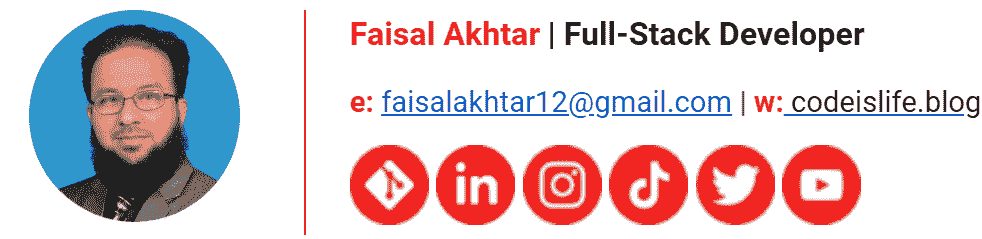

# 在线个人品牌程序员指南

> 原文：<https://simpleprogrammer.com/online-personal-branding/>

Creating a personal brand online is a hot topic for all kinds of professionals—which isn’t a surprise, since the internet is a major source of exposure and promotion. Programmers are no exception, and as a programmer, you should know how to effectively create your online personal brand.

但在我向你展示如何在网上创建个人品牌之前，你首先需要了解什么是个人品牌。

如果要我用一句话来解释，我会说“[个人品牌化是以一种方式行动的过程，这种方式让你因你想让别人知道的](http://www.amazon.com/exec/obidos/ASIN/1118915550/makithecompsi-20)而为人所知。”

清澈如泥？让我们更具体地了解一下开发人员。

程序员/开发者希望以什么出名？他们的编程技巧。你甚至可以说，被认为有能力和有能力一样重要。

为了在开发人员的职业生涯中脱颖而出，你应该控制自己在网上的形象。我见过的大多数有经验的开发人员似乎都反对自我推销的想法。他们喜欢编码，只喜欢编码，很少花[时间在自我推销](https://simpleprogrammer.com/marketing-freelance-programmer/)上。

这是一个错误。你可能很擅长你所做的事情，但是如果你不被认为是熟练的，并且没有人知道你的能力，那么你将永远不会实现你的全部潜力。你永远不会得到你真正想要的工作，你也不会为你真正相信的软件项目做出贡献。

在这篇文章中，我为你提供了如何在网上建立一个个人品牌的建议，这个品牌会让你有收入，会让你有发展的乐趣，并且会成为你以后职业生涯的资产。

## 在线品牌与面对面品牌

为了理解在线个人品牌，我们必须首先了解在线个人品牌和亲自品牌的区别。

面对面品牌是关于你如何面对面地展示自己。例如，你的外表、穿着方式、说话方式、气味，甚至你的种族和国籍都是你个人品牌的一部分。这篇文章不是关于个人品牌，而是关于在线个人品牌。

你的在线个人品牌由你的在线个性和你如何让它在互联网上闪耀组成。就个人而言(不管你喜不喜欢)，人们会根据上面提到的外在特征来评判你。在网上，人们会根据你发布的内容、你参与的对话和你编写的代码来评判你。

你的网上个人品牌应该是你本人的一个缩影。当人们在网上看到你的时候，他们应该能瞥见你在现实生活中的样子。

这样想:如果一个完全不认识你，也没见过面的人在网上找到你，只看到你的网上存在，他们会看到什么？

你想让他们看一眼，感受一下你在现实生活中的样子。如果你对某件事充满热情，这应该会在你的网上表现出来。如果你擅长某件事，你应该在网上展示它。如果你思维敏捷，那么你应该让人们在网上开怀大笑。

你必须让你的个性在你的在线档案中闪耀。正如我们将在下一节看到的，发展个人品牌(在线或离线)的第一步是标语或电梯推销。

## 标语或个人电梯推销

Every online professional needs a tagline or what is sometimes called a [personal elevator pitch](https://simpleprogrammer.com/personal-brand-reputation/). You can think of an elevator pitch as the one sentence you would say to someone you met on an elevator.

如果他们问你“你是做什么的？”你几乎到了他们的楼层，你会怎么回应？我个人的口号是“我教人们软件”就是这样。就是这么简单和简短。如果你看了我的个人资料，你会发现这条信息贯穿了所有人。

当然，我目前的职位不是讲师，但教和学软件是我的激情之一，我的 YouTube 频道、我的推文和我的 LinkedIn 个人资料都指向这一单一线索。你将会在你的网上形象中编织你自己的独特线索，所以首先要定义它。

你应该这样思考你的个人口号:“在你目前职业的理想版本中，你会做什么？”我的答案很简单。如果我的职业生涯是完美的，我会不断地学习新的软件和教别人说软件。

这个想法真的让我如火如荼。现在，教书可能不适合你，这没关系。每个人必须自己回答这个问题。所以继续吧，想想你的电梯推销。如果你的职业生涯很完美，你会做什么？

我的一个朋友最近告诉我，如果他的职业生涯很完美，他会不停地写代码。即使这个项目需要编写设备驱动程序或使用 Pascal 之类的旧语言，他也会在自己的笔记本电脑上编写程序。他的口号可以简单地说是“我编码所有的东西”，他真的是这么想的。

他会很高兴独自坐着写二进制代码，这是我无法想象的，比他稍微外向一点。这正说明了每个人都有自己的想法，所以一定要形成自己独特的口号或电梯推销。

## 维护在线档案

作为你在线个人品牌的一部分，你必须保持多个在线个人资料和存在，如 Twitter、LinkedIn、GitHub 和 YouTube。出于本文的目的，让我将在线个人资料定义为一个您可以用自己的名字创建或发布内容的地方。

但是在你开始网上品牌之旅之前，你应该记住一件事:不要仅仅因为我这么说就开始创建和维护个人资料。这是一个非常私人的旅程，如果你知道你可以保持一致，你应该只维持一个在线个人资料。

如果你更擅长短文本内容，那么 Twitter 就是你的朋友。如果你更擅长写长篇内容，那么你应该开始写博客。如果你喜欢创作视频，你应该考虑 YouTube 或 Instagram，但你必须让这个过程符合你的个性。记住，这是你的事。

在接下来的几节中，我将列出我维护的一些个人在线档案，每个档案的优点，以及维护这些档案的一些提示和技巧。我知道如何管理这些配置文件中的每一个都值得写一篇文章，但是我会给你一个快速入门。

### 开源代码库

任何优秀的开发人员都应该维护的第一个在线档案，也可能是这个列表中唯一一个我认为对开发人员来说是强制性的档案是 GitHub。

这是你的代码库，它应该包含你写的代码的展示。作为一名开发人员，你可能已经在向 GitHub 推送代码了，所以把你的照片放在那里，更新你的标语，开启双因素认证，并维护你的 GitHub 个人资料。

这可能是潜在雇主首先会考虑的地方，所以经常将代码推送到 GitHub。

此外，在您的 GitHub 概要文件上维护一个名为“Project Showcase”的存储库。在这个库中，你应该突出你写的代码，你做过的项目，以及你参与过的其他有趣的代码活动。对于开发者来说，GitHub 已经成为事实上的在线投资组合，所以要小心维护它。

如果你是初学者或者还是学生，请在 GitHub 上分享你的项目。分享你做过的任何有趣的家庭作业或免费工作。你能写代码的唯一真正的证明是你写的代码——不是简历而是实际的代码，GitHub 是强调这一点的地方。

### 商务化人际关系网

Are you still using resumes? You are doing it wrong. There is almost no use for resumes these days, especially for developers, as [LinkedIn and GitHub = resume for developers](https://simpleprogrammer.com/programmer-resume-guide/).

网上有很多关于如何维护你的 LinkedIn 个人资料以及如何撰写每一部分的文章，但我只想说，你不应该忽视 LinkedIn 作为新工作和新工作机会潜在线索的来源。

甚至就在两周前，有人因为我在 LinkedIn 上的活跃程度而没有面试我就邀请我去为他们工作。

张贴你拥有的任何证书/凭证和课程证书。更新你 LinkedIn 个人资料中的所有部分，并让现在和以前的同事推荐你。LinkedIn 上一个被忽视的部分是技能部分。参加技能评估。您通过的任何评估都将突出显示。

还记得在你所有的在线个人资料中建立一致信息的要点吗？嗯，LinkedIn 是在你现在和以前的同事面前传达这个信息的好地方。让你的关系网知道你在做什么。发布你正在写的代码和你正在做的项目。发布一个关于它的视频，或者分享一篇关于你最近学到的东西的文章。在 LinkedIn 上与你的同事互动，经常发布你的职业旅程。

### 博客

博客并不适合每个人，只有当你喜欢写作并且知道你可以保持一个内容一致的时间表时，你才应该开始写博客。不，你不必试图通过写博客获得六位数的收入。

发帖频率会完全取决于你，帖子的类型也会因人而异。所以你想以 Python 出名？继续写一篇关于 Python 和你的学习经历的文章。写下什么是简单的，什么是具有挑战性的。

写一个你最近解决的问题，这个问题别人可能正在努力解决。写一篇如何操作的文章或技巧和诀窍。写你选择写的任何东西，但是记住，你要在你所有的在线个人资料中传达一个一致的信息，那就是你的标语。

如果你的口号是“我帮助艺术家成为开发者”，那么就写艺术，写发展，写游戏行业或市场对创意专业人士的需求，但一定要写。

### 推特

Twitter 是一个与你的开发伙伴甚至潜在雇主进行交流的好地方。你应该在 Twitter 上与人们互动的一些主要方式如下:转发他人的推文，用深思熟虑和发人深省的答案回复他人的推文，参与对话，保持对话的亲切。

此外，一定要发布你感兴趣的内容。例如，我经常发布我参加的课程和我在网上阅读的文章，我与人们谈论代码、学习编程和培养终身学习习惯。

所以，如果你还没有 Twitter 账户，那就创建一个吧，并开始参与对话。我知道这个不用说，但是不要在网上无礼。你在网上写的所有东西都会永远留在那里，不，删除一条推文不会有任何帮助，所以在你发推文之前要三思。

### 油管（国外视频网站）

我运营过多个 YouTube 频道，包括我不久前创建的一个有 14000 名订户的个人兴趣频道。几周前我开始了我现在的频道，我有一些工作要做。

然而，我不会建议每个人都开办一个 YouTube 频道。只有当你知道你能创作出对他人有价值的、编辑良好的长视频内容时，才开设 YouTube 频道。

要记住的一点是，如果你选择 YouTube 作为一个内容平台，你必须与你的观众互动，并在一致的基础上创造内容。

经营一个 YouTube 频道可能是一次非常有益的经历，它为你打开了大门。但是请记住，记住你的口号，用一个一致的信息在你所有的平台上创建内容。

### 抖音和 Instagram

我强调这两个平台是为了强调你不应该害怕尝试。老实说，我不知道我是否会在这些平台上找到观众，以及我将如何利用他们，但我目前正在尝试不同的视频。

我还不确定我会走多远，但抖音似乎是一个发布诙谐短视频的有趣地方。我个人不怎么用 Instagram，但是如果你去参加一个会议，遇到一个有趣的人，或者看到一些与你的领域相关的有趣的东西，在 Instagram 上发布一张照片。

你还会发现很多关于如何在抖音和 Instagram 上吸引粉丝的文章，所以一定要加入这些平台，但要记住一件事:你的标语。

## 电子邮件签名

最后，电子邮件签名是查看你个人资料的好方法。你写的每封邮件都有你的电子邮件签名，为什么不用它来宣传你自己呢？这是我的电子邮件签名的样子。

电子邮件签名示例

它包含了我所有在线资料、我的职位、我的博客和一张图片的链接。你应该使用电子邮件签名来突出你的个人资料，提升你的在线形象。

## 这是关于一致性

现在让我们回到原点。这一切的意义何在？这样想:作为所有这些努力的结果，如果一个人不认识你，他可能会在网上发现你的什么？

他们查看你的 LinkedIn 个人资料，他们看到了什么？如果他们打开你的 Twitter feed，他们会有什么印象？如果有人阅读你的博客，你会有什么感觉？

首先，想象一下，如果你所有的个人资料都是内容的随机组合，就像大多数在线个人资料一样。现在想象一下，如果你控制了这些档案，并在所有档案中呈现一致的信息。你认为这会对你的职业生涯有积极的影响吗？

从我个人的经验来看，我可以说肯定是这样的。你还在等什么？开始吧。