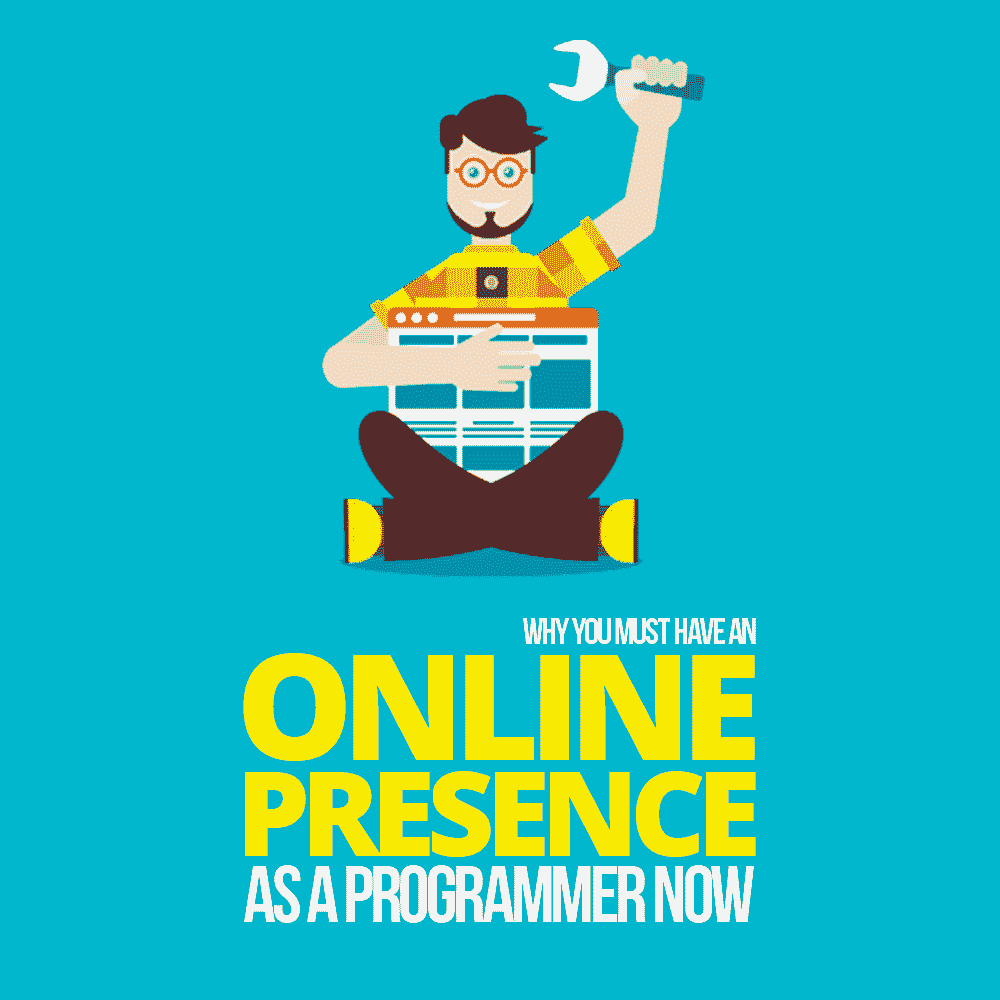

# 为什么你现在必须有一个程序员的在线意识

> 原文：<https://simpleprogrammer.com/online-presence-programmer/>

In today’s day and age, **the internet is an extremely powerful tool.** With various forms of social media, YouTube, blogs, and tons of other platforms, you can reach people all around the globe within a few clicks.

能够与全球各地的人互动意味着您可以与另一个海岸的开发人员交流技巧，从其他国家的公司那里了解最佳实践，并向广大社区提供您自己的专业知识。

可悲的是，大多数人没有利用互联网给我们带来的巨大优势。许多程序员认为，他们只需要一个与朋友和家人保持联系的个人在线状态，而忽略了专业状态的战略潜力。

它允许您在同一时间在多个地方使用您的内容。通过在多个平台上构建一个想法，你可以最大化你的影响范围(从而有效地增加你的工作)。你还可以与更多的人互动，增加你被关注和获得更好工作的可能性，或者成为有影响力的人。

让我们讨论一下什么是专业的在线展示，为什么你需要一个，以及一些帮助你开始的资源。

## 什么是在线状态？

在线状态是你的虚拟形象，能够在网络世界中提供信息并与其他人互动。

它通常始于以下至少一个:YouTube 频道、GitHub、博客、subreddits(或你所在领域的其他形式)，或任何社交媒体网站(Twitter、Instagram、脸书和 LinkedIn)。

在这些网站上，你可以创建一个专业简介，概述你是谁以及你的专业领域。然后，你可以通过发布你创建的内容、你觉得有趣或刺激的内容的链接和评论，以及与平台上其他人的对话来参与社区活动。

****

下面这个例子会让你看得更清楚一点。假设我们有一个叫安东尼奥的人(我知道，我也在想同样的事情……很棒的名字，对吧？).Antonio 有一个博客，是他通过阅读“如何作为一名软件开发人员推销自己”而创建的他在 Node.js 上写关于 web 开发的博文。因此，他创建了一个名为“如何使用 Node 创建 NPM 包”的帖子。接下来，他创建了一个 YouTube 视频，用不同的格式解释相同的信息。接下来，他链接到博文和 YouTube 频道，并在他的 Twitter 上分享。除了所有这些活动，Antonio 还在推特上发布了他认为在 Node.js 中开发时非常有用的其他文章。

过了一段时间，人们开始相信 Antonio，认为他知道 Node.js 和 web 开发的一切。事实上，当他们对该话题有疑问时，他们可能会通过这些网络平台中的任何一个向他寻求帮助。

在线业务让你在公司之外建立强大的专业声誉，给你一个强大的、多样化的网络和影响你所在领域的机会。

## 你为什么需要一个？

作为一名软件开发人员，有很多理由让你保持在线状态。让我们来看几个比较重要的。

### 无限网络

当你已经就某个话题发表了一段时间，展示并分享了你的知识，你的特定领域和领域的其他人会找到你并阅读你的信息。随着时间的推移，这些人会开始在网络上与你互动。

当你继续通过各种视频、博客或社交媒体分享为他们提供价值时，你就在与追随你的人建立关系。这种接触让你可以通过互联网在你的领域建立一个网络。

为什么拥有一个大的网络会有用？结识新朋友，寻找新的合作伙伴，寻找和你有相同兴趣的人，等等。

整天呆在电脑后面的程序员不像其他职业领域那样关注网络。作为一名程序员，拥有在线状态可以让你以一种更舒适的方式(通过计算机/互联网)进行交流。

### 雇主喜欢它

当你找工作的时候，雇主主要是想证明你知道自己在说什么。有什么更好的方法来证明你知道你在做什么，而不是通过博客帖子和视频，在那里你正在教授人们你应该知道的确切主题？(这里的正确答案是:没有更好的办法了！)

进入面试时，公司会对你的网络形象进行调查，看看你是否知道自己在说什么。到那时，大部分找工作的战斗已经结束了。

除了网上展示给你的自动证明之外，公司的招聘人员和工程经理会因为你在网上发布的所有信息而开始联系你。他们整天都在网上搜索，寻找那些知道他们在谈论某个话题的人。现在，在找工作时，来自这个职位会让你处于一个更有利的位置，因为他们希望你进入这个职位。

### 非常适合自由职业者/在线商务

如果你不是在找工作，不要担心，我也有东西给你。如果你想开始自由职业或者创建一个网上公司，网上公司会更加有用。

如果你想做自由职业者的工作，一个潜在的客户看到你已经写了并教了其他人他们需要做的工作的确切主题，T2，他们会认为你知道你在说什么。如果他们认为你知道自己在说什么，这将让他们在所有竞争中信任你。你认为招聘经理会选择谁来做一份工作？在互联网上有很好的视频和有用的帖子来教授信息的人？或者只是说通过简历就能做点事的人？

如果你想[拥有自己的事业](http://www.amazon.com/exec/obidos/ASIN/B071W81VTY/makithecompsi-20)该怎么办？然后，你可以向教授你专业领域的私人课程的人收费，或者创建诸如“如何成为亚马逊 Alexa 开发者”的课程，并将它们出售给许多已经信任你的追随者。

## 那么，你如何创建一个在线的存在呢？

我非常喜欢把事情变得尽可能简单，这样就可以马上采取行动。你现在能做些什么来建立一个网络形象？

在我看来，你可以做的最简单的事情就是创建一个 [Twitter 账户](http://www.amazon.com/exec/obidos/ASIN/0071794964/makithecompsi-20)(这个平台是程序员往往更活跃的地方)。我把这推荐给任何人，当他们开始寻找最简单的第一步来建立一个在线的存在。

你甚至不用发任何自己的知识。只需在推特上发布一条内容，无论是开源知识库、博客教程，还是你所在领域的观点文章。在推特上发布内容链接不是最有效的长期策略，但这是你现在可以开始做的最简单的事情。

如果你想更快地建立一个存在，那么我建议在所有平台上发布，一天几次。多个平台包括网站和博客、YouTube 频道、Twitter、脸书、Instagram 和 Reddit 账户。每天发这么多帖子可能要花很多时间，这是一种更高级的互联网存在形式。对于一个刚刚起步的人来说，这可能会让人不知所措。

我会选择一个平台，一直练习到你熟悉为止，然后添加另一个。就我个人而言，我从 Twitter 开始，然后开了一个博客，然后创建了一个 YouTube 频道，一个 Instagram 账户，最后，我跳进了脸书。我花时间养成了定期在这些账户上发帖的习惯，然后随着时间的推移越来越多。这个过程可以防止你不知所措，让你从今天开始！

## 帮助您入门的资源

## 

T2】

关于这个话题，我推荐的一门高质量课程是 John Sonmez 的[如何作为一名开发者营销自己](https://simpleprogrammer.com/store/products/how-to-market-yourself/)。在这里，他谈到了创建一个博客，有一个在线存在，选择一个利基，以及如何使用各种社交媒体平台。我利用这个培训开始了我自己的在线展示，并强烈建议这样做。

在我看来，对程序员来说，最好的社交媒体形式是 YouTube、Twitter、博客、GitHub，以及任何与你的领域相关的形式/子编辑。这些网站允许你展示你的代码，教别人关于代码的知识，或者在编程社区中分享有趣和相关的新闻。

如果你想开一个 YouTube 频道，看看其他人是怎么做的，看看这个[列表](https://hownot2code.com/2016/11/18/40-youtube-channels-for-programmers/)上的频道。

一个真正伟大的程序员论坛是[黑客新闻](https://news.ycombinator.com/)。GitHub 有点不一样；您为其他开发人员创建开源项目。或者你可以成为其他开发人员现有项目的贡献者，或者你可以修复这些项目中的错误。

每个不同的平台都有优点和缺点，但您可以根据自己的喜好选择一个或多个。

## 去行动吧！

随着互联网越来越普及，人们在上面花费的时间越来越多，你的在线形象将变得更加重要和有价值。创建一个社交媒体账户只需几秒钟。很有可能你知道一些对世界上某个地方的人有益的事情。

有了这些回报，你几乎没有理由不开始。它可以让你拥有一个几乎无限的世界各地的熟人网络，你可以出于各种原因得到这个网络。如果你不想失去一份编程工作，那么这是一个确保人们会雇佣你的可靠方法。如果你有自己的事业或者是一名自由开发者，那么你在互联网上的存在是获得更多工作或客户的一种方式。

这可能需要长期的努力，但是如果你坚持不懈，你将开始获得一些动力。这里给你的信息是用来帮助你的，而不是为了阅读的乐趣。所以，走出去，采取大规模行动，利用今天的互联网！