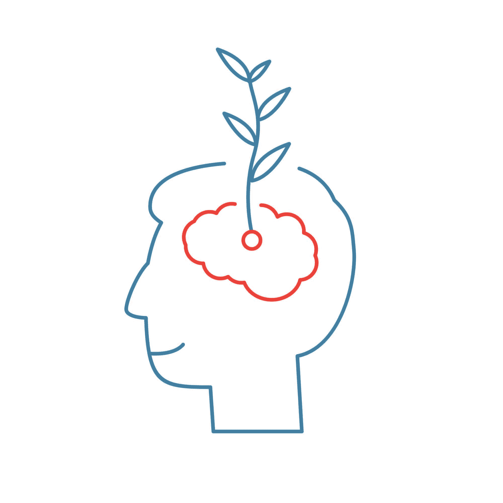

# 以坚忍的心态克服程序员职业障碍

> 原文：<https://simpleprogrammer.com/overcoming-obstacles-stoic-mindset/>

2017 年 11 月，Medium 上有一篇名为“[编码者应该担心作家发生的事情](https://medium.com/@melissamcewen/coders-should-fear-what-happened-to-writers-d87a895b03db)”的文章

如果你时间不够，TL；作者认为底层软件开发人员的市场正变得越来越艰难——只有那些从事顶级编码工作的人得到了丰厚的报酬，而其余的人则被留在底层，几乎没有报酬。作者将这一行业与写作行业进行了比较，并描述了他们是如何在那里看到同样的问题的。

当我读这篇文章时，我不禁感到泄气。作者的人生观似乎相当黯淡，我不禁同情他们，因为他们显然已经尽力了。然而，我也感到一丝沮丧，几乎就像作者错过了我的标记。似乎他们已经接受了失败主义的观点。

我不打算写回应，因为我看不出我能为谈话增加什么价值。与此同时，我感到不安的是，这些强烈的、负面的观点在这个行业中存在。我变得太不安，不能不回应。

我对争论这个行业是否如作者所描述的那样不感兴趣。事实上，他们对行业现状的预测很可能是正确的。但是，与其简单地接受这个事实，不如让我们谈谈我们能做些什么。让我们行动起来；让我们下定决心茁壮成长。作者缺少的是斯多葛派的观点和一些积极主动的策略。

## 进入:斯多葛主义

我是斯多葛派的忠实粉丝。我甚至在包里放了一本小的《沉思集》(可能是最受欢迎的斯多葛派书籍),旁边还有我的日记和一支笔。每当我感到不安或悲观时，我会通读一些段落，寻找古罗马式的刺激。这让我回到了正确的精神状态。

对于那些不熟悉的人来说，斯多葛派是古希腊和古罗马的一个流行学派。斯多葛派是哲学家，以他们的(惊讶！)斯多葛派的观点。在现代，斯多葛派这个词通常被认为是面无表情、冷漠或没有感情的。但这些意思并不是这个词的起源。它的真正含义是:力量、毅力和精神韧性。

斯多葛派以感知大师而闻名。他们接受了生活是我们选择的现实，生活中唯一的伤害就是我们选择被伤害。正如斯多葛派所说，在生活中，有两件事:事件本身和我们对它的看法。斯多葛派的塞内卡有一句名言:

“我们的行动可能会受到阻碍，但不能阻止我们的意图或部署。因为我们能够适应和适应。头脑适应并把我们行动的障碍转化为它自己的目的。行动的障碍推动行动。挡在路上的就成了路。”

换句话说，我们应该把障碍变成机会。我想对这篇前一篇文章做同样的事情——一篇接一篇地阅读，在每一节的开头引用原始文章中的文字，确定作者察觉到的障碍，然后讨论可以将这些障碍转化为程序员职业生涯中的战略优势的实际方法。

## 坚守阵地

引用原始媒体文章:

“我有两份职业。我是一名开发商，坦白地说，我支付了大部分费用。我是一名作家，我做这个主要是因为我喜欢它。很难承认这一点，但是的，我宁愿做一名作家。”

著名的斯多葛派哲学家塞内加在他的一封信中这样开头:“一棵经常移动的植物，永远不会茁壮成长。”这就是说，坚守阵地是一种伟大的美德。塞内加承认人们渴望从一个地方到另一个地方，或者从一本书到另一本书，但他警告这样做的严重危险。

这几乎就像塞内卡预言了现代社会媒体的世界，在那里我们从一篇文章跳到另一篇文章，从一个想法跳到另一个想法，同时有一个焦点危机。但这是一个在不同书籍或不同行业之间调情的陷阱，因为我们很难对任何一本书进行足够深入的研究。

我一直以来最喜欢的书之一是丹尼尔·普里斯特利的《关键人物 》。Priestley 概述了成为一个行业中备受尊重和高薪人士的五个步骤。Priestley 在他的书的结尾有一章叫做“让它发生”，其中他讨论了在两个行业之间调情的诱惑。他认为，如果你继续追逐新事物，你最终将永远不会成为任何行业中有影响力的关键人物。你必须致力于一个你热爱的行业，并不断接近它的核心圈子。

## 做最坏的打算

引用原始媒体文章:

“我的很多作家朋友都被解雇了。我想不出我认识的作家中有谁没被裁过。”

斯多葛派有做最坏打算的习惯。前面提到的冥想是从下面这句话开始的:“当你早上醒来时，告诉自己:我今天要对付的人将是多管闲事、忘恩负义、傲慢、不诚实、嫉妒和乖戾的。”

这个练习的目的是做好准备。我们生活中的很多不快乐都源于我们的期望。斯多葛派认为，如果你预测并做好最坏的打算，你就会一直做好准备。

通过这种坚忍的想法，我们可以确保每天都为最坏的可能做准备，比如被解雇。最终，我们无法控制雇主或市场的行为。这让我们只剩下我们能控制的东西，这意味着确保我们总是在构建与市场一致的相关技能组合。

一个很好的准备方式是当你有全职工作时，在网上写作或为开源做贡献。你还应该确保你的简历或作品集网站是最新的。被解雇不应该是我们第一次考虑找新工作；我们应该不断评估我们的市场价值，并确保它呈上升趋势。

确保你增值的一个很好的衡量标准是评估你拥有的专业资产。大多数人认为他们简历上的多年经验是一种资产，但是你可以获得更多的资产。

在线帖子、LinkedIn 上的推荐、认证、你的声誉、你发布的任何视频和开源贡献都是资产，它们可以在你工作的时候“为你工作”。专注于增加资产价值是确保你在市场中保持相关性的好方法，所以如果最坏的情况发生，你要做好准备。

## 零和游戏

引用原始媒体文章:

“我觉得我看到了未来，科技变得像写作一样。谷歌、脸书或推特的少数高薪程序员。然后我们其他人赚不了多少。”

斯多葛派知道，我们对事件的感知是我们可以培养的最大美德之一，我们应该花时间关注自己的事情，警惕花太多时间观察他人。马可·奥勒留在《沉思集》中多次提到感知的控制:“不要把你剩下的时间浪费在担心别人身上——除非这会影响到公共利益。它会阻止你做任何有用的事情。”。

相反，我们可以选择不尝试直接与行业内的其他人竞争，而是做我们自己的事情，创造我们自己的价值，或者市场营销人员所说的[创造蓝海](https://hbr.org/2004/10/blue-ocean-strategy)——以我们自己独特的方式定位自己，而不是放弃自己，尝试与大众竞争。

在*中，作者塞思·戈丁在题为“有限还是无限”的一章开始写道:“你可以把你的市场看作是有限的，一个零和游戏，一个为了一个人赢，另一个人必须输的地方。或者你可以把它看作是无限的。一个人才创造增长、市场规模扩大的地方。”像斯多葛派一样，戈丁理解感知能力对我们选择如何花费时间和精力的影响有多大。*

*戈丁暗指的是，最好的程序员是为自己创造就业机会的。他们知道这个世界将会让他们失业，所以他们转而投资于理解他们所从事的业务和他们正在解决的问题的能力。通过自动化工作，他们创造了蓝海。*

*在整篇文章中，戈丁谈到了两类员工心态的比较:一类认为自己是戈丁所说的“工厂工人”，另一类是关键人物。戈丁说，在工业时代，有人付钱让你出现，让你做什么就做什么，然后回家。但是随着技术的进步，所有轻松的工作都消失了。作者甚至在原始媒体文章中提到了这一点:*

*“但最终只有最难的东西没有被自动化或外包。如果你不是一个天才，你就会触及你能力的上限。”*

*作者所说的“最难”可能是指最没有创造力。计算机在处理大量数据方面令人难以置信。他们还不能与个人的创造能力竞争。*

*这是我们需要关注的地方。计算机不能告诉你下一步要构建什么功能——这是由人类做出的决定。这也不是可以外包的事情。它需要对产品和市场有深刻的理解。*

*通过了解如何实施将用户放在第一位并高效创建功能的[精益](http://www.amazon.com/exec/obidos/ASIN/0670921602/makithecompsi-20)方法，我们可以成为关键人物。我们也可以鼓励像 A/B 测试这样的技术，或者促进和运行[一个设计冲刺](http://www.amazon.com/exec/obidos/ASIN/0593076117/makithecompsi-20)。*

*这些技能帮助我们不是被动的“工厂工人”，而是主动帮助企业发现什么是有价值的，然后交付它。这种心态意味着我们不断推动雇主的业务向前发展，并创造必要的收入来调整我们的工资，并确保我们始终处于就业状态。*

## 

**

*做出不“走作家之路”的决定*

*你可以投资的最大资产是你自己和你的心态。你可以从培养一种坚忍不拔、富有弹性的心态开始，这种心态将在你的整个职业生涯中为你服务。选择专注于你能控制的事情，做最坏的打算，在生活的障碍中寻找机会，这些都是投资自己的有效方法。*

*拥有一份非凡的职业并不容易。我们有两个选择:向市场让步，声称我们无能为力，或者争取我们的位置，保持专注和承诺，成为一个有影响力的关键人物或关键人物。*

*斯多葛派提醒我们，心态是一种选择，我们选择我们的现实。我知道我会选择哪种心态，但是你选择哪种心态，那取决于你，所以要明智地选择。*