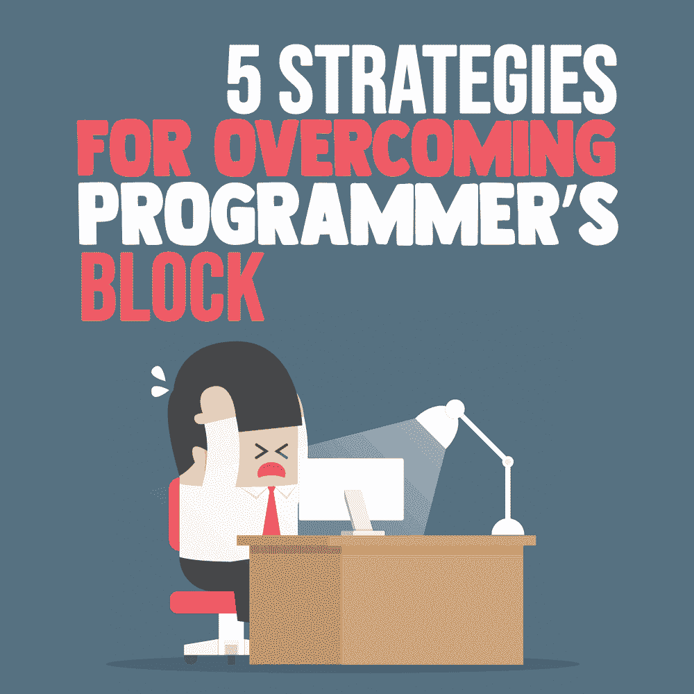
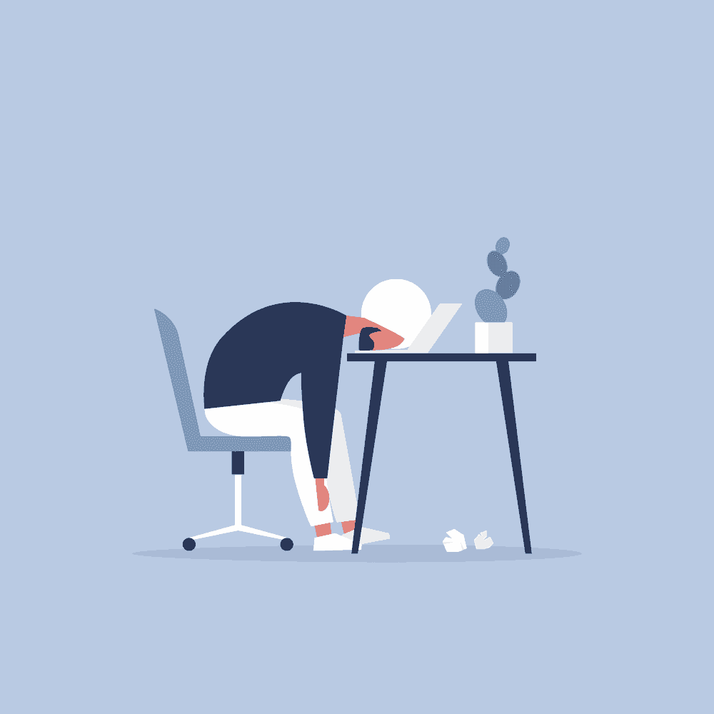

# 克服程序员障碍的 5 个策略

> 原文：<https://simpleprogrammer.com/overcoming-programmers-block/>

<figure class="alignright is-resized">

</figure>

程序员停滞期是指一个程序员根本写不出任何代码的时期。在此期间，想法没有实现，项目的目标似乎遥不可及。

好消息是，这种情况是正常的——尽管如果它一直反复出现，可能会被认为是一种医学状况。在大多数情况下，它会自然消失，即使你没有采取任何行动来处理这种情况。

不幸的是，我们程序员是在争分夺秒地工作，这意味着任何一分钟的拖延都是昂贵的。因此，每当你发现自己正经历一个心理障碍时，尽快找到出路就变得至关重要。

以下是编码阻塞的五种常见表现和解决问题的实用方法；

## 案例 1:你对目标不是 100%清楚

精神障碍的一个主要问题是它会让你忘记自己的目标。你变得如此迷茫和困惑，以至于看不到自己在做什么。当这种类型的心理障碍发生时，你可以采取几个步骤来重新获得控制。

首先，重温你的目标。希望你[已经在某个地方写下了目标](https://simpleprogrammer.com/modern-developer-planning-analysis/)。当你写好目标后，如果你遇到困难，你可以回头看看你错在哪里。如果你没有书面的目标，另一个可能的解决方案是回到项目的开始。重访一切开始的地方更有可能唤起你的记忆，让你知道你应该去哪里。

然而，如果回到项目的开始没有帮助，再后退几步:问问自己为什么要做这个项目。为什么代码很重要？它的目的是什么？如果你能回答这些问题中的哪怕一个，你应该能够[找到重新行动的方法](https://simpleprogrammer.com/flow-state/)。

## 案例 2:你不断改变对*方法*的想法

策略是编程的重要组成部分。您希望在最大化生产率的同时最小化资源。例如，你可能想在一个迫在眉睫的截止日期前更快地完成这一部分。不幸的是，当你有思维障碍时，想出一个伟大的战略可能是一个问题，这种情况经常会导致*自我怀疑循环*，在那里你开始在想到的每个解决方案中戳洞。

每当你发现自己陷入自我怀疑的循环，是时候**打破循环**了。停止编程，取而代之的是，散散步或和某人随意交谈——谈论一些完全与工作无关的事情。休息一下会给你的大脑足够的时间整理好自己的[思绪](https://simpleprogrammer.com/wiire-your-brain)。

但是，不要休息太久，因为你可能会失去那天继续工作的所有动力。一旦你休息了 15-20 分钟，**继续工作**——但是要记住两件事。首先，带着全新的视角回来。试着从不同的角度看问题(而不是解决方案)。其次，不要让完美成为好的敌人；你不必完美，但你必须完成这个项目。

## 案例 3:工作似乎太多了。你从哪里开始？

每当你看到一个项目并感到不知所措时，你可能甚至在开始编码之前就开始感到失败。这个问题只有一个解决方案——**把你的项目分解成可管理的小块**。

研究表明，当你觉得一项任务简单且容易完成时，你会更有动力去完成它。这种积极的感觉可以让你在以后的道路上避免拖延。

理想情况下，你应该把项目分成更小的、更容易完成的部分，尽管有些人更喜欢用时间而不是项目来计划。例如，你可以决定工作一个小时，然后休息一下或者工作到短期任务完成。这两种方法都是有效的，并且根据整个项目的规模，它们的有效性会有所不同。然而，对于较大的项目，将负载分成可管理的块无疑是更好的选择。

为了获得更大的动力，将目标分解为宏观目标，将宏观目标分解为微观目标，直到你有了可以在几分钟而不是几小时内完成的工作。确保庆祝每一个微目标的竞争。这样做将确保你的成功。

## 案例 4:你对未来的工作不感兴趣

<figure class="alignright is-resized">

</figure>

即使工作很少，目标和方法都很明确，你可能仍然对目的不感兴趣。事实上，缺乏兴趣是导致许多程序员完全放弃项目的一个大问题。

好消息是，有几个方法可以提高你的项目兴奋度。首先，**把这个项目看作是学习新东西的机会**。例如，考虑使用项目来试验一个新的库或框架。

其次，**找到使[工作变得重要的理由](https://simpleprogrammer.com/find-your-why)** 。为什么你*需要*参与这个项目？为什么*现在*？在这里，与项目经理或客户(对于自由职业者来说)交谈会非常有帮助。

另一个可能的解决方案是**利用机会修复技术缺陷**。例如，如果工作需要使用一种新的编程语言，这可能是你提高语言知识的时候，如果这是你已经推迟了一段时间的事情。

## 案例 5:你生活或工作环境中的某些事情困扰着你

精神障碍也可能来自个人问题或工作环境。你觉得不舒服吗？你的个人关系或婚姻有问题吗？你家里有不舒服的孩子吗？所有这些问题都会导致严重的精神障碍，阻碍你继续工作的能力。

如果你在一个不友好的环境中工作，这同样适用。一些研究表明，当太热或太冷时，思维会转移，开始专注于保持身体的温度。这些类型的分心*可能*是你不能专注于你的项目的一些原因。

对于个人问题，最好的解决办法是先解决问题，或者至少和朋友或专业人士谈谈。如果生病了，马上就医，感觉好点了再继续编码。如果像孩子感觉不舒服，带他们去医院。首先处理好你的个人生活会让你头脑清醒，让你在工作时保持专注。

对于您的工作环境，适当的供暖和空调可以帮助您和您的同事继续工作。另外，带一个空气净化器来提高空气质量，带一个加湿器来增加房间的湿度。这些对你的工作环境的细微调整可以在对抗程序员的瓶颈时产生很大的不同，应该可以帮助你排除任何干扰，完成你的工作。

## 你能克服它

程序员的瓶颈并不是一个新问题。它影响着每一个程序员，不仅仅是你。谢天谢地，这不是你无法处理的情况。以上几点应该可以帮助你识别和解决障碍，这样你就可以带着清晰的头脑继续工作。