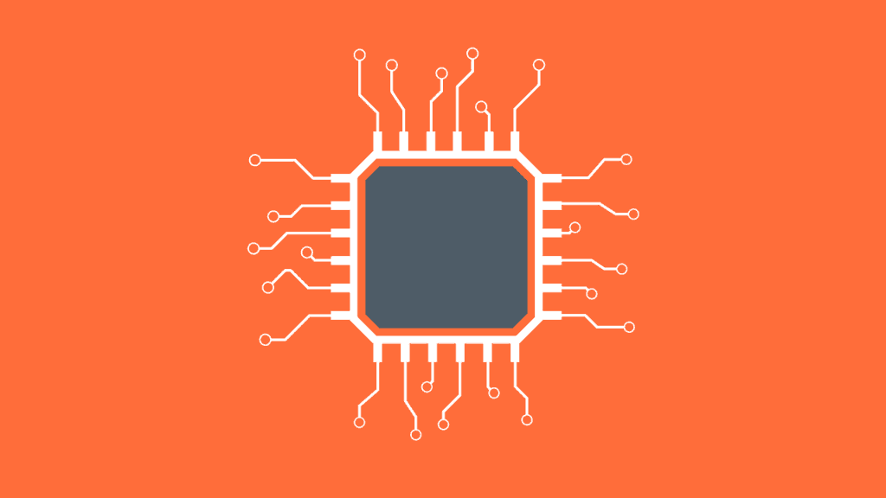

# 一起更好:结对编程的好处

> 原文：<https://simpleprogrammer.com/pair-programming/>

我找到了一份新工作，我们做事的方式与我过去的方式略有不同。

老实说，我想不出我听说过的任何其他公司会常规地、系统地采用结对编程范例。我想象我过去工作过的大多数公司都有会计师在后台说类似“我不想为解决一个问题付两倍的钱；为什么会有两个人同时做完全相同的事情？”

这个新的工作场所完全采用结对编程，这是一个明显的区别，真正偏离了我所在领域的工作场景的规范。

为了这个故事的目的，我将[结对编程](http://www.amazon.com/exec/obidos/ASIN/0201745763/makithecompsi-20)定义为让两个人在同一台计算机上同时解决相同的编码问题。

不要慌！虽然“在一天的大部分时间里与另一个人交谈”听起来很可怕，但事实并非如此。以我的经验来看，让两个人一起写一段代码最终确实证明是有益的。

当然，这个博客的读者中更内向的成员(也就是我们中的大多数)可能会被这种前景吓到。但是我保证，[结对编程](https://simpleprogrammer.com/2009/12/11/pair-programming-why/)值得。拥有一对搭档进行编程所带来的价值真正改变了我对高质量代码的看法。

结对编程使我的代码更容易阅读，减少了我的类文件的整体大小，通常只是简化了过去复杂得多的代码。

了解了结对编程的优势后，我强烈建议你向你的经理和团队提出这种做法。让别人直接和你一起工作的价值怎么强调都不为过。当然，也有一些缺点；然而，以我的经验来看，它们远远超过了正结对编程所提供的净价值。

那么，是什么将结对编程与单飞区分开来呢？

## 物理设置

为了使结对编程正常工作，第一个也是最重要的因素是硬件设置。双人组必须共享一台电脑。

我们用两个非常大、非常高分辨率的屏幕、两个键盘和两个鼠标来完成这项工作。监视器被设置成镜像模式，每个人都可以控制一个键盘和一个鼠标。

这样，我们可以很容易地投入到我们想要转化为代码的想法中，而不必说，“嘿，我可以用一下键盘吗？”

这是真正的并行编码。它有各种各样的好处。

## 结对编程有节奏

如果你走进我的办公室，没有花太多时间停下来注意到底发生了什么，结对编程可能看起来就像一群两两成群的程序员，每一对共享一台计算机。

它可能看起来和人们自己编程没有太大的不同，或者就像两个人在同一个桌面上工作一样。

但是结对编程有一个模式和节奏——不仅仅是两次单独编程。如果是这样的话，结对编程的所有价值都将丧失，结对也不会是一项投资——它只会增加成本，浪费一个程序员的时间。

一对的一般模式在很大程度上建立在良好的测试程序上。它依赖于两个人来确保测试写得很好。

结对编程通过显著提高我们生成的输出的质量来增加显著的价值。与我之前从事的工作相比，我们创建的代码中的缺陷数量非常少。我们很少实现错误的业务逻辑，因为我们总是要向坐在我们旁边的人证明我们的逻辑。

有些模式程序员只能通过结对编程来实现，最近我发现自己真的渴望在任何时候写代码都有第二双眼睛——不仅仅是在工作中。(不幸的是，我不得不在家自己编程。不过没关系——我凑合着过。)

我们两人一组遵循的惯例如下:

*   编写功能或集成测试，编写单元测试，编写通过测试的代码，重构代码，审查代码，对代码进行 QA。

这看起来很熟悉，但是每一个步骤都是两个人一起敲键盘完成的。测试部分确实有不同的感觉，稍后我会更详细地介绍。

结对编程难以下咽的一个原因是与之相关的会计成本。结对编程的无形好处大大超过了支付两个开发人员解决同一问题的成本，但是如果不理解结对编程如何极大地有利于项目的结果，会计师只会认为它是两倍的昂贵。

## 即时代码审查

实时代码审查是结对编程最明显的好处之一。

当你让两个人积极地处理屏幕上的代码行时，更多的打字错误和逻辑错误会被发现。

如果正在编写的代码对它正在使用的问题域没有意义，pairs 有两倍的可能性意识到代码的当前方向需要改变。

事实上，最近我正在和我的搭档制作我们的一张卡片。我们进行了大约一个小时，他说了这样的话，“我想另一个团队已经解决了这个问题。”

事实证明他是对的:一个不同的团队已经编写了一个库来做我们正在尝试做的事情。这可能会花掉我们一整天的时间。所以我们用两个脑袋解决问题，节省了大量时间。

结对编程是代码审查的下一个进化步骤。如果您在编写代码时没有进行任何形式的代码审查，那么您应该这样做。几乎所有的创造性产出都受益于评论；举例来说，这个博客有编辑——全部的编辑人员。

代码审查就像有一个编辑人员——它帮助你抓住你可能会错过的东西。因为我们是人类，人类会错过一些事情。

结对编程提供了对你正在做的事情的实时回顾。这意味着你更有可能对每一行代码有两个不同的人的认可。

如果你认为每一行代码都是一个商业决策，那么让两个人一起做这个决策会更有意义。

## 配对和 TDD

在这篇文章中，我不打算深究测试驱动开发(TDD)的原则，因为这是一个值得考虑的主题。

可以说，TDD 意味着您总是有测试没有通过，然后您实现产品代码来使它们通过。这就是“红色->绿色->重构”这个术语的来源。

然而，结对编程在彻底的 TDD 的成功中起着至关重要的作用。这是确保您的测试测试正确的东西的绝对最佳方式——因为您的搭档努力确保被测试的业务逻辑是正确的。只有测试正确的东西，测试才有价值。

在我们的结对编程设置中，一个人编写自动化单元测试，另一个人编写产品代码以通过测试。这为…遁遁遁… ***的邪恶组合打开了大门。**T3】*

## 邪恶的配对

当我加入我目前的团队时，我甚至从未听说过邪恶配对的概念——事实上，我对配对编程是如此陌生，以至于邪恶配对的模式对我来说完全陌生。然后我变得邪恶。这真是太有趣了。

简单来说，邪恶配对是指编写尽可能少的代码来通过单元测试，从而证明测试不正确或不完整。

除了有趣之外，邪恶配对还有一个非常重要的功能。它迫使我们确保我们的测试和我们的产品代码一样好。因为没有好的测试，你真的不可能有好的生产代码。

我描述这种情况的最佳方式是提供一些测试代码的人为例子，以及使其通过的邪恶方式。感谢微软给了我一个体面的工作基准。

你可以在我的要点中看到通过这个单元测试的邪恶方式:

很明显，如果一个值不是 1，那么素数测试就不会失败。然而这正是我所做的——并且单元测试通过了。

这就是我对邪恶配对的看法——实现代码来解决测试的人应该编写尽可能少的代码来通过测试。

我们使用这个实践来暴露边缘情况或者测试最初没有覆盖的其他场景。(它还有一个重要的额外好处，当实现的人以一种可怕的方式通过测试时，他们会邪恶地咯咯笑。)

## 分享全局

一般来说，[神经科学研究](https://en.wikipedia.org/wiki/The_Magical_Number_Seven,_Plus_or_Minus_Two)表明我们的工作记忆一次最多能容纳七个项目。

我不知道你的编程项目，但在我的项目中，当我解决问题时，几乎总是有超过七个概念需要跟踪。

然而，如果你增加第二个大脑，我们可以同时跟踪的事物数量就会翻倍。所以现在 14 个想法可以在你的综合工作记忆中反复出现。

一般来说，让一个人思考手头最紧迫的问题是个好主意，而另一个人则试图记住系统的大图和整体架构。通常这些想法是重叠的。

有时它们会相互冲突，这时你就必须就最佳前进路线展开对话。

通常，这种对话听起来有点像我最近进行的一次关于我们的数据存储模式的对话。我们不确定是应该使用 ORM 还是纯 SQL，所以我们讨论了一会儿，最终决定纯 SQL 更有意义。尽管当时我们使用 ORM 进行数据存储。

我正在编写一些 ORM 代码，而我的搭档正在考虑如何使用 SQL 来解决这个问题。SQL 更有意义。这就是我们改变的方向。最终，我们的代码变得简单多了，我们也更容易互相解释，所以这是一个很好的胜利。

## 配对主权

一般来说，我们的团队由足够多的人组成，任何时候都至少有两对程序员。我们在彼此非常接近的地方工作。

一般来说，团队里每个人都是两人一组工作。有时，我们可能独自工作，但我们重视结对编程作为一种实践，并努力将结对工作融入我们的日常工作中。

我们经常交换舞伴，这样我们就能在日常工作中互相配合。这也有助于我们创建由团队而不是一个(或两个)人[编写的代码。](http://www.amazon.com/exec/obidos/ASIN/1680501283/makithecompsi-20)

真正有助于这种布局工作的一点是，我们强烈相信对主权。当一对努力解决一个给定的问题时，其他的一对不会用“如果……可能会更好”或其他任何打破两人界限的建议来打断他们。当你在一对中时，你的一对支配着你正在处理的代码，无一例外。

这有助于我们专注于我们作为一对正在解决的问题，而不是担心另一对的问题。我们将在代码审查中看到它，所以不用担心我们会失去与我们不合作的一对的业务知识的跟踪。

## 应对分心

在一个你的整个团队共享一个空间，并且没有隔间墙(或真正的墙)将你们彼此分开的环境中，很容易分心并偏离与你正在解决的问题无关的话题——甚至与工作无关。

在这些情况下，我的团队会使用一个安全词。如果我们团队中的任何人说了“肉桂”这个词，这意味着我们已经注意到我们作为一个团队已经偏离了轨道几分钟，这种分心已经变得毫无成效。

分心是好事；他们有助于团队建设和一般的友情。但有时它们会失控，所以这就是为什么我们可以说“肉桂”——作为一个温和的提醒，是时候回去工作了。

这种沟通工具对任何团队布局都很重要。但是在结对编程中，几乎总是会有对话发生。因此，我们需要一种方法来确保这些对话不会分散我们解决问题的目标。

## 社区不会让你分心

尽管我们有时会偏离主题，不再谈论我们团队正在解决的问题，但我们团队的露天交流总体上建立了更好的交流，并为我们的团队充当了安全网。这有助于我们更好地合作，作为一个团队更一致地解决问题。

## 内向的人也喜欢它

你会注意到结对编程和单独编程之间的一个很大的区别是[全面关注于保持人们相互参与。几乎不可能找到一个黑暗的角落房间或隔间，藏起来不被团队中的其他人发现，因为当我们的团队成员之一无法配对时，我们都会注意到——并且会在意。](https://simpleprogrammer.com/2012/09/03/avoiding-procrastination-through-pairing/)

这并不是说我们谴责休息的做法——我们都知道我们是内向的人，有时需要安静。但是我们喜欢一起工作。我们都明白，独自解决一个问题可能会非常孤立和令人沮丧。所以我们总是尽我们所能互相帮助。

## 沟通

为了确保我们不会以一对拥有给定解决方案的所有信息的知识孤岛而告终，我们还会例行地做一些称为对交换的事情。无论是在时间范围内还是在逻辑转折点(取决于团队决定做什么)，我们都会定期让一个人呆在机器旁，而另一个人去另一组。

这种轮换有助于确保整个团队拥有整个解决方案架构的上下文，并且极大地打破了知识孤岛。这是我见过的处理一个人成为一个领域中唯一的主题专家的问题的最好方法。

与单独编程相比，你可以花一天(或更长时间)来解决一个问题，而不与任何人谈论你正在处理的问题。

即使您花时间对您编写的代码进行事后代码审查，团队的其他成员也会丢失您当时获得的问题域上下文，如果没有真正涉及的代码审查，这是无法恢复的。

如果你要进行一次代码审查，以涵盖你在解决问题时学到的所有东西，那么它可能会花费和一开始解决问题一样长的时间。而且大多数地方不会愿意那么长时间的代码评审。

## 转机

那么，当你们两人一组，而你们对问题领域的综合知识不足以完成当前任务时，会发生什么呢？

我们的工具箱里还有一个工具，叫做“转变”这时，我们对我们的团队说“turnaround ”,每个人都离开他们的办公桌，转向团队，讨论手头的问题。

通常，团队成员只需要不到五分钟的讨论时间，就如何解决问题达成合理的一致。有时，找到正确的前进路线需要很长时间，但通常很快。

前几天，转变的主题仅仅是我验证我们想要将我们的数据库表称为“Chewbacca”我不记得了，所以我问了队里。大约花了十五秒钟。但是如果我决定把它叫做“HanSolo”的话，那 15 秒钟就能让我们避免很多认知失调。(很明显，名字被更改是为了保护代码库，这是我不允许透露的)

不管时机如何，只要整个团队理解我们代码的方向，转变的主要目标就实现了。

## 结对编程很有趣

最重要的是，作为结对程序员，你得到的是一种与和你一样热爱编程的人一起玩得开心的感觉。

我以前在一些地方工作过，在那里我戴上耳机，一天工作八个小时，然后回家。这是一个内向者的梦想——但也可能是孤立和令人沮丧的。

结对编程完全消除了我们的编程工作故意造成的隔离。它鼓励社区，丰富我们的整体团队体验。