# Selenium Webdriver 的并行测试——自动化

> 原文：<https://simpleprogrammer.com/parallel-testing-selenium-webdriver-automation-steroids/>

## 介绍

并行测试执行包括并行运行一套自动化测试，而不是顺序运行。你不会一个接一个地执行你的测试。相反，您可以将整个批次的测试分散到多个服务器上，这样每个服务器一次可以运行一个测试。这种技术对于改善您的整体软件开发生命周期有一些奇妙的优势。

首先，并行运行测试可以显著减少执行时间。如果您有足够的资源一次运行所有的测试，那么测试执行的持续时间将只和您最慢的测试一样长。例如，如果您有 100 个测试和 100 个运行这些测试的虚拟机，那么并行划分它们将允许您一次运行 100 个测试。如果您最慢的测试运行需要两分钟，那么这就是整个测试套件执行所需的时间。

连续运行这 100 个测试将会花费你数倍的时间，因为你一次只能执行一个测试。因此，您需要将所有的测试运行时间加在一起，以了解这需要多长时间。如果我们假设每个测试运行需要两分钟，那么连续运行它们将需要 200 分钟的运行时间。这是 5000%的差别！

并行测试执行相对于顺序测试执行的第二个优势是，它为您的团队提供了更快的反馈循环。如果您的测试套件可以更快地执行，那么您的团队就可以更快地得到反馈来采取行动。这是一个令人惊讶的事情，整个 IT 行业都在朝着这个方向发展。如果您的整个测试套件需要 10 个小时来执行，那么连续交付是不可能的。

因此，在本教程中，我将教你如何做到以下几点:

1.  通过 Selenium Webdriver 在您的计算机上并行运行自动化功能测试。
2.  使用 BrowserStack 在云中通过 Selenium Webdriver 运行自动化功能测试。
3.  使用 Sauce Labs 在云中通过 Selenium Webdriver 运行自动化功能测试。

**先决条件**

我假设您有以下信息:

1.  visual studio 安装程序
2.  [C#](https://simpleprogrammer.com/2012/07/29/book-review-c-in-depth-second-edition/) 的一般知识
3.  了解 [Selenium Webdriver](http://www.amazon.com/exec/obidos/ASIN/0992293510/makithecompsi-20)

如果你在整个教程中需要任何额外的帮助:

*   [关于这个话题的免费视频教程](http://courses.ultimateqa.com/courses/parallel-testing-tutorial?coupon=simpleprogrammerparallelpost)
*   [本主题中使用的代码库](https://github.com/nadvolod/ParallelTestingTutorial)
*   [Github 教程](http://www.qtptutorial.net/how-to-download-a-github-project-and-open-it-in-visual-studio/)
*   [重磨教程](http://www.qtptutorial.net/resharper-for-visual-studio-build-amazing-automation-testing-code/)

## 如何在本地并行执行自动化测试

在 Visual Studio 中创建类库项目。

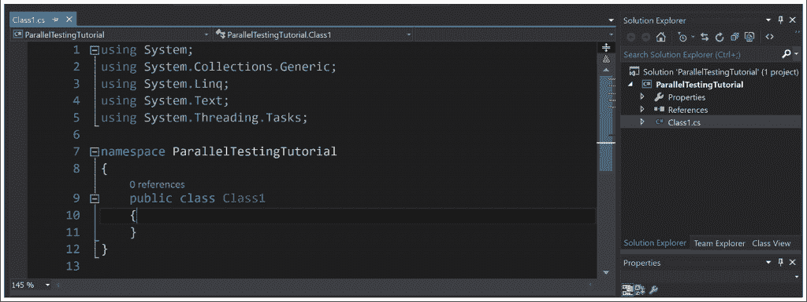

转到 NuGet 软件包管理器安装适当的软件包。

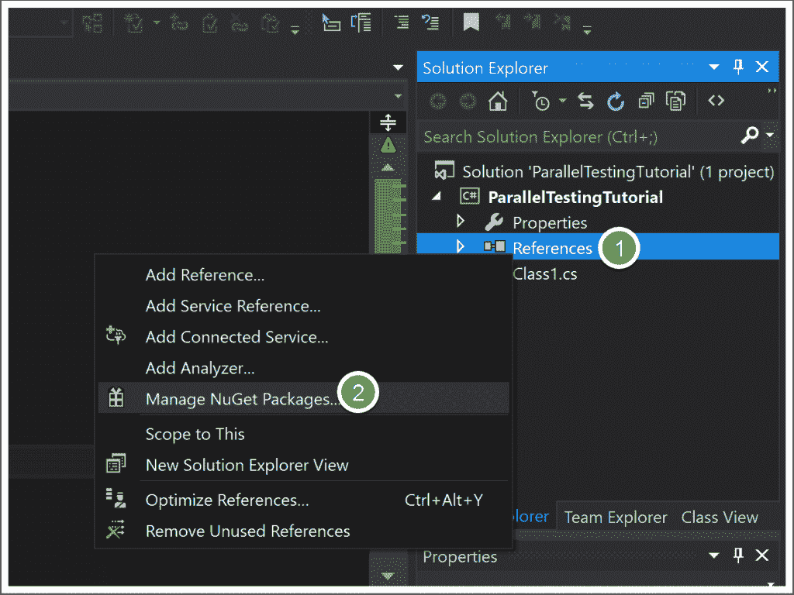

### 搜索 Nuget 包

在此步骤中，您将安装:

1.  硒。自动化测试
2.  硒。支持

包源应该设置为“nuget.org”。

**生产力提示:**为了节省一点时间，您可以安装 Selenium。将自动安装 Selenium.Webdriver 的支持包

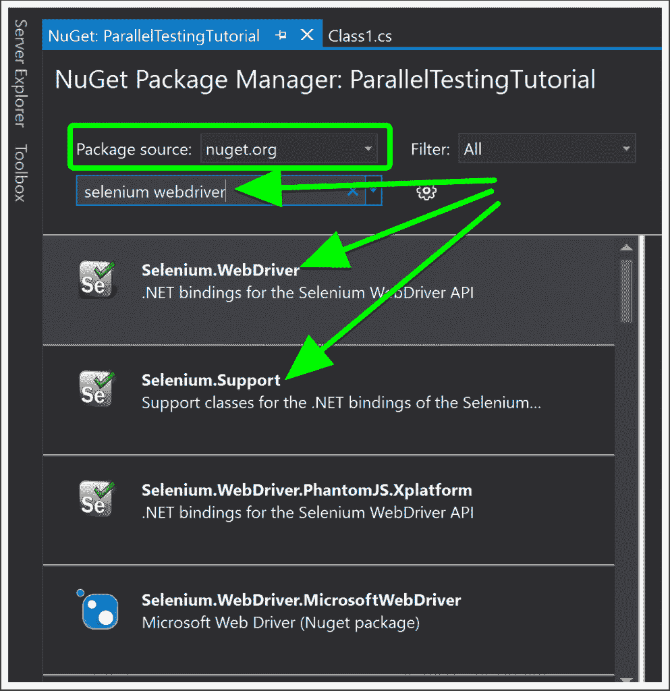

### 检查你的参考

如果您成功安装了 Nuget 包，您将在解决方案资源管理器的“References”部分看到它们。

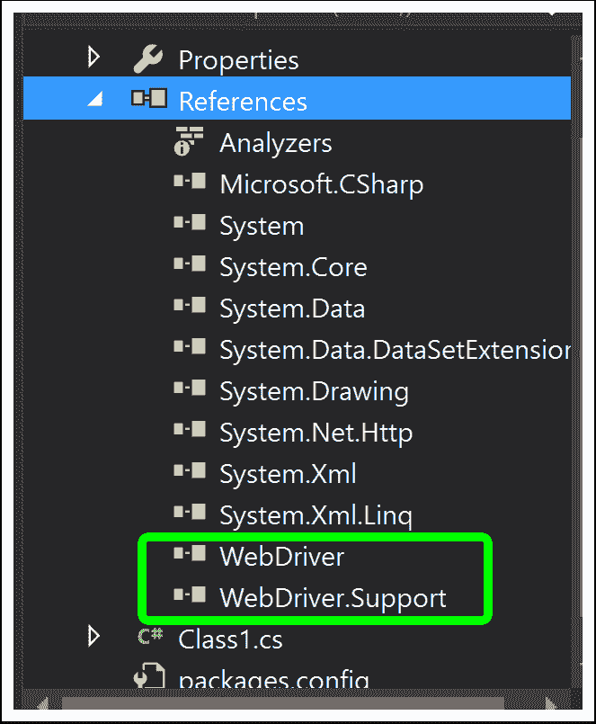

### 安装 Nunit Nuget 包

另外，安装 Nunit Nuget 包，这样我们就可以通过 Nunit 执行我们的测试。这个时候我有了 3.0.1 版本。

**注意:**您将需要一个 NUnitTestAdapter 来通过 Visual Studio 执行您的自动化测试。然而，从 Nuget **安装 NUnitTestAdapter 的 v 2.0 将无法工作。**相反，您需要扩展！(至少对我的 Visual Studio 2015 的配置没用。我花了几个小时来解决这个问题，并找到了一个解决方案，我将在后面讨论。记住这一点，这样你就不会经历和我一样的噩梦。)

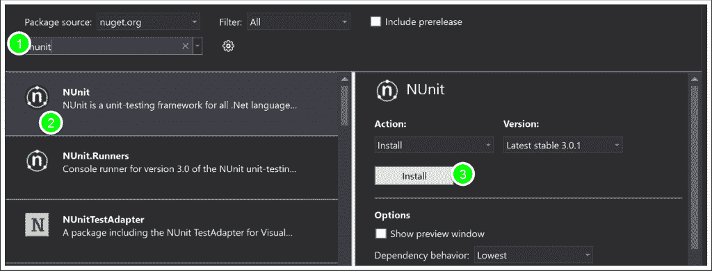

### 安装 Nunit3 测试适配器扩展

如果您运行的设置和我完全一样，这一步是必须的。这将允许我们从 Visual Studio 中实际运行 NUnit 测试。

1.  转到“工具”
2.  单击“扩展和更新”

### 搜索“Nunit”

1.  点击“在线”
2.  搜索“努尼特”
3.  安装“Nunit3 测试适配器”因为我们安装了 NUnit 3 Nuget 包，所以我们需要 NUnit 3 测试适配器。对我来说似乎是合乎逻辑的，我假设您也需要将 NUnit 测试适配器版本与您的 NuGet NUnit 版本相匹配。但是，由于我只有 Visual Studio 2015，我不能保证这一点。

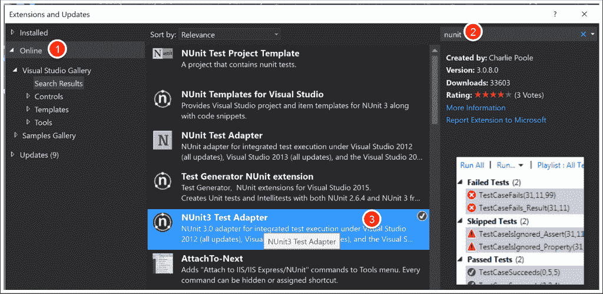

### 检查证明人

查看您的参考资料，确保您安装了所有适当的 Nuget 包:WebDriver、WebDriver。支持，和 Nunit。

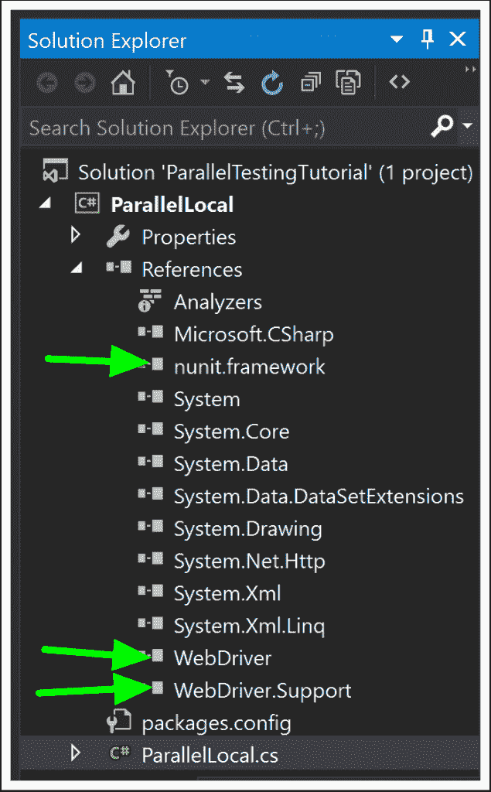

### 使用 F5 运行您的测试

当您尝试您的测试时，您将得到下面的错误。这仅仅是因为您创建了一个类库类型的项目。这个项目不包含我们的应用程序进入并开始运行的 Main 方法。

让我们解决这个问题。

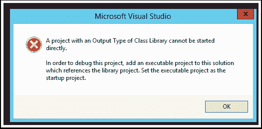

### 将[TestFixture]属性添加到测试类中

这告诉 Nunit 这个类包含测试和可选的 setup 或 teardown 方法。

我的 [Resharper](http://www.qtptutorial.net/resharper-for-visual-studio-build-amazing-automation-testing-code/) 足够智能，可以将所有的引用拉入我的 Nunit 测试中。如果你不知道 Resharper，学习它和[大大提高你的编码速度。](http://www.qtptutorial.net/resharper-for-visual-studio-build-amazing-automation-testing-code/)

但是，如果您现在的目标是完成本并行测试教程，并且您只有 Visual Studio 2013 或更早版本，则需要在参考资料的顶部添加以下行(不带引号):

“使用 NUnit。框架；”

我的 Visual Studio 2015 足够聪明，也能解决这个问题。使用“Ctrl +”，您可以让 Visual Studio 填充这些细节。

### 将[Test]属性添加到测试方法中

这将告诉测试框架什么是应该运行的测试。

我的最终代码可以在下面找到。如果你想参考的话，你也可以随时免费下载代码。如果你想要这方面的视频教程，那也是免费的。

### 运行您的 Nunit 测试

现在，您应该能够使用上面更新的代码运行这个测试了。

首先构建代码，以便 Visual Studio 可以找到测试。然后，在 Test Explorer 窗格中，您将能够看到名为 Test1 的单一测试。点击“全部运行”链接，运行所有测试。

成功是如此甜蜜！

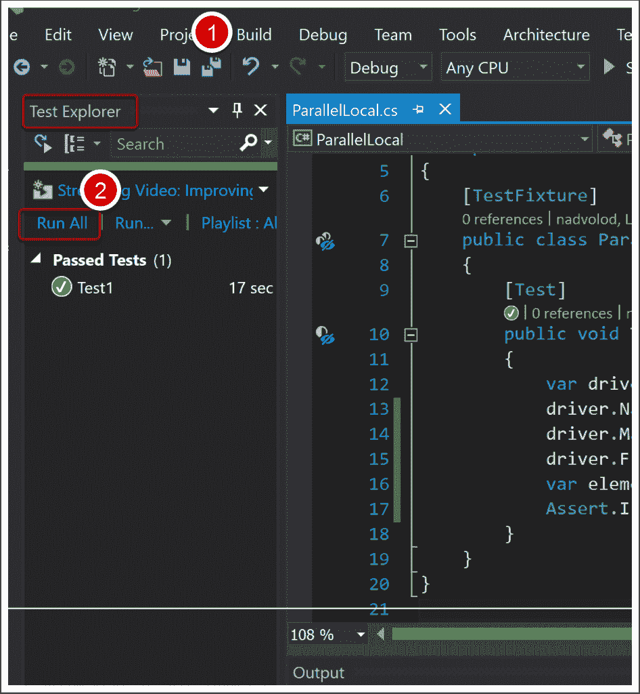

### 如何并行运行测试

**注意:**

当前版本的 NUnit (3.0.1)不能在一个测试类中并行运行多个测试。

它只会按顺序运行这些程序；相信我，我尽力了。因此，如果您想要并行运行您的测试，您将需要为每个测试创建一个单独的测试类。

将您的测试复制到不同的班级。

更新您的第二个测试，使其与第一个测试稍有不同。我的代码如下所示:

将[Parallelizable]属性添加到每个类中。这将允许您的测试并行运行。

构建您的代码，以便在测试资源管理器菜单中发现您的新测试。在 Visual Studio 2015 中，我和 F6 一起这样做。您现在已经准备好运行您的并行测试了。

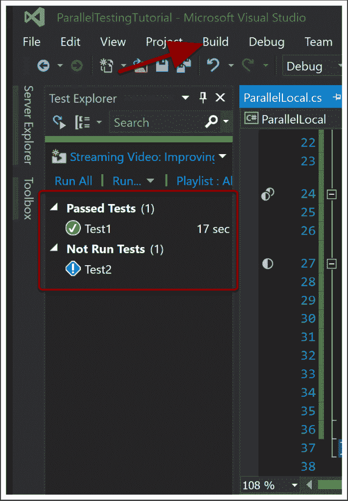

### 执行并行测试

在测试浏览器中点击“Run All”按钮，在您的本地浏览器中并行运行您的测试。如果你跟随我的教程，一个测试应该通过，一个应该失败。

**就是这样！**

您已经成功地创建了使用本地资源并行运行的测试。

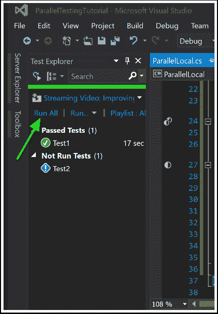

### 在本地运行测试的优点和缺点

**优势**

1.  您可以一次运行多个测试，只受计算机硬件的限制。这将减少执行时间，因为最长的运行时间将与最慢的测试时间一样长。
2.  如果这是您所能得到的全部，那么这比一次顺序运行一个测试要好得多。

**缺点**

1.  本地测试的最大问题之一是你必须维护软件。因此，您需要维护 Selenium Webdriver 和所有浏览器的最新版本。这是一个极其痛苦的过程。我一直有这个问题，因为事情在某些时候会变得不同步。如果您决定走 Selenium 网格路线，并开始使用多个虚拟机来完成这个过程，那么您将需要维护这些虚拟机以及更新、配置等等。同时，你需要编写框架，做好你作为 QA 工程师的工作。几乎不可能把这些都做好，当然也不值得你浪费时间。
2.  在您的计算机上一次只能运行少量的并行测试。你需要强大的计算能力才能同时运行 50 个浏览器。因此，您会受到您所拥有的计算资源的限制。

### 你如何克服本地并行测试的缺点？

然而，不要因为这些缺点而气馁。能够在本地主机上运行并行测试比顺序运行测试要好得多。你的工作环境将决定你能获得哪些资源。因此，即使您只能在本地计算机上并行运行测试，也要选择这个选项。

顺序运行测试是执行测试的最基本和最低效的方式。下一个逻辑升级是在本地并行运行您的测试。之后，您可以转移到在多台服务器上并行运行测试。最后，最有效也是我最喜欢的执行测试的方法将在下面介绍。

为了克服必须维护所有自己的硬件和软件的恼人问题，您可以去云。有一些很棒的服务，比如 SauceLabs 或 T2 browser stack，可以帮你做到这一点。

在云端测试真的很神奇。您获得的一些好处包括:

1.  对任意数量的虚拟机进行并行测试。如果你有钱，就做 1000 个平行测试。
2.  在浏览器和操作系统的任意组合中测试。他们有超过 700 种浏览器/操作系统组合供您选择。你甚至可以测试手机。
3.  它们会自动为你记录日志、截图和视频。你那边没有工作。这使得自动化工程师和开发人员的调试变得轻而易举。
4.  他们有像 Jenkins 这样的工具的持续集成插件，所以你可以很容易地设置它们。
5.  没有人需要浪费时间维护任何种类的软件或硬件。
6.  自动化工程师现在可以花更多的时间创建测试，花更少的时间做其他任务

真的。使用这些服务进行测试会将您的自动化带到一个完全不同的水平。我将花费多年时间和多种资源来实现这样一个惊人的框架。最好的方法就是插入并利用已经存在的美妙之处。

## 如何用 BrowserStack 并行执行 Selenium Webdriver 测试

### 什么是 BrowserStack？

BrowserStack 是一个基于云的服务，允许你使用 Selenium Webdriver 进行自动化软件测试。他们维护着一个庞大的浏览器和操作系统矩阵，使得跨浏览器的功能测试更加容易。在这篇文章发表的时候，他们有超过 700 种可能的组合。基本上，你有能力在 Mac、Windows、Android、iOS 和许多组合上运行，只需传递正确的配置。

就个人而言，我喜欢在云中运行我的自动化 Selenium Webdriver 测试。与本地运营相比，优势遥遥领先。试一试；差别是巨大的。

### 在 BrowserStack 中设置并行测试

先决条件:

*   一个 BrowserStack 帐户，这样你就有了一个用户名和一个在他们的云中运行的密钥—[免费试用注册](https://www.browserstack.com/users/sign_up)
*   [浏览器堆栈文档](https://www.browserstack.com/automate/c-sharp)

### 如何开始使用浏览器堆栈

任何 Selenium Webdriver 云自动化系统都非常类似于在本地运行我们的测试。主要区别在于，我们不是创建一个指向 FirefoxDriver 或 ChromeDriver 等可执行文件的本地驱动程序，而是创建一个 RemoteWebDriver。我们将 URI 和功能传递给那个驱动程序，以便我们可以在云中执行我们的测试。

要设置运行 BrowserStack 测试的代码:

1.  像前面一样，建立另一个 Visual Studio C#类库项目。和往常一样，你可以下载我的代码。但是如果你真的实践你所学的东西，你会有最好的记忆率。最好是一次学好一个东西，而不是很多次理解能力差。
2.  从 BrowserStack 站点，我复制了那里的代码片段，以便开始使用。我会稍微修改一下，以符合我的需求。但是，在将代码粘贴到解决方案中之后，您会注意到所有的编译错误。

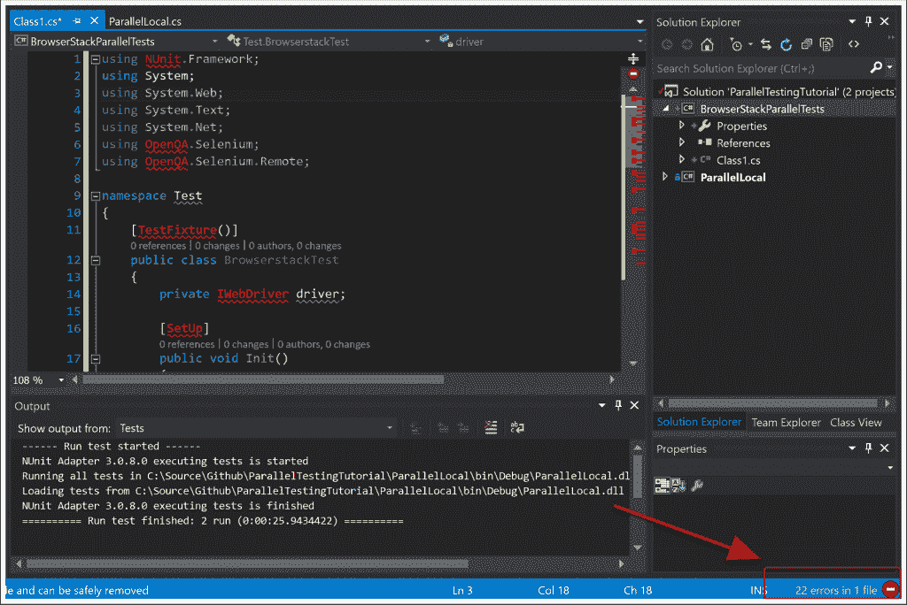

### 修复编译错误

您需要先修复这些错误，然后才能继续。

生产力提示:如果你有 ReSharper，你可以使用他们的快捷键“Ctrl + Enter”快速完成这项工作这将允许您在 Nuget 中搜索所有损坏的指令，并像我们上面所做的那样绕过手动执行的过程。看一看。

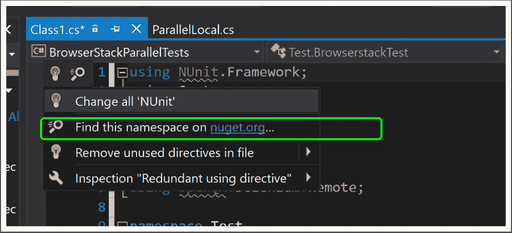

### 使用 ReSharper 修复损坏的指令

ReSharper 可以快速搜索 Nuget 并找到包来帮助我修复我破坏的指令。顺便说一句，我和 Jetbrains 一点关系都没有。我真的觉得他们的产品非常棒，我给了他们支持！

在不到一分钟的时间里，我安装了三个 Nuget 包，并修复了我所有的编译错误。这是一个有效的产品。

如果你没有 ReSharper，只需按照我们上面的步骤下载所有合适的 Nuget 包。这些与我们用于本地自动化测试的是相同的。

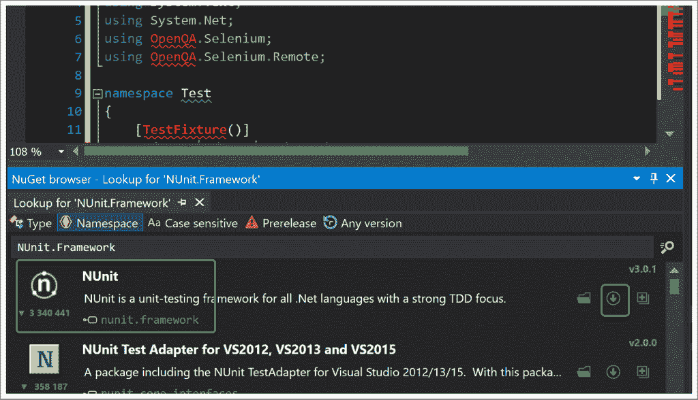

### 设置与 BrowserStack 并行运行的测试

1.  在所有编译错误消失后，确保从 BrowserStack 帐户中获取用户名和访问密钥。

**生产力提示:**如果您登录到 BrowserStack，并且您正在[复制他们提供的代码示例](https://www.browserstack.com/automate/c-sharp)，您的访问密钥和用户名将出现在代码示例中，并且您不需要采取任何进一步的操作。

2.  更新该类的 Init()方法，以使用我们需要的功能。在这种情况下，我将在不同的浏览器和操作系统组合中运行我的测试。
3.  在 [BrowserStack 的帮助页面](https://www.browserstack.com/automate/c-sharp)上，他们有一个名为“设置你的操作系统、浏览器和屏幕分辨率”的部分，允许你选择你的浏览器和操作系统组合，然后给你一段代码粘贴到你的测试中。选择您想要的任意组合，并将其粘贴到 Init()方法中。
4.  复制整个类并创建另一个测试。适当地重命名类和方法，以便在运行测试时有所帮助。如果您感到困惑，可以看看下面的代码示例。
5.  想做多少次就做多少次。记住，每个类将代表一个测试，以便 NUnit 可以通过 BrowserStack 并行运行。根据需要重命名所有的类和方法。此外，这些测试并没有达到应有的效率。我只是在演示如何并行运行测试。您可以更进一步，将 Init()和 Cleanup()方法抽象为一个基类，减少冗余。

[如果你是 C#](http://www.amazon.com/exec/obidos/ASIN/0985580127/makithecompsi-20) 的新手，不明白如何构造类，你可以在[用 C#完成 Selenium Webdriver 课程](http://courses.ultimateqa.com/courses/selenium-with-c?coupon=simpleprogrammerparallelpost)中学习。

6.  最后，像前面一样在每个类上添加[Parallelizable]属性。
7.  在运行测试之前，不要忘记更新您的用户名和访问密钥。

您的代码将类似于下面的示例。和往常一样，你也可以[下载代码](https://github.com/nadvolod/ParallelTestingTutorial)。

### 如何在 BrowserStack 中运行并行测试

1.  构建您的解决方案，以便测试资源管理器可以发现您刚刚添加的新测试。
2.  右键单击并选择“运行选定的测试”

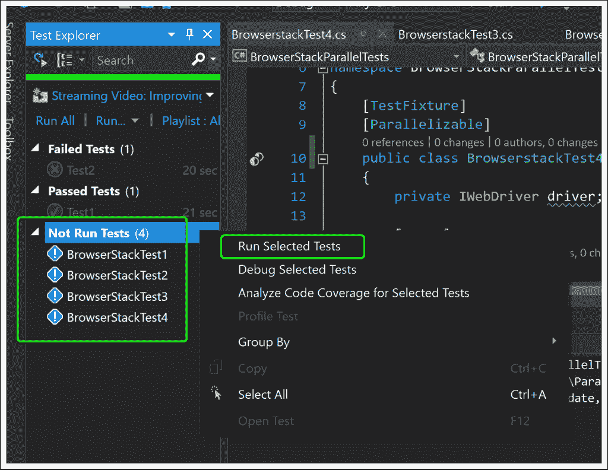

### 并行运行的测试

看看这个。并行运行的四个令人敬畏的测试。我的订阅允许我并行运行多达 40 个测试。

用 BrowserStack 玩一会儿。请注意我们的测试是如何自动记录视频、文本日志和可视日志的。我们不需要做任何事情来获得这种能力。他们只是包括它。

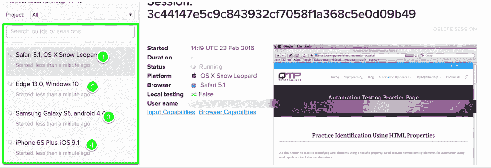

## 如何使用 Sauce Labs 并行运行测试

### 什么是酱实验室？

酱实验室和 BrowserStack 很像。它也是一个基于云的系统，允许你在云中执行自动化测试用例。它们托管基础设施，并允许您在数百种不同的操作系统和浏览器上运行测试。相比 BrowserStack，我更喜欢 Sauce Labs，原因如下:

1.  他们成立较早，有一个整体更好的平台。
2.  他们的文档非常优秀，使集成他们的技术变得非常容易。
3.  总的来说，它们比 BrowserStack 拥有更多的功能。

但是这两种解决方案都比 Selenium Webdriver 的本地功能 GUI 测试领先好几年。所以尽你所能。

### 酱油实验室入门

*   与大多数这些工具一样，您需要一个帐户。如果您的公司没有帐户，请获得[免费试用](https://saucelabs.com/signup/trial)。
*   酱实验室的文档真的很棒。您可以遵循它来运行您的代码。

基本上，通过安装所有的 Selenium Webdriver Nuget 包和 NUnit，您可以完成我们之前所做的一切。

### 复制源代码并修复编译器错误

1.  复制他们的帮助页上的源代码，并将其粘贴到您的 Visual Studio 类中。你现在会有很多编译错误。在我的例子中，我看到 41。
2.  就像之前一样，让您的智能感知帮助您修复这些错误。同样，这只是安装 Nuget 包，更新测试名称空间，并确保为 Sauce Labs 准备好适当的用户和密钥。

我最终的代码看起来像这样，也可以下载。

### 从哪里获取用户名和访问密钥

当您登录到 Sauce Labs 时，您可以在图中所示的位置获得访问密钥和用户名。用您个人帐户的适当值更新代码。

如果您再次查看我的代码，您会注意到我使用本地环境变量来存储我的用户名和密码。这实际上是我最近通过网络研讨会从戴夫·海夫纳那里学到的。这太棒了，因为我的代码将总是在本地运行。此外，我可以与你分享代码，而不需要改变它来掩盖我的用户名和密码。

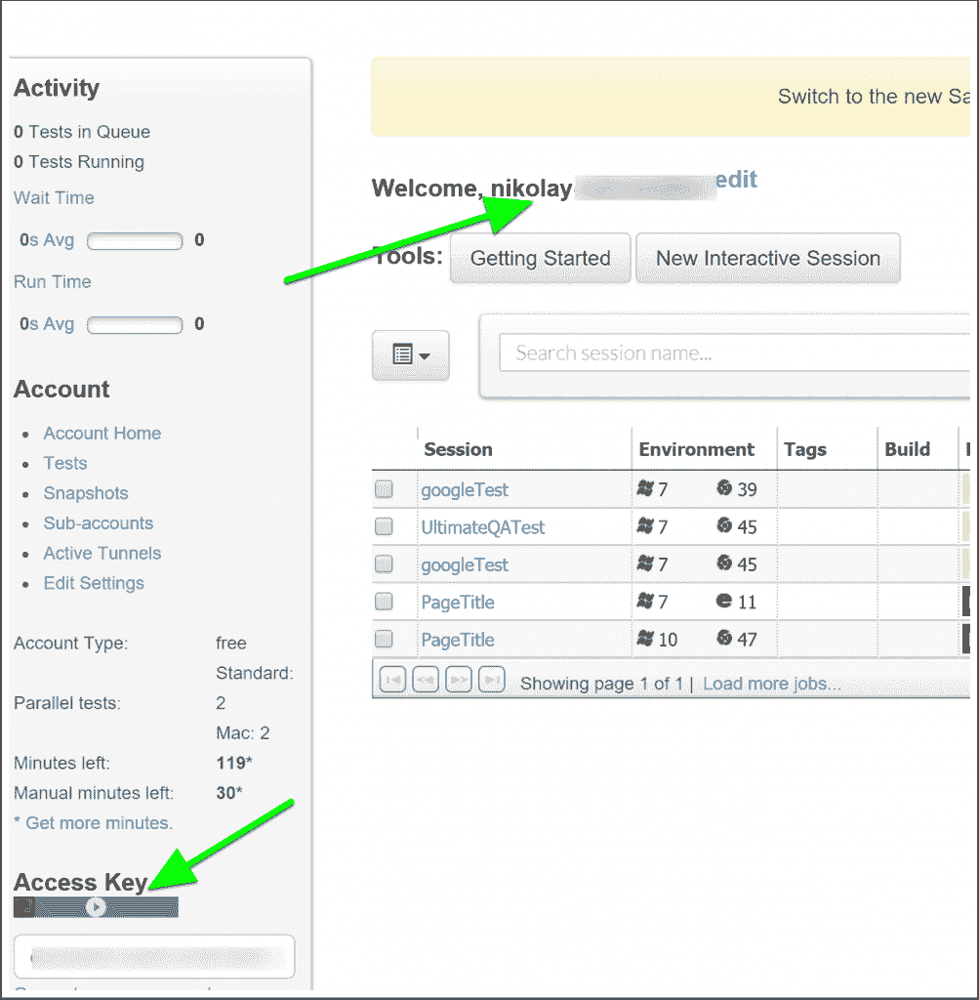

### 最终要求检查

跑步前，确保你已经准备好了所有的东西:

1.  下载了正确的代码。
2.  安装 Webdriver 和 Nunit 的 Nuget 包。
3.  安装了 NUnit 扩展。
4.  您的用户名和密码保存到环境变量中。或者，您可以将它们硬编码到您的代码中。
5.  您的所有测试都有适当的属性:测试的[Test]和类的[Parallelizable]。如果您使用我提供的代码，这应该不是问题。如果您创建自己的代码，请记住这一点。

### 如何使用 Sauce Labs 并行运行 Webdriver 测试

1.  构建您的代码，以便测试资源管理器可以看到您的所有测试。
2.  在测试资源管理器中，突出显示要运行的测试。因为我们正在与 Sauce Labs 合作，所以让我们选择 Sauce Labs 测试。
3.  在它们被选中之后，右键单击并执行“运行选中的测试”

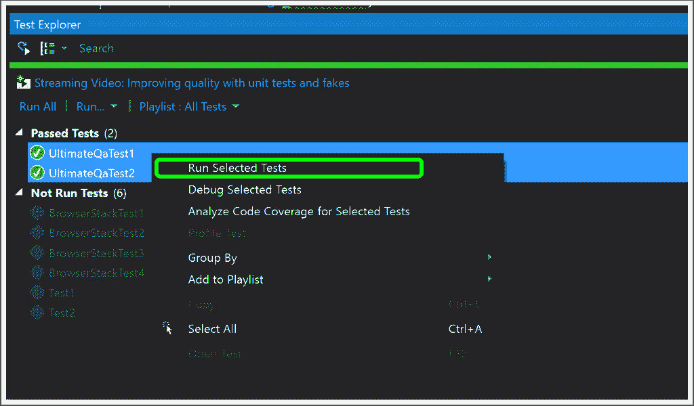

### 在哪里可以看到酱油实验室运行的结果

看看你的酱油实验室仪表板。您将看到您的两个测试并行运行。看一下时间标记。

如果你真的想把你学到的东西应用到测试中，为什么不在 Sauce Labs 测试套件中添加更多的测试，看看你是否能让它们并行运行？

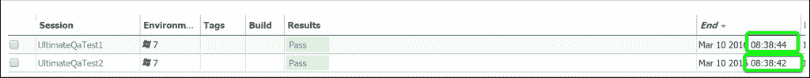

### 一些很酷的酱实验室功能

与本地测试相比，我更喜欢在云中进行测试的原因是因为这些服务提供了令人惊叹的特性。如果你点击其中一个测试，你可以得到命令日志、截图、视频、元数据、Selenium 日志和交互式会话，所有这些都可以下载。

在我从事自动化软件测试的这些年里，我从未想过在我的框架中内置如此性感的功能。有了 Webdriver 和 Sauce Labs，真的很简单，开箱即用。

摆弄这些标签，探索。你将看到的东西超级酷:)

### 什么错误信息？

努尼特。core . UnsupportedFrameworkException:已跳过加载程序集“{assembly name}”，因为它引用了…

如果您遇到这个错误，那是因为您试图使用 Resharper 来运行您的测试。这个错误是我自己犯的。相反，使用 Visual Studio 来执行您的测试，测试将通过 NUnit 扩展顺利运行。

## 结论

总之，使用 Selenium Webdriver 进行并行测试有很多好处，比如减少测试套件的执行时间，减少测试提供的反馈循环的长度。这些好处有助于通过更有效的方式驱动更高质量的软件，这是我每天都在努力的事情。

如果您有选择的话，尝试在云中执行您的并行测试。你得到的好处，比如日志、视频、截图和你的工作历史，是你自己能够创造的任何东西都无法比拟的。所有这些额外的服务将帮助您调试，并允许您花更多的时间实际覆盖新的功能，从而使您更加高效。

在这一点上，你可以自己尝试一下。自动化您想要的任何测试，并让它们并行运行。您可以在这个[练习页面](http://www.qtptutorial.net/automation-practice/)上练习功能自动化软件测试。

感谢您花时间阅读我的帖子。请随意留下任何评论、问题或侮辱。同样，如果您需要，这里有额外的资源:

*   [关于这个话题的免费视频教程](http://courses.ultimateqa.com/courses/parallel-testing-tutorial)
*   [本主题中使用的代码库](https://github.com/nadvolod/ParallelTestingTutorial)
*   [Github 教程](http://www.qtptutorial.net/how-to-download-a-github-project-and-open-it-in-visual-studio/)
*   [重磨教程](http://www.qtptutorial.net/resharper-for-visual-studio-build-amazing-automation-testing-code/)
*   [测试自动化框架架构](https://simpleprogrammer.com/2014/04/14/test-automation-framework-architecture/)

在你开始涉猎所有这些资源之前，也可以看看我的课程[“快速学习任何东西的 10 个步骤”](https://simpleprogrammer.com/store/products/learn-anything-quickly/)。