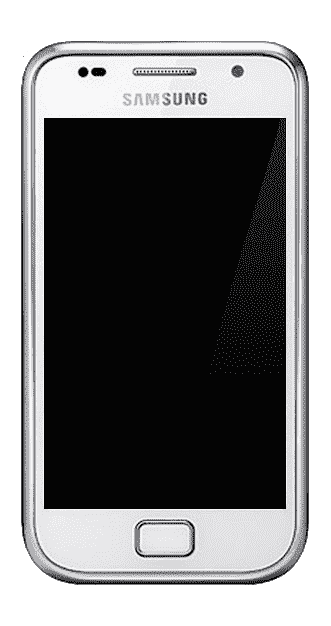

# 互联网的历史:第 16 部分——iPhone 与 Android

> 原文：<https://simpleprogrammer.com/part-16-iphone-versus-android/>

在[第 12 部分](https://simpleprogrammer.com/history-internet-12-birth-of-the-iphone/)和[第 13 部分](https://simpleprogrammer.com/history-internet-13-criticism-of-the-iphone/)中，我们看到了 iPhone 是如何革新智能手机市场产品并成为销售热点的。在[第 15 集](https://simpleprogrammer.com/history-internet-part-15-android/)中，我们描绘了 Android 从实验样机到 2008 年 9 月首款 Android 智能手机 HTC Dream 发布的发展历程。

苹果和谷歌各自采取了非常不同的方法来开发智能手机。苹果认为，最好的产品是通过控制软件和硬件开发，并设计两者无缝协作来制造的。

谷歌决定只生产 Android 软件，并与各种硬件制造商合作开发新设备。这让谷歌有更多的机会推出畅销产品，因为即使几家硬件制造商未能推出成功的 Android 手机，一个成功的故事也足以推广他们的操作系统。

另一方面，苹果实际上需要在 iPhone 的每一个新版本上下注。苹果的风险和回报都更高。

2008 年，诺基亚凭借其广受欢迎的塞班操作系统占据了智能手机市场的大部分份额。RIM 的黑莓系列产品继续热销，但 iPhone 销量的飙升让黑莓在年底黯然失色。大多数人还不知道 Android 智能手机的存在，但一系列新设备即将吸引消费者的注意力。

## 摩托罗拉在安卓系统上下了双倍赌注

对谷歌来说，一个好消息是 2008 年 8 月任命桑杰·贾为摩托罗拉移动公司的首席执行官。

Jha 在高通工作时与谷歌的安迪·鲁宾有着良好的业务关系，作为新的首席执行官，他下令 Android 是摩托罗拉手机上唯一搭载的操作系统。他们开始与谷歌和威瑞森无线公司合作，开发了摩托罗拉 Droid。

<figure class="aligncenter">

<figcaption>The Motorola Droid. Photo by [Shritwod](https://en.wikipedia.org/wiki/en:User:Shritwod), [CC BY-SA 3.0](https://creativecommons.org/licenses/by-sa/3.0)</figcaption>

</figure>

这是第一款在美国大受欢迎的 Android 设备，在前三个月的销售速度超过了第一款苹果 iPhone。

## Nexus One

Nexus One 由 HTC 制造，但由谷歌营销。这是第一款看起来像 iPhone 的 Android 手机，在某些方面，它在技术上更胜一筹:它有更大的触摸屏和降噪麦克风。

HTC Desire 好评如潮，包括 TechRadar 的五星评级，他总结道，“简而言之，这是一款非凡的手机——我们有过的最好的手机之一。”

<figure class="aligncenter">

<figcaption>HTC Desire</figcaption>

</figure>

## 三星 Galaxy 和 Galaxy S

<figure class="aligncenter is-resized">

</figure>

三星于 2009 年 4 月 27 日发布了三星 Galaxy，配备 3.2 英寸  触摸屏和 500 万像素自动对焦摄像头，带大功率 LED 闪光灯。

它于 2009 年 6 月 29 日发布，最初是 Android 1.5 Cupcake，后来是 Android 1.6 Donut。它受到了批评，因为它没有正式升级到 Android 2.3 版本，也不是一个重大的商业成功，但它给了三星在第二年推出开创性的 Galaxy S 所需的经验。

<figure class="aligncenter">

<figcaption>
Photo by Dj106 [CC BY-SA 3.0](https://commons.wikimedia.org/w/index.php?curid=33021366)</figcaption>

</figure>

在发布时，Galaxy S 拥有所有智能手机中最快的图形处理能力，并且是最薄的智能手机，厚度为 9.9 毫米。它售出了超过 2500 万台，这一成功导致了该品牌的更多代。整个 Galaxy S 系列迄今已售出超过 10 亿台。

## iPhone 4——苹果的最大飞跃

2010 年是安卓手机的突破年，用户从 700 万增长到 6700 万。

2010 年 4 月，安迪·鲁宾对《纽约时报》说，他预计安卓将统治全球:“这是一个数字游戏。当你有多个原始设备制造商在多个产品类别中生产多种产品时，这只是时间问题。”

截至第二季度末，Android 设备占据了全球销售额的 17%，而 2009 年仅为 2%。

尽管推出了速度更快的 iPhone 3GS 型号，但 iPhone 开始看起来有点过时，销量落后于基于 Android 的手机和 RIM 的黑莓设备。苹果迫切需要推出一款更新的机型，让用户重拾兴奋感。

苹果的答案是 iPhone 4，号称是自第一代 iPhone 以来最大的飞跃。首席执行官史蒂夫·乔布斯吹嘘它有史以来最薄的框架，制造质量和集成天线。由于像素是以前的四倍，产生的清晰文本对眼睛来说更容易，苹果公司声称这超出了人类视网膜区分像素的极限。出于这些原因，苹果通过将其品牌化为“ [retina 显示屏](https://en.wikipedia.org/wiki/Retina_display)”，成功地将其形象与竞争对手区分开来

陀螺仪的引入为游戏开辟了新的可能性，相机得到了改进，配备了背面照明传感器，可在弱光条件下拍摄出色的照片，并能够录制高清视频。

对许多人来说，最好的新功能是苹果的 FaceTime 视频通话，尽管要使用它，你的朋友也需要拥有一部 iPhone 4，你和你的朋友都要连接到 WiFi。

iPhone 4 是一款畅销产品，销量超过了之前的任何一款 iPhone。24 小时内超过 600，000 人预订，发布会当天出现了混乱的场面，数千人彻夜等待购买 iPhone 4，警察被召来试图恢复秩序。

### 天线门

iPhone 4 发布后不久，发布前的大肆宣传就变成了负面报道。用户抱怨他们在拿着手机时失去了信号。手机边缘的金属外壳充当了两个天线，微小的间隙将它们彼此分开。触摸手机的左下边缘会桥接两个天线，导致信号丢失和掉线。

苹果最初的声明建议“避免握住手机的左下角”，这被许多消费者认为是不可接受的。

作为回应，乔布斯组织了一场新闻发布会，宣布苹果将向所有 iPhone 4 用户提供一个免费保护套来帮助解决问题，或者如果他们仍然不满意，可以退款。尽管有许多负面的新闻标题，但只有不到 2%的顾客将手机退回退款，大多数顾客对他们的购买仍然满意。

## 专利战争:乔布斯的愤怒

2009 年 10 月 22 日，[诺基亚起诉苹果](https://appleinsider.com/articles/09/10/22/nokia_sues_apple_over_iphones_use_of_patented_wireless_standards.html)iPhone 未经授权使用其无线标准。诺基亚指责苹果“试图搭诺基亚创新的便车”苹果的回应是反诉诺基亚侵犯了 13 项专利。

不甘示弱的诺基亚提起了第二起诉讼，并向美国国际贸易委员会投诉苹果的另外七项专利。这只是一场重大专利战争的开始，这场战争一直持续到 2011 年 6 月 14 日，当时苹果同意向诺基亚支付一笔未披露的一次性款项以及继续支付的专利费。

随着苹果与诺基亚的专利纠纷日益增多，乔布斯也越来越担心谷歌在手机市场不断增长的市场份额。
T1。large-mobile-banner-1-multi-119 { border:无！重要；显示:屏蔽！重要；浮动:无！重要；行高:0；边距-底部:15px！重要；左边距:0！重要；右边距:0！重要；margin-top:15px！重要；最大宽度:100%！重要；最小高度:250px 最小宽度:250 像素；填充:0；文本对齐:居中！重要}

2008 年夏天，谷歌和 HTC 不情愿地屈服于乔布斯的要求，从 HTC 的梦想中删除了类似 iPhone 的功能。乔布斯仍然不高兴他需要首先威胁谷歌，在一次与苹果员工的会议上，他说，“这些家伙在骗我，我不会再忍受了。这种'[不作恶'](https://en.wikipedia.org/wiki/Don't_be_evil)的玩意儿都是扯淡。”

作为谷歌首席执行官和苹果董事会成员，埃里克·施密特回避了有关 iPhone 的讨论。施密特一再淡化 Android 对乔布斯的意义，称 Android 项目可能会报废，甚至在 HTC Dream 推出后，施密特还被允许继续担任苹果董事会成员。

但是谷歌在 2009 年 7 月 7 日发布了 Chrome 操作系统，这一对苹果的额外威胁成为了乔布斯的最后一根稻草，他在 2009 年 8 月 3 日发布了[新闻稿](https://www.apple.com/newsroom/2009/08/03Dr-Eric-Schmidt-Resigns-from-Apples-Board-of-Directors/)，声明:

“不幸的是，随着谷歌进入苹果更多的核心业务，包括 Android 和现在的 Chrome 操作系统，埃里克作为苹果董事会成员的效力将大大降低，因为由于潜在的利益冲突，他将不得不回避我们更多的会议。因此，我们共同决定，现在是埃里克辞去苹果董事会职务的恰当时机。”

<figure class="aligncenter">

<figcaption>Eric Schmidt’s anti-Apple business moves forced him to resign from Apple’s board. Photo by Jolie O'Dell</figcaption>

</figure>

2010 年 1 月，HTC 推出了一款具有多点触控功能的 Android 手机，并拥有 iPhone 外观和感觉的许多其他方面。乔布斯脸色铁青，在准备对 HTC 提起诉讼的同时，他告诉传记作者沃尔特·伊萨克森:

> “如果需要的话，我会用尽最后一口气，我会花光苹果银行 400 亿美元的每一分钱，来纠正这个错误。我要毁掉安卓，因为它是偷来的产品。我愿意为此发动热核战争。”

<figure class="aligncenter">

</figure>

苹果公司于 2010 年 3 月提起诉讼，乔布斯评论道，“我们可以坐视竞争对手窃取我们的专利发明，或者我们可以做点什么。我们决定对此做点什么。”

谷歌发言人评论说，“我们不是这场诉讼的一方；然而，我们支持我们的 Android 操作系统和帮助我们开发它的合作伙伴。”

HTC 反诉苹果，声称侵犯了 HTC 从谷歌获得的专利。2012 年 11 月，HTC 就此案达成和解，同意向苹果支付一笔未披露金额的专利费。此时，苹果正处于与摩托罗拉的另一场专利战中，与三星的专利战规模更大。

## 乔布斯的遗产

可悲的是，这场诉讼延续到了乔布斯之后。由于健康状况恶化，乔布斯于 2011 年 8 月 24 日向苹果董事会递交了辞呈，并推荐蒂姆·库克为下一任 CEO。

五周后，苹果推出了 iPhone 4S，活动结束时，库克、乔尼·伊夫和其他几位苹果高管接到电话，邀请他们去乔布斯家做最后的告别。2011 年 10 月 5 日，乔布斯去世了。

微软罕见地与他们的长期竞争对手团结一致，加入苹果公司，在其总部和校园降半旗致哀。

<figure class="wp-block-image">

<figcaption>2011 年 10 月 5 日降半旗致哀。艾莉森·卡西迪的照片， [CC BY-SA 3.0](https://commons.wikimedia.org/w/index.php?curid=16883932)</figcaption>

</figure>

苹果新任首席执行官库克宣布:“苹果失去了一位富有远见和创造力的天才，世界失去了一位了不起的人。我们这些有幸认识史蒂夫并与之共事的人失去了一位亲爱的朋友和一位鼓舞人心的导师。史蒂夫留下了一个只有他才能创建的公司，他的精神将永远是苹果的基础。”

微软首席执行官史蒂夫·鲍尔默说:“我的心与他的家人、苹果公司的每个人以及所有被他的作品感动的人同在。”微软董事长[比尔·盖茨发表声明](https://www.quora.com/How-did-Bill-Gates-respond-to-Steve-Jobs-death?share=1)说:“史蒂夫和我在近 30 年前初次相遇，在我们超过一半的生命中，我们一直是同事、竞争对手和朋友。世界上很少有人能像史蒂夫一样产生如此深远的影响，这种影响将会持续好几代人。对于我们这些有幸与他共事的人来说，这是一种无比巨大的荣誉。我会非常想念史蒂夫。”

作为回应，白宫与奥巴马总统发表了一份声明，总结道“世界失去了一位远见卓识的人。世界上很多人通过他发明的一种设备得知了他的死讯，这或许是对史蒂夫成功的最大褒奖。

在他们的书《谷歌如何工作》中，埃里克·施密特和 T2 反驳了苹果的专利主张，但赞扬了乔布斯，说“没有比他更好的例子来说明一个聪明的创意对世界的影响了。他体现了技术深度、艺术和创作天赋以及商业头脑的结合，这使他能够创造出人们真正爱上的计算产品。”

## iPhone 与 Android——谁赢得了智能手机之战？

我们可以查看两家公司多年来的销售数据，并对声称一个平台比另一个平台稍有优势的情况进行各种分析，但这可能会遗漏要点。事实是苹果和谷歌都赢得了智能手机战争。

该行业的前巨头诺基亚和 RIM(现在的黑莓有限公司)，以及微软等竞争者，都未能取得苹果和谷歌的长期成功。今天，智能手机市场可以被描述为双头垄断:虽然你可以从几个不同的 iPhone 型号和各种基于 Android 的设备中进行选择，但绝大多数消费者总是会购买运行 Android 或 iOS 的手机。

本系列过去几集讲述的是 21 世纪关于在哪些设备上使用互联网的控制权之争。本世纪也发生了一场不同的斗争，争论的焦点是什么信息可以在互联网上看到，谁可以看到，什么信息应该保密。

接下来的几部分将探索政府在互联网上的角色，以及维基解密的故事。