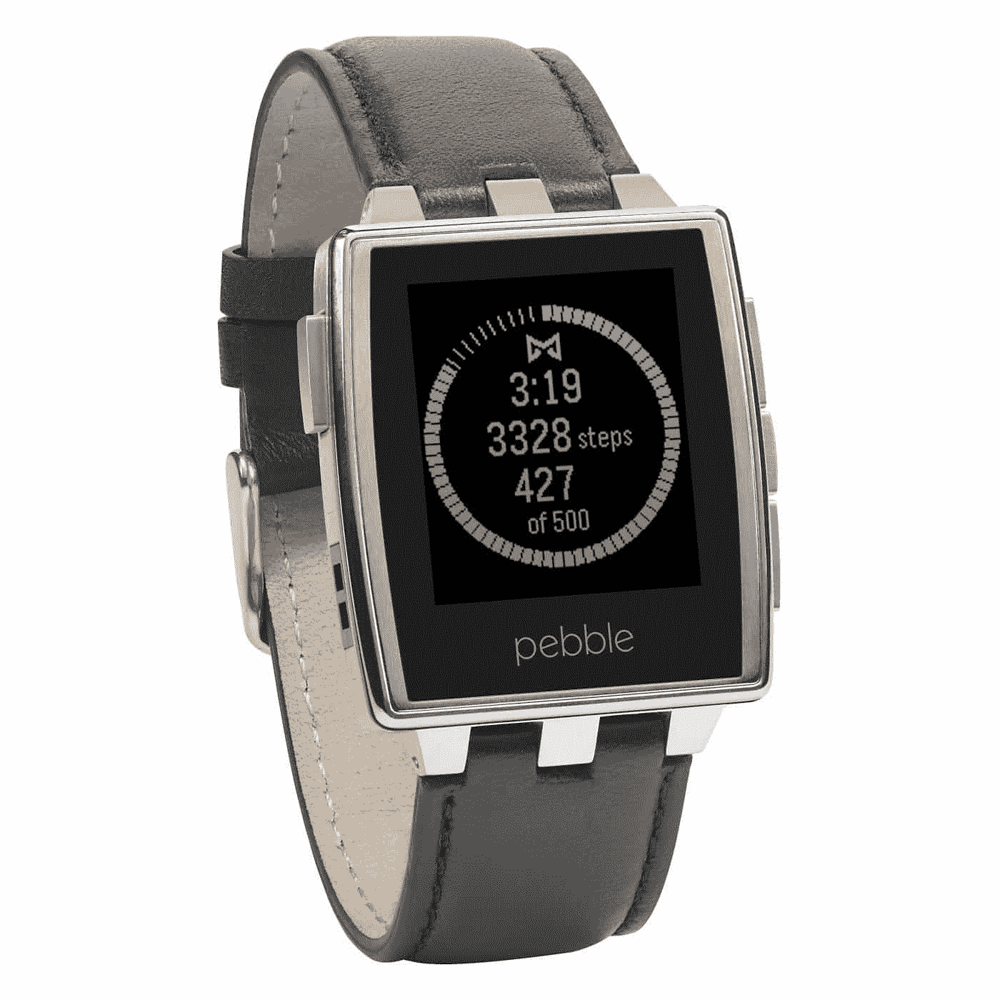
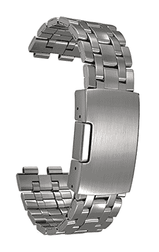

# Pebble Steel 评论:振动臂的 4 个月

> 原文：<https://simpleprogrammer.com/pebble-steel-review/>

我现在越来越频繁地在不同的人身上看到各种各样的智能手表。

事实上，目前的市场统计表明，你可以在 [4-6 万人](http://www.theguardian.com/technology/2015/aug/28/apple-watch-smartwatch-sales-analysis)上看到一款智能手表。我很难找到我可以准确依赖的直接统计数据，但可以说，智能手表在我们的经济中有着强大的立足点。

我在 2015 年 10 月买了一辆 [Pebble Steel](http://www.amazon.com/exec/obidos/ASIN/B00KVHEL8E/makithecompsi-20) 。它可能没有[约翰·桑梅兹的苹果手表](https://simpleprogrammer.com/2015/09/14/apple-watch-review-after-3-months-travelling-with-an-apple-watch-heres-what-i-think/)那么有魅力，但我仍然认为它值得一试。总的来说，我喜欢戴着它，它完全符合我对这种设备的期望。

## 为什么它很棒

### 闹钟

当你戴上这个东西，你不会错过最后期限或叫醒电话。无论你选择使用股票闹钟(这是非常基本和无聊的)还是闹钟应用程序，当事情开始发生时，你会注意到它。

这东西里的触觉马达是我见过的最强的一个。它震动得非常剧烈。事实上，如果我不戴它——在充电或淋浴时——它会剧烈振动，即使它不是声音警报，我仍然可以从它碰巧坐在的任何表面上的纯粹振动力中听到它。

### 说到淋浴

头几个月，我用的是手表附带的普通皮表带。如果你决定买这些东西中的一个，我强烈建议你走不锈钢带的路线。在每天使用手表并正常出汗(我不是健身爱好者)大约一个月后，普通的皮革表带开始发出一种非常难闻的气味。钢制的闻起来像…不锈钢。

我也不能在用吊带洗澡的时候把它放在有水的壁架上。现在我有了钢制的手表，如果我收到电话、短信、Skype 通知等，手表就会通知我。洗澡的时候。现在，我不能在洗澡的时候接电话。太奇怪了。但至少它让我知道在我完成后是否有重要的事情要转圈回去。

此外，我倾向于在淋浴时思考生活、信仰和任何其他主题而分心。有一个小时钟盯着我，提醒我已经在那里呆了 30 多分钟，这是一个有用的提醒，可以节约一点水。:-) 

### 电池寿命

根据你为手表选择的配置，你可以在 5-7 天内完成充电，没有任何问题。一些更密集的应用程序和 watchfaces 会更快地耗尽电池。如果你经常收到通知，振动马达会很快耗尽手表电池。

不管你多快耗尽，充电只需要很少的时间。通常，我插上电源 30 分钟或更短的时间，我就会看到绿灯(充满电之前是橙色的)。当然，我不会让它在插上电源之前变空，所以这也是需要考虑的事情。

### 通知

这真的是这款手表最大的卖点。通知机制很容易定制，也很容易告诉手表一天中的什么时间是你的安静时间。这样，你可以立即得到最重要的事情的通知，而把其余的事情留给“当你去做的时候”

例如:短信和电话显示在我的手表上。脸书的帖子和博客评论没有。电子邮件会——但只是我认为更重要的电子邮件。

好消息是，Pebble 是跨平台的。我已经把它连接到一个 Android 设备上了，但是我想当连接到一个 iOS 设备上时，通知配置也是一样灵活的。

### 价格

我买的时候发现有特价，所以只花了 119 美元。但即使在 150 美元的价位，这款手表也确实有价值标签。虽然它的某些部分肯定属于“一分钱一分货”的类别，但总体而言，它是一款非常时尚的硬件，我很乐意在任何场合佩戴。另外可以配合 [iPhone 或者安卓](https://simpleprogrammer.com/2015/11/11/android-vs-apple-today/)使用，这是一个福利。

### 硬件接口

不像很多[智能手表](https://simpleprogrammer.com/2015/11/30/software-developer-gifts-and-other-tech-geek-gifts-2015/)，这个东西没有触摸屏。但这并没有让我觉得我不能成功地使用它。这四个按钮很容易理解，可以处理我想用手表完成的所有任务。而且它们绝对不会减损手表本身的整体外观。

钢制版(更具体地说是表带)需要记住的一点是:它是拉丝不锈钢，这意味着它确实太容易被划伤。对我来说，这并不是一个很大的贬损，因为有划痕的地方并不太明显。此外，手表本身的机身保持无划痕，即使我很滥用它。

## 在“要么接受要么放弃”的类别中

### 应用程序选择

这里有两个我非常欣赏的应用程序:

1.  高档帽
    *   这是一个非常可定制的计步器和活动跟踪器，与 Google Fit 有很好的联系。它也为我做了令人钦佩的睡眠跟踪工作。
    *   有可能放下手机去散步/慢跑等。但这也意味着留下手机上的音乐和书籍来阅读。
2.  NavMe
    *   如果你在路上或骑自行车，基于手腕的导航指令可以提供很大的帮助。如果你是一个经常旅行的人，它会很好用。

否则，应用程序本身的效用就不那么好了。[这里有一个不错的应用选择列表](http://www.digitaltrends.com/mobile/best-pebble-apps/7/) [你可以选择](http://www.digitaltrends.com/mobile/best-pebble-apps/7/)，但老实说，我没发现它们中的大多数有什么好处。

我用 stock music 遥控器跳过手机上的歌曲。但是我的手机必须随身携带才能听音乐或者做任何事情。没有手机，它唯一能做的就是任何与加速度计或日期/时间相关的事情。无论如何，我的手机几乎总是在蓝牙范围内——但这对一些人来说可能是个缺点。

### 看脸

很多人喜欢为手表打造新的表盘。[我找到了一个非常符合我个性和需求的](https://apps.getpebble.com/en_US/application/55a5c024f4510f794c000071?query=timestyle&section=watchfaces)(记住，这个链接在 Pebble Time 上显示了它。我的没有彩屏)。对我来说，看脸并不是一个很大的负面因素。然而，如果你喜欢修修补补，你必须学习一些 C 语言(是的，实际上是古老的 C 语言)来制作一个完全自定义的手表表面，这可能是一些人“负面”一栏中的一点。

也就是说，使用[这个便捷的工具，你可以在定制的表盘上实现你想要的大部分功能。](http://www.watchface-generator.de/)

同样，我不能代表苹果，但 Android 也有这个应用程序，名为 [Canvas](https://play.google.com/store/apps/details?id=com.pennas.pebblecanvas&hl=en) 。它不是超级灵活，但是对于有创造力的人来说，你可能会想出一些看起来有点酷的东西。

我认为大多数人对表盘本身的主要问题是屏幕的分辨率。这对于通知、时间和一般易读的东西来说是很棒的。但是在 144 x 168 像素的情况下，你不会得到平滑的角度和清晰的线条。这对我来说没什么大不了的，因为我用它来阅读一个快速通知，然后回到手表表面。但它确实让一些更复杂的表盘变得不那么好看了。

### 手表带

从皮革表带换成不锈钢表带大约需要 15 分钟。总的来说，这不是一个很大的时间消耗，但如果你想要一块可以快速切换波段的手表，这可能不是你想做的事情。

不仅如此，可用波段的选择似乎有些有限。当然，我没有花太多时间去寻找不同的表带；我找到了一个我喜欢的，所以我不必。但是，如果你不喜欢普通皮革或经 Pebble 认证的不锈钢，你可能会有一些狩猎要做。

## 一些明显的(但适宜的)差距

因为我的智能手表不是 Pebble 的最新款，即 [Pebble Time](http://www.amazon.com/exec/obidos/ASIN/B0106IS5XY/makithecompsi-20) ，有几件事情它不能做到这一点，如果你正在寻找这些功能，我会选择不同的智能手表。

1.  

    Heart Rate Tracking
    *   我不确定如果我有这个我会不会用它。大概？但我不能肯定。
2.  语音命令
    *   我不能在手表上与 Siri 或谷歌或 Cortana 通话。我真的不在乎。
3.  手表上有限的应用选择
    *   Pebble Time 不受此限制，但在 Pebble/Pebble Steel 上，你只能在手表上选择八个应用槽。换句话说，在应用程序和非库存手表表面之间，你只能安装八个东西。老实说，我还没有找到我真正经常用来关心的八件事。但是有些人觉得这让人望而却步。

## 一个显著的缺点是

也许命运有一种讽刺的意味。就在我开始写这篇文章来回顾我的手表时，奇怪的事情发生了。我能想到的最好的描述方式就是你在老式模拟电视上看到的静电。

在搜索 Pebble 的支持论坛时，我发现 Pebble 社区对此有一个术语，叫做“屏幕撕裂”显然，振动电机加上充电过程中产生的热量，会导致主控芯片和屏幕之间的连接带分离。

如果你愿意取消你的保修，有变通办法可以解决这个问题，但我的保修还不到 25%。因此，我联系了 Pebble 支持人员，他们目前正在处理更换产品的 RMA(退货授权)。

到目前为止，这一过程并不迅速，但我认为“免费”更换硬件是值得的。

如果你决定走 Pebble 的路线，请记住这一点。这种情况经常发生，以至于有一个关于它的 Pebble 支持主题。因此，希望他们已经修复了生产过程，以防止这种情况发生。但是如果还没有改善，如果你的支持团队也遇到这种情况，准备好处理他们的支持团队。

## 底线

There are some feature limitations to the Pebble (the Pebble Time probably makes up for some of them). And, the manufacturing process seems to need some tweaking.

如果你真的在寻找功能丰富、高度集成的智能手表，我会多花一点钱，买一些更集成到 Android wear 或苹果生态系统中的东西。

然而，如果你想要一款价格实惠的智能手表，Pebble Steel 绝对不会错。

*   它已经提供了很多不错的定制功能。
*   它有一些有趣的设施。
*   电池能持续很长时间。
*   您再也不会错过重要的电话、短信、电子邮件或其他信息。你的闹钟可以唤醒一具尸体。

总的来说，我在亚马逊上给它打了五星，只是因为我喜欢它能做的事情，也因为我的期望一开始就没有高到天上去。这一点，对于一个外观漂亮的硬件来说，价格是合适的，它上面有一些比一般软件更好的软件。我很自豪能经常穿我的鞋，我怀疑其他人买这种鞋的感觉会和我不一样。