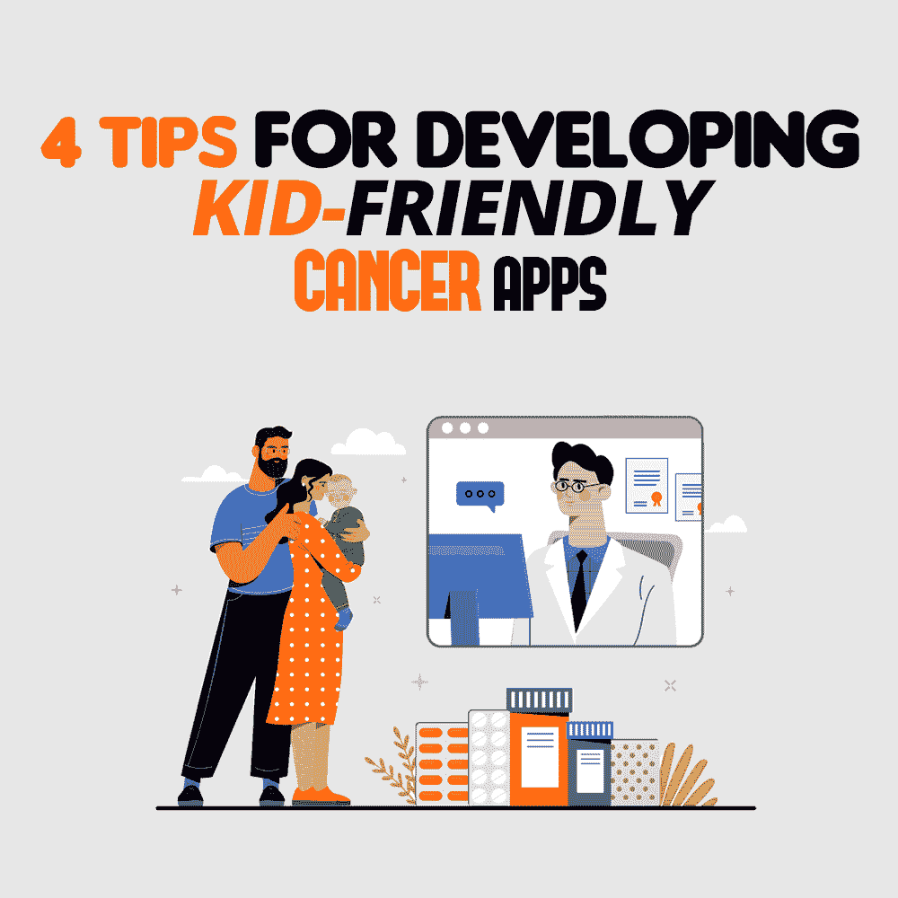

# 开发儿童友好型癌症应用程序的 4 个技巧

> 原文：<https://simpleprogrammer.com/pediatric-cancer-app-development/>

The World Health Organization reports that cancer is one of the leading causes of death, with 10 million deaths in 2020\. By 2025, the dreaded disease will have about 20 million new patients globally, of which approximately 1% will be children.

受遗传因素和环境中化学物质的影响，据估计，2022 年美国将有 10，470 名 15 岁以下的儿童被诊断患有这种疾病。

由于各种原因，儿童癌症的发病率一直在上升，特别是在低收入和中等收入国家，原因是缺乏诊断、误诊、延误诊断和缺乏药物，以及其他因素。更令人震惊的是，在[美国，儿童癌症研究一直资金不足](https://www.alexslemonade.org/childhood-cancer/about-childhood-cancer/facts)，因为不到 4%的联邦预算用于这方面。

儿童与癌症抗争最令人不安的一点是，他们大多接受化疗。化疗有使人虚弱的副作用，会降低他们的生活质量，甚至导致治疗停止。除了副作用之外，他们还必须经历没完没了的化疗、医学测试、治疗等。这对孩子和父母来说都是困惑和情感上的挑战。

对于患有癌症的孩子和他们的父母来说，移动健康应用程序是真正的救命稻草。这些应用程序可以让他们了解不同类型的可用治疗方法，跟踪症状，获得社会支持，并与医疗保健提供商沟通。

在这篇文章中，我分析了**儿科癌症应用程序开发**的四个关键特征，这些特征使患癌症的儿童及其父母能够以一种可理解的、令人信服的和有组织的方式应对疾病。这篇文章还分享了最好的癌症应用程序的例子，以帮助您更好地理解这些功能。

## 儿科癌症应用程序开发的四个关键特征

正如我上面提到的，一个儿科癌症应用程序应该有一些关键的功能，允许患者和父母以一种可联系的、令人信服的和有组织的方式处理这种情况。一般来说，这四个特征围绕着**信息、症状追踪、社会支持、**和**提醒**。让我们一个一个来看看。

### 教育和信息

研究发现，移动健康应用比医疗小册子和与医生的口头对话等传统沟通方式更有效。研究表明，患者更容易记住通过移动健康应用程序提供的信息。

向患者和父母提供信息和教育可以确保更好的疾病管理、更少的并发症、改善患者的生活质量和高质量的儿童护理。[移动应用开发者](https://www.goodtal.com/app-developer)应该意识到他们的目标受众的需求，并为癌症创建反映这些需求的应用。

一般来说，在应用程序中开发教育和信息功能时，您应该记住以下几点:

*   互动。将应用程序设计成互动和有趣的，让孩子们想使用它。
*   **使用简写本。**保持内容简洁，易于孩子理解。
*   使它在视觉上吸引人。孩子们通常喜欢图像，所以尝试通过图像和互动元素来解释复杂的概念。
*   **添加测验。**在最后用小测验来确定孩子们是否理解了这个概念。
*   **内容本地化。**整合目标市场的文化和意识，使其更具吸引力。
*   **定期更新。以即兴创作的形式定期更新内容会让用户着迷。**

至于目前帮助患有癌症的儿童了解和管理他们的疾病的应用程序的例子，我可以提到以下内容。

在北美工具公司(Tool of North America)的帮助下创建的一个新的 AR 癌症管理应用程序推出了一系列动画电影，其中包括一只唱歌的飞行独角兽、一只长着牙齿的绿色苔藓怪物、一个机器人、一只恐龙、一只快乐的蛞蝓等角色，以帮助儿童以互动和有趣的方式理解他们的诊断和治疗。

想象一下，一个鹦鹉船长向孩子们解释人体是如何充满微小细胞的，有时坏细胞会向好细胞宣战——就像船上的叛乱一样。然后是关于化疗，脱发，心情难过的有创意的解释。

Kraeftvaerket 应用程序是一款独特的应用程序，由具有癌症经验的青少年(AYAs)发起、创建和评估。毫不奇怪，该应用程序提供的实用和临床信息很容易引起患有癌症的儿童和青少年的共鸣。

该应用程序有一个信息库，这是患者和父母在癌症治疗过程中寻求信息的重要参考工具。大多数话题都包含在病人可以认同的其他 aya 的短视频叙述中。真实的视频叙事对受众和观众来说都是好兆头。

**吃或移植后吃**是一款应用程序，旨在为干细胞移植后急性恢复期的青少年提供信息。该应用程序帮助青少年学习关于饮食、可能的术后症状以及预防和控制并发症的措施的自我管理技能。吃吧！集中在饮食的七个方面:食欲、食物选择、呕吐、味觉变化、口干、饮食控制、恶心和常态。

**LESS** (晚期影响监测系统)应用程序是根据输入的癌症类型和等级数据，根据患者的疾病状况量身定制的。该应用程序的一个主要特点是在一周内提醒后续访问、定期检查和测试。

### 症状跟踪

Oncologists need to communicate with children directly to provide them with proper cancer treatment and care. Children's difficulty verbally communicating their symptoms and a lack of a system for thoroughly evaluating symptoms prevent them from getting the treatment they need.

在大多数情况下，临床工作人员低估了儿童报告的症状数量，这意味着许多症状没有得到识别和治疗。[癌症诊断](https://www.amazon.com/dp/B07WD5RKBK/makithecompsi-20)在儿童输入的帮助下跟踪症状的应用程序，以及儿童容易理解的深思熟虑的短语，可以帮助医生更准确地识别症状。

因此，在应用程序中开发症状跟踪功能时，请记住以下几点:

*   让孩子们说话。儿科肿瘤医生需要用自己的话来测量和记录孩子的症状。为什么？因为这有助于他们进行精确的症状测量。
*   **添加优点。**在应用程序中包含患者报告结果(PRO)表格，可以直接从患者那里收集数据，这有助于提高他们接受的护理质量。
*   **轻松导航。**该应用程序应易于使用和导航，以便儿童能够快速轻松地访问他们需要的信息。
*   **SOS 功能。**这是一项 SOS 功能，当孩子在医院遇到危险或困难时，它会向家长发送通知。

一些帮助儿童跟踪其癌症症状的应用程序包括以下内容。

**Sisom** 是一款帮助 6-12 岁儿童直接向治疗团队报告症状的 app。该应用的用户界面基于研究，确保使用的短语能引起儿童的共鸣，从而产生令人信服的症状集合。

巴戈特(Baggott)的移动肿瘤症状跟踪器(mOST)应用程序是一款 iPhone 应用程序，使用电子版儿科恶心评估工具(PNAT)帮助儿童和青少年跟踪症状。这个类别的大多数应用程序都是电子日记，激励目标群体每天测量和报告他们的症状，这比纸笔方法更有效。

Cherry 应用程序是一款 Android 应用程序，可以帮助患有癌症的儿童和青少年在日记中记录他们的经历，并与他们的父母、同龄人甚至医疗保健提供者分享。此外，该应用程序包括疾病相关信息和医生的反馈。

**Pain Squad** 是一个 iPhone 应用程序，可以帮助患者跟踪他们每天的疼痛强度、持续时间、位置和影响。该应用程序允许儿童记录使用的药物和其他疼痛管理策略。据 [NCBI 研究公司称，](https://www.ncbi.nlm.nih.gov/pmc/articles/PMC6320418/)这款应用易于使用，并利用基于游戏的功能和虚拟奖励来吸引青少年。

一些应用程序提供了[附加功能](https://simpleprogrammer.com/app-features-for-your-project/)来帮助跟踪症状，如果发现症状严重，就立即向用户提供反馈。例如， **Kraeftvaerket 应用程序**，不仅提供测量和记录特征，还帮助向医生呈现症状。

该应用程序还包含特定的算法，使医生能够得出症状的严重程度。如果症状被确定为致命的，警报会自动发送给患者，他们会收到症状管理的建议。据称，该应用程序可以提高生活质量，并为患有癌症的青少年提供支持。

### 社会支持和与其他患者的交流

使用应用程序与他人联系并获得个人体验支持是值得赞赏的。此外，应用程序可以帮助患者联系资源和组织，从而减轻父母的压力和经济负担。

考虑到这一点，在应用程序中开发社交支持和交流功能时，您应该考虑以下几点:

*   分享视频和故事。通过故事、建议、提问，甚至上传照片和视频，让患者之间的交流变得更加轻松。
*   **联系癌症支持护理。**这是为了帮助父母从积极从事癌症和支持性护理的组织中寻找资金和其他资源。

下面是一些目前提供社交支持和交流功能的应用程序的例子。

Cherry 应用程序的功能允许用户与使用该应用程序的其他人分享他们患癌症的经历，如朋友、父母和他们的治疗团队。

Kraeftvaerket 应用程序通过分享疾病和治疗的经验，帮助用户相互交流和支持。用户可以发送消息和图片来帮助和支持他人。

**护理助手应用**为父母和家庭成员提供社交支持，并允许用户分享他们的经历和提出问题。此外，该应用程序可以帮助用户联系活跃在癌症和支持性护理领域的资源和中心，这有助于减轻父母的压力和经济负担。

### 日历和提醒

日历和提醒模块旨在帮助患者管理时间，避免遗忘。虽然这是一个关键的功能，但它在癌症应用程序中并不常见。

在开发儿科癌症应用程序时，请记住以下提示，以提供有用的日历和提醒功能:

*   **轻松添加事件和提醒。应该开发该功能，以便用户发现创建和管理事件和提醒是轻而易举的事情。**
*   使用名人的声音和视频进行提醒。使用名人的声音和视频进行提醒将会促使孩子执行所需的任务，例如填表。
*   **提供奖励。**对于遵守提醒要求的孩子，可以给予一些奖励。

正如我所说，日历和提醒功能在癌症应用程序中并不常见。然而，我仍然可以举几个例子。

疼痛小组应用程序利用游戏机制——促销和奖励——鼓励患有癌症的儿童和青少年跟踪疼痛程度。例如，当医院里的孩子们开始写他们的疼痛日记时，他们就加入了致力于创造一个没有疼痛的世界的“特别警察部队”疼痛小组。

孩子们一天两次收到“警察总部”的提醒，说是时候提交报告了。孩子填写的报告越多，他们在机构中的排名就越容易上升，甚至会收到加拿大顶级警匪剧演员的贺信。

**Dosecast 应用**通过提供持续提醒，帮助癌症青少年坚持药物治疗方案。该应用程序最独特的功能是它的实时同步功能。即使应用程序被下载到所有设备上，每个设备都会立即更新。因此，如果你在手机中输入详细信息，平板电脑不会提醒你服药。

## 应用程序可以成为癌症儿童的救命稻草

对于癌症儿童来说，应用程序和药物是相辅相成的。这意味着应用程序开发人员社区需要对癌症患者和护理人员的需求格外敏感，并设计出能与他们产生无缝共鸣的功能。

事实上，上面分享的指导方针和例子，如教育患者、游戏化、症状跟踪、社会支持和沟通等，肯定会帮助你迈出最好的一步。

也就是说，没有什么可以替代用户测试。如果你想要一个成功的应用程序发布，从一开始就吸引患者和癌症幸存者，让他们积极地测试你的应用程序。