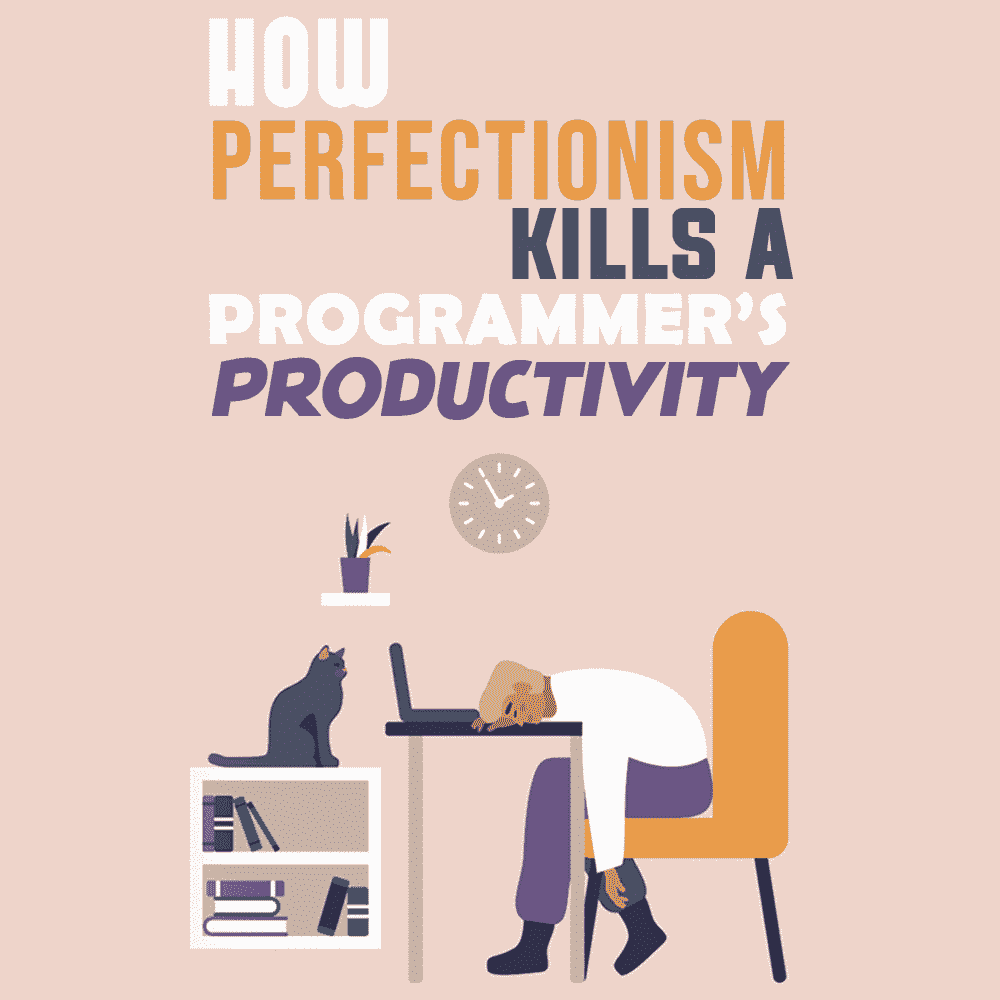
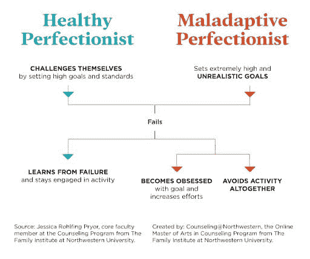

# 完美主义如何扼杀程序员的生产力

> 原文:[https://simple programmer . com/完美主义-kills-程序员-生产力/](https://simpleprogrammer.com/perfectionism-kills-programmers-productivity/)

You can often hear someone proudly say, “I am a perfectionist,” then adding, “Look, I am doing everything perfectly.” In fact, there is nothing to be proud of.

除非我们谈论的是轻度完美主义——比如对桌子上摆放完美的餐巾感到满意——否则在任何业务中，追求完美的痛苦愿望肯定会降低生产率。

似乎努力把每件事都做到完美的人应该在工作和生活中更成功。但实际上，完美主义者是最顽固的拖延者和懒人。为什么会这样？让我们找出答案。

在这篇文章中，我将向你展示为什么完美主义会损害程序员的生产力。我也将与你分享在你自己的行为中识别完美主义的技巧，以及摆脱它的技巧。这将帮助你变得更有效率，同时减少压力。

## 为什么完美主义会损害生产力

完美主义者浪费大量时间来完善小事情。他们不能忽视无关紧要的细节，结果在他们做的每件事情上都投入了同样多的时间和注意力，徒劳地试图让每一件小事都完美执行。

同时，完美主义会导致[拖延](https://jatapp.com/blog/keeping-deadlines-in-software-development/)。因为完美主义者希望把每件事都做得完美，所以解决任何问题都要困难得多。对执行质量的责任负担如此紧迫，以至于更容易完全推迟执行。

不管你怎么想，是完美主义者把事情往后推，因为“心情不太好”或“我累了”或“现在不会像我感觉好的时候那样完美。”

听起来很矛盾，完美主义者是家里最乱的人，因为获得完美的清洁比简单的命令要花 10 倍的时间。知道做这样的清洁有多难，有完美主义倾向的人宁愿根本不去做。

此外，世界规定了自己的规则，这些规则与把每件事都做得尽善尽美的愿望背道而驰。不太完美的产品和项目被投放到市场上，然后在反馈的帮助下进行完善。完美主义者做不到这一点，最终错失良机。当他们试图创造完美的产品时，另一些人用原始但相关的想法发了财。

事实是，边做边学是当今发展的有效途径。对完美主义者来说，可悲的是，他们恰恰没有这种能力。他们不喜欢尝试他们不知道如何做的事情，或者在第一次尝试后就退出训练，对他们的实验结果感到极度不满。

的确，像“除非我做得完美，否则我做不到”这样的方法已经毁掉了很多想法和项目。一个有革命性想法但没有实现它的技能的普通程序员很少被阻止；他们只是知道他们需要什么，然后继续前进。相反，完美主义者很可能根本不会去做，因为他们害怕事情不会完美地完成。

最终，完美主义者在负罪感上花费了太多精力。但是，精神健康就像时间和金钱一样，是一种会耗尽的资源。你可以把它花在[灵感的导火索](https://simpleprogrammer.com/inspiration-creativity-software-developer/)上，做一些很酷的事情，也可以用它来沉迷于自我鞭挞，为没有完美履行自己的职责而感到内疚。

考虑到这一点，让我们来看看揭示完美主义可能如何影响你的编程生涯和你的生活的潜在迹象。

## 完美主义正在毁掉你生活的迹象

Of course, the stages of perfectionism differ from person to person, and to an extent this phenomenon is characteristic of many of us. In most cases, when we hear this word, we are talking about mild to moderate perfectionism and not about a pathological condition that requires intervention.

然而，问题是，几乎不可能独立确定你的完美主义程度。不过，让我们来看看一些可能表明完美主义会影响你工作效率的警告信号。如果你在下面的列表中认出了自己，也许是时候开始与完美主义作斗争了。

### 你总是认为自己做得不够好

铁杆完美主义者最大的问题是痛苦地追求卓越。我们知道，完美是不存在的。

是的，你可以完美地铺床，没有一个褶皱，把枕头铺在尺子上，心满意足，但要描绘出完美的画面是不可能的。你的工作和你想象的理想之间的差距会让你非常沮丧，以至于你会彻底放弃。

### 你有自尊问题

对工作结果的持续不满会让你沉湎于失败，降低你的自尊。你最终会感到内疚，即使是很小的事情，而且你对批评非常敏感。

通常，人们不会注意到工作中的小瑕疵，但是完美主义者甚至会因为小瑕疵而受到良心的折磨。然而，内疚是极具破坏性的——如果你一直被不断犯错、做什么都很糟糕的感觉所困扰，我们还能谈什么和谐与自我发展呢？

### 你不会打草稿，进展缓慢

完美主义者试图把每件事都做得完美，这排除了粗糙工作的可能性——这在许多领域是必要的元素。

如果你正在考虑写一个程序，但是你不能超越最初的几行代码，因为你在不断地重写它以达到理想，那么这一点描述了你。

### 不完美让你疯狂

你在网站上看过这些“[完美主义者的噩梦](https://www.amazon.com/dp/0996435409/makithecompsi-20)”汇编吗？对某些人来说，它们很有趣，但对于中度或重度完美主义者来说，它们会引起真正的不适。

或者，再举一个例子:你有没有遇到过一个人开始在商店的货架上摆放易拉罐，然后把所有的标签都转向正前方或者一个人按照颜色和尺寸挂衣服？有些人真的不能忽视这样的事情。如果你在上面认出了自己，那绝对是一个警告信号。

但没必要绝望。这是一种对抗完美主义的方法。让我们看看怎么做。

## 如何摆脱完美主义:管理时间

许多患有完美主义的人都想知道如何摆脱它。不幸的是，对于他们来说，没有简单的方法来摆脱这个令人烦恼的习惯。然而，你有办法克服它并显著改善你的生活方式。

在这一部分，我将与你分享一些帮助你更好地管理时间的技巧，从而消除可能导致完美主义行为的因素。我也将分享我每天使用的[时间管理方法](https://simpleprogrammer.com/programmer-productivity-time-attention-management/)来成功改善我的生活方式:T2 番茄工作法。

番茄工作法简单而有效，有可能彻底改变你对时间管理的看法。本质上，番茄工作法要求你长时间专注于一项任务，即使是很小的事情。

当你这样做的时候，你会情不自禁地想，如果这个任务完成了，会有多棒。随着你继续关注这项任务，你会逐渐减少它的持续时间。你将会到达一个你几乎注意不到它存在的点。番茄工作法旨在迫使你着眼于大局，这是你应该做的，而不是纠结于小细节。

当你觉得自己的不完美妨碍了你的进步时，番茄工作法非常有用。

例如，如果你觉得你花了太多时间计划你的任务，你可以花一个小时计划一个任务，然后半个小时什么也不做。然后，你可以通过衡量你做了多长时间和多少工作来衡量你在计划和完成小任务方面有多成功。

这样，你会亲眼看到如何通过减少日常执行任务的数量来摆脱完美主义。当然，你不可能把所有的任务都减到零。然而，你应该致力于减少每个任务中的不完美。

减少你执行的任务数量的一个方法是专注于完成一项任务，而不要太关注细节。

例如，如果你计划粉刷你房子的墙壁，你将不会完美地粉刷墙壁。如果你对颜色不是很在行，你可能还是想粉刷墙壁。然而，完成任务时不要过多考虑达到完美。完美主义者喜欢从事详细的项目，但是当他们开始看到最终结果时，他们立即开始讨厌这项任务，想要放弃。

## 战胜完美主义，变得更有效率

完美主义会导致压力、挫折，甚至精疲力竭。相反，你应该努力让自己满意。一旦你做到了，能够接受真实的自己，你就不需要用你完美的行为来定义自己。

不管人们怎么想，完美主义者是没有生产力的。相反，他们很难完成任务，最终错过了机会。正如我们在这篇文章中看到的，完美主义者无法轻松应对现代职场和整个世界的许多现实。

完美主义会给你的生活带来很多问题，但是通过接受真实的自己，你可以在满足和没有压力的情况下提高你的生产力。