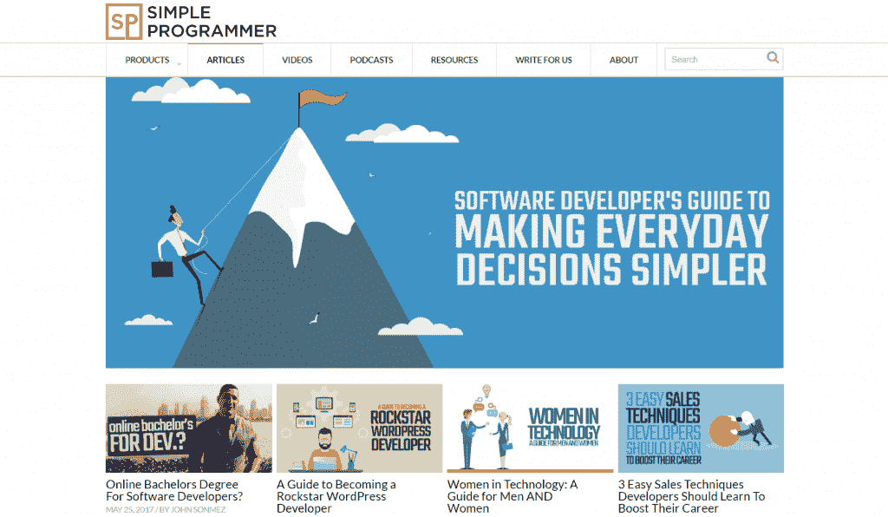

# 作为软件开发人员，如何建立个人品牌和声誉

> 原文：<https://simpleprogrammer.com/personal-brand-reputation/>

在你的软件开发生涯中，你能做的最重要的事情之一，比学习最新的编程语言或 JavaScript 框架更重要的，是建立一个稳固的声誉。

成为一名优秀的程序员并拥有高度的技术能力是很棒的，但这只会让你走得更远。

如果你真的想出类拔萃，如果你真的想让你的职业生涯更上一层楼，你需要学习如何建立一个稳固的声誉——如何推销自己和建立个人品牌——这将为其他人打开机会之门。

我怎么知道这个？

我软件开发生涯的大部分时间都相对默默无闻——好吧，完全不为人知。

我努力提高自己的技能。

我花了大量时间磨练自己的技能，阅读一本又一本关于软件开发的书，阅读博客，学习新技术，并实践我已经学到的东西。

我教授和指导团队中的其他软件开发人员。

作为一名软件开发人员，我尽我所能以我所知道的最好的方式来提高自己。

现在，我不会告诉你我没有任何成功。当然了。

我有一份体面的职业。

我不时地努力寻找工作，但总的来说，我得到了一些不错的工作和机会，尽管不是什么大事。

我很快就撞上了“玻璃天花板”

作为一名软件开发人员，我真的赚不到更多的钱，我对此也无能为力，至少我是这样认为的。

然后我开始了我的博客，[简单程序员](https://simpleprogrammer.com)。

最初的想法只是写一些我觉得某些软件开发人员为了让自己看起来更聪明、更有价值而把事情变得比实际更复杂的话题。

这就是为什么我称这个博客为“化繁为简”

但是随着我开始写作，越来越多的人开始阅读博客，有趣的事情发生了。

当我参加代码营和活动时，有些人会知道我是谁，或者至少他们会熟悉我的博客。

我开始联系一些受欢迎的播客，邀请他们接受采访，更多的人开始知道我是谁。

很快，我开始收到工作邀请，而不仅仅是来自垃圾邮件招聘人员的。

然后有一天，当我坐在办公桌前时，我接到一家公司的电话，他们只想当场雇用我。

没有采访，什么都没有。

他们所有的开发者都是我博客的读者，听过我的播客，或者上过我的一些 [Pluralsight 课程](https://simpleprogrammer.com/pluralsight)。

我认为那是不可能的。

我从未听说过没有面试就被录用了。

从那以后，事情越来越多。

我专注于积极建立我的品牌和营销我自己——事实上，我开始教其他程序员如何做——突然我的头撞破了玻璃天花板。

如此多的机会出现在我的面前，这是我从未想到过的。

快进到今天，**开始写博客的决定让我赚了数百万美元，**让我“提前退休”，并把我带到了简单的程序员行业。

现在，你不必走我走过的路——不是每个人都想提前退休并成为一名企业家——但你不想得到你梦想的工作吗？

你不想得到更多的钱吗？

难道你不想在一本流行的软件开发杂志上读一读你写的文章吗？

那不是很酷吗？

很好。在这一章中，我将告诉你如何做。

## “出名”的好处

在我们进入如何建立你作为一个软件开发人员的声誉之前，让我们谈一谈出名的好处。

例如，考虑一下真正的好厨师和名人厨师之间的区别。

一个真正的好厨师可以赚很多钱。

但是一个上电视的著名厨师赚了很多钱。

为什么？

这真的和那个厨师有多好有关系吗？

真的，问问你自己，年薪 100 万美元的厨师是否比年薪 10 万美元的厨师强 10 倍。

你认为这可能吗？

我是说，我喜欢美食，我喜欢食物，但是食物就是食物。

味道只能这么好。

如果区别不是技能，那区别是什么？

**没错。名声。**名气。本质上来说，出名。

你可以在音乐家、演员、整形外科医生、律师、房地产经纪人等等身上看到类似的现象。

关键是，拥有一个名声会得到不平等的回报。

你得到的报酬超过了你的技能所应得的。

这是一件好事——非常好的事情——如果你能实现的话。

但是，如果你有名气——如果你“出名”，你不仅会得到更多的报酬

你让人们向你走来，工作向你走来，机会向你走来，而不是出去追逐它们。

这真的很好。

## 风格+实质

不幸的是，我将我的一门关于为软件开发人员建立声誉和个人品牌的旗舰课程命名为“[如何作为软件开发人员推销自己”。](https://simpleprogrammer.com/store/products/how-to-market-yourself)

为什么我说这个命名是不幸的？

因为，在那个时候，**我并没有意识到[许多软件开发者](https://simpleprogrammer.com/2015/07/16/how-to-deal-with-criticism-when-marketing-yourself/)是多么反对自我推销和任何一种营销的想法**，尤其是营销他们自己。

这并不意味着这门课程没有价值或者卖得不好——我已经卖出了数百本，它教会了许多软件开发人员如何建立我们一直在谈论的“名声”——但如果我给它起了一个更好的名字，我可能就不会产生许多程序员在听到“营销”这个词时的那种下意识反应

但是不管其他开发者如何回应，你都必须克服这一点。

你必须意识到自我推销、建立品牌和营销都不是坏事。

重要的是你如何去做。

我经常引用的一个公式是这样的:

技能*营销= $$$

您可以将其重写为:

Substance * Style = $$$

或者:

编程能力*声誉= $$$

我的一个朋友杰森·罗伯茨创造了一个类似的短语来定义这种现象，叫做“运气表面积”

基本上，你可以成为世界上最好的程序员，但如果你独自一人坐在地下室，除了你自己没人知道，这并不重要。你不会有太大的影响。

但是如果你能走出去，提升自己一点——我们一会儿会谈到如何——你就能取得非凡的成绩。

事实上，你不必成为世界上最好的程序员。我没有。

我在任何方面都不是“最好的”，但我是“众所周知的”(至少在编程界是这样。)

我宁愿拥有中等的技能和巨大的声誉，也不愿拥有巨大的技能却没有声誉。

你不能只关注“伟大”

这不是一个非常有利可图的职业策略。

在我的墙上，我有一张裱好的海报，它有两个维度:谈话和工作。

有三种尺寸组合:

1.  夸夸其谈，没有工作=江湖骗子
2.  不说话，高功=烈士
3.  高谈阔论，高工作=骗子

做一个骗子。

## 创建个人品牌

卖出去了吗？

好；我们继续吧。

在你推销任何东西之前，你必须知道你在推销什么。

要风格+实质，就得有风格。

那么，如何获得风格呢？

什么是风格？

这看起来有点像现在酷孩子所说的个人品牌。

个人品牌就像任何商业品牌一样，只是它是一个代表你的品牌。

当你创建自己的个人品牌时，你需要做的第一件事就是**定义你想以什么而出名。**

而且一次只能挑一件。

这就是困难的原因。

(我们将在下一章专业化中详细讨论如何做到这一点。)

现在，我们只能说，你需要想出一个简单的电梯营销，你会给人们——一句俏皮话，如果你愿意——代表你和你的品牌。

如果我问你是做什么的，你会怎么回答？

你是在漫谈你知道的 100 种技术和编程语言，还是有一种简单的方式来描述你自己——你的品牌——让人们记住，这样当他们把你介绍给其他人时，他们会说，“嘿，这是乔，他是教人们如何在 Android 中创建动画的人。”

当我参加企业家类型的会议或活动时，人们问我是做什么的，我会说“**我教软件开发人员如何变得酷。**

这就是我目前品牌的本质。

这是软件开发人员的个人成长。

就是这样。

简单的程序员代表了这一点。

品牌从清晰、简单、简洁的信息开始。

你是谁，你代表什么。

从那里，你前进，实际上创造一个标志，选择一套你一贯使用的颜色，得到一个你一贯使用的头像，等等。

你可能从最后一句话中了解到了品牌的另外两个组成部分。

如果你没有注意，第一条是你的信息。

第二个是视觉效果。

这是你的标志，颜色等。

第三个是一致性。

没有一致的信息和视觉效果，一切都会分崩离析。

如果你想拥有一个品牌，而不仅仅是一个星期的风味，你必须始终如一。

所以挑一件事，坚持下去。

即使当信息更重要时，人们倾向于关注视觉效果，你也应该从你的信息开始。

## 如何变得“家喻户晓”

好吧，我撒谎了。

对于任何品牌来说，你还需要一件东西。

你看，你可以有一个很棒的品牌。

你可以有一个清晰，简洁，有针对性的信息。

你可以有一个很棒的标志，上面有一只青蛙拿着一把燃烧的剑。

无论你在哪里应用品牌信息和视觉效果，你都可以保持一致。

但是……如果你没有**重复曝光**，也没关系。这不是一个品牌。

人们必须看到和听到你的品牌，他们必须不止一次地看到和听到它。

事实上，我要说的是，一个品牌需要接触四到五次，才会有人认出它并说，“嘿，我认识那个人。”

所以，你必须走出去，站在人们面前。

你必须让你的名字在那里。

“好吧，约翰，我该怎么做？，“你问？

因为我不想重复我自己，而且我已经产生了关于这个主题的大量内容，我将在这里给你一个快速的纲要。

如果你愿意，你可以通过我的[软技能:软件开发人员生活手册](https://simpleprogrammer.com/softskills)一书中关于营销自己的章节或者[如何营销自己成为软件开发人员](https://simpleprogrammer.com/store/products/how-to-market-yourself)的课程来填补空白。

基本策略是**从一个渠道或媒介开始，学习如何掌握它并将其系统化，这样你就可以在那个渠道上非常多产和有效，然后扩展，这样你基本上无处不在。**

我们来分析一下。

假设你说[我要开始通过开博客](https://simpleprogrammer.com/2013/12/30/marketing-create-blog/)和写博文来出名。

这将是你决定掌握的渠道。

所以，你创建了你的博客([查看我关于如何做的免费课程](https://simpleprogrammer.com/lp/create-your-blog-1/))并开始写作。

最终你会开发出一个写有效博客文章的系统。

也许你把系统开发到了这样一个地步，你实际上可以只写文章，让别人编辑文章，安排时间，添加图片等等。(嗯……这个怎么听起来这么耳熟？)

然后你**使用这个系统变得非常多产，**你开始从一周一篇博客文章变成一周三篇。

现在你开始真正出名了。

从那里你开始扩张，你决定转向更多的渠道。

你开了一个 YouTube 频道，开始接触[软件开发人员播客](https://simpleprogrammer.com/2014/03/10/ultimate-list-developer-podcasts/)进行采访，也许为软件开发杂志撰稿，并在一些软件开发会议上发言。

现在，通过反复曝光，你的品牌开始崭露头角。

现在，无论任何人去你的空间，他们都能找到你，听说过你，或者看到你。

长期坚持这样做，久而久之，你就会变得“众所周知”

也许不是著名的“我想脱下我的内衣扔向你”(这还没有发生在我身上)，但是你会建立足够的声誉来极大地增加你的运气表面积。

这里有一个想法或渠道的列表，你可以用它来让自己出名:

*   你自己的博客
*   为其他人的博客发表客座博文
*   写一本书
*   写杂志文章
*   上别人的播客
*   创建自己的播客
*   创建 YouTube 频道
*   成为真正活跃的 Twitter 或其他社交媒体用户
*   在本地用户组和代码营演讲
*   在大型开发者大会上发言
*   创建一个流行的开源项目

## 

为他人创造价值

事情是这样的:仅仅做这些事情并想出名并不会让你出名。

我知道我说过会的，我也知道我之前说过你需要的只是一个很酷的标志和一条信息，但我又说谎了。

你看，**完美的品牌和世界上所有的自我推销，如果不是全部基于一个重要的东西**，一个重要的原则或理念:为他人创造价值，那就什么都不是。

并且最好是自由值。

我所做的 90%都是免费的，10%是收费的。

我的重点是给人们尽可能多的价值，这样他们不仅会消费我的信息，而且会传播它。

我希望人们说，“嘿，那个简单的程序员，约翰·索诺梅兹，或者不管他叫什么名字，他是一个很酷的人，你应该看看他的东西。因为他，我有了工作和女朋友。”

你能做的最好的营销就是给别人的生活增加价值。

被认为是一个给予者。

成为那种其他人想待在身边并与之交往的人，因为他们觉得当他们在你身边时，他们会受益于 T2。

如此多的公司和品牌失败是因为他们想尽一切办法压榨顾客。

他们试图*提取*值而不是*注入*值。

我向你保证，如果你持续不断地为人们的生活注入价值并带来真正的改变，你将会获得回报。

我最喜欢的一句名言是:

> “如果你能帮助足够多的人得到他们想要的东西，你就能得到生活中你想要的一切。”
> 
> –金克拉，[完成销售的秘密](http://amzn.to/2e5t2Jq) (1984)

所以，无论你在做什么，先想想它会如何为别人创造价值。

## 这需要时间

最后，你必须意识到这不是你一夜之间就能实现的。

事实上，你要花很长时间才能真正看到你创造声誉的行为的显著效果。

这就是你最好现在就开始的原因之一。

通常，新的软件开发人员或刚刚进入软件开发的人告诉我，他们还没有准备好开始写博客或建立声誉，因为他们知道的还不够多。

你永远不会“知道得够多”

你必须在准备好之前开始，因为在你看到任何结果之前有一个很长的准备时间。

即使你是编程新手，你也能提供一些东西。

您可以在学习编程时分享您的旅程，其他人会发现这很有用。

你可以选择一个专业进行深入研究，并分享你从一个主题的新手到专家的旅程。

这一旅程对那些想做同样事情的人来说有着巨大的价值。

所以，早点开始——在你准备好之前——并且要有耐心。

这需要时间，但是如果你坚持下去，你会得到结果的。

问题是许多软件开发人员开了一个博客，写了大约一年的博文，看不到任何结果，就放弃了。

如果你想成功，你必须愿意坚持更长时间。

这可能需要你两三年，甚至五年的时间，但是如果你继续努力，你最终会成功的。

大多数人在生活中从未取得任何成就，因为他们放弃得太快。

不要成为他们中的一员。

* * *

