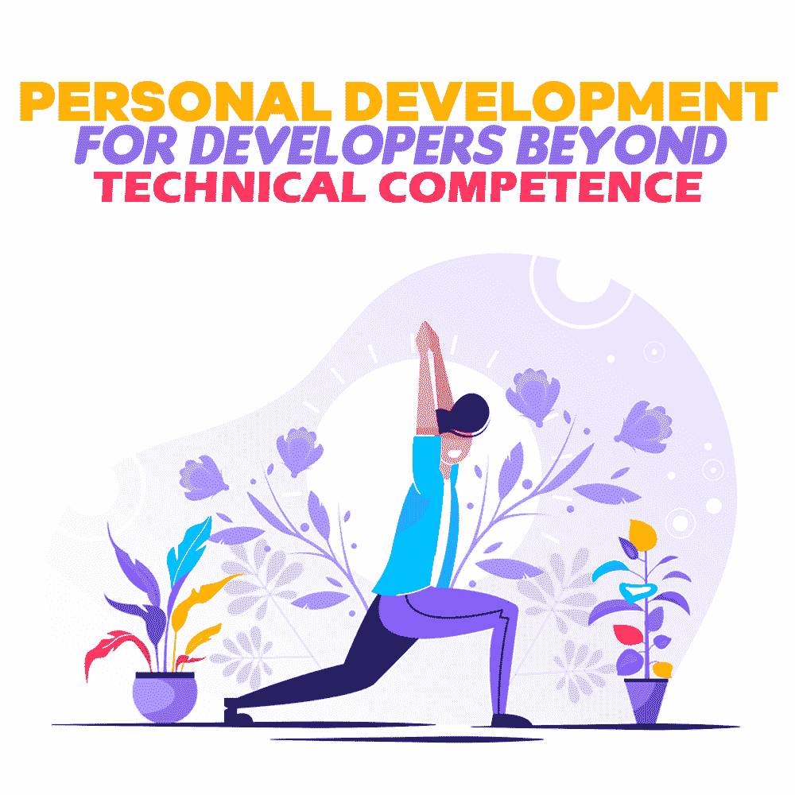
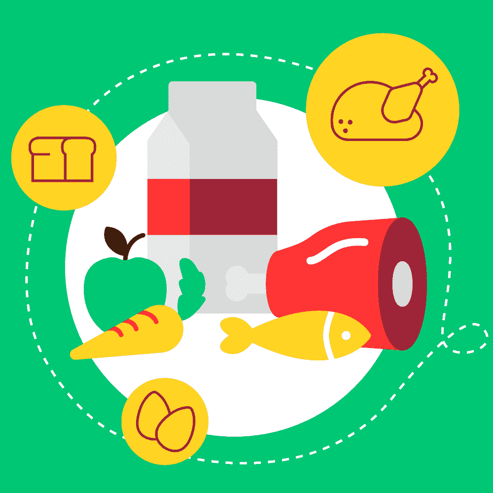

# 超越技术能力的开发人员的个人发展

> 原文：<https://simpleprogrammer.com/personal-development-for-developers/>

Software developers, as a professional class, are particularly dependent on their overall condition to perform well at their jobs. As the job is particularly intellectually demanding, setting up a healthy lifestyle that complements the work is more than necessary.

我在一家开发医疗保健应用的外包公司工作时了解到，程序员显然需要提高他们的技术技能。然而，超越工作的具体细节，建立一套技能和生活方式，帮助你成为一个全面发展的人，在职业环境中是无价的。你不仅开始建立一个可持续发展的实践，而且降低了分期偿还的风险，创造了一个更健康、更成功的你。

## 健康的身体，健康的精神

每位工匠都会将工具打磨得很好，并妥善保管。这确保了它们随时可用并处于最佳状态。对于一个开发者来说，这些工具包括他们的身体和思想。对于开发人员来说，保持这两者尽可能健康的状态是很重要的，因为这对提交的工作质量是必不可少的。

大多数人似乎都认为某些事情很重要:健康的营养、规律的锻炼和充足的睡眠。虽然这些是健康的明显支柱，但对于实现这些目标的正确方法仍有激烈的讨论。

对于忙碌的开发人员来说，随着时间的推移找到可持续的方法是最好的方法。以下是我从学生和全职员工的经历中学到的一些保持健康平衡的小技巧。

### 每周至少锻炼几次

一丝不苟地坚持一两个月，然后当你变得不知所措、太累而无法保持新的极端习惯时，就放弃，这被证明是一种非常低效的方法。与其把自己完全投入到一种我们不习惯或没有真正准备好的生活方式中，最好是慢慢开始，承诺每周只锻炼一两天，然后如果有机会就慢慢提高。

我目前试图保持每周三次的体育活动。如果我尝试的更多，我会发现这对我来说是不可持续的，我跟不上。少于这个量，活动就不足以提高我的能量或帮助我保持肌肉张力。

当然，什么类型的运动，什么时候做，多久做一次，在哪里做取决于你的个人喜好。最重要的是开始。现身吧，做你答应自己要做的事。最终，这种习惯会变得如此自然，你不会想离开它度过一生。

### 把糖减少到最低限度

与糖有关的问题被广泛认为是诱发糖尿病的习惯。然而，每天使用糖的真正问题是，它会导致胰岛素水平的不一致。这直接导致不一致的能量峰值和下降。

你摄入的糖量与你每天的能量水平直接相关，所以把糖量减少到最低限度会让你的工作效率更加稳定。

作为一个非常喜欢吃甜食的人，我很难完全戒掉它。但是我确实试着把它限制在我早餐燕麦或茶里放的仅仅一茶匙蜂蜜。

即使当你吃甜食时会感到能量爆发，也不足以维持你一整天。最终，它消失了，让你比以前更累，更没有动力。限制糖的摄入量意味着你再也不用经历下午的疲劳和完全缺乏能量了。你的精力变得更加可靠和可预测，帮助你提前计划你的工作。

这对那些表现主要是智力的人——比如开发人员——尤其有利。虽然你的身体可以自动执行身体活动，但在解决问题时保持创造性和创新性需要充分的脑力。

### 调整你的时间表，每天保证七到八小时的睡眠

睡眠是绝对必要的。如果我每天睡眠不足，我会发现我的表现明显下降。根据你的工作安排和其他职责的灵活程度，保证充足的睡眠可能很容易也可能很难。

为了得到急需的休息，我有两个主要建议:

1.  早点上床睡觉，这样离你的起床时间还有八个半小时。如果你不习惯早睡，很难入睡，我推荐睡眠冥想视频。这些帮助我显著降低了压力水平，足以入睡并拥有足够高质量的睡眠。久而久之，越来越容易入睡。
2.  保持你卧室的温度比平时更冷。理想情况下，温度应该在 19 到 21 摄氏度(66 到 69 华氏度)左右。睡眠质量好了入睡会容易很多，也不会因为感觉太热，寻找更好的位置而翻来覆去那么多。

### 均衡饮食

There are so many dietary practices out there. We have [Paleo or keto](http://www.amazon.com/exec/obidos/ASIN/1939754267/makithecompsi-20), vegan, vegetarian, pescetarian, low or no carbs, low or no fats, mainly meat-based, eating only red meats, etc. It can get confusing as to what you should be doing with the thousands of people pushing their opinions on you online.

我的建议很简单:尽量平衡所有需要的群体。吃蔬菜，吃肉，吃脂肪，吃水果。关键是适度和兼容。只要你有一个整体均衡的饮食，并强调原料质量，你可能会开始吃得更好，感觉也明显更好。

### 了解热量值

我明白计算你摄入的每一卡路里会有压力。在一般的生活方式中，这并不是真正需要的。但是，有了所有容易获得的加工食品，了解不同食物的能量值最终可以帮助你保持健康的体重，并对适当的份量有更好的直观测量。

我鼓励你衡量一下你平均每天吃多少。将其与你的平均摄入量进行比较，并花时间去了解高热量食物的含量。这种理解有助于你避开令人讨厌的饮食习惯，这些习惯一旦根深蒂固就很难克服。

### 膳食准备

做饭对我来说是救命稻草。我喜欢各种各样的食物。如果我工作忙，我就不太可能特意去吃一顿健康的午餐。快速解决办法是办公室里的自动售货机。另一方面，当我选择荤素搭配的均衡膳食时，午餐费用会迅速增加。

从经济角度来说，在家做饭显然是更好的选择。此外，有一个午餐盒给了我自动售货机级别的舒适和方便，而食物甚至优于我在工作时购买的健康餐馆饭菜。

这需要提前做一点计划，但是我试着每周去两次杂货店，同时提前三四天做饭。这意味着午餐和晚餐。我会在晚上加一份我现场做的新鲜沙拉——通常不超过 15 分钟。

## 社交圈和工作生活平衡

工作是任何现代人生活的重要组成部分。然而，生活不仅仅是工作，作为一名开发人员，为了健康成长，您需要掌握所有的技能。平衡你的时间，让你成长对你来说重要的事情。保持你的健康和身体，这样你才能在专业环境中茁壮成长。

什么是你一直想在生活中实施但却遇到困难的改变？你认为什么应该是开发人员生活中的优先事项，但却被广泛忽视了？