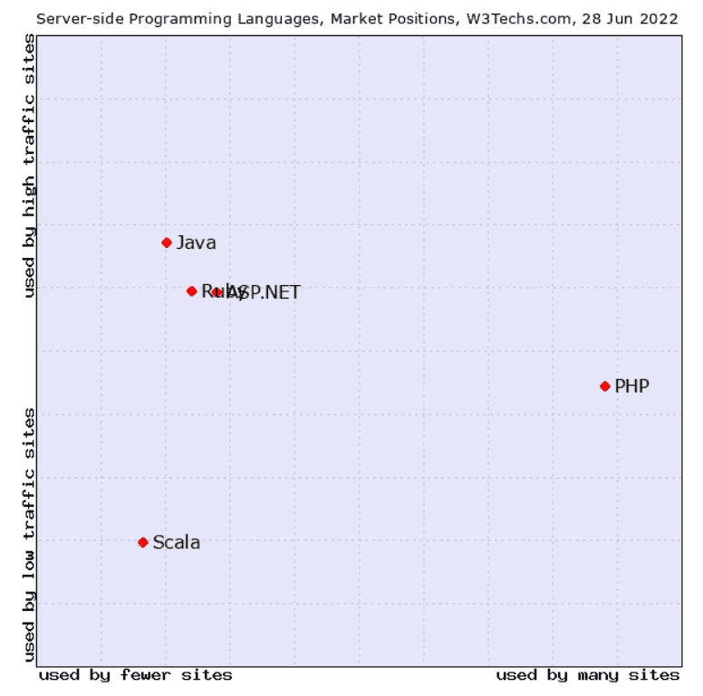
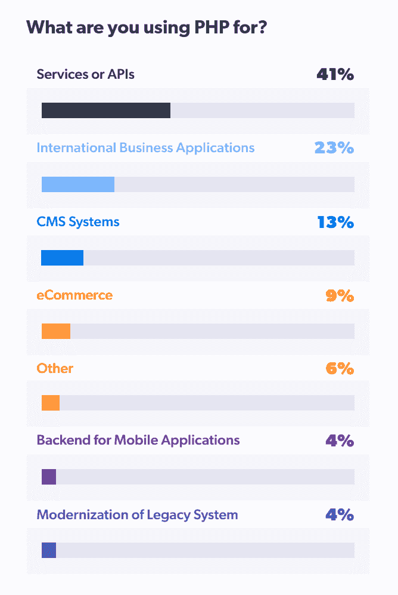

# PHP Web 开发:是时候退休了吗？

> 原文：<https://simpleprogrammer.com/php-web-development-retire-old/>

PHP 是当今万维网的支柱。目前，世界上超过四分之三的网站都是由 PHP 驱动的。说到服务器端编程语言，PHP——超文本预处理器，对于那些后来者来说——没有竞争对手。

[来源](https://w3techs.com/technologies/market/progrdamming_language/)

然而，在开发者社区中有反对 PHP 的巨大暗流。PHP 是继 C、Perl、Assembly 和 VBA 等明显的罪魁祸首之后最令人讨厌的主流编程语言——可能是因为人们认为与 Python 等更现代的语言相比，PHP 是一种笨拙而古老的语言。根据一项堆栈溢出调查，甚至 C++、Java 和 Ruby 都表现得更好。而且是社区里经常开玩笑的笑柄。

<article role="article" data-focusable="true" tabindex="0" class="css-1dbjc4n r-14lw9ot r-1ny4l3l r-1inuy60 r-1yt7n81 r-ry3cjt r-m611by r-o7ynqc r-6416eg" onmouseover="this.style.backgroundColor='rgb(245, 248, 258)'" onmouseout="this.style.backgroundColor='rgb(255,255,255)'">[I Am Devloper@iamdevloper](https://twitter.com/iamdevloper?ref_src=twsrc%5Etfw%7Ctwcamp%5Etweetembed%7Ctwterm%5E983963738213666816%7Ctwgr%5E%7Ctwcon%5Es1_&ref_url=https%3A%2F%2Fpublish.twitter.com%2F%3Fquery%3Dhttps3A2F2Ftwitter.com2Fiamdevloper2Fstatus2F983963738213666816widget%3DTweet)when you're reminded you wrote the world's biggest social network in PHP [https://t.co/bnXqNeDjiC](https://t.co/bnXqNeDjiC)[3:03 PM · Apr 11, 2018](https://twitter.com/iamdevloper/status/983963738213666816?ref_src=twsrc%5Etfw%7Ctwcamp%5Etweetembed%7Ctwterm%5E983963738213666816%7Ctwgr%5E%7Ctwcon%5Es1_&ref_url=https%3A%2F%2Fpublish.twitter.com%2F%3Fquery%3Dhttps3A2F2Ftwitter.com2Fiamdevloper2Fstatus2F983963738213666816widget%3DTweet)[17.7K](https://twitter.com/intent/like?ref_src=twsrc%5Etfw%7Ctwcamp%5Etweetembed%7Ctwterm%5E983963738213666816%7Ctwgr%5E%7Ctwcon%5Es1_&ref_url=https%3A%2F%2Fpublish.twitter.com%2F%3Fquery%3Dhttps3A2F2Ftwitter.com2Fiamdevloper2Fstatus2F983963738213666816widget%3DTweet&tweet_id=983963738213666816)[6.2K](https://twitter.com/iamdevloper/status/983963738213666816?ref_src=twsrc%5Etfw%7Ctwcamp%5Etweetembed%7Ctwterm%5E983963738213666816%7Ctwgr%5E%7Ctwcon%5Es1_&ref_url=https%3A%2F%2Fpublish.twitter.com%2F%3Fquery%3Dhttps3A2F2Ftwitter.com2Fiamdevloper2Fstatus2F983963738213666816widget%3DTweet)</article>

那么，尽管 PHP 拥有强大的安装基础，但为什么多年来一直不受欢迎呢？

我们已经知道它是当今网络的中流砥柱。然而，明天还会这样吗？它在新技术和脚本语言的洪流中站稳了脚跟——无论是旧的还是新的。当我们回答这些问题时，让我们来看看使用 PHP 建立网站的挑战和利弊。

## Web 的现实与 PHP 的现实交织在一起

即使今天所有的开发者和网站管理员都决心停止使用 PHP，他们也做不到，因为 WordPress 是互联网上最常见和最流行的内容管理系统。根据 W3Techs 的数据，如今有惊人的 43%的网站运行 WordPress——而且这个数字还会继续增加。

但是，如果您认为 PHP 主要是作为 CMS 的基础使用的话，那也是情有可原的。一项如此根深蒂固、拥有如此庞大的社区的技术，不可能因为一个应用程序而生或死。根据 Zend PHP 景观报告，目前全世界有超过 600 个开发团队在使用 PHP:

[来源](https://www.zend.com/resources/2021-php-landscape-report)

那么问题出在哪里？为什么我们甚至在谈论 PHP 的需求或未来？

## PHP 怎么了？

PHP 从来没有打算成为一种广泛使用的编程语言。1995 年创造 PHP 的人——拉斯马斯·勒德尔夫——以抨击他的作品和他自己的编程技巧而闻名。“我真的不喜欢编程。据报道，勒多夫说:“我开发 PHP 是为了减少编程，这样我就可以重用代码了。”。

在 SitePoint 的[采访中，他更进一步贬低 PHP。“PHP 就像你的牙刷一样令人兴奋。谁会想看关于牙刷的书？”](https://www.sitepoint.com/phps-creator-rasmus-lerdorf/)

考虑到 PHP 语法的不直观、不起眼、不一致以及糟糕的设计原则，许多开发者原则上同意勒多夫的观点。尽管 PHP 已经有整整 27 年的历史了，但它只是第八个主要版本。核心更新和增量更新的速度极其缓慢且不稳定。

说到不直观和不起眼，还有替代和可比语言的问题。

最接近的竞争对手——就感知和可见的受欢迎程度而言——是 [Python](https://simpleprogrammer.com/5-benefits-of-python/) ,开发人员喜欢它的简单性和灵活性。Python 是一种类似 PHP 的服务器端语言，但它的设计方式使得开发人员只需编写很少的代码。虽然今天只有一小部分网站运行 Python，但它已经成为人工智能和 ML 编程以及任何与大数据相关的事情的首选。

然后是 [JavaScript](https://learn.simpleprogrammer.com/javascript-launchpad-fec66c37-0639-4bed-910f-a48577c4e8e8) 。虽然它是一种客户端脚本语言(因此，与 PHP 相比是不可同日而语的)，但 Node.js 和其他 JavaScript 框架的兴起促进了服务器端脚本和全栈开发，这是 PHP 所不具备的。JavaScript 推动了 Google Drive 等单页面应用程序的发展，在 Google Drive 中，页面使用 API 调用的数据以闪电般的速度重新呈现，无需刷新浏览器。这很难用 PHP 来复制——它涉及到以迂回的方式编写大量代码，只是为了实现用 JS 可以很简单地完成的事情。

那么是什么让 PHP 保持活力呢？

## PHP 什么是对的？

PHP 有很多优点，尤其是它所支持的网站数量。

### 经过测试的代码

PHP 的一个不可否认的优势是，在过去的 27 年里，所有能想到的函数都被编写、发布和使用过。几乎没有什么是你不能让一个基于 PHP 的网站做的。开发人员可以高枕无忧，因为他们知道任何突出的问题都已经(或将最终)被面对和解决。

### 巨大的社区

虽然最新一代的开发人员已经开始讨厌它了，但是经验丰富的开发人员已经把整个职业生涯都建立在 PHP 上了。他们已经发布了大量的技巧、教程和常见问题解答，几乎可以回答任何问题，即使是有经验的开发人员。

这对企业和组织来说也是一件好事——如果你想建立一个网站或网络应用程序，你有一大群技术娴熟、知识渊博的开发人员可供选择。

### 可扩展性

鉴于其悠久的历史和专业开发人员社区，PHP 多年来积累了大量的功能、插件、框架等库。您几乎不需要从头开始编写任何代码。像 Laravel、CodeIgniter 和 Yii 这样的 PHP 框架加速并标准化了基于现成通用功能的开发。

此外，还有很多网站提供现成的 PHP 脚本，用于特定的功能，如电子商务购物车、列表、投票、日历预订等。允许您在不牺牲性能的情况下加速应用程序开发生命周期。

### 数据库连接

PHP 相对于 Python 等竞争语言的最大优势是它的数据库连接性。PHP 可以安全而方便地连接几乎任何类型的数据库，这给了开发人员从现有的各种数据库程序中进行选择的余地。它还通过专注于应用和服务开发而不是数据库集成来提高他们的工作效率。

### 多才多艺

与其他编程语言、应用程序和操作系统不同，PHP 在任何意义上都是免费和开源的。这意味着 PHP 有大量的开发人员不断地提供支持，实现前沿特性，修复错误和漏洞，并添加新的组件。

PHP 以“灯”的形式预装在 web 服务器上(Linux，Apache MySQL，PHP)。然而，它是独立于平台的——你可以在 Windows、Mac OS 或 Linux 上运行它。更重要的是，它支持你可能听说过的所有浏览器。

## 判决

为了回答标题中的问题，这篇文章是由一个基于 PHP 的网站提供的。如果你问我的话，我会说判决很清楚！

是的，PHP 正在失去人气——在 Stack Overflow 的最新开发者调查中，它在最受欢迎的编程、脚本和标记语言中排名第十。PHP 开发人员也是同行中工资第二低的。

然而，PHP 是年复一年在调查中出现的语言。这就是它的力量所在。新手开发者可以放心地打赌 PHP 将会存在 Stack Overflow 将会把它包括在调查中——从现在起 10 年。

在过去的二十年里，开发人员从未停止过用 PHP 建立站点，同时不断改进它的开源代码库。PHP 经受住了时间的考验——在其作为互联网核心的 20 年统治期内，它比众多的网络技术都要长寿。如果你问我，我会说这不会很快发生。