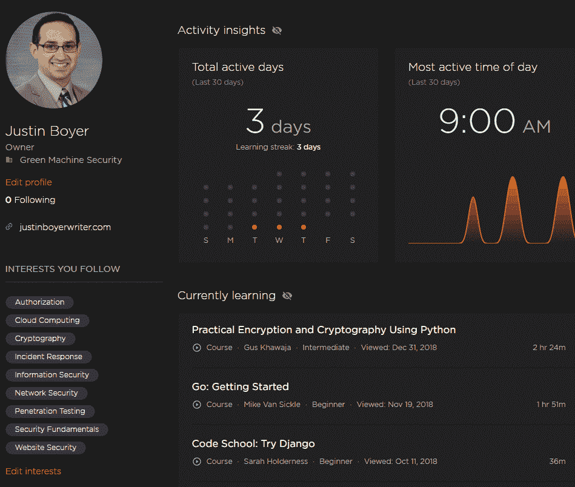
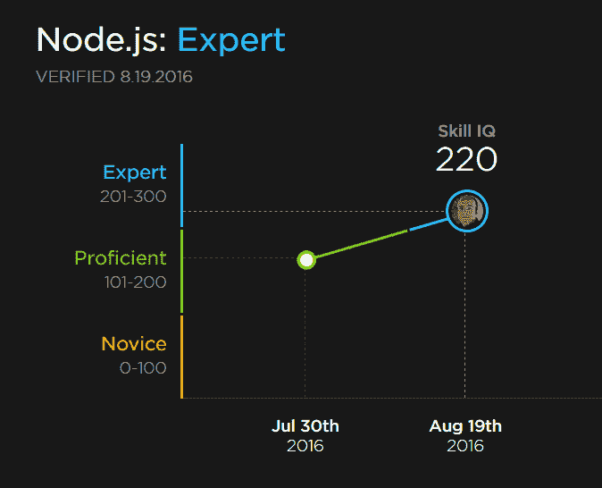
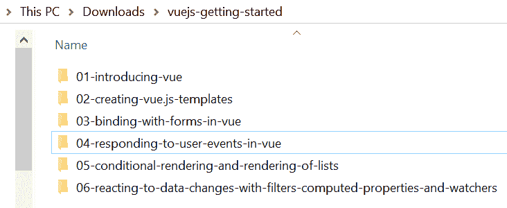
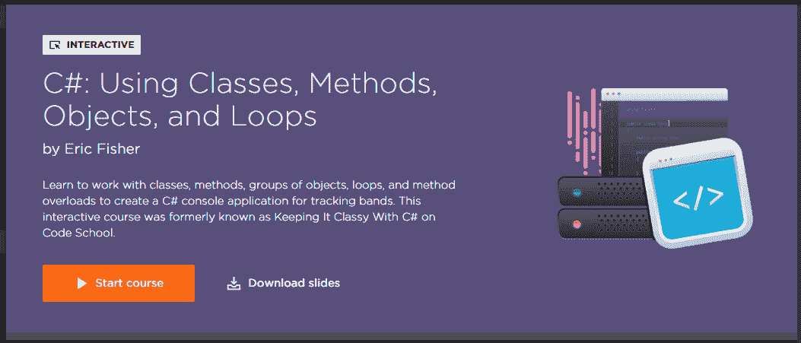
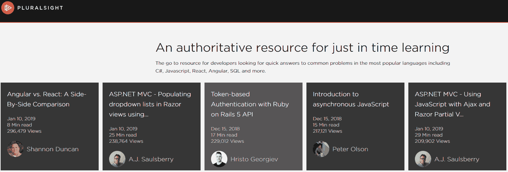
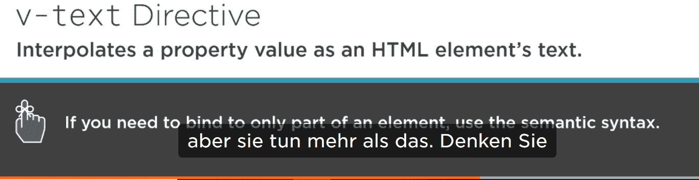
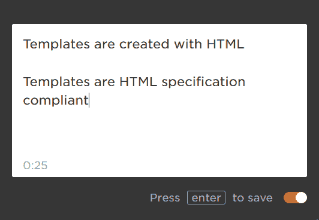
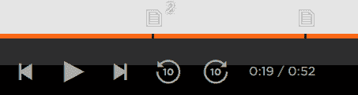
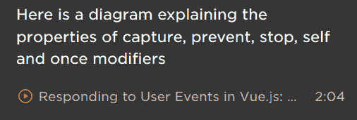
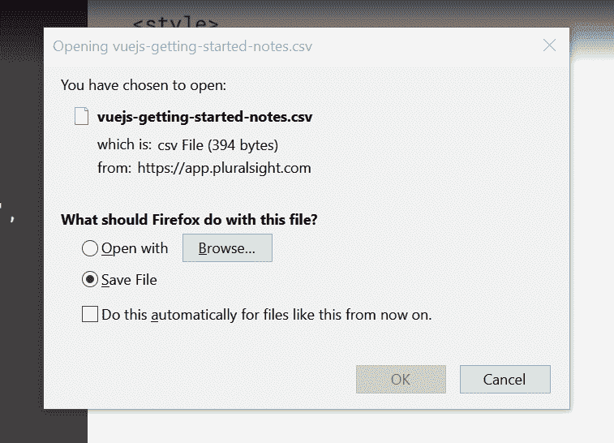

# 多重视野:权威指南

> 原文：<https://simpleprogrammer.com/pluralsight-review/>

本指南由撰稿人凯文·奥肖内西和贾斯汀·博耶合作完成。T3】

* * *


We’ve all been there.

迷失在软件开发日常生活的技术洗牌中。新的技术和框架一直在出现。现有技术的新版本带来了翻天覆地的变化。程序员必须跟上不断变化的形势。

即使你没有追逐最新的发展潮流，深入某个特定的主题仍然是复杂的。比如，一旦你了解了 Node.js 的基础知识，如何让自己的技能更上一层楼？您如何建立推进您的发展职业所需的专业知识？

如果有一个工具供您使用，包含程序员需要了解的几乎每个主题的数千门课程，这不是很好吗？按照逻辑顺序组织课程，这样你就可以有一个具体的计划来推进你的职业生涯，怎么样？

上述工具确实存在。这叫做多重视野。欢迎阅读这篇关于 Pluralsight 的评论，在这篇评论中，我们将解释它的各种优势，以及它如何为您的 it 职业生涯带来优势。

而我们又是如何如此了解 Pluralsight 的呢？

Kevin O'Shaughnessy 坚信持续学习，自 2012 年发现 Pluralsight 以来，他已经完成了 [429 门课程](http://pluralsight.pxf.io/1VMgx)和 11 条学习路径。

Justin Boyer 是 Pluralsight 课程[的作者，该课程使用微软威胁建模方法学](https://simpleprogrammer.com/get/threatmodelingpluralsight)和 Node.js 中的[实用加密技术进行威胁建模。他自己也是一个连续学习者，在成为作家之前，他在 2011 年发现了 Pluralsight，并推动两家公司采用了它。](https://simpleprogrammer.com/get/pratcryptops)

## 什么是复数视野？

Pluralsight 是一个面向专业人士，尤其是技术专业人士的在线学习平台。它最初是一家为公司提供课堂培训的培训公司。随着时间的推移，重点已经转移到从软件开发到市场营销和平面设计等主题的在线培训。随着越来越多的公司寻求为员工提供点播视频培训，Pluralsight 应运而生。

Pluralsight 持续增长，现在提供评估来帮助衡量学习者在各种技能和工具方面的增长，以便公司跟踪其员工正在学习的内容以及他们接下来应该学习的内容。

Pluralsight 不仅适用于雇主和雇员。个人用户计划允许任何人学习新技术。自由职业者可以学到更多的技能来帮助更好地服务他们的客户。如果你想在软件开发人员的职业生涯中更上一层楼，使用 Pluralsight 来学习新的技术和技能，这将帮助你实现目标。Pluralsight 订阅将有利于任何希望保持技术领先并学习新技能的人。

Pluralsight 开创了众包培训模式。Pluralsight 接受行业专家创建的课程，而不是聘请全职培训师来构建在线课程。这些专家在被接受为 Pluralsight 作者后，创建他们专业的课程，然后根据他们课程的表现收取版税。Pluralsight 节省了一个大型培训师团队的开销，作者也获得了一点额外收入。不错的安排。

多年来，Pluralsight 一直稳步增长。它的图书馆包括由 1500 多名行业专家撰写的 7000 多门课程。Pluralsight 每年都会在其家乡犹他州的盐湖城举办一次大型技术会议，名为 [Pluralsight LIVE](https://simpleprogrammer.com/get/pluralsightlive) 。该公司去年启动了首次公开募股，并期待继续增长。

## 复数视野涵盖哪些主题？

Pluralsight 提供所有主要语言和技术的培训。

随着 Pluralsight 库发展成为数千门课程，培训材料被分为四种主要用户类型:

### 软件开发

有数以千计的课程面向所有技能水平的开发人员。这里的主要学习领域是流行语言 Python、JavaScript、Java 和 C#，以及 web 开发和移动开发。

### IT 运营

这些课程面向专业或有抱负的数据库和系统管理员。它们涵盖了不同的领域，如 IT 认证、云平台、网络、安全、数据库管理、虚拟化和服务器。

### 数据专家

这些课程涉及数据科学主题，包括商业智能和大数据。主要的关系数据库引擎，Oracle 和 SQL Server，被大量地覆盖。

### 信息和网络安全

这些课程面向 IT 安全专业人员和希望进入这一领域的学生。它包括大量的材料，将有助于你获得专业认证，如 CompTIA。

## 这要花多少钱？(不同的封装和选项)

个人的标准交易[是每月 35 美元或每年 299 美元。](https://simpleprogrammer.com/get/pluralsightpricing)

对于希望为员工提供多视角培训的企业，也有一些培训包可供选择。

微软开发者网络(MSDN)用户可以免费使用 Pluralsight 长达三个月。令我吃惊的是，有这么多 MSDN 用户没有利用这项服务；如果您已经订购了 MSDN 服务，[今天就注册您的免费 Pluralsight 帐户](https://simpleprogrammer.com/get/pluralsightpricing)。

## 为什么不使用免费服务呢？

许多其他视频分享平台提供免费教程，YouTube 和 Vimeo 是其中最著名的。免费服务上有高质量的视频，但也有许多低质量的视频，很容易浪费时间在所有其他视频中搜索更好的视频。

免费平台上的大多数作者完全自己创作内容。通过付费订阅服务，如 Pluralsight，全职专业人士可以帮助作者编辑视频，使其达到更高的制作水平。作者学习如何拍摄专业视频，并且必须试镜，每个剪辑都经过编辑和同行评审，以确保其有效。Pluralsight 的编辑不仅关注质量，还关注教学的有效性。

免费服务通常需要你观看广告来资助网站。Pluralsight 是 100%无广告的，甚至允许通过他们的应用程序将课程下载到您的移动设备上。你可以在飞机、火车或汽车上进行多视训练。

当你使用免费服务时，你不能保证从专家那里学到东西。有了 Pluralsight，只有业内最好的老师才能成为作者。大约四分之一的申请人进入了申请过程的试听阶段，被接受为作者。因此，你知道你正在从一个专门的俱乐部中接受培训，这个俱乐部由目前在这个行业工作的人组成，他们拥有必要的经验和教学能力。

## 轮廓

Pluralsight 为您提供了一个个人资料页面，允许您轻松地与朋友和同事分享您的进展。个人资料页面显示了您当前正在学习的课程、已经完成的课程以及您表现出的兴趣。



用户可以访问书签和频道来保存和组织他们喜欢的课程。渠道可以与他人共享或公开，是团队组织新员工或继续教育所需课程的一个很好的工具。

## 评价

Pluralsight 提供对您 100 多个不同技能领域知识的评估。

新的角色智商功能可以衡量你对某个主题(如 Node.js)的了解程度，并告诉你接下来应该学习哪些课程。

每项评估的得分在 1 到 300 分之间，分为新手、熟手或专家级。如果您选择重新参加评估，技能智商历史记录功能可以显示您的知识随着时间的推移增加了多少。



## 下载

除了视频，您还可以下载幻灯片、代码和其他课程材料。这些是 zip 文件，内容是根据相关课程模块构建的。例如，Vue JS 入门课程包含所有六个模块的幻灯片。



## 著名作家

许多 Pluralsight 作者都是世界知名的，并且是世界上最好的开发人员之一。这里只是一些名人和面孔的精选。

### 汉森姆

如果你用谷歌搜索“斯科特”，你会看到斯科特·汉瑟曼的页面出现在第一页的顶部。十多年来，Scott 通过博客、[播客、](https://www.hanselman.com/podcasts/)、编写开源软件以及在[会议上发表演讲而获得了如此高的声望。](https://www.hanselman.com/blog/CategoryView.aspx?category=Speaking)

Scott 在 Pluralsight 上有四门课程可供选择，包括优秀的完全免费的课程[Get include！](https://simpleprogrammer.com/get/pluralsightgetinvolved)，提供关于博客、Twitter、GitHub、堆栈溢出、用户组和会议的专家建议。

Scott 的课程最初是与 Rob Conery 一起为 Tekpub 制作的，Pluralsight 购买了这些课程的版权，并于 2014 年收购了 Tekpub。

### 特洛伊·亨特


Troy Hunt 是微软的地区总监和开发者安全 MVP。他从网络的早期就开始开发网络软件，并创造了[,我被邀请了吗？](https://haveibeenpwned.com/)这是一项免费服务，收集数据泄露信息，帮助人们确定恶意网络活动的潜在影响。

Troy 是电子书和 OWASP 十大系列的作者。NET 开发人员和 ASP.NET 网站自动安全分析器的创建者。他[定期写博客](http://www.troyhunt.com/)，经常在行业会议和媒体上发言。

在撰写本文时，Troy 已经为 Pluralsight 制作了 47 门课程。这些涵盖了许多信息安全主题，包括 Angular JS，以及 JavaScript、拒绝服务、SQL 注入和 HTTPS 等其他主题。他还教授关于 GDPR 和蔚蓝的课程。

### 约翰不会结束的


The original author of the Simple Programmer blog and best selling books [*The Complete Software Developer’s Career Guide*](https://simpleprogrammer.com/products/careerguide/) and the [*Software Developer’s Life Manual*](https://www.oreilly.com/library/view/soft-skills-the/9781617292392/) has 48 courses on Pluralsight on a wide range of technical topics. John is highly skilled in learning new topics quickly and has used these skills to teach a range of languages including Java, Go, C#, Objective-C, and Lua.

### 朱莉·勒曼


作为 30 年的程序员和导师， [Julie](https://twitter.com/julielerman) 是实体框架方面领先的独立权威，从一开始就一直在使用和教授它。

作为三本[实体框架](https://simpleprogrammer.com/get/programmingentity)书籍的作者，包括 [Code First](https://simpleprogrammer.com/get/programmingentity1) 和 [DbContext](https://simpleprogrammer.com/get/programmingentityframework) 版本，Julie 在。NET 社区担任微软地区总监和 MVP，以及国际会议发言人。自 2010 年以来，她一直是《MSDN》杂志每月数据点专栏的作者。

朱莉·勒曼用 Pluralsight 制作了 22 个球场。

### 道格拉斯·克洛克福特


道格拉斯·克洛克福特因其于 2008 年出版的优秀著作[*《JavaScript:好的部分*](https://simpleprogrammer.com/get/javascriptgoodparts) 》而闻名。Crockford 谦虚地将这本书描述为“一本关于 JavaScript 的古怪的小册子”，这本书教导一代开发人员 JavaScript 语言有一种隐藏的美，这普及了这种语言，并加速了它成为当今世界上使用最广泛的语言。他最近的一本书是[*JavaScript 如何工作*](https://simpleprogrammer.com/get/howjavaworks) 。

Douglas 发明了世界上最流行的数据格式 [JSON](https://json.org/) ，他在 2002 年通过创建 [JS Lint](https://jslint.com/) 开创了借助林挺工具提高 JavaScript 代码质量的趋势。

Douglas 是 PayPal 的高级 JavaScript 架构师，在为[前端大师](https://frontendmasters.com/courses/good-parts-javascript-web/)举办的为期三天的研讨会期间，他制作了长达 10 小时的课程[JavaScript 和 Web 的精彩部分](https://simpleprogrammer.com/get/goodpartsofjava)，该课程也可以在 Pluralsight 上看到。

### 约翰爸爸


John Papa is a principal developer advocate with Microsoft and an alumnus of the Google Developer Expert, Microsoft Regional Director, and MVP programs.

他为 Pluralsight 制作了 40 门课程，涵盖了 Angular、ASP.NET、iOS、TypeScript、构建自动化和 Docker 等主题。

### 乔恩·斯基特


[Jon](https://twitter.com/jonskeet) 是 Stack Overflow 上评分最高的用户，在撰写本文时有超过 34，500 个答案。他尤其以对 C#的详细了解而闻名，深度撰写了《T2*c#*T5》一书，是微软 MVP。他还精通 Java 语言。

乔恩出现在 Pluralsight 的七个课程中。

## 你会在 Pluralsight 上找到什么类型的课程？

### 一点一点地玩

播放视频演示现场编程和讨论会议。一幕接一幕的课程通常是两个作者同时在屏幕上讨论一个话题，没有预演也没有脚本。有时是讨论，有时是解决问题或实施项目。

一个很好的例子就是课程 [Play by Play: OWASP 十佳 2017](https://simpleprogrammer.com/get/playbyplay) 。在本课程中，Troy Hunt 与 OWASP 董事会成员 Andrew van der Stock 讨论了 [OWASP 十大 web 应用程序漏洞](https://www.owasp.org/images/7/72/OWASP_Top_10-2017_%28en%29.pdf.pdf)。对列表中新漏洞的洞察以及如何选择它们的方法是非常宝贵的，在其他任何地方都找不到。

### 执行摘要课程

这些课程保持简洁明了:通常不超过 30 分钟，不需要太多的先决技术知识，也不会给你带来太多技术细节的负担。他们的目的是给你一个关于像 GDPR 这样的主题的最重要的信息的提示。

执行摘要课程是为那些没有太多时间深入研究某个主题的忙碌的高管或部门主管而设计的。它们的结构就像朋友之间的谈话，或者如果一位高管过来问你什么是云计算，简单的插图和实际应用，这样当话题出现时，高管就可以做好决策的准备。

### 基础课程

这些课程是初学者友好的，因为它们不假设以前的经验，但也深入主题，并强调技术背后的计算机科学概念。

### 高级课程

这些课程最适合对某个主题有一些现有知识或经验，并有兴趣获得更高级知识的用户。

高级课程有时被称为“深入课程”，是为了深入钻研某个特定主题而开设的课程。这不是一门宽泛的基础课程，而是一门紧密围绕某一方面的课程。

例如，角度基础课程将教会你构建角度应用所需的一切。高级课程可能会深入探讨角度服务的工作方式以及创建角度服务的最佳实践。

### 宏观课程

这些课程的目标是广度而不是深度。这些课程通常只持续一两个小时，帮助你评估这个主题是否是你想要投入更多时间去掌握的。

### 互动课程

交互式课程，也称为“实践学习”课程，旨在为学习编程语言或技术提供交互式媒体。

学生能够观看教学视频，然后通过在浏览器中编写实际代码来实践这些概念。互动部分指导学生使用课程中教授的概念构建一个真实的应用程序。

互动课程是 Pluralsight 的新产品，因此互动图书馆将继续发展，以包含更多的主题。



### 前端主机

Frontend Masters 是一系列由前端 web 开发艺术和科学领域的许多世界领先专家为学生现场拍摄的研讨会。对于亲自参加的学生来说，研讨会通常需要一到三天的时间。但对于在线学生来说，研讨会被编辑成持续 2 到 10 个小时的课程。

Pluralsight 已经许可了一些由 Frontend Masters 制作的课程(在撰写本文时有 27 个课程可供使用)。要访问前端硕士课程的完整列表，您需要[购买订阅](https://frontendmasters.com/join/)。

## 学习路径

一个单一的 Pluralsight 课程可以改变你对一个主题的理解，但如果你真的想掌握一个技术领域，你可能会决定完成整个学习路径。

学习路径让你从完全的初学者变成许多不同领域的专家。有 100 多种不同的学习途径可供你选择。

学习路径是一组分为三类的课程:初级、中级和高级。

使用角色智商评估，您可以快速确定您相对于其他 Pluralsight 用户对某个主题的理解水平。根据这些结果，Pluralsight 会建议你是从初级课程开始，还是跳过初级课程，从中级甚至高级课程开始。当然，你决定观看哪些课程完全取决于你自己，但推荐系统可以帮助你找到最适合你的水平。

## 贡献你的专长:如何成为一名作家

当你开始学习 Pluralsight 课程，了解更多你感兴趣的话题时，你可能会开始考虑如何做出贡献。也许你的专业领域还没有出现在 Pluralsight 的库中。你如何贡献你的专业知识并成为一名多视作家？

首先，有不同的贡献方式。您可以创建教授特定主题的视频课程。这些课程构成了 Pluralsight 的大部分内容。

您还可以帮助创建评估来衡量学生在特定主题上的知识。这些后来成为学习路径中的角色智商测试。

最后，你可以建立[技术指南](https://www.pluralsight.com/guides)，引导读者完成一项技术任务。技术指南通常专注于一个特定的任务，并引导读者完成它。



Pluralsight 技术指南页面。

成为作者的第一步是填写在[成为多见作者](https://simpleprogrammer.com/get/teach)页面上找到的表格。Pluralsight 收购团队的一名成员会联系那些提供独特经验并能帮助解决所需话题的人。

未来的作者在被接受之前需要进行试镜。试听只是一堂迷你课，就未来作者选择的主题进行多视角课程的形式。一旦提交，剪辑审查教学效果最重要。有效的在线教学是每个作者必须掌握的一项关键技能。为了确保内容的高质量，要求非常严格。大约四分之一进入试镜阶段的人被接受为作者。

成为一名多视角作者最好的部分是你得到的惊人的支持。Pluralsight 知道它的作者对他们的成功非常重要。每位作者都有一个作者成功经理，他是你的联系人，指导你完成课程的制作过程。Pluralsight 也有一个专门为作者构建的网站，提供有关课程创建、设备、提示和技巧的资源，甚至还有品牌图标和网页，作者可以使用它们来使他们的课程看起来很棒，而无需从头开始构建。

如果你是某个技术领域的专家，并且喜欢教别人，那就去申请成为一名作者吧。你可以用你的专业知识接触到很多人，并对他们的生活产生真正的影响。我最近在 LinkedIn 上收到了一条消息，是一个人用我的一门课程帮助我通过了安全认证考试。没有什么感觉像看到某人因为你的努力而成功。

## 让你的钱物有所值:让它成为一种习惯

Pluralsight 订阅是一种“吃到饱”的交易类型:你可以想看多少就看多少。另一个比喻是健身房会员。如果你想尝试 Pluralsight 订阅，我们希望你能从你的金融投资中获得最大价值。要做到这一点，您还需要在 Pluralsight 上投入大量时间。但这并不一定是繁重的；用复数视觉学习既简单又有趣。

你可以在公交车或火车上用 Pluralsight 学习，使用 Android 和 iOS 的 Pluralsight 应用程序。假设你乘公共交通工具上下班需要一个小时。这给了你每天两个小时来学习新东西。仅仅一两天，你就可以从零到英雄。

你不必担心缓慢的流媒体速度或超出你的数据限额:你可以从家里的 Wi-Fi 下载整个课程到你的手机上，然后在你有空的时候离线观看。

或者你可以边吃午饭边看 Pluralsight。许多课程很短，可以在你的午餐时间内完成，甚至更多的课程被分成几个部分，每个部分不到一个小时，这样你就可以在工作周内轻松完成课程。

无论您之前是在台式机、笔记本电脑还是手机上观看，您的个人资料都允许您从之前离开的地方继续观看。Pluralsight 还可以让您在学习时轻松地做笔记。

随着你发现自己的技能水平提高，学习变得更容易，你的个人资料也更容易被其他科技公司注意到并留下深刻印象。努力工作是有回报的，但是如果你计划自己每天花一个小时甚至几分钟来学习你感兴趣的东西，那就不会觉得这是努力工作。

许多雇主也允许或鼓励他们的员工花时间观看 Pluralsight 课程。Pluralsight 培训的成本通常比现场培训低得多，因此这是一种让员工掌握最新技术技能的有效方式。

如果你现在的雇主不提供任何形式的技术培训，他们可能会输给其他提供技术培训的公司，无论是在招聘能力还是员工跳槽到提供更好培训的公司方面。所以你的老板可能会同意你的观点，认为购买商业计划在财务上是有意义的。

## 提示和技巧

Pluralsight 具有许多功能，旨在帮助您学习您的学习方式，并尽可能提供最佳的学习体验。让我们来看看一些能让你的多重视觉体验更好的提示和技巧。

### 可变回放速度

有效学习和利用时间的最重要的特点是可变的播放速度。该软件包括时间拉伸，因此即使在双倍速度下音高也保持不变。尝试不同的速度，直到你找到你觉得舒服的最快速度。不要弹得太快以至于你理解作者有困难，但是如果你理解起来没有困难的话，一定要弹快一步。

### 隐藏字幕

大多数复视课程都有字幕。能够在听到信息的同时阅读信息可以强化你头脑中的信息。如果英语不是你的第一语言，你可以用谷歌翻译支持的任何语言显示。



### 记笔记

做笔记可以帮助你理解课程材料。看书的时候，一定要一行一行的看。另一方面，无论你是否集中注意力，视频都会继续播放，如果你不集中注意力，很容易错过很多重要信息。

写笔记的过程有助于你保持专注，避免分心。杰森·阿尔巴在他的[成为更好的倾听者](https://simpleprogrammer.com/get/becomealistener)课程中有一些更有用的消除分心的建议。

Pluralsight 有自己的工具，可以在线保存笔记，并自动将笔记与您拍摄笔记时正在观看的片段链接起来。只需在文本框中键入内容，然后按“enter”保存即可。如果您想要创建单独的段落，请在键入下一个段落之前按“shift”和“enter”两次。



您可以输入多个注释，这些注释会自动与视频剪辑以及您输入注释的视频剪辑上的时刻相链接。当您在视频剪辑的同一时间点输入多个音符时，视频进度条会显示一个音符图标和您输入的音符数。如果您在片段的不同点输入音符，片段中的每个相关点都会显示一个音符图标。



为每个视频剪辑输入多个音符可以帮助您组织您正在学习的信息。短视频剪辑强调一个关键点，在这些情况下，一个简单的注释就能抓住剪辑的精髓。较长的视频剪辑包含更多的信息，因此需要更多的努力来保留这些额外的信息，但是通过将视频剪辑分成一个简短的笔记来记录你从视频剪辑中学到的每个要点，在将来记住你学到的东西会变得容易得多。

有时一个复杂的概念不能简单地用几句话来解释，但可以用表格、图表或插图来解释。Pluralsight 在最有效的地方使用插图。在这种情况下，你可以简单地标记出课程中包含有用视觉效果的点，而不是写大量的笔记。



你也可以将你为一门课程写的所有笔记下载到一个 CSV 文件中。



CSV 文件将信息分为以下几类:

*   注意
*   课程
*   组件
*   夹子
*   剪辑中的时间
*   统一资源定位器

这里有一个例子:

```
"Note","Course","Module","Clip","Time in Clip","URL"

"Helps you maintain separation between your design and data","Vue.js: Getting Started","Creating Vue.js Templates","Binding to CSS Classes","0:11","https://app.pluralsight.com/player?course=vuejs-getting-started&author=chad-campbell&name=vuejs-getting-started-m2&clip=14&mode=live&start=11.475537¬eid=a5d8c25f-e7ad-4a51-8302-1a7d7f01b1c1"
```

利用这些信息，在复习所学内容时，你可以快速跳回感兴趣的视频片段，随心所欲地编辑笔记。

笔记功能唯一的缺点是，因为笔记是在标准的 HTML 文本框中输入的，所以它不提供 word 自动完成功能。如果你使用 [NotePad++](https://notepad-plus-plus.org/) 或 [Visual Studio Code](https://code.visualstudio.com/) 这样的工具，你可以更快地写笔记，然后将这些笔记粘贴到 Pluralsight notes 工具中。

## 学习它，做它，教它

请记住，通过课程或学习路径并不是你学习的真正结束——只是你通往真正专业知识之旅第一章的结束。它会给你信心，让你自己去尝试，然后[把它](http://www.bitnative.com/2013/12/14/programming-your-brain-the-art-of-learning-in-three-steps/)教给别人。