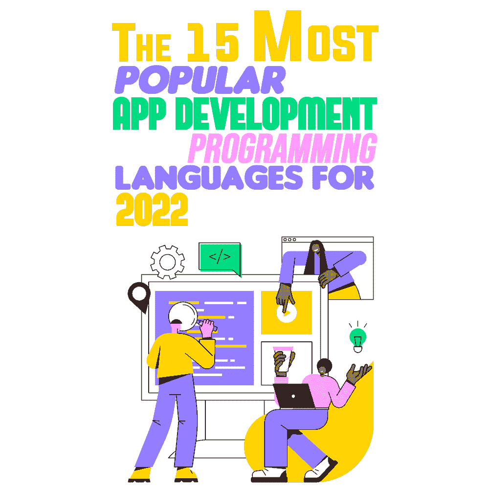

# 2022 年最受欢迎的 15 种应用开发编程语言

> 原文：<https://simpleprogrammer.com/popular-app-development-languages-2022/>

A mobile application—also referred to as a mobile app or simply an app—is a computer program or software application designed to run on a mobile device such as a phone, tablet, or watch.

应用程序最初旨在提高工作效率，如电子邮件、日历和联系人数据库，但公众对应用程序的需求导致其迅速扩展到其他领域，如手机游戏、工厂自动化、GPS 和基于位置的服务、订单跟踪和购票。因此，现在有数以百万计的应用程序可用。

应用程序通常从移动操作系统所有者运营的应用程序分发平台下载，如应用程序商店(iOS)或谷歌 Play 商店。一些应用程序是免费的，而另一些是有价格的，利润由应用程序的开发者和分发平台分享。

移动应用程序通常与桌面应用程序和 web 应用程序形成对比，前者设计为在桌面计算机上运行，而后者在移动 web 浏览器上运行，而不是直接在移动设备上运行。

那么，移动应用的未来会是怎样的呢？对于软件开发人员来说，更重要的是，预计在 2022 年及以后，什么编程语言将是最受欢迎的移动应用程序开发语言？这就是你将要发现的！

## 移动应用程序开发最流行的语言

考虑到上述情况，让我们来看看 2022 年移动应用程序开发的最佳编程语言。

### 计算机编程语言

Python 已经在 web 开发服务中使用了将近 30 年。它是 web 开发中发展最快、最好的编码语言之一。

Python 是一种高级动态类型编程语言，专注于健壮和快速的开发，其多功能性使其非常适合 web 开发或数据科学。这里有一些在你的应用程序中使用 Python 编程语言的优点和缺点:

**优点**

*   功能多样，开发快速，易于使用
*   您可以用更少的代码做更多的事情
*   种类繁多的图书馆

**缺点**

*   不适合移动环境
*   比其他编程语言慢
*   内存消耗非常高

### 迅速发生的

Swift 是一种面向 iOS 和 OS X 的新编程语言，它建立在 C 和 Objective-C 的基础上，但没有 C 兼容性的限制。Swift 是少数采用安全编程模式并添加现代功能以使编程更简单、更灵活、更有趣的应用程序开发语言之一。

Swift 干净的石板，由成熟且深受喜爱的 Cocoa 和 Cocoa Touch 框架支持，是重新想象移动应用程序开发工作方式的机会。

**优点**

*   快速开发过程
*   提高安全性和性能
*   应用程序的速度和可扩展性

**缺点**

*   人才库有限
*   缺乏对早期 iOS 版本的支持
*   语言还年轻

### Java Script 语言

Invented in 1995 at Netscape corporation, JavaScript is a programming language used in HTML pages. JavaScript programs run by an interpreter built into the user’s web browser.

对于移动应用程序，应该提到 React Native，这是一个开源 JavaScript 框架，旨在利用完全相同的代码库在 iOS、Android 和 web 应用程序等多种平台上构建应用程序。

React Native 是基于 React 的，它把所有的荣耀都带到了移动 app 开发上。没有什么比 JavaScript 构建一个 app 更好的了。简而言之，JavaScript 是一种解释性的轻量级语言，旨在创建以网络为中心的应用程序。因为它与 HTML 集成在一起，所以很容易实现。此外，建议按照 React Native 上的正确指南[来开发应用程序，因为它可以毫无争议地帮助构建跨 Android 和 iOS 平台的应用程序。](https://www.prismetric.com/guide-to-react-native-app-development/)

**优点**

*   将真实的 DOM 转换成虚拟的 DOM
*   丰富的界面和扩展的功能
*   能够进行前端和后端开发

**缺点**

*   需要支持 JavaScript 的浏览器
*   缺少调试设备
*   支持单一继承，不支持多重继承

### 结构化查询语言

SQL 是一种标准化的计算机语言，目前被认为是最好的编程语言之一。它最初是由 IBM 开发的，用于使用声明性语句查询、修改和定义关系数据库。

开发人员可以[成为 SQL 开发的大师](https://simpleprogrammer.com/mastering-sql/)。SQL，也称为结构化查询语言，是一种数据库计算机语言，设计用于管理关系数据库管理系统(RDBMS)中的数据。它可以对数据库执行查询，并从数据库中检索数据。

**优点**

*   无需代码即可轻松管理
*   定义良好的标准和多种数据视图
*   可移植的交互式语言

**缺点**

*   复杂的接口，难以扩展
*   部分控制并需要专业人员
*   在快速开发环境中存在问题

### 锈

Rust 是一种专注于安全性、速度和并发性的编程语言。它的设计允许您创建具有低级语言的性能和控制的程序，但是具有高级语言的强大抽象。

这些特性使得 Rust 适合于那些拥有 C 语言经验的程序员，他们正在寻找一个更安全的替代方案，也适合于那些来自 Python 等语言的程序员，他们正在寻找在不牺牲表达能力的情况下编写性能更好的代码的方法。

**优点**

*   强大的社区支持
*   对安全性有保证的仿制药的强力支持
*   节省测试和调试时间

**缺点**

*   编译缓慢
*   编程语言很复杂
*   缺乏有效的垃圾收集

### 斯卡拉

Scala 平滑地集成了面向对象和函数式编程。它旨在以一种简洁、优雅和类型安全的方式表达常见的编程模式。

Scala 引入了几个创新的语言结构，比如一个灵活的语法和类型系统，支持构建高级库和新的特定领域语言。此外，Scala 与 Java 兼容，允许使用 Java 库和框架，无需粘合代码或额外声明。

**优点**

*   内置控制结构
*   强大的 IDE 支持
*   可扩展且功能强大

**缺点**

*   有限的开发者池
*   没有真正的尾部递归优化
*   使类型信息难以理解

### 红宝石

Ruby 是一种动态编程语言，具有复杂但富于表现力的语法和核心类库，以及丰富而强大的 API。Ruby 从 Lisp、Smalltalk 和 Perl 中汲取灵感，但是使用了一种 C 和 Java 程序员容易学习的语法。

尽管 Ruby 是一种纯面向对象的语言，但它也适合过程式和函数式编程风格。它包括强大的元编程能力，可用于创建特定领域语言或 DSL。

**优点**

*   开源和 100%免费
*   充满活力的 ruby on rails 社区
*   高速原型制作

**缺点**

*   运行速度较慢
*   缺乏灵活性
*   更高的成本

### C++

几乎每个应用领域都有无数的开发人员在使用 C++。它是从 C 编程语言发展而来的，除了少数例外，它保留了 C 语言的子集。

C++的最大优势是它能够有效地用于需要在各种应用领域工作的应用程序。很常见的一种应用涉及局域网和广域网、数字、图形、用户交互和数据库访问。

**优点**

*   平台独立性和可移植性
*   多范式语言
*   可扩展并与 C 兼容

**缺点**

*   没有垃圾收集器
*   不支持内置线程
*   缺乏安全感

### C#

C#是一种通用的、类型安全的编程语言。这种语言的目标是程序员的生产力。为此，C#平衡了简单性、表达性和性能。

C#语言是平台无关的，可以与一系列特定于平台的编译器和框架一起工作，最著名的是微软的。NET framework for Windows。它是面向对象范例的丰富实现，包括封装、继承和多态。

**优点**

*   布尔条件和标准库
*   自动垃圾收集
*   易于编写代码

**缺点**

*   缺乏独立的编译器
*   不适合低级的东西
*   糟糕的平台 GUI

### 服务器端编程语言（Professional Hypertext Preprocessor 的缩写）

PHP 最初是一个小型开源项目，随着越来越多的人发现它有多么有用，它也在不断发展。早在 1994 年，拉斯马斯·勒德尔夫就发布了 PHP 的第一个版本。PHP 是“PHP:超文本预处理器”的递归首字母缩写。它是一种嵌入在 HTML 中的服务器端脚本语言。

它用于管理动态内容、数据库和会话跟踪，甚至构建整个电子商务网站。PHP 集成了许多流行的数据库，包括 MySQL、PostgreSQL、Oracle、Sybase、Informix 和 Microsoft SQL Server。

**优点**

*   强大的支持库
*   内置数据库
*   成本效益高

**缺点**

*   难以管理
*   倾向于处理错误
*   不安全

### HTML5

HTML5 stands for Hypertext Markup Language version 5\. It was published by the World Wide Web Consortium (W3C) in October 2014 as one of the best coding languages for app development. It is the most recent version of the language or code that explains web pages.

HTML5 是为了实现当今网站所需的各种特性而创建的。它很容易采用，因为 HTML 的编程版本没有重大改变。调试和调整代码更加容易，并且极大地方便了搜索引擎优化(SEO)。

**优点**

*   完整的 UI 和网格系统
*   最友好的搜索引擎
*   易于使用和学习

**缺点**

*   需要不必要的编码
*   附加定制
*   不足以用于动态页面

### 我的锅

Kotlin 是一种现代的、静态类型的、兼容 Android 的语言，它修复了许多 Java 问题，比如空指针异常或过多的代码冗长。 [Kotlin 通过提高代码质量和安全性，提升开发人员的绩效，将应用开发提升到一个全新的水平](https://www.amazon.com/dp/9389328586/makithecompsi-20)。

Kotlin 作为一个跨语言项目，被设计为与 Java 无缝地并肩工作。现有的 Java 库和框架生态系统与 Kotlin 一起工作，没有任何性能损失。

**优点**

*   清晰紧凑的代码库
*   合并过程式和函数式编程
*   最大化生产力

**缺点**

*   编译速度慢
*   较小的人才库
*   有限的学习资源

### 摆动

Flutter 是使用 Dart 开发的，包含一个独特的技术堆栈，使其有别于竞争对手。Dart 语言是 [Flutter 应用开发](https://www.prismetric.com/flutter-app-development-guide/)的核心。

像 Flutter 这样的现代框架需要一种高级的现代语言来为开发人员提供最佳体验，从而使创建健壮的移动应用程序成为可能。Dart 的目标是集合大多数高级语言的优点和成熟的语言特性，包括生产工具、类型注释和垃圾收集。

**优点**

*   定制小部件
*   允许即时更新
*   高性能和热重装

**缺点**

*   没有第三方库
*   网络浏览器不支持
*   有限的资源

### 去

Go 由谷歌的 Robert Griesemer、Rob Pike 和 Ken Thompson 创建，并于 2009 年 11 月发布。该语言及其配套工具的目标是富于表现力，在编译和执行方面高效，并能有效地编写可靠和健壮的程序。

Go 和 C 有着表面上的相似性，和 C 一样，它是专业程序员的工具，用最少的手段达到最大的效果。但它不仅仅是 C 语言的升级版，它具有独特的数据抽象方法和异常灵活的面向对象编程。

**优点**

*   易于部署
*   高效优化代码的能力
*   静态代码分析

**缺点**

*   有缺陷的依赖性管理
*   自动化招致错误
*   内部不一致

### 目标 C

Objective-C 语言是一种简单的计算机语言，旨在实现复杂的面向对象编程。这种方法使得程序设计更加直观，开发速度更快，更容易修改，也更容易理解。它不仅导致了构建程序的不同方式，也导致了构思编程任务的不同方式。

选择 Objective-C 语言作为 Cocoa 框架是因为它的动态特性。它的语法很小，明确，易于学习，并促进应用程序的最佳代码。

**优点**

*   可移植的结构化编程语言
*   可重用性；写一次，用多次
*   数据冗余和继承

**缺点**

*   内存管理不足
*   运行时间检查
*   缺少异常处理

## 编程语言在不断发展

对于选择哪种编程语言，您需要考虑的一个主要因素是您想要的软件类型。

例如，基于网络的创业公司更有可能用 Python 和 JavaScript 编程。较大的公司倾向于使用 C#或 Java 开发他们的内部软件应用程序，使用 PHP 开发他们的 Web 应用程序。嵌入式设备，如汽车和医疗保健行业的嵌入式设备，运行用 C、C++或 Rust 编写的软件。

编程语言的全部内容都在不断发展。如果你考虑了我上面展示的一系列因素、优点和缺点，你将能够明智地为你的应用程序开发选择最佳的编码语言。