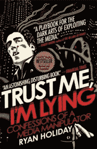
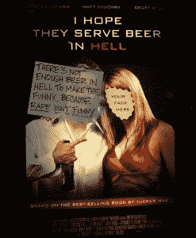
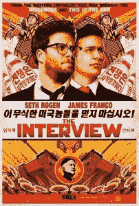

# 索尼黑客事件有没有可能只是一个宣传噱头？

> 原文：<https://simpleprogrammer.com/possible-sony-hack-just-publicity-stunt/>

如果索尼从来没有真的被黑过呢？

或者更糟的是，如果索尼黑了他们自己？

我知道这听起来有点疯狂——我承认，我是有点疯狂——但是，请允许我占用您几分钟时间，也许我会让您相信，整件事有可能是为了一个非常特殊的目的而策划的……

## 为什么会有人想给自己负面的宣传呢？

我的意思是，不好的宣传…不好吗？

嗯，不，不完全是。

你听过“没有所谓的坏宣传”这句话吗？

我绝对相信这种说法有一定的道理。我并不孤单。

畅销书作家赖安·哈乐黛写了一本关于这个主题的书，书名是[《相信我，我在撒谎:一个媒体操纵者的自白》](http://www.amazon.com/gp/product/1591846285/ref=as_li_tl?ie=UTF8&camp=1789&creative=390957&creativeASIN=1591846285&linkCode=as2&tag=makithecompsi-20&linkId=IAD5RAVL6JXLJ5Y4) 

在这本书里，他基本上，平出[细节，他如何操纵主流媒体](http://www.businessinsider.com/the-10-biggest-lies-told-by-american-apparels-top-pr-man-2012-8?op=1)给臭名昭著的和自称的混蛋，[塔克马克斯](http://www.tuckermax.com/)，在主要媒体频道的头版报道，所有推广他的电影[我希望他们在地狱提供啤酒](http://www.amazon.com/gp/product/B0033VKM2O/ref=as_li_tl?ie=UTF8&camp=1789&creative=390957&creativeASIN=B0033VKM2O&linkCode=as2&tag=makithecompsi-20&linkId=EAEPVTFDSJUT2IAV)

在[“相信我，我在撒谎”](http://www.amazon.com/gp/product/1591846285/ref=as_li_tl?ie=UTF8&camp=1789&creative=390957&creativeASIN=1591846285&linkCode=as2&tag=makithecompsi-20&linkId=IAD5RAVL6JXLJ5Y4)中，Ryan 详细描述了**如何一手挑起负面报道甚至抗议，故意丑化他自己的“[我希望他们在地狱里供应啤酒](http://www.amazon.com/gp/product/B0033VKM2O/ref=as_li_tl?ie=UTF8&camp=1789&creative=390957&creativeASIN=B0033VKM2O&linkCode=as2&tag=makithecompsi-20&linkId=EAEPVTFDSJUT2IAV)”的宣传广告**，并向他知道大型媒体从其获得故事的小型博客发送假新闻密报。

他还故意举行抗议活动，激怒女权主义者和其他组织，甚至抵制这部电影。

所有这些负面新闻做了什么？

直截了当地说:它卖出了一部很烂的电影和同名的书。

  

“污损”海报

当然，这与索尼黑客攻击的规模不可同日而语，但如果一个试图推广一部小成本电影的人能够制造并利用如此多的负面宣传，那么一个真正有预算的人能做些什么呢？

他们会走多远？

在书中，瑞安提到了许多更大的丑闻和整个媒体操纵行业，所有这些都是由谎言和负面宣传推动的。

或许索尼黑客事件是真实的，但不可否认的是，负面宣传和媒体操纵的秘密世界确实存在，而且也有结果。

## 以前有人假装被黑过吗？作为宣传噱头？

你这么问很有趣。

是的，就在不久前。

你喜欢墨西哥卷饼吗？我知道我有。

嗯，有一家公司希望你喜欢他们的墨西哥卷饼，以至于他们愿意对你撒谎，假装被黑了，让你多吃一些。

看看这些来自 Chipolte 推特账户的推文:

<article role="article" data-focusable="true" tabindex="0" class="css-1dbjc4n r-14lw9ot r-1ny4l3l r-1inuy60 r-1yt7n81 r-ry3cjt r-m611by r-o7ynqc r-6416eg" onmouseover="this.style.backgroundColor='rgb(245, 248, 258)'" onmouseout="this.style.backgroundColor='rgb(255,255,255)'">[Chipotle@ChipotleTweets](https://twitter.com/ChipotleTweets?ref_src=twsrc%5Etfw%7Ctwcamp%5Etweetembed%7Ctwterm%5E359005224821727232%7Ctwgr%5E%7Ctwcon%5Es1_&ref_url=https%3A%2F%2Fpublish.twitter.com%2F%3Fquery%3Dhttps3A2F2Ftwitter.com2FChipotleTweets2Fstatus2F359005224821727232widget%3DTweet)Hi sweetie, can you please pick up some lime, salt, and onions? twitter[1:41 AM · Jul 22, 2013](https://twitter.com/ChipotleTweets/status/359005224821727232?ref_src=twsrc%5Etfw%7Ctwcamp%5Etweetembed%7Ctwterm%5E359005224821727232%7Ctwgr%5E%7Ctwcon%5Es1_&ref_url=https%3A%2F%2Fpublish.twitter.com%2F%3Fquery%3Dhttps3A2F2Ftwitter.com2FChipotleTweets2Fstatus2F359005224821727232widget%3DTweet)[458](https://twitter.com/intent/like?ref_src=twsrc%5Etfw%7Ctwcamp%5Etweetembed%7Ctwterm%5E359005224821727232%7Ctwgr%5E%7Ctwcon%5Es1_&ref_url=https%3A%2F%2Fpublish.twitter.com%2F%3Fquery%3Dhttps3A2F2Ftwitter.com2FChipotleTweets2Fstatus2F359005224821727232widget%3DTweet&tweet_id=359005224821727232)[911](https://twitter.com/ChipotleTweets/status/359005224821727232?ref_src=twsrc%5Etfw%7Ctwcamp%5Etweetembed%7Ctwterm%5E359005224821727232%7Ctwgr%5E%7Ctwcon%5Es1_&ref_url=https%3A%2F%2Fpublish.twitter.com%2F%3Fquery%3Dhttps3A2F2Ftwitter.com2FChipotleTweets2Fstatus2F359005224821727232widget%3DTweet)</article>

<article role="article" data-focusable="true" tabindex="0" class="css-1dbjc4n r-14lw9ot r-1ny4l3l r-1inuy60 r-1yt7n81 r-ry3cjt r-m611by r-o7ynqc r-6416eg" onmouseover="this.style.backgroundColor='rgb(245, 248, 258)'" onmouseout="this.style.backgroundColor='rgb(255,255,255)'">[Chipotle@ChipotleTweets](https://twitter.com/ChipotleTweets?ref_src=twsrc%5Etfw%7Ctwcamp%5Etweetembed%7Ctwterm%5E359006375508054017%7Ctwgr%5E%7Ctwcon%5Es1_&ref_url=https%3A%2F%2Fpublish.twitter.com%2F%3Fquery%3Dhttps3A2F2Ftwitter.com2FChipotleTweets2Fstatus2F359006375508054017widget%3DTweet)Mittens13 password leave[1:46 AM · Jul 22, 2013](https://twitter.com/ChipotleTweets/status/359006375508054017?ref_src=twsrc%5Etfw%7Ctwcamp%5Etweetembed%7Ctwterm%5E359006375508054017%7Ctwgr%5E%7Ctwcon%5Es1_&ref_url=https%3A%2F%2Fpublish.twitter.com%2F%3Fquery%3Dhttps3A2F2Ftwitter.com2FChipotleTweets2Fstatus2F359006375508054017widget%3DTweet)[393](https://twitter.com/intent/like?ref_src=twsrc%5Etfw%7Ctwcamp%5Etweetembed%7Ctwterm%5E359006375508054017%7Ctwgr%5E%7Ctwcon%5Es1_&ref_url=https%3A%2F%2Fpublish.twitter.com%2F%3Fquery%3Dhttps3A2F2Ftwitter.com2FChipotleTweets2Fstatus2F359006375508054017widget%3DTweet&tweet_id=359006375508054017)[721](https://twitter.com/ChipotleTweets/status/359006375508054017?ref_src=twsrc%5Etfw%7Ctwcamp%5Etweetembed%7Ctwterm%5E359006375508054017%7Ctwgr%5E%7Ctwcon%5Es1_&ref_url=https%3A%2F%2Fpublish.twitter.com%2F%3Fquery%3Dhttps3A2F2Ftwitter.com2FChipotleTweets2Fstatus2F359006375508054017widget%3DTweet)</article>

<article role="article" data-focusable="true" tabindex="0" class="css-1dbjc4n r-14lw9ot r-1ny4l3l r-1inuy60 r-1yt7n81 r-ry3cjt r-m611by r-o7ynqc r-6416eg" onmouseover="this.style.backgroundColor='rgb(245, 248, 258)'" onmouseout="this.style.backgroundColor='rgb(255,255,255)'">[Chipotle@ChipotleTweets](https://twitter.com/ChipotleTweets?ref_src=twsrc%5Etfw%7Ctwcamp%5Etweetembed%7Ctwterm%5E359008625051709440%7Ctwgr%5E%7Ctwcon%5Es1_&ref_url=https%3A%2F%2Fpublish.twitter.com%2F%3Fquery%3Dhttps3A2F2Ftwitter.com2FChipotleTweets2Fstatus2F359008625051709440widget%3DTweet)Sorry all. We had a little problem with our account. But everything is back on track now! - Joe[1:55 AM · Jul 22, 2013](https://twitter.com/ChipotleTweets/status/359008625051709440?ref_src=twsrc%5Etfw%7Ctwcamp%5Etweetembed%7Ctwterm%5E359008625051709440%7Ctwgr%5E%7Ctwcon%5Es1_&ref_url=https%3A%2F%2Fpublish.twitter.com%2F%3Fquery%3Dhttps3A2F2Ftwitter.com2FChipotleTweets2Fstatus2F359008625051709440widget%3DTweet)[234](https://twitter.com/intent/like?ref_src=twsrc%5Etfw%7Ctwcamp%5Etweetembed%7Ctwterm%5E359008625051709440%7Ctwgr%5E%7Ctwcon%5Es1_&ref_url=https%3A%2F%2Fpublish.twitter.com%2F%3Fquery%3Dhttps3A2F2Ftwitter.com2FChipotleTweets2Fstatus2F359008625051709440widget%3DTweet&tweet_id=359008625051709440)[212](https://twitter.com/ChipotleTweets/status/359008625051709440?ref_src=twsrc%5Etfw%7Ctwcamp%5Etweetembed%7Ctwterm%5E359008625051709440%7Ctwgr%5E%7Ctwcon%5Es1_&ref_url=https%3A%2F%2Fpublish.twitter.com%2F%3Fquery%3Dhttps3A2F2Ftwitter.com2FChipotleTweets2Fstatus2F359008625051709440widget%3DTweet)</article>

<article role="article" data-focusable="true" tabindex="0" class="css-1dbjc4n r-14lw9ot r-1ny4l3l r-1inuy60 r-1yt7n81 r-ry3cjt r-m611by r-o7ynqc r-6416eg" onmouseover="this.style.backgroundColor='rgb(245, 248, 258)'" onmouseout="this.style.backgroundColor='rgb(255,255,255)'">[Chipotle@ChipotleTweets](https://twitter.com/ChipotleTweets?ref_src=twsrc%5Etfw%7Ctwcamp%5Etweetembed%7Ctwterm%5E359009125717385218%7Ctwgr%5E%7Ctwcon%5Es1_&ref_url=https%3A%2F%2Fpublish.twitter.com%2F%3Fquery%3Dhttps3A2F2Ftwitter.com2FChipotleTweets2Fstatus2F359009125717385218widget%3DTweet)Please return to your usual #chipotle love and thanks for your patience with us today. - Joe[1:57 AM · Jul 22, 2013](https://twitter.com/ChipotleTweets/status/359009125717385218?ref_src=twsrc%5Etfw%7Ctwcamp%5Etweetembed%7Ctwterm%5E359009125717385218%7Ctwgr%5E%7Ctwcon%5Es1_&ref_url=https%3A%2F%2Fpublish.twitter.com%2F%3Fquery%3Dhttps3A2F2Ftwitter.com2FChipotleTweets2Fstatus2F359009125717385218widget%3DTweet)[107](https://twitter.com/intent/like?ref_src=twsrc%5Etfw%7Ctwcamp%5Etweetembed%7Ctwterm%5E359009125717385218%7Ctwgr%5E%7Ctwcon%5Es1_&ref_url=https%3A%2F%2Fpublish.twitter.com%2F%3Fquery%3Dhttps3A2F2Ftwitter.com2FChipotleTweets2Fstatus2F359009125717385218widget%3DTweet&tweet_id=359009125717385218)[70](https://twitter.com/ChipotleTweets/status/359009125717385218?ref_src=twsrc%5Etfw%7Ctwcamp%5Etweetembed%7Ctwterm%5E359009125717385218%7Ctwgr%5E%7Ctwcon%5Es1_&ref_url=https%3A%2F%2Fpublish.twitter.com%2F%3Fquery%3Dhttps3A2F2Ftwitter.com2FChipotleTweets2Fstatus2F359009125717385218widget%3DTweet)</article>

哎呦？Chipotle 的推特账号刚刚被黑了吗？

不，他们只是为了获得追随者而假装被黑。[他们甚至承认了。](http://mashable.com/2013/07/24/chipotle-faked-twitter-hack/)

## 但是索尼从来没有做过这样的事情，对吧？不对！

在索尼便携式游戏机发布之前，索尼在 www.alliwantforxmasisapsp.com 创建了一个假博客。

在博客上，有个家伙明显发帖说 PSP 有多好，还说他圣诞节想要一个。

索尼的一些游戏玩家觉得有些不对劲，[当他们查看网站注册人是谁](http://www.pcworld.idg.com.au/article/170345/fake_psp_blog_backfires_sony/)时，发现是…

…你猜对了，**一家病毒式营销机构**。特别是 Zipatoni，他们后来改了名字。

索尼的病毒式营销尝试失败了，但它证明了索尼正在投资病毒式营销和一些不择手段的策略，包括彻底撒谎。

所以，我认为索尼尝试做这样的事情是不可能的。

但是，他们真的会黑自己吗？

他们真的会泄露那么多个人数据，只是为了引起媒体的注意吗？

好吧，说实话，他们不只是得到了一点媒体的关注。索尼已经在每个主要的新闻频道上出现了几个星期。

这部关于刺杀朝鲜独裁者金正恩的粗制滥造的电影可能会在影院上映，但现在却成了头条新闻，在脸书和推特上广为传播，比今年圣诞节的圣诞老人还受关注。

我的意思是，索尼甚至邀请了美国总统来谈论他们和这部电影。

哦，在这奇怪的转变中发生了什么？

好吧，现在看来索尼正在打退堂鼓，说他们终究会发布《采访》。我猜他们不再害怕金正恩了？

这样做很方便。

但是，我仍然知道你在想什么…

这似乎仍然是一些疯狂的阴谋论。我的意思是，索尼从这整个惨败中遭受了很多负面后果。

他们的股票暴跌。

实际的破坏性备忘录和数据被公布于众。

他们的员工的社会安全号码被分发出去。

## 我认为*实际发生的事情*

我认为事实是这样的:

我不认为索尼打算让这一切都结束。

这只是一个理论，但我认为这是一场病毒式营销活动。

请注意，这都是猜测。

但是，如果索尼雇佣了一些过分的病毒式营销代理会怎么样呢？

如果索尼只是想为这次采访制造一点负面宣传，让它看起来像是朝鲜攻击了他们，以报复他们制作了一部关于杀死金正恩的电影，会怎么样？

但是，如果事情变糟了——糟糕透顶，该怎么办呢？

如果病毒式营销公司雇佣了错误的“黑客”来实施网络攻击，因为他们想让攻击看起来像真的，而那个黑客有自己的计划，那该怎么办？

如果索尼只是想制造一点负面新闻，**但整件事就在他们面前爆发了**，现在他们正试图最大限度地利用它，同时尽可能地减少损失，那该怎么办？

这里还有一个“假设”,这是最可怕的一个。

如果《采访》成为有史以来最畅销的 DVD 电影会怎样？

你怎么想呢?

如果你疯了，你认为我疯了，你想每周听到更多我的疯狂想法，在这里注册我的每周邮件。