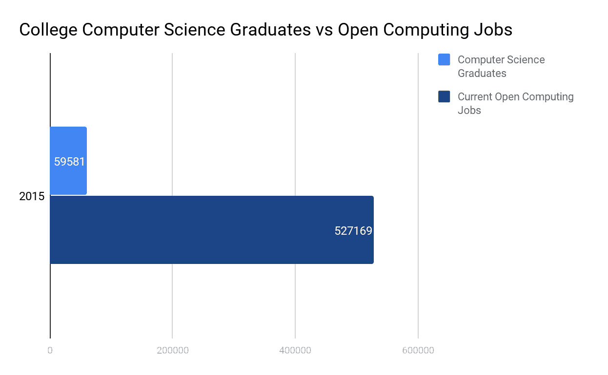
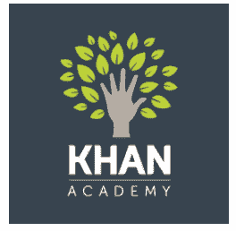
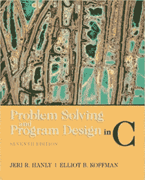
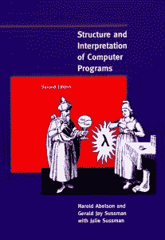
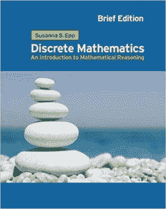
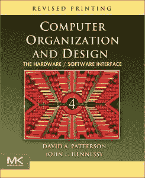
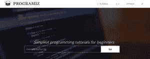

# 为大学计算机科学做准备的 10 种方法

> 原文:[https://simple programmer . com/prepare-computer-science-university/](https://simpleprogrammer.com/prepare-computer-science-university/)

由于每 10 份公开计算工作中只有一名计算机科学毕业生，这些工作的薪水会飞涨，这吸引了许多人去追求计算机科学的职业。

图集，数据:Code.org 国家教育统计中心

如果你想在像计算机科学这样利润丰厚的领域发展事业，你可能会计划获得一个大学学位。学位对于学习如何编程是很重要的，也有助于为自己在该领域的职业生涯做准备。

大学生不仅需要学习，还需要在团队项目中表现出色。表现突出、平均绩点优异的学生会被选中，有机会参加海外交流项目或非常好的实习，这将提升你的简历，带来更多机会。

在进入大学之前，学生需要准备好忍受学术环境中的挑战。大多数高中毕业的学生确实尝试过一些准备工作，比如学习如何编码，但他们只是触及了表面。简单地学习编码是任何人都可以在短时间内完成的事情，与全面的准备方法相比，它不会给你带来太多的优势和先机，这将使你与众不同。

大学前的准备对学生来说是极其重要和有价值的，尤其是因为即将入学的大学生想要在学校里表现出色的激烈竞争。

我是一名新加坡人，正在等待 2019 年进入新加坡国立大学学习计算机科学，但首先我必须服两年强制性兵役。受 John Sonmez 的[如何为大学做准备](https://youtu.be/pXxqYVWoWg0)视频的启发，我精心制作了一个游戏计划，为自己在大学阶段学习计算机科学做好最好的准备。希望这些建议也能帮助其他希望进入计算机科学项目的人！

## 1.确定计算机科学对你意味着什么

在决定去大学深造之前，问自己以下几个问题:你这么做是为了赚钱吗？因为儿时梦想设计自己的电脑游戏？还是对赋予人工智能生命之美的惊叹？

不管计算机科学对你意味着什么，关键是要像对待自己的生命一样珍惜它，因为当事情变得艰难时(当，而不是如果)，它将是你意志力的源泉。

找出你对计算机科学的专业兴趣，无论是算法、计算机安全还是软件工程，并完全沉浸其中，因为计算机科学是一个多样化的领域。通过围绕一个主要兴趣为你的学习打下基础，你会看到大的图景，这无疑会帮助你点燃激情。

投资于与你兴趣相关的书籍，观看 YouTube 频道，阅读相关新闻等。它们不一定是技术性的，但是它们应该给你一个更好的视角和对学科的总体理解。

正如约翰·桑梅兹所说，不知道自己的专业兴趣就像在没有方向感的船上划船。

比如我的兴趣是人工智能，正在看的书有:艾瑟姆·阿尔帕丁著的[机器学习](https://mitpress.mit.edu/books/machine-learning-1)，尼克·博斯特罗姆著的[超智能](https://www.goodreads.com/book/show/20527133-superintelligence)，马克斯·泰格马克著的[生活 3.0](https://www.goodreads.com/book/show/34272565-life-3-0) 。我还订阅了 YouTube 上的人工智能频道，并关注脸书的 Yann LeCun 和李开复。

## 2.磨练你的手艺，建立一套技能

不用说，技术技能和知识是计算机科学家的本质。大学水平的课程节奏很快，一些学生可能很难跟上——这使得你很难成为一个高水平的表演者。

让自己在学习上领先一步可能是个好主意。一种方法是通过大规模开放在线课程(MOOCs)。

MOOCs 是免费的在线课程，提供了一种学习新技能的灵活方式。一些大学，如麻省理工学院和哈佛大学，为他们自己的在校学生提供这些课程，作为获得课程学分的替代选择，这本身就应该说明他们 MOOCs 的质量。

以下是一些提供 MOOCs 的组织，这样你可以磨练自己的技能，让自己比大学同学多一份优势:

| **[edX](https://www.edx.org/)************T6】** | [**可汗学院**](https://www.khanacademy.org/) | [**斯坦福在线**](http://online.stanford.edu/) |

我目前正在 edX 上学习哈佛的 [CS50:计算机科学导论](https://www.edx.org/course/introduction-computer-science-harvardx-cs50x)。讲座很吸引人，问题集有有趣的背景，而且是免费的(除非你想要一个经过验证的在线证书)。

最棒的是，这个 CS50 班有一个脸书小组，里面有一个活跃的、乐于助人的学生在线社区，他们随时准备回答你的任何问题。发布一个问题后不到一天，人们就会插话进来，试图提供帮助。

## 3.了解你的资源

如果你想在进入真正的大学之前寻找更多的补充资源，可以看看各大学流行的更便宜的电子书版本的教科书。互联网提供了大量的资源和信息。利用它们为你造福！

这里有几本我用过的不错的入门教材:

| [**Problem Solving and Program Design in C**](http://www.amazon.com/exec/obidos/ASIN/0132936496/makithecompsi-20) | [**计算机程序的结构与解释**](http://www.amazon.com/exec/obidos/ASIN/0262510871/makithecompsi-20) | [**Discrete Mathematics: An Introduction to Mathematical Reasoning**](http://www.amazon.com/exec/obidos/ASIN/0495826170/makithecompsi-20) **T2】** | [**计算机组织与设计:硬件/软件接口**](http://www.amazon.com/exec/obidos/ASIN/0124077269/makithecompsi-20) |

在线教程和手册教授编程语言基础知识，如运算符、函数和库，您可以自由地将其应用到您的代码和问题集中。在大学里，你还需要查阅这些基础知识以供参考。

这里有几个可供参考的网站示例:

| [**辅导点**](http://www.tutorialspoint.com/) | [**Cprogramming.com**](https://www.cprogramming.com/)**** | **[程序设计](https://www.programiz.com/)** |

其他一些资源不错的地方还有[麻省理工学院开放课件](https://ocw.mit.edu/courses/electrical-engineering-and-computer-science/6-001-structure-and-interpretation-of-computer-programs-spring-2005/video-lectures/)，YouTube: **[简单程序员](https://www.youtube.com/user/jsonmez)** ，[编码技术](https://www.youtube.com/channel/UCtxCXg-UvSnTKPOzLH4wJaQ)， [CodingTutorials360](https://www.youtube.com/user/pizzapokerguy87) ， [LevelUp Tuts](https://www.youtube.com/user/LevelUpTuts) ，以及 [LearnCode.academy](https://www.youtube.com/user/learncodeacademy) 的在线讲座。

## 4.想走得快，就一个人走；如果你想去很远的地方，一起去

与你认识的每一个人建立关系网:大学同学和校友、亲戚和朋友。你的前辈和校友也可以对某些公司文化提供有价值的见解。你也永远不知道毕业后你需要一份工作，而你的一个朋友却是一名人力资源招聘人员。

不要羞于向大学校友/学长寻求建议。在你大学的脸书/推特页面上寻找他们，在那里他们可能会偶尔展示他们的成就和奖项。一定要问问你的朋友和亲戚，他们是否认识在大学学习计算机科学的人；他们应该愿意帮助你。

依靠在线社区的帮助。从 StackOverflow 到脸书集团，网上丰富的智慧、知识和鼓励的话语将带你走得更远。人们有宝贵的经历，这些经历要花很多时间才能获得。向他们学习，你就节省了他们花在学习上的所有时间。

也帮助别人！大学里学其他课程的朋友，比如材料工程，经常有需要学习基础编程的课程。当他们需要帮助时，试着在他们身边，你也会从学习其他科目中受益。

## 5.训练你的精神纪律

编程并不容易——长时间盯着屏幕/规划代码结构/分析问题集会让人不舒服，所以如果你想在大学取得成功，就必须及早练习。计划一个节目时间表，并执行它。

找出你自己的编程习惯，以及是什么让你融入其中。无论是戴着耳机听音乐，在你身边喝一杯热咖啡，还是在大家一起学习的地方(比如图书馆)学习或工作，做你觉得最合适的事情。

此外，为了减轻长时间盯着屏幕的影响，练习良好的坐姿，找一把好椅子，调整适合你眼睛的最佳光线设置(并[安装蓝光过滤器](https://justgetflux.com/))，并让笔记本电脑支架与你的眼睛水平。

到你上大学的时候，你会忙于完成作业和复习，无暇顾及你的视力和体态。所以，趁现在还有时间，抓紧时间为长期做好必要的准备。

## 6.学习使用 GitHub

GitHub 是一个托管开源项目的开发平台。这就是开发人员如何在同一项目上在线合作。

GitHub 在大学和职场都很常见。对于开发人员来说，在相同的代码上工作是一项必须的技能。一些大学甚至使用 GitHub 来指导他们的课程，重要的是至少要学会在网站上操作。

这里有一些你可以用来开始使用 GitHub 的指南: [GitHub 指南](https://guides.github.com/)、[开源指南](https://opensource.guide/)和[learn code . academy 的 GitHub 教程](https://www.youtube.com/watch?v=0fKg7e37bQE&t=37s)。当然，你还需要一些编码的技术知识。

## 7.保持进度日志组合

WordPress 、 [GitHub](https://github.com/) 和[stack overflow Developer Story](https://stackoverflow.com/users/story/join)是一些平台，你可以在这些平台上记录你的编程进度，指出你犯的错误并从中吸取教训。你甚至可以附上你的项目，把它作为你的作品集展示给面试者，让他们了解实习和工作。

写进度日志的目的是让你每隔几个月回顾一下，分析一下你是否朝着自己的目标前进了。如果你不是，你可以相应地调整你的未来计划。虽然你的最终目标是进入一所大学，但这真的是一个旅程，有一个日志来回忆这些年来你是如何进步的会有所帮助——即使是在大学毕业之后。

## 8.试试黑客马拉松

在大学，你的成绩不仅取决于你个人的知识和技能，也取决于你的队友。尝试黑客马拉松让你亲身体验团队协作的沟通、领导力和编程挑战，并从中学习一些东西。

作为一名初学程序员，我想看看黑客马拉松到底是怎么回事，所以我尝试了一次。

我接触了一位大学校友，他在过去三年里参加了 30 多次黑客马拉松。在与他分享了我如何参加 MOOCs 和学习后，他建议我“加入一个黑客马拉松”，因为目的不仅仅是创造一个解决方案，而是学习。他还注意到没有编程背景的人加入了黑客马拉松，并在这个过程中从头开始学习。

以下是美国黑客马拉松的汇编，你可以试试:[黑客事件](https://hackevents.co/hackathon/usa)

如果你对黑客马拉松的运行方式以及你能否在团队中有效工作感到紧张，我建议找一小群(3-4 个)朋友，尝试做一个个人项目。称之为个人迷你黑客马拉松会议:从你的朋友和他们的编程语言中学习尽可能多的东西，并创造一个小产品。

## 9.尝试不同的准备思路

走出你的舒适区。发现什么适合你，什么不适合。尝试新颖独特的准备方式，比如制作 YouTube 视频来解释概念，或者志愿为非营利组织设计网站。

当你走出舒适区时，你会发现会把你带到更高境界的机会。你将获得自信，这样当你在大学遇到新的挑战时(例如，任何特定的编程错误)，你*知道*你将需要一些时间来克服它们并保持动力。

如果你有足够的时间，你可以考虑教青少年编程。教学是最好的学习方式。青少年可能会有与你截然不同的分析视角。他们的问题可以促使你重新思考你已经知道的东西，以及如何以全新的方式应用这些知识，从而拓宽你的视野。

## 10.这不是一场竞赛，而是一种生活方式

放松一点；重点不是要在大学里胜过所有其他人来确保你的一流荣誉。学习和获得学位的过程是计算机科学对你有意义的原因，取得的成就是额外的奖励。

它是关于你建立的友谊，你克服的挑战，以及你如何成长。这就是为什么计算机科学对你来说是一个有意义的职业。

## 伟大旅程的开始

当然，所有这些都只是计划，除非你坚持到底，否则不会有用。最终，大学只是一个让你获得市场技能的平台。你的目标不应该仅仅是完成大学学业，而是在大学毕业后作为一名计算机科学家参与终身学习。也就是说，不要等到大学，现在就开始准备。

当你遇到诱惑你放弃的挑战时，总是依靠计算机科学对你的意义；这会帮助你找到继续前进的力量。