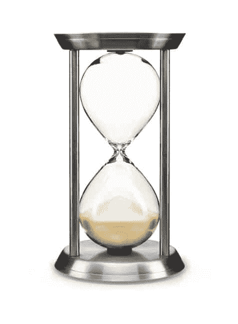
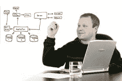
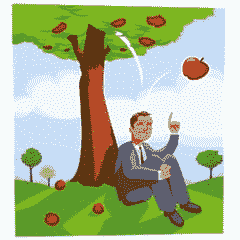

# 原则是永恒的，最佳实践是时尚

> 原文：<https://simpleprogrammer.com/principles-are-timeless-best-practices-are-fads/>

原则和最佳实践之间有着巨大的差异。

最佳实践是主观的，很大程度上取决于具体情况，而原则是永恒的、普遍的。

在写完[我知道的越多，我知道的越少](https://simpleprogrammer.com/2012/12/15/the-more-i-know-the-less-i-know/)之后，我收到了几封电子邮件，谈论在软件开发中应该始终遵循的绝对最佳实践。

我已经打算写关于原则的文章，但是这种混乱让我清楚地意识到，应该区分最佳实践和原则。我们不想把婴儿和洗澡水一起倒掉。

## 看一些最佳实践的例子

首先让我们看看一些软件开发的最佳实践，然后我们将它们与原则进行对比，以便更好地了解其中的区别。

当今软件开发中最常见的最佳实践之一是单元测试的思想。[我已经写了过去我对盲目遵循这一最佳实践的怀疑](https://simpleprogrammer.com/2010/12/12/back-to-basics-why-unit-testing-is-hard/)，但是[我们是否应该遵循它](https://simpleprogrammer.com/2011/01/14/back-to-basics-unit-testing-automated-blackbox-testing-and-conclusions/)，这不是我今天关心的。

单元测试是非常上下文相关的。我这么说的意思是，几乎所有人都会同意，有一些特定的环境使得单元测试有价值。 

如果你在一个执行单元测试需要很长时间的环境中工作，或者你正在用瀑布方法开发你的软件，你有一个大的前期设计和详细的需求，单元测试开始迅速失去价值。

但是，与其陷入单元测试何时失去价值的争论，不如解决它何时具有最高价值——我们更有可能在这一点上达成一致。

当我们在敏捷环境中工作时，单元测试具有最高的价值，在这种环境中，变化被快速地引入到软件系统中，重构正在发生。当您能够快速地执行和编写测试时，它的效用也会大大增加，因为反馈循环使得用逐步的方法编写测试更加容易，尤其是在进行 TDD 的时候。

有很多其他的最佳实践已经失宠了，比如用 UML 图大量注释代码和记录需求，但是上下文也在这些实践的价值中扮演了重要的角色。

当大多数开发人员编写非常短的变量名和方法名时，注释非常重要。在敏捷过程流行之前，预先获得详细的需求是至关重要的。

## 但是，大多数最佳实践都是好的！

是的，你是对的，大多数最佳实践确实适用范围很广，并且通常在大量不同的上下文中是有帮助的。

例如，使用一个源代码控制系统被认为是一个最佳实践，而且似乎没有多少情况不是这样。

那么这难道不是一个具体的规则或原则吗？

不，它仍然太具体，不能在所有情况下普遍适用，将代码置于源代码控制中的行为对提高软件或软件产品的质量没有任何帮助。

如果你盲目地遵循任何最佳实践，而没有以一种能够揭示潜在原则的方式来应用最佳实践，那么你实际上很可能得不到任何好处。

你看，大多数最佳实践实际上来自于永远不变的普遍适用的原则。这就是为什么大多数最佳实践都是好的。

问题是应用最佳实践本身并不能保证其潜在原则的好处。

简单地说，有更重要的事情在起作用，这使得将代码签入源代码控制系统成为一个好主意。完全可以跟着动作走，却完全错过了动作的精神。

如今，我越来越多地看到这样的软件开发团队:

*   编写单元测试
*   使用持续集成系统
*   使用源代码管理
*   召开 Scrum 会议
*   结对编程
*   使用 IoC 容器

然而，他们几乎没有从中受益。只是有更多的痛苦和困难需要克服。原因很简单…

## 有效的不是最佳实践，而是最佳实践背后的原则

原则无处不在。它们适用于我们生活的方方面面。就像万有引力定律一样，你不可能一天不被 100 种不同原则的结果影响，这些原则对你的生活有着持续的影响。

重力实际上是理解原理的一个很好的方法。据我们所知，这是一种普遍的力量，总是在起作用。逃脱万有引力定律是不可能的，无论你在宇宙中走到哪里，它都会影响你。

原则就像自然法则，只是更大一些。原则更像是现实的法则。尽管你可能无法完全描述它们或理解它们是如何工作的，但它们总是在工作。

以收获的法则为例。大多数人都熟悉这个特殊的原理。基本上是这样的。

> ***种瓜得瓜种豆得豆。*T3】**

这个道理有多普遍？怎么会有人避免呢？有多少次你发现自己受制于这条关于现实如何运作的不可逃避的法则？

许多软件开发最佳实践实际上都是基于这个原则。想想那些让你在过程早期努力提高软件质量的最佳实践。

TDD 或测试驱动开发就是这样一种最佳实践。TDD 的基础是尽早将质量引入软件开发过程，从而使成品更好。

如果你在没有理解这个原则的情况下应用 TDD 的实践，你只是在跟随动作，你实际上不会从实践中获益。

如果你在某种程度上不能理解做 TDD 的目的是在你的软件中播下一些好的种子，你将在以后收获，你将不会写正确的测试。

在编写代码之前编写测试并没有什么神奇的，但是有目的地投资于前期质量，最终目标是在正确的季节获得巨大的投资回报，这是有价值的。

顺便说一下，这就是为什么我喜欢鲍伯·马丁的书[c#](http://www.amazon.com/gp/product/0131857258/ref=as_li_ss_tl?ie=UTF8&camp=1789&creative=390957&creativeASIN=0131857258&linkCode=as2&tag=makithecompsi-20)中的敏捷原则、模式和实践；它讨论了许多永恒的软件开发原则。像这样的书和我在这个博客中提到过大概 10 次的书，[如何赢得朋友和影响他人](http://www.amazon.com/gp/product/1439167346/ref=as_li_ss_tl?ie=UTF8&camp=1789&creative=390957&creativeASIN=1439167346&linkCode=as2&tag=makithecompsi-20)，都充满了原则。

另外，看看吧，你刚刚了解了什么是敏捷。牢记原则，现在阅读[敏捷宣言](http://agilemanifesto.org/)。它从来没有被设计成开发软件的一个详细的过程和一组最佳实践，**它总是意味着对一组指导软件开发的原则的认可。**

所以，请记住，下一次当你与某人争论最佳实践，或者考虑将最佳实践应用到你正在从事的项目中时，如果你不理解基本原理，再多的仪式和程序也不会有丝毫的好处。