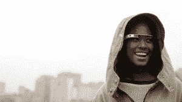
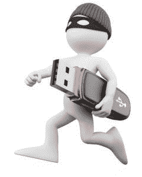

# 隐私已死，是时候为未来做准备了

> 原文：<https://simpleprogrammer.com/privacy-is-dead-time-to-prepare-for-the-future/>

个人隐私结束了。

世界比你更了解你，而且很快会知道得更多。

我们可以继续战斗以保护我们的隐私，或者我们可以学习如何在未来的时代生活，在这个时代我们所有的行为都有可能被公众看到。

在你担心我会对你采取政治手段之前，不要担心，我不是在纵容对个人隐私的侵犯或根除它，但同时我也不支持它。

我只是在观察随着我们社会的技术进步而出现的模式，这种转变是不可避免的。

实际上，我坚决反对在任何论坛上公开表达我的政治观点，甚至是在我自己的博客上，我经常建议其他人也这样做，主要是因为正在发生的这种转变。稍后我会对此进行更多的讨论，但首先让我告诉你为什么隐私确实已经死亡，或者至少正在死亡。

## 不止是谷歌眼镜

谷歌眼镜本身可能不会改变个人隐私的概念，但可穿戴计算肯定是未来。

  

谷歌眼镜

谷歌眼镜所做的，是为可穿戴计算成为主流创造条件。

我听到很多抱怨谷歌眼镜的人说，他们永远不会在公共场合佩戴这项技术，因为他们看起来像一个极客或呆子。

但是，这正是像玻璃这样的创新如此重要的原因。社会首先改变的是观念。

谷歌眼镜可能没有足够的动力来打破在头上戴电脑的“愚蠢”障碍，但它会在那堵墙上留下凹痕，随着时间的推移，那堵墙会倒塌。

## 当每个人都戴着摄像机时，就不可能控制它们了

我们之前已经讨论过了。

我能想到的我们已经经历过至少两次了。

首先，有一个 USB 驱动器。

突然之间，我们可以把一个小设备插入任何一台电脑，从里面取出数据或者把数据放进去。

没有磁盘驱动器或网络接入的计算机不再无法访问。

他们的数据不再安全。

当然，许多公司试图做到这一点，以便他们大楼里的个人电脑是安全的，但是大多数公司意识到他们将不得不面对这个新的现实。你必须意识到，如果一个人可以访问计算机上的数据，如果他们想的话，他们可以把这些数据带回家。

当所有的手机都开始配备高质量的摄像头时，同样的事情也发生了。

安全设施试图通过禁止员工携带带摄像头的手机来防止人们拍照，但这并没有持续很久。

很快就变得显而易见的是，几乎不可能阻止部分是人、部分是 iOS 或 Android 的人将他们的手机带入建筑物。而且，即使你可以，真正想拍照的人也会找到别的方法。将微型相机带到每部手机背后的技术也开创了大规模制造微型相机的先河，这种相机可以很容易地隐藏在任何地方。

## 政府和家庭事务已经进入公众视野

我们现在生活在一个社会里，公众人物或政府几乎不可能在公开场合做一件事，并试图保密。

想想在过去的几年里，当一名警察越线或一个政府试图使用暴力或过度武力来镇压公众抗议的时候。

每一次，不仅有事件的照片和视频，而且信息通过像推特和脸书这样的媒体几乎立即传播到全世界。

事实是，几乎不可能隐藏或掩盖发生在公众面前的任何事情。

想想最近在波士顿马拉松赛上发生的令人惊讶的悲剧事件。在一个巨大的人群中，使用公众提供的图像和视频，仅用了大约一天的时间就从数千人中识别出了两名嫌疑人。

这一事件意义重大，因为它表明，即使人们没有试图在公共场合捕捉你的数据，他们也在捕捉数据。

你不必担心政府会追踪你。政府没有权力或能力去做这件事。相反，你在追踪你自己，你在追踪政府。

哦，如果你仍然认为家庭事务是私人的，你可能没有听说过这个叫脸书的东西。

不要认为你可以离婚，或者甚至与你的孩子发生激烈的争吵而不被脸书公众所知。

问题是，现在有太多的信息泄露到私人家庭事务中，这些信息很容易传播出去。

更糟糕的是，你给自己拍的那些裸照，或者不幸的是，你那不谙世事的少年给自己拍的那些你以为没人会看到的照片……我只能说“祝你好运”

## 现实是反对隐私的趋势不会逆转

你不仅愿意提供你自己的私人信息，而且公司也在积极挖掘这些信息。

从跟踪 cookies，到搜索历史，到朋友图表，广告链接点击，foursquare 签到，你在 Twitter 上发布的内容等等，一切都被记录和跟踪。

每一条信息本身并不十分有价值，但是当你把所有这些信息结合在一起，一个非常真实和精确的轮廓开始从你藏在后面的毛玻璃窗户中显现出来。

而且，就像我之前说的，即使谷歌眼镜不成功，用不了多久，每个人都会在公共场合和私人场合佩戴一个你不仅无法控制，甚至可能看不到的摄像头。

不仅我们最终都将戴上相机，而且这些相机的数据将立即上传到云端，成为永久记录。

随着时间的推移，有几个不可阻挡的因素将继续改善，从而推动这一趋势:

*   技术小型化
*   电池效率的提高
*   处理能力的提高
*   社交网络的普及

随着技术变得更小，移动性更强，处理大数据和通过社交网络分发数据的能力增加，隐私将大大减少。

现实是，我们正从一个私有是默认、公共是选择的社会过渡到一个公共是默认、私有需要相当大的努力，在某些情况下是不可能的社会。

## 如何生活在这个新的“默认公开”的世界里

与其无谓地花费我们的精力去对抗世界的潮流，不如花这些精力去磨炼我们的行为，以适应我们生活的这个世界，以及我们即将出生的这个世界。

首先要养成一种习惯，那就是我们放在互联网上的所有东西不仅会被公开，而且很可能会成为一个永久的记录，很容易被搜索到。

一天中有很多次，我看着我的 Twitter 或脸书 feed 飞来飞去，我对所有那些发表自己不应该公开的私人观点的人感到厌恶。

我不是说你不能有自己的观点，但我是说你必须警惕，你表达的观点不仅仅会被与你分享它们的人看到，而且会成为你无法疏远的永久记录。

你是共和党人吗？你是民主党人吗？也许你是自由主义者或共产主义者？你支持枪支管制吗？你支持堕胎吗？

很好！代表什么，但没有必要大声说出来。让你的行动代表你，无论如何，它们比语言更有力量。

在推特上谈论你的政治观点的问题是，它们可能会改变。你今天可能倾向于一个政治方向，但是五年后，你会完全改变你的想法。但是，猜猜什么永远不会改变？没错，你在网上说的话的永久记录。如果你决定竞选公职，甚至去约会，你说的那些话可能会回来困扰你。

而且就算你的想法不改变，**你真的要果断的让世界人口的一半直接和你作对吗？**我想象不出这是个好主意的场景。即使在政治上，两党政治人物通常也要成功得多。(好吧，那是我编的，但我觉得是真的。)

我有点离题了，但我想说的是，在你把东西放到网上之前，你需要强烈地考虑一下，因为你在网上说的话是公开的，是永久的。

当然，它不仅仅局限于互联网，尽管它可能从互联网开始。

我们必须为这样一个世界做好准备，在这个世界里，我们走出家门的那一刻，我们的行为就会被记录下来。

在这种世界里，我们必须小心不要试图隐藏那些一旦被揭露就有可能对我们造成破坏的东西，因为我们知道被隐藏的东西有可能被揭露。

这意味着在我们的交往中更加坦率和诚实，并小心地管理我们的形象，使焦点集中在我们想要的形象和展示上，同时减少对我们不想要的形象的关注。

当你无法控制信息本身时，你必须专注于控制信息的呈现方式。

这一切都归结于以这样一种方式生活，这种方式清楚地反映了你试图代表的价值观，并且知道感知比现实重要 100 倍。

## 现在是最好时机

如果你仍然活得像你可以隐藏你的踪迹，像你的记录无关紧要，你最好现在就停止，否则就太晚了！

答案不是试图为你的秘密找到更好的藏身之处，也不是试图将自己与世界隔绝，而是接受现实，找到适应现实的最佳方式。

> "人不是他认为的那样，而是他隐藏的东西。"
> ― [安德烈·马尔罗](http://www.goodreads.com/author/show/63564.Andr_Malraux)