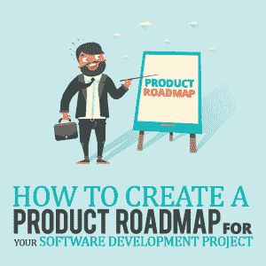
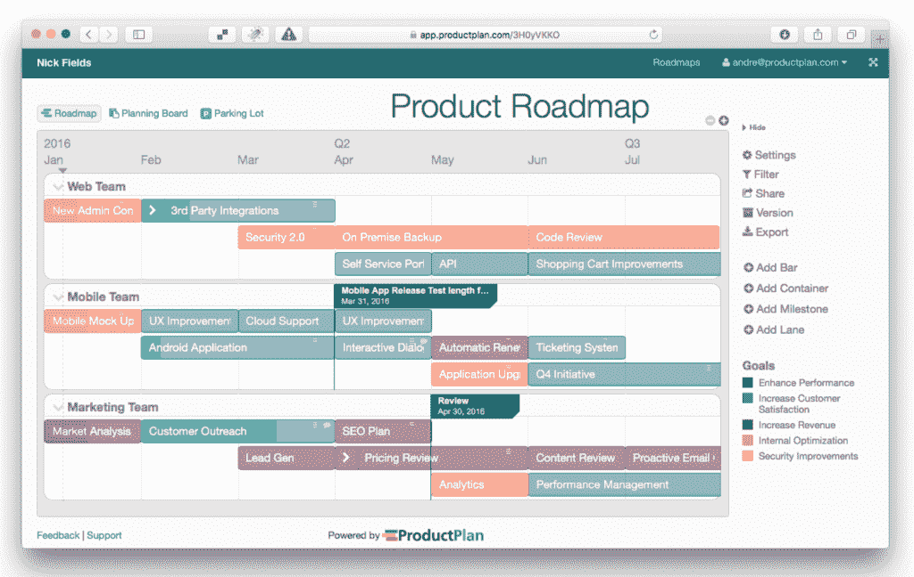

# 如何为您的软件开发项目创建产品路线图

> 原文:[https://simple programmer . com/product-roadmap-软件-开发-项目/](https://simpleprogrammer.com/product-roadmap-software-development-project/)

Many new products are launched every day with a focus on solving people’s problems.

公司努力更快地向市场推出产品，并成为其利基市场中的第一家。这给了他们相对于其他公司的竞争优势，也使他们能够利用先发优势。

然而，这并不容易。这是非常危险的，需要遵循很多步骤。当然，成功的关键驱动力往往是来自利益相关者的早期和持续的反馈、自动化测试和测试驱动的开发，但是你猜怎么着？

路线图是最重要的。

说实话，“路线图”、“里程碑”[“T1”、“产品负责人”](https://apiumhub.com/tech-blog-barcelona/software-project-milestone/)对我们来说都是比较新的词，仍然有很多人不确定它们是什么意思。

然而，[敏捷方法](https://simpleprogrammer.com/testing-metrics-agile-environment/)如今是成功产品发布的必备要素，因此了解什么是路线图、为什么路线图对敏捷项目管理如此重要、关键优势是什么，以及最重要的是，如何创建路线图的关键技巧是至关重要的。

## 什么是产品路线图？

在当今世界，跟踪进展、管理期望并让人们了解即将到来的行动和计划是极其重要的。

产品路线图是一个很好的工具，因为它是一个战略计划，描述了数字产品在未来一段时间内的可能发展。它支持产品的目标、愿景和优先级，并有助于保持利益相关者的一致。此外，它促进透明度，以管理客户的期望。

让我们更详细地看看什么是路线图。

路线图是帮助您的团队实现目标所需的行动的可视化。它就像是你业务的全球定位系统。它有助于团队中的每个人都清楚地了解您的愿景，创建一个详细的计划，其中包括短期和长期目标、使用特定技术解决方案实现这些目标的方法，以及对产品或解决方案如何随时间发展的预见。例如，产品所有者使用路线图来概述未来的产品功能以及新功能何时发布。

它给出了一个项目可交付成果的详细描述，以及在项目生命周期的特定时间预期会发生什么的清晰概述。它跟踪项目里程碑，并帮助[团队的协调和沟通](https://simpleprogrammer.com/developer-communication-skills/)。

## 如何创建产品管理路线图

好的，但是你如何创建一个，对吗？

让我们看看关键步骤:

### 1.宏观分析

看你公司的长期目标，愿景，大局，市场。在这里，你分析你的公司，思考下一个季度、六个月和一年的重点是什么，并决定你要把时间和资源花在哪里。

### 2.产品策略

在这个阶段，你应该考虑各种各样的问题，例如你的产品将实现的商业目标，什么样的客户将使用该产品，该产品将解决什么问题，可用的预算，截止日期，以及使该产品脱颖而出的主要产品差异。在这里，确保每个人都朝着相同的目标努力，并对项目有相同的愿景是绝对重要的。

### 3.项目计划定义

接下来，您定义项目是什么，并创建项目计划来指导项目的执行。所有行动都应与截止日期和里程碑一起描述。例如，我们来看一个移动应用项目的初始阶段:注册和登录将在 7 月 1 日完成，脸书集成将在 7 月 5 日完成，Whatsapp 集成将在 7 月 10 日完成，Instagram 集成将在 7 月 15 日完成，以此类推。有许多有用的工具来进行项目规划，其中一些将在本文的后面找到。

### 4.角色和职责

确定负责项目执行的人员以及积极参与产品路线图的关键利益相关者是绝对必要的。这个想法是每个人都知道谁对什么负责。

### 5.项目风险

风险管理部分总是非常重要，因为它实际上会影响你的截止日期。在这里，你列出了所有可能的问题，并提出了预防和解决这些问题的解决方案。

我给你举个例子。如果今天是 7 月 3 日，你需要在 7 月 5 日之前完成脸书整合，你可以清楚地看到你会迟到。因此，你需要有一个后备计划，它可以仅仅是增加参与项目的人数。

你的解决方案可以是向项目经理多要一个开发人员几天来加速这个过程。如果你提前建立一个备份计划，那么你可以非常有效地解决问题。如果你没有 B 计划，那么你可能无法按时交付功能。

### 6.生成路线图

范围、时间和资源都很清楚。现在，是时候实际创建路线图了。这时，您可以使用像吉拉或 ProductPlan 这样的工具来分析团队的速度，并根据小时数和天数来估计积压工作。主要想法是创建一个现实的预测供您使用。

要了解路线图的样子，请查看下面的示例:

[产品计划](https://www.productplan.com/)

### 7.确认

与您的团队分享您的路线图，并确保他们批准时间。有时候，人们完成任务的速度与你估计的不同。也许开发人员认为他们编写登录功能的时间比你想象的要长。营销人员也是利益相关者，也许三个月后会有一个重要的事件发生，你需要完成某些功能，这意味着你需要在一个团队中有更多的开发人员来满足最后期限。

### 8.改进

获得客户和利益相关者的反馈并持续改进。你总能做得更好。你可以通过组织回顾会议来获得利益相关者的反馈。至于客户，只需询问他们的意见，阅读评论，并创建调查。

## 路线图创建的顶级工具

如今，我们有工具来做任何事情，路线图的创建也不例外。
让我们来看看最好的和最受欢迎的:

### 1.啊哈！

超过 15 万公司领导使用 Aha！这是一个基于云的软件，帮助产品和公司的建设者将他们强大的战略与他们团队的工作联系起来，并创建可视化的路线图。现在，它是世界上最顶尖的产品路线图软件之一。他们的目标是帮助人们有信心地制造产品。

### 2.[产品计划](https://www.productplan.com/)

ProductPlan 是规划、构建和交流产品路线图的最简单的方法。它有助于将整个产品策略集中在一个地方，并提供一个月的免费试用。全球成千上万的产品所有者，如微软、星巴克和 Spotify，使用 ProductPlan 在整个组织中可视化和共享他们的产品策略。

### 3.[智能表](https://www.smartsheet.com/s/smartsheet-home?s=55&c=21&m=5500&a=223646311567&k=smartsheet&mtp=e&adp=1t1&net=g&dev=c&devm=&plc=&gclid=EAIaIQobChMIy8zW9rio2wIVXWQZCh28VAgTEAAYASAAEgINLPD_BwE)

Smartsheet 是一个基于云的项目管理平台，采用熟悉的电子表格布局。在表单中存储所有数据和文档并与团队成员直接协作非常容易。您还可以创建可定制的产品路线图并节省时间。Smartsheet 有一个名为“甘特图的功能优先级和路线图”的预建模板，可帮助您组织项目目标、即将推出的功能和附件。

### 4.[吉拉](https://www.atlassian.com/software/jira/portfolio/agile-roadmap-planning)

吉拉是由 Atlassian 开发的著名敏捷路线图规划工具。它提供了错误跟踪、问题跟踪和项目管理功能。对于 [Apiumhub](https://apiumhub.com/) ，我们使用吉拉，并且非常满意。一切都在一个地方。绝对是一个计划、跟踪和发布优秀软件的神奇工具。

## 创建路线图的好处

Can a company or a project “survive” without a roadmap? Yes, but will a project be delivered on time without a roadmap? And will it be exactly how you wanted it? That’s less likely. A product roadmap helps product owners launch a product with the right functionalities and optimal costs on time because it:

*   设定目标，并传达在接下来的几周和几个月中应该如何开发产品。
*   有助于确定功能优先级，这对于确保您的团队在正确的时间尽可能高效地处理正确的事情，而不会在可能阻碍流程的事情上浪费时间是非常重要的。
*   将业务战略和市场数据与产品和技术决策联系起来。
*   揭示产品和技术计划中的差距。
*   帮助设定现实的时间表和正确的里程碑。
*   降低风险。
*   增强项目对所有风险承担者的可见性，并改善沟通。因为它对每个人都可用，所以它确保每个人都在同一页面上，并使一切都在控制之下。

根据我们的经验，我们确信产品路线图是高效软件开发和成功产品发布的必要条件。在我们的案例中，路线图帮助我们专注于正确的事情，创建敏捷的生态系统，满足截止日期，并让我们的利益相关者满意。希望对你也有帮助！