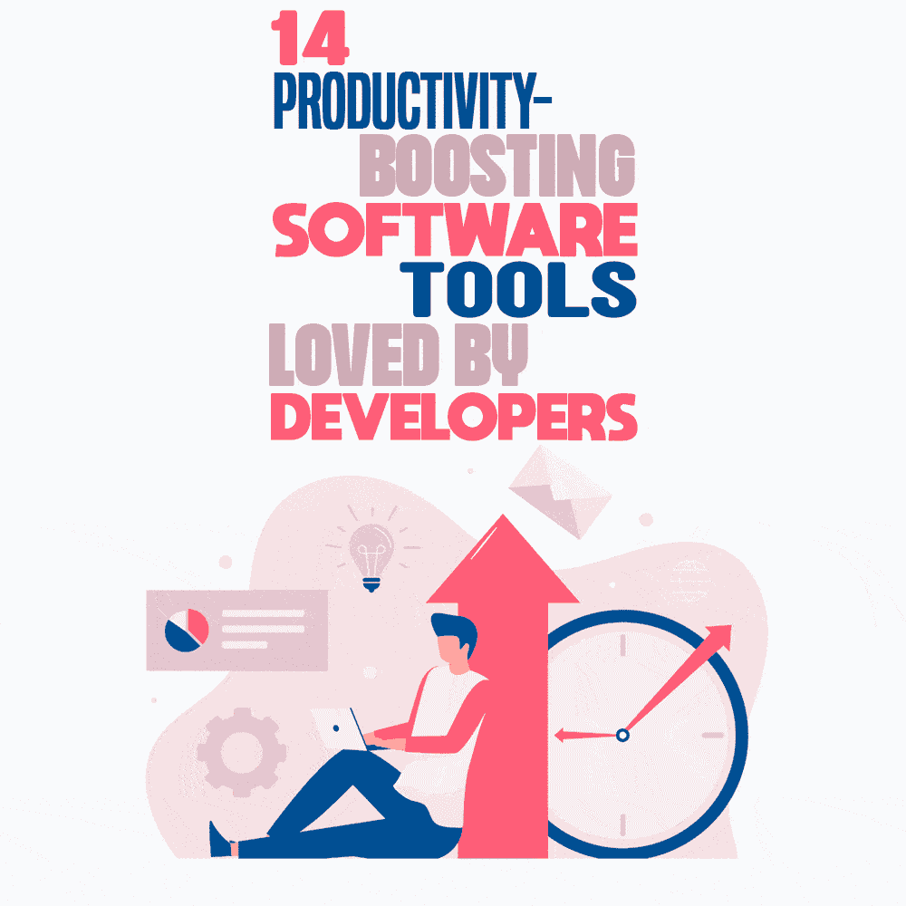

# 开发人员喜爱的 14 种提高生产力的软件工具

> 原文：<https://simpleprogrammer.com/productivity-boosting-software-tools/>

As any programmer at the heart of a digital product can tell you, not only do they need to be able to concentrate and focus on writing, testing, and executing code, they also need software that allows them to collaborate and communicate seamlessly with the rest of the team. No developer wants to be dealing with frustrating, buggy software that’s more of a hindrance than a help.

考虑到这一点，程序员可能比其他任何人都更清楚什么是热门软件，什么不是。

在 [Timetastic](https://timetastic.us/) 这里，我们不断发现新的工具和应用程序[帮助我们的程序员更有效率](https://simpleprogrammer.com/productivity-for-busy-developers/)并成为更好的程序员。像所有开发人员一样，我的团队喜欢测试新产品，所以我问他们在过去的 12 个月里他们最喜欢的发现是什么。我正在与你分享他们的答案，这样你也许可以自己发现一个新宠。

## 首席技术官 Matt Roberts

我先从我们的 CTO(首席技术官)Matt Roberts 说起。作为我的联合创始人，Matt 从一开始就和我在一起，除了在 Timetastic 编写代码之外，他还帮助决定我们添加什么功能以及我们在 Timetastic 采取的总体方向。

Matt 痴迷于编码，学习新的语言和技术。他从制作简单、实用、对他人有益的东西中获得了极大的乐趣。以下是他最喜欢的应用——注意，作为一个 [Mac](https://www.amazon.com/Apple-MD760LL-13-3-Inch-Dual-Core-Bluetooth/dp/B01LZORCUR/ref=sr_1_3?crid=11NCWWPLA9O1P&keywords=mac&qid=1648477025&sprefix=ma%2Caps%2C164&sr=8-3) 用户，这个列表包括了 macOS 独有的应用。

### 光线投射

对于任何在 Mac 上使用过 Alfred 的人来说， [Raycast](https://www.raycast.com/) 可能看起来很熟悉。乍一看，它有点像 Alfred，事实上，有点像 Spotlight，但 Raycast 远不止如此。您可以使用它来快速启动应用程序，运行脚本，并将应用程序放置在屏幕上预定义的位置。

你可以运行系统命令，它有一个内置的剪贴板管理器。一旦你设置好了，并意识到你可以保存你的剪贴板历史，并从中取回东西，你会想没有它你是怎么做到的。

它也比 Alfred 好，因为它免费、更快、更容易定制，可以做各种各样很酷的事情。

### 更好的触摸工具

更好的触摸工具是一个完全的瑞士军用工具，解释它不做什么比解释它做什么更容易。这个工具是作为一种完全定制你的触摸条的方式出现的，如果你的 Mac 有触摸条的话，它已经发展成了多种个性化你的 Mac 和增强其功能的方式。

这个软件中我最喜欢的是增加了自定义滑动手势。这个内置的窗口管理器允许我轻松地将应用程序发送到屏幕的左侧/右侧/中央，它的文本扩展能力(像 Espanso)，重新映射键盘的能力，以及 notch new Macs 周围的可定制区域。它是一个美人。

### 手

出于一些原因，我想摆脱邮递员，结果发现了[爪子](https://paw.cloud/client)。该软件是 Mac 专用的，是一个漂亮的 API 客户端，允许你像 Postman 一样建立 API 调用集，但没有任何臃肿。它最适合创建一组带有有意义描述的定义好的 API 调用，而不仅仅是一个临时使用的工具。

### DevUtils

DevUtils 有很多不错的方便的离线工具，比如正则表达式测试器、json 格式化器、base64 en/解码器，所有这些都在一个漂亮简单的应用程序中，它会一直在你的任务栏中，直到你需要它。当你需要谷歌搜索“正则表达式测试者”之类的东西时，它可以帮你节省时间。

### 干净镜头 X

Cleanshot X 绝对是在 Mac 上截图和录制视频的游戏规则改变者——当你想与同事分享进展时，它是完美的选择。该程序集成得如此之好，它取代了内置的快捷方式，所以你可以编辑你的截图，并对其进行注释。另外，它在录制视频方面也很棒。

## 开发商 Gareth Terrace

Gareth has been with us for five years, and alongside his app development role, he takes on technical bits of the website and deals with the security side of Timetastic. In short, he’s a  tech and engineering tinkerer at heart who likes a spot of woodwork or a fight with home automation.

当我问他最喜欢的工具时，Gareth 说他更喜欢远离人们经常使用的大工具——例如，VS code、Sublime text 或 Cloudflare。这是他的最爱。

### 失眠休息客户

Postman 曾经是模拟和测试 HTTP 调用或使用第三方 API 进行任何工作的黄金标准。然而，它变得臃肿，没有帐户也不简单易用。

[失眠休息客户端](https://insomnia.rest/)带回了邮递员的简单和轻松。它有一个很好的黑色主题，一个非常容易使用的用户界面，它不碍事。至少现在，它让你可以继续测试你的端点，而不是试图导航应用程序来这样做。

### 祭

Omatsuri 是一个基于网络的工具集合，用来做你有时需要在网络应用前端做的事情:压缩 SVG、base64 编码、生成渐变等。设计精美，易于使用，优雅的工具，做一件事，并把它做好。它也是[开源的](https://www.amazon.com/Working-Public-Making-Maintenance-Software/dp/0578675862/ref=sr_1_1?crid=QKV1BQ1NVEZ2&keywords=open+source&qid=1648477104&sprefix=open+source%2Caps%2C159&sr=8-1)，所以它应该随着技术的变化保持最新和相关。

### 顺序

登录你的应用程序开始是一件“很好的事情”,随着你的成长，它很快成为一个必不可少的“为什么会发生这种事情”的工具。几年前，我们改用 Serilog 记录日志，用 [Seq](https://datalust.co/seq) 查看日志，这非常简单。它有真正强大和快速的搜索，它可以处理任何生产日志负载没有落后。

设置 Serilog 的“接收器”,这样你就可以把你的日志输出发送到你最需要的地方。将开发数据输出到控制台，将生产数据输出到 Seq，这样您就可以很好地跟踪本地和生产中的 bug、错误和问题。

我们大多数人也有一个本地 Seq 实例，所以我们可以查看历史开发日志。

由于 [Log4j 漏洞](https://en.wikipedia.org/wiki/Log4Shell)，日志记录最近得到了很多关注，Seq 已经在生产中一次又一次地证明了自己，而我们已经调查了从性能到奇怪的并发错误到简单的浏览器问题的一切。

实时跟踪系统上的所有活动至关重要。我参与的任何新项目都将使用 Seq。

### Windows 电动玩具/开发玩具

微软 PowerToys 为你提供了一些漂亮、易用的工具，用于文件重命名、窗口重新排列、挑选颜色等等。如果你是一个 Windows 高级用户——如果你是一个开发人员，那么你就是——使用这个软件。

还有 [DevToys](https://github.com/veler/DevToys) 有更具体的基于开发的工具，所以你可以测试正则表达式，转换和编码网址，JWT 和 Base64。对于那些你偶尔需要做一次但永远找不到你一年前谷歌过的“像样的工具”的一次性工作，这或多或少都是一站式的。

## 乔·汉弗瑞，开发者

最后但绝对不是最不重要的，我们有一个时代周刊的新成员，乔·汉弗瑞。Jo 于 11 月加入了 Timetastic 团队，主要从事网络和移动应用的前端工作。以下是乔最喜欢的工具。

### Flameshot

[Flameshot](https://flameshot.org/) 是一款截图并在分享前进行编辑的工具。我喜欢它，因为它在加载时启动，所以它只是潜伏在我的工具栏中，直到我需要调用它，它简单/直观，但也充满了功能。

我主要用它来截取我屏幕上的一小块区域，突出显示其中的一部分(或者画一个箭头)，然后把它复制到我的剪贴板上，以便立即粘贴到其他地方，比如 Basecamp 或 Slack。

这比全屏捕捉然后手动编辑要好得多。它也是开源的，这总是一个额外的好处。

### 展开的

Espanso 是一个文本扩展工具，也就是说，它会监听键盘快捷键，然后用你事先准备好的更长的文本替换这个神奇的单词。它也可以比这更强大，例如，动态插入当前日期，或者你可以添加包，使添加表情符号变得非常容易。这是一种简洁的方式，可以在其他地方使用可能仅限于终端的代码别名。

它是跨平台的，所以它可以在浏览器、文字编辑器、终端等中工作。我用它来减少我经常输入的东西，比如 git 命令、电子邮件的落款等等。还是那句话，是开源的！

### 编号书签

[编号书签](https://marketplace.visualstudio.com/items?itemName=alefragnani.numbered-bookmarks)是 VSCode 扩展，很棒！你可以通过 Ctrl+Shift+ <数字键>将书签放到不同的代码行上，然后使用 Ctrl+ <数字键>在它们之间快速导航。

它们色彩鲜艳，易于使用，节省了在常用文件间滚动的大量时间。

### 流行音乐

It’s probably worth mentioning [Pop](https://pop.com/), that us developers have started using a lot. It's high-quality video, easy to use, and has cool features like drawing on each others' screens, whiteboard, and taking control of someone else's screen.

我们在 Timetastic 使用它进行技术聊天和结对编程类型的任务。我也开始在空闲时间用它来代替社交 Zoom 聊天，因为它没有 40 分钟的限制，而且是免费的！

它对与祖父母聊天也很有用，因为他们不需要安装任何东西或有一个帐户——你只需分享一个浏览器链接。

## 更好编程的好工具

正如你所看到的，有很多工具可以让你的编程团队[保持高效](https://simpleprogrammer.com/improve-remote-software-engineers-productivity/)，保持联系，并顺畅地一起工作。正如我在开头所说的，程序员需要能够集中注意力。要做到这一点，他们需要合适的工具。除了程序员自己，还有谁能更好地为程序员推荐工具呢？

非常感谢 Jo、Gareth 和 Matt 在百忙之中抽出时间让我了解他们当前最喜欢的工具和应用。