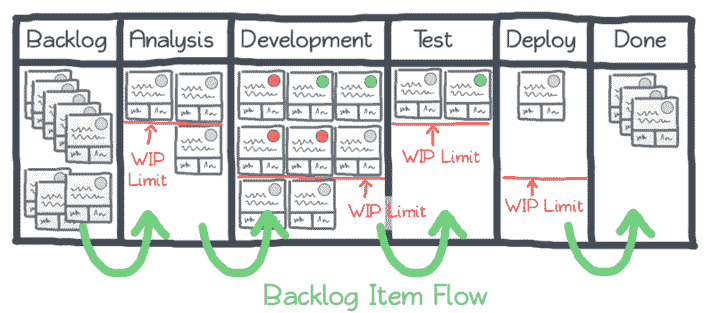

# 开发人员的 13 个高效技巧

> 原文：<https://simpleprogrammer.com/productivity-for-busy-developers/>

伟大的生产力是你作为一名开发人员所能拥有的最好的软技能之一。

我已经用这些技巧快速制作课程、写书、开发应用程序、网站&数码产品。

下面你将学到 13 个实际有效的程序员生产率技巧。

制定一个实施这些建议的计划，你将能够实现你的产出。

## 使用这些高级开发人员生产力技巧，事半功倍

**软件工程师和首席开发人员需要额外的生产力**

作为一名软件工程师，你每天必须处理许多不同的任务。你也负有很大的责任。这意味着你需要+的生产力来完成每件事，并确保你让老板、同事和客户满意。

### 1.别浪费时间了

T3】

普通办公室职员每周浪费的时间超过八个小时。

如果你能收回这些时间，用它来更快地完成你的编码项目，会怎么样？

拖延症可能有不同的原因。但最终还是要克服阻力(史蒂文·普雷斯菲尔德称之为“T1”)，不管你感觉如何，都要努力工作。

使用下面的建议给你一个对抗拖延症的策略。

### 2.防止不必要的任务切换

假设您刚刚完成了一项困难的编码任务。你的头着火了；但是接下来还有一项艰巨的任务。

你全力以赴，但过了一会儿，你说“嗯，这个其实没那么急；我等会儿再谈。”然后你开始做一些更容易的事情，因为你已经精疲力尽了。

几个小时后，你回到任务中，但是你感到非常困惑，因为你不记得你应该做什么。这意味着你现在需要花一些额外的时间回到正轨。

这是[上下文切换](https://simpleprogrammer.com/context-switching/)的一个例子，作为程序员，这可能会降低你的工作效率。

由美国心理学协会进行的一项研究显示，任务之间的转换会产生精神障碍，这会耗费你 40%的生产力。

### 3.激光-将您的努力集中在 WIP 限制上

图片来源:leanguru.com

工作进度限制将帮助你战胜压力，确保更高质量的工作。

如果你有多个项目正在进行，你需要为项目 A 等待一些东西，从项目 b 开始可能很诱人，但最终，这将导致你同时处理所有项目:你将不断地切换任务。

为了防止生产力障碍的发生，你应该限制你一次处理的工作项目的数量。

限制正在进行的工作有可能通过减慢你自己的速度来加快你的工作。

如果你能在三天内处理四个任务，那么在这个特定的时间段内，你的 WIP 限制就是四个。从这里开始，你可以把这些信息作为经验法则，防止自己负担过重。

### 4.使用适合您工作的管理工具进行控制

[https://www.youtube.com/embed/W9k0OhJkjQ0](https://www.youtube.com/embed/W9k0OhJkjQ0)

据 186 名参与者报告，陷入问题解决是开发人员不快乐的最常见原因。

排在第二位的是时间压力，152 名参与者称时间压力让他们在工作中不开心。

你可以通过安排你的任务和管理好你的时间来缓解这种压力。

有不同的[工具可以帮助你管理你作为一个程序员的时间](https://simpleprogrammer.com/time-management-apps/)以及[你在不同领域的工作流程，比如网络开发](https://simpleprogrammer.com/7-tools-improve-web-development-workflow/)。

我使用 KanBanFlow 来安排我的每周和每天的任务。我喜欢它有一个集成的番茄定时器。

## 提高编码效率的关键技巧

### 5.番茄提高生产力

番茄工作法很简单。

您设置了一个计时器，它有专门的工作时段和专门的休息时段。基本设置是工作 25 分钟到休息 5 分钟。总计达半小时。你完成四个 30 分钟的周期，然后休息一段时间，重新开始。

[番茄工作法最适合那些很难专注于工作或试图进入良好工作节奏以满足最后期限的程序员](https://simpleprogrammer.com/some-questions-about-the-pomodoro-technique/),他们会专门休息以避免筋疲力尽。您可以完全优化时间段以适应您的工作。

### 6.使用代码片段

作为一名初学程序员，我建议你尝试自己编写所有的代码——以确保你已经学会了如何去做。如果你已经很精通了，那么去谷歌上找一些其他人的代码片段，并把它们包含在你的程序中也没有什么坏处。

如果你这样做，你可以大大加快这个过程。当然，我们这里说的是复制片段，不是整个程序。并且始终确保你理解你刚刚复制的内容。

你——或者其他使用你代码的人——应该能够回过头来看它，并且仍然能够理解它。

### 7.避免代码混乱

基于这个观点，[在工作中遵循干净的代码原则](https://simpleprogrammer.com/clean-code-principles-better-programmer/)也会让你更有效率:

*   筛选杂乱的代码会减少你浪费的时间
*   你就不会有那么多需要修复的错误了
*   你将更快地完成每个项目，并为下一个项目做好准备——压力更小

### 8.使用最好的软件工具

为程序员获得最佳的[生产力提升软件工具](https://simpleprogrammer.com/productivity-boosting-software-tools/)来帮助自己更快更有效地工作。一个例子是[银搜索器](https://github.com/ggreer/the_silver_searcher)，一个帮助你筛选代码的应用程序。

将软件开发到部署可能是一个复杂的过程，包含许多单一的任务。对于这些任务中的大多数，有工具可以批量处理它们，或者使它们变得不那么费力。

如果你想在开发软件时更有效率，这些可能是天赐之物。

### 9.学会闪电般地打字

> 当你是一个快速高效的打字员时，你花在思考和用代码表达之间的时间会更少。

这是杰夫·阿特伍德在他 2008 年的博客文章中所说的“我们首先是打字员，其次是程序员”

更快地将代码从大脑中取出。在更短的时间内产生更多的代码。如果你还不是一个快速打字的人，在这方面努力是值得的。

### 10.从数字干扰中排毒

当你开始一个重要的编码项目时，关掉你的手机。放在你不容易够到的地方。

如果你经常发现自己注意力不集中，随意打开网站或社交媒体应用——在你做项目的时候屏蔽掉它们。尽可能地专注于你的工作。随着时间的推移会变得更容易。当你开始感到筋疲力尽时，不要屈服于随意浏览互联网的冲动。

取而代之的是真正的休息。

## 如何成为一名高效的程序员(&保持健康)

### 11.进行有成效的休息

如果你经常真正休息，你会成为一个更有效率的程序员。什么是真正的突破？

*   你从椅子上站起来
*   你四处走动
*   你深呼吸
*   你出去呼吸新鲜空气
*   你闭上眼睛让他们休息一下

### 12.保持敏锐——精神上和身体上

健全的精神寓于健康的身体。老生常谈是真的。

作为一名开发人员，请注意你的健康状况，你将获得解决棘手问题的清晰思维，长时间编程的精力，如果需要的话，还会获得长时间无痛苦静坐的力量。

### 13.避免倦怠

在你追求尽可能多产的过程中，不要让自己陷入困境。遵循我们列出的建议——安排你的任务，设置限制，消除能量消耗，休息足够的时间——你将[避免开发人员精疲力竭](https://simpleprogrammer.com/programmer-burnout/)。

警告:如果你的工作量不是很大，但你仍然连续几周没有动力，问题不在于工作量，而可能在于你现在正在做的项目或工作的类型。

## 您迈向卓越生产力的下一步

我邀请你来看看我的免费电子书《软件开发人员的最佳性能习惯》。

它教你我用来成为 7 位数开发者的 7 个简单习惯: