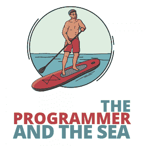

# 程序员和大海

> 原文：<https://simpleprogrammer.com/programmer-and-sea/>

Learning to code is a journey. Recently, on a trip to Morro Bay, California, my wife and I went stand-up paddleboarding, and I noticed a lot of similarities between paddleboarding and programming. So, the rest of this article is a metaphor for the developer journey.

为了清楚起见，我用参考数字标记了一些关键的相似之处。最后，这些参考数字中的每一个都有一个简短、具体的描述，说明每个隐喻背后的思想。当然，像所有(希望如此)好的文学作品一样，部分价值在于读者带来的独特体验。我非常鼓励你将其他相似之处与你自己的生活联系起来，并分享它们。

* * *

当我们走下港口时，一些当地人已经在水上了。这是美好的一天；太阳出来了，海湾像玻璃一样光滑。他们四处滑行，穿梭于停泊的船只之间，优雅而轻松地划动着。

他们是[站立式桨板](https://en.wikipedia.org/wiki/Paddleboarding)。从根本上说，桨板是一个更大、更平的冲浪板，你可以站在上面，用一个长的类似皮艇的桨来荡来荡去，进行运动或放松。

我们眺望海湾，看着所有在周围忙碌的人们。有些有简单漂亮的木板。有些人有看起来非常复杂的设置，定制的桨，和特别花哨的装备——看着这些人，我甚至不确定我是否能够开始。看起来我们需要的东西太多了，我们需要知道的东西太多了。很难不被吓倒。

尽管如此，它看起来还是很有趣，所以我们去了海滨，去了我们以前用过的皮划艇和桨板租赁处。我本不需要担心没有起步所需的东西。

那里的人们习惯于和我们这样的人打交道:充满激情和干劲，却缺乏任何知识和技能。在签署了几份弃权书后，他们给了我们一份技能和知识的快速纲要，我们需要这些技能和知识来保持我们的安全、快乐和干燥。(2)

最重要的是，他们和我们交谈时就像我们是初学者一样，他们不期望我们知道任何事情。"看到那边的浮标了吗？"出租向导指着水面问。“看到它是怎么得到数字 12 的了吗？数字向右增加。不要走过红色的，否则会变得危险。数字向左递减。不要超过八点，否则你就有陷入泥沼的危险，一点乐趣都没有。看到我们头顶上的红色屋顶了吗？那是家。如果你迷路了或者害怕了，你可以随时回来找我们。”我很惊讶听到这个消息是多么令人欣慰。

本质上，他们在说，“你在做新的东西。困惑、迷失方向或害怕是很自然的。如果一切都失败了，你可以去一个安全的地方。”拥有那个逃生出口是至关重要的，大大减少了我的焦虑感。

他们给我们提供了救生衣，一个防水袋，用来装我们的东西，木板和桨；保持我们的董事会稳定；帮助我们在水上行走。(3)

Fun fact: water is *really* squishy. It’s not *nearly* as solid as dry land. When there’s no helpful guide holding your paddleboard steady, you realize that keeping everything stable becomes *your* job. As my board began wobbling like hundreds of crazed kamikaze fish were battering the underside, my first instinct was to stare at my feet and will them to stillness. This worked, kind of. (4)

我取得了表面上的稳定，但我身上的每一块肌肉都完全绷紧了，我很快就开始抽筋。这不是答应给我的放松、冥想的航海活动。最重要的是，我意识到我忘了划桨，而微弱的水流正带着我离开。(5)

我美丽的圣女般的妻子呼唤着我，将我从螺旋中拉了出来。“加油！”她喊道，挥手，因为她平静地从我身边 scooted 像一个优雅的海洋公主。这实际上真的很有帮助，因为它给了我一个专注于实现的目标，而不是只关注我在这个新的未知领域有多不舒服。

我试探性地将我的桨浸入水中，不时地交换位置。当我开始划桨并找到节奏时，我想起了 Rock Kayak 的人给我们的训练。我开始逆潮流而动，跟着老婆。

当我专注于划水时，我的冲浪板也开始有节奏地运动，随着海浪和我的动作自然地摇摆。没有更多疯狂的摇摆！整整一天，我慢慢意识到这个概念是相对普遍的:我越专注于远处的事物，比如风景和我的总体目标，我的动作就变得越自然，划水就越有效率。

对我来说，把我的固定目标变成移动目标的潮流不是问题。第二，我关注的是细节问题——我这样做对吗？一个大浪来了！珍妮比我走得快吗？事情变得不稳定、紧张、没有成效。(6)

在我掌握了静止不动和划水的复杂艺术后不久，一个新的问题出现了:我的脚开始抽筋。我的思维又开始加速了。我该怎么办？我在水中央。这不像是我可以走到陆地上休息我可怜的脚！我不可能就这样跪在黑板上…哦。

事实证明，在冲浪板上，从站立位置跪下或坐下是相当容易的。

我可能看起来不像是最酷的冲浪手。我可能比珍妮走得慢一点。但是我仍然能够继续前进，同时保持我的精神和脚的健康。这并不可耻。(7)

那天早上，我多次从站立过渡到跪下，知道我可以做到这一点给了我另一个逃生出口，大大提高了我的乐趣。

既然眼前的紧急情况都处理好了，我开始了一次真正令人惊异的、禅宗般的体验。我四处划桨，享受阳光和海洋，咸咸的浪花的味道，还有港口的声音。我向正在晒太阳的几只海豹和漂浮在周围的几只水獭问好。这个是我被许诺的放松、冥想的活动。我肯定还会这么做。就在那时，我得到了最重要的启示。

为什么我这么担心会掉进去？

这无疑是发生在我身上最糟糕的事情。然而，水没有那么冷，我的手机和钱包都塞在防水袋里，我穿着救生衣，最重要的是，我知道如何游泳。*哦耶*，*没错。我从小学就开始游泳*。(8)

在我所有的恐慌和螺旋上升中，我已经忘记了我在生活的其他部分发展的所有其他技能和应对机制。我从未经历过任何真正的危险——至少，只经历过淋湿和有点冷的危险。也许我会有一段时间闻起来像鱼。但我肯定不会死！

On top of that, I realized there was no one out here that actively wanted me to fall in (maybe besides Jenny, and then only with love and the desire to laugh at me looking silly). In fact, were I to ever be in any *real* trouble, everyone out on that bay would immediately rush to my aid. I had been too busy looking at all of the things that could go wrong to consider the vast safety net that was available to me if I needed it.(9)

就这样，我们结束了在水上的剩余时间，平静地享受着彼此的陪伴和大海的温柔起伏:珍妮熟练地进出船只，而我，愚蠢但善意，幸存下来并享受着我一生的时光。

我向任何感兴趣的人强烈推荐它(并且在一片好的水域附近)，我很乐意带任何想去的人去，分享我新发现的智慧，因为我知道他们也会喜欢它。要成为一名伟大的划桨手，我还有很多东西要学，还有很长的路要走，但我确实认为自己是一名划桨手，我为自己是一名划桨手而自豪。

* * *

1.)编程界有很多工具。复杂的构建过程，精心设计的编辑器，以及配置文件！哦，配置文件！特别是对于一个初学者来说，弄清楚需要什么是令人生畏的。什么是合适的工具？什么是正确的做事方式？人们很容易忘记重要的事情是开始行动。学习和工具会在你需要的时候出现。

2.)导师可以以多种不同的形式出现。当然，还有更传统的老师，比如高中和大学的教授以及训练营的负责人，但是网上留言板上的一个人或者有一点经验的同事也可以是一个很好的导师。重要的是，它们帮助你变得高效和安全，并推动你成长。

3.)导师对于[学习如何编程](https://simpleprogrammer.com/speed-up-learning-software-developer/)至关重要，最优秀的导师知道学习需要是一个具有挑战性但*100%安全*的经历——至少在开始的时候。

导师的工作是确保学员知道他们需要知道什么才能进步和安全，以及如果他们感到困惑如何寻求帮助。没有这个“安全网”，学习者很容易迷失和困惑，最终放弃。

4.)虽然像大学、学徒或新兵训练营这样的学习空间相对来说没有什么实际后果，但当你第一次独自一人、从事自己的项目或从事第一份工作时，训练的轮子就会脱落。你的行为会产生真正的后果，你的错误会影响成百上千的人。可以理解，这很可怕。

5.)作为一名新程序员，有很多事情要做:学习所有需要学习的东西，整理你的作品集，宣传你的个人品牌，等等。让事情变得更加困难的是，这个行业正在快速发展，让你的学习成为一个移动的目标。如果你停滞不前，那么你就落后了！这是可以理解的压力。

6.)不要太专注于现在发生的事情。不要担心你是否和其他人进步得一样快。不要担心你是否正在以“错误的方式”做这个或那个小编码。专注于目标。如果你的目标是在一家大型科技公司找到一份工作，那么在你工作的时候，一定要记住这一点。如果你的目标是教书，那就让你所做的一切都符合这个目标。

一个常见的山地自行车技巧是看看你想去哪里。如果你盯着那块大石头，你就会撞到那块大石头。这同样适用于科技领域。这将有助于防止你筋疲力尽，并帮助你度过一路上的小坎坷和问题。

7.) It is OK if you need to take a break. Burnout is real, and it is powerful. No matter what, your physical and mental health should come before any deadline, boss’s mandate, or performance review. If anyone tells you otherwise, they don’t have your best interests at heart. Full stop.

8.)当事情变得疯狂时，尤其是在一个你总是在学习并发现你*不*知道多少的行业，重要的是要记住*你确实知道一些事情*。记住你已经练习过的，尽你所能为自己的成功做准备，并将失败的后果最小化。

目标是提前计划并利用你的知识，这样当你问自己，“最坏的情况会是什么？”答案没那么可怕。不确定您的代码是否会中断生产？写一些测试。让一位同事看一下。运行它。打算要求升职？做你的研究。弄清楚什么是合理的加薪。记录下你做过的所有好事和额外工作。记住你拥有的技能。

9.)这是对#7 的补充。建立一个支持网络。找到爱你的人，会让你振作起来，希望你成功。然后，当事情变得困难时，依靠他们。如果你失败了，他们会支持你的。别忘了这意味着你也需要在他们身边！