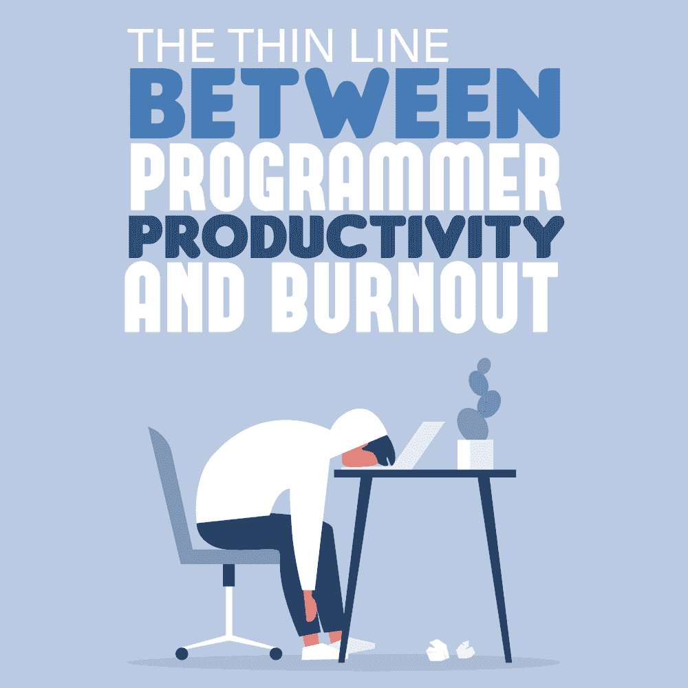
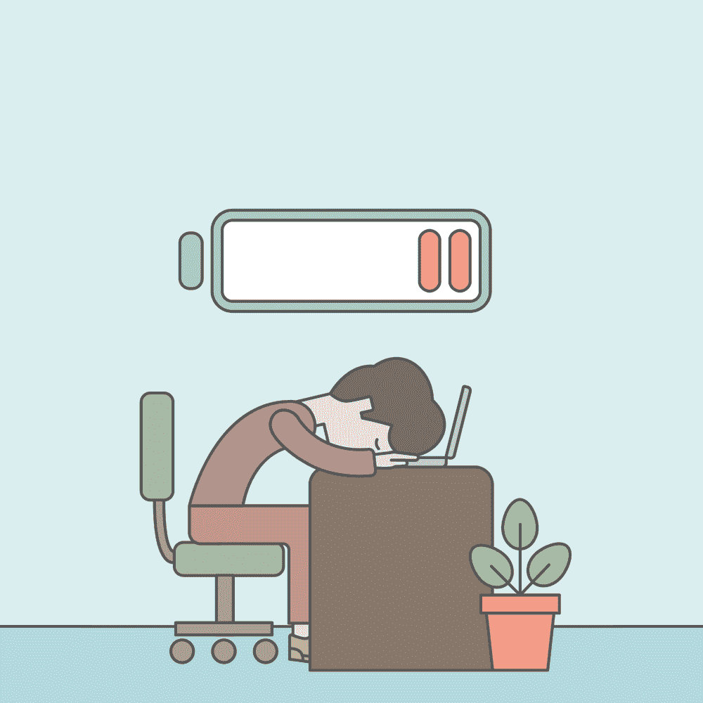
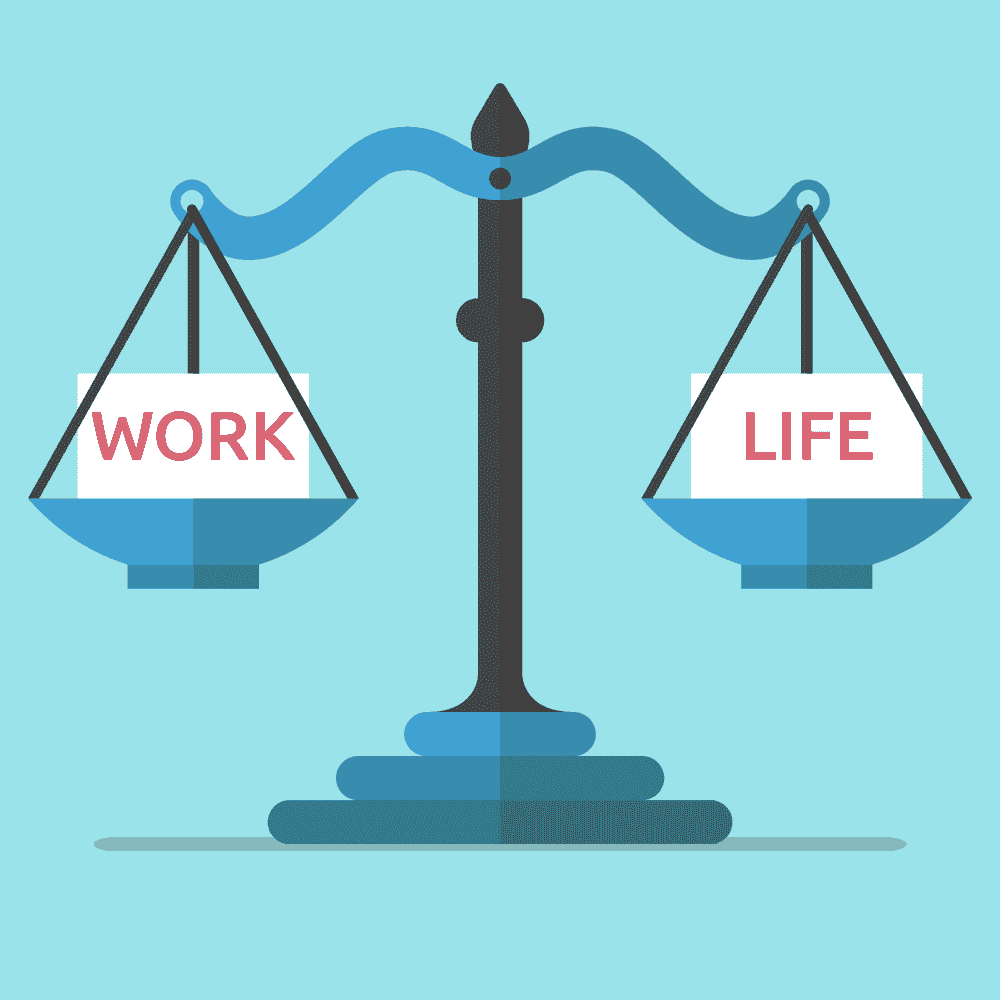

# 程序员生产力和倦怠之间的细微差别

> 原文：<https://simpleprogrammer.com/programmer-burnout-2/>

<figure class="alignright size-large is-resized">

</figure>

我们都希望工作富有成效。我们希望取得更多的成就，我们享受不断超越我们前方里程碑的成长感。看到检查过的待办事项列表，在截止日期前完成任务，当我们一次又一次地提供高质量的工作时受到鼓励，这种感觉简直太棒了。

然而，从我在一家 java 开发公司工作的经历来看，我知道生产力离筋疲力尽只有一线之遥。作为一名程序员，你不仅要推出有需求的产品，还要跟踪任何可能改变项目发展方向的更新。

虽然这是工作描述的一部分，但是程序员和其他人一样需要休息！如果你聪明地对待你的工作，你可以建立健康的习惯，这对你的整体精神或身体健康没有危险。

现在，有许多开发人员带着热情工作。他们喜欢参与一个一个项目地建设未来的行业，尤其是考虑到技术对每个社会成员日常生活的影响！

当然，拥有普遍良好的工作条件和有竞争力的薪水不会伤害人们在 IT 行业工作的愿望。毕竟，成就感加上保持既定生活方式的需要是让这么多人每天都去工作的主要驱动力。

## 为什么人们喜欢高效积极地工作

众所周知，每当我们完成一项小任务时，我们的大脑就会释放出多巴胺的峰值[。这种激素被称为“感觉良好”的激素，是快乐和暂时幸福的源泉。](https://www.entrepreneur.com/article/225356) 

大脑将这个动作与多巴胺尖峰联系起来，有效地建立了重复执行相同动作的习惯，以试图获得下一剂多巴胺和一种立即被认可的感觉。作为重复行为的结果，寻求瞬间快乐的自动反应实际上对人类来说是高度上瘾的。你越多地用这种练习来培养有成效的习惯，你的大脑就会越多地去寻找它——用同样的练习你会得到越多的结果。

## 随着时间的推移,*生产力*如何发展成*倦怠*

有许多关于如何更有效率和充分利用每一天的有用提示。改变你的心态以获得更好的结果是你能为你的职业生涯做的最好的事情之一。

然而，你应该意识到，由于你经历的上瘾效应，当你让自己陷入巨大的*倦怠时，很容易不被注意到。*

### 倦怠到底是什么？

定义:*由于在困难或苛刻的条件下工作而产生的压力，导致身体和情绪疲惫的感觉。倦怠之后会出现慢性疲劳、易怒多疑、易感冒、头痛和发烧等症状。*

根据定义，倦怠会对你的整体身心健康产生严重的负面影响。它的程度取决于你在压力下工作的时间长短。为了保护自己，你需要后退一步，评估一下你是否有这些症状:

*   **失去目标感—**你热爱的工作似乎不再像过去那样有意义。

*   感到身心俱疲——当你觉得简单的事情变得越来越难做时，通常会出现这种情况。你突然执行的每一项任务和行动都比以前更困难了——从刷牙到及时出门赶合适的公交车。完成同样的任务需要更多的时间，不管它看起来有多简单。

*   经历情绪波动、易怒和急躁——你可能会发现自己很容易被通常不会对你产生太大影响的事情所困扰，或者你会不理智地抨击你所爱的人和同事。这也可能导致你对曾经充满热情的事情产生情感上的疏离。

*   **难以兑现承诺**——你开始上班迟到；你忘记了一个重要的会议。你要么不计划与人会面，要么在最后一刻放弃。有时，你可能完全忘记了一个承诺，根本没有出现或通知对方。或者，如果你履行了你的义务，你很难成为社会交往的一部分，并且这种经历不会导致预期的结果。

*   经常生病——精疲力竭不仅会影响你的精神，还会降低你的免疫系统，让你更容易生病。这会导致你需要越来越多的病假。

*   **工作表现不佳**——你可能会经历所谓的大脑模糊和无法集中注意力。经常伴随着一种你的努力没有得到赏识的感觉，你可能会变得与同事们疏远，并且完全避免社交活动。

*   经历睡眠剥夺、焦虑和沮丧的人生观——无法入睡或早上难以醒来并开始新的一天也是增加脑雾的一个因素。感到绝望，以及看不到你所拥有的机会，是经历倦怠的人常见的现象。

### 为什么我们没有及时注意到呢？

<figure class="alignright size-large is-resized">

</figure>

所有的副作用都很严重，所以我们怎么可能没有注意到倦怠的发生呢？往往，倦怠会随着时间的推移而增加。一开始，我感到有点累，决定不参加周五的家庭聚餐。随着时间的推移，病情的严重性及其症状会慢慢增加，直至难以克服。

我们如何强迫自己进入对健康有害的状态？如前所述，我们的大脑喜欢多巴胺，并积极寻找导致峰值的行动。然而，这使得我们很容易在没有注意到的情况下过度包装我们的时间表和待办事项清单。你每天的日程安排越多，你对自己的期望就越大。

与此同时，你养成了一种习惯，把压倒自己作为新的常态:

*   你一个晚上在办公室加班变成了一周两三次。
*   周末的快速邮件检查变成了每隔一周工作几个小时。
*   有些周末你开始工作几个小时，然后每个周末，等等。

通过这样做，你迫使你的大脑和身体长时间持续超负荷工作，超过了它准备好的承受能力——这一切都是为了完成另一项任务，获得多巴胺激增，以及成就感！

精疲力竭很容易导致工作压力，进而对你的健康产生严重的负面影响。在一天结束的时候，没有什么值得你拿自己的健康去冒险！

我建议找到一个中间立场。当你收到需要休息的信号时，学会倾听你的身体和大脑。与此同时，要学会平衡你盘子里的工作。

## 找到你理想的工作和生活平衡

自然地，我们都想有所作为——这是我们为了保持专业卓越而需要做的事情。然而，你应该记住，有一些方法可以确保你不会过度劳累到危险的程度。

你能做的一件事是确保总是为最基本的人类需求奉献足够的时间。客观上你越健康，你就越能在保持健康的同时管理好你的日常事务。

*   **每天花足够的时间保证高质量的睡眠—**—普通成年人的推荐睡眠时间是 7 到 8 小时。其他因素，如压力、体力活动以及你摄入的食物种类和数量都可能影响你需要多少睡眠时间。所以，优先考虑奉献足够的时间让你的身体和精神从一天的工作中恢复过来。

*   为至少三顿饭奉献足够的时间–**作为一个忙碌的成年人，你可能没有时间准备自制的食物或在餐厅度过一个多小时，这是可以理解的。但是在你的午休时间，至少花 30 分钟吃一顿好饭是必须的。没有食物，身体就无法正常运转，更不用说离开办公桌带来的额外好处了。精神上的休息会让你在回去工作时感觉更加精神焕发，并且会减轻一些压力，至少是暂时的。**

*   **花一点时间锻炼身体——即使每天锻炼 15 分钟也会有所不同。走路去上班，休息时散散步，早上做做伸展运动，或者骑骑自行车。即使不多，也要尽力保持活跃，你的健康和大脑活动会从中受益。**

*   **把你的任务分成小任务–**我们的大脑喜欢关注[短期目标](https://www.entrepreneur.com/article/225356)和小任务。背后的原因很简单:你越是经常有成功的感觉，你的大脑就越能记住是什么让你取得了小小的胜利。当你完成清单上的下一个项目时，你可能会受到鼓舞，重复这个动作，获得同样的情绪。****

*   ****对你在一个工作日内实际能完成的工作持现实态度–**成功是一步一个脚印建立起来的。简单地把你的每一项任务分成一系列小步骤，一次只专注一项，这很好。然而，你需要一个标准来衡量你一天能把多少串起来。做 20 个小任务和做两三个大任务一样会让你过度劳累！******

******这些建议将帮助你在面对任务时保持健康。目标不是减少你的工作，降低工作效率，而是通过*你如何完成日常工作，同时避免失败感，从而提高效率。*******

## *****找到满足您需求的平衡点*****

<figure class="alignright size-large is-resized">

**********

</figure>

*****倦怠慢慢地、无形地潜入你的生活，直到为时已晚。你必须找到一种方法来平衡工作效率，同时给自己足够的时间休息和恢复。尝试不同的策略，看看什么最适合你的工作要求和你的个人活动。*****

*****无论是在工作中还是在生活中，区分并清楚地定义你的优先事项，是将你的注意力引向真正重要的事情的最佳方式。此外，这种方法允许你在完成剩下的任务和义务时有一定的灵活性。次要的在有他们的空间的地方得到适合，而不是被优先对待。目标是最佳性能，而不会损害您的健康！*****

*****想想你每天可以做些什么来管理你的生产力，而不会达到危险的精疲力竭水平。然后试着更加注意你选择如何管理你的任务和你的基本需求，并记住:**没有什么工作比你的健康和幸福更重要！*******