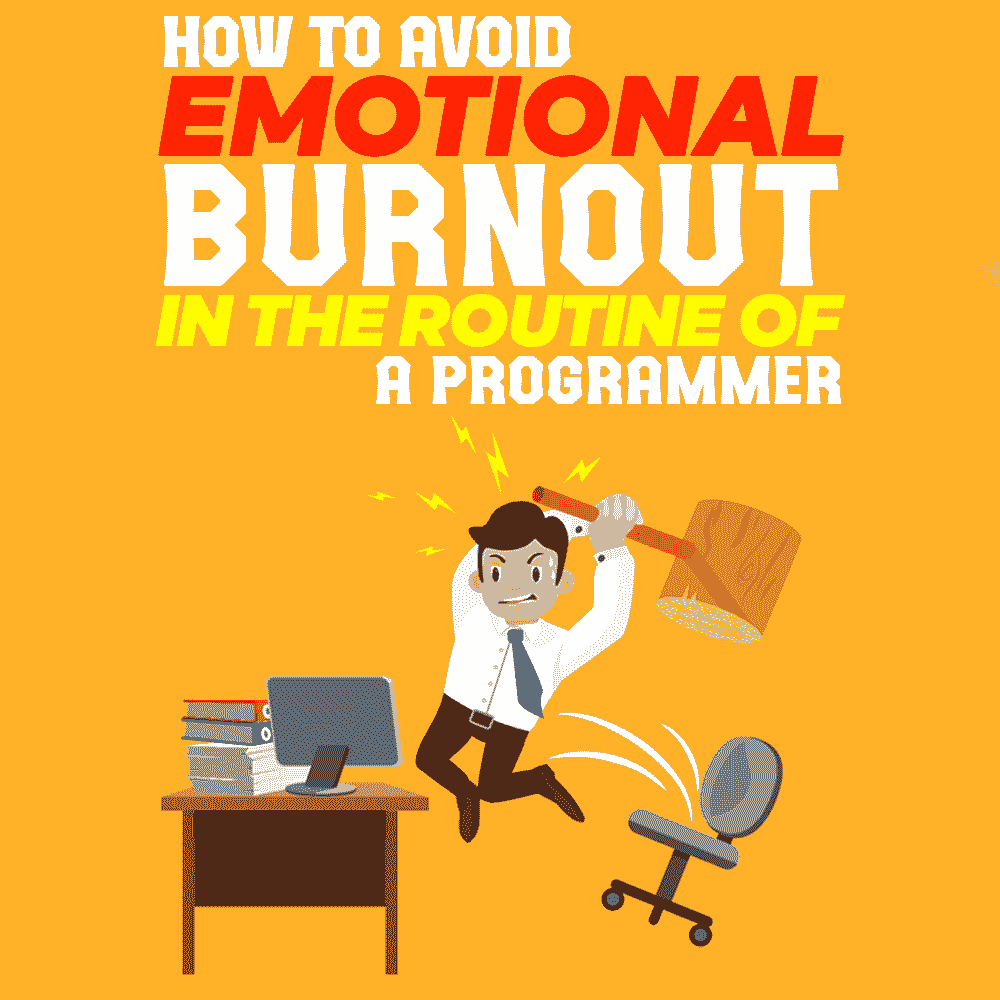

# 一个程序员的套路如何避免情绪倦怠

> 原文：<https://simpleprogrammer.com/programmer-burnout/>

If you want to [become a better programmer](https://simpleprogrammer.com/become-a-better-programmer/), you need to learn constantly, adapt to new technologies and methods, and solve highly complex and complicated problems on a daily basis. This can be a huge source of stress even if you are an experienced professional.

程序员可能在办公室里工作太多，甚至还要加班工作很长时间。有些人非常自信，因此他们试图参加很多课程，这些课程现在肯定不太重要，或者可以在开源中找到信息。

有时程序员只是失去了兴趣，想尝试在另一个部门工作，无法应对快速的技术发展，等等。

此外，紧张的截止日期和永无止境的办公时间经常会导致程序员情绪和身体上的倦怠，他们完全离开这个行业并不罕见。

当然，作为一名程序员，你可能收入颇丰，而且由于[程序员可以期望 87%的就业率](https://www.stackoverflowbusiness.com/blog/5-quick-stats-about-developers-and-what-they-mean)，你不必担心工作的稳定性，但它也有自己独特的挑战。

作为一名程序员，James Walters,[assignment geek](https://www.assignmentgeek.com.au/)的 IT 主管，推荐了八种方法来应对情绪枯竭，过上更加平衡、[充实和富有成效的生活](https://simpleprogrammer.com/productivity-for-busy-developers/)。

## 1.控制你的身体健康

身体上出了问题会影响我们的精神和情感健康。你可能长时间工作，当然你需要额外的能量，这些能量通常来自咖啡、零食和糖。

虽然这可能是一个短期的解决办法，但从长远来看，它可能会导致一系列问题，如肥胖、心血管问题、整天坐着的背部问题以及睡眠不足导致的疲劳。

为了应对这一点，选择更健康的食物，获得足够高质量的睡眠，确保你的日程安排不那么紧张，在日常生活中引入体育活动，即使只是步行上下班。先照顾好自己。

## 2.留出时间尝试新事物

根据 2014 年的一项研究，[世界上有超过 1850 万程序员](https://www.daxx.com/article/software-developer-statistics-2017-programmers)，随着我们越来越依赖技术，这个数字在未来几年只会继续增长。

然而，对软件的这种需求可能会导致一些程序员很快筋疲力尽。为什么好吧，如果你专注于某个经常使用的东西，比如 Java 或 Android，你可以期待有很多工作等着你，这很好，但是如果你一遍又一遍地做同样的事情，这可能会非常令人沮丧，甚至令人心碎。

例如，解决方案是分配 20%的时间去尝试新的技术和方法，尝试它们或者试图弄清楚一个特定的图书馆是如何工作的。

例如，你可以[为你的代码](https://simpleprogrammer.com/problems-in-code-development/)试验解决方案。如果您需要编写一段代码，您不应该陷入困境，试图想出适用于所有可能场景的东西(这是您在进行单元测试时想要的)。编写足够的代码，使解决方案提供 80%的预期效果。

## 3.不要吝啬你的设置和工具

你的工作可能已经很有压力了，你不需要一台速度很慢的电脑给你带来更多的痛苦，尤其是当你试图编译一些东西的时候。除了功能强大的 PC 或 Mac，您还应该考虑双显示器设置，这将节省您的时间，并保持一切显示清晰。

而且，因为你一天中的大部分时间都要弯腰驼背地坐在键盘前看代码，所以你应该买一把舒适的办公椅，这会有助于你的姿势。其他小东西，如降噪耳机，也可以让你的工作日更加舒适。

## 4.依靠好的工具获得帮助

另一件能让你的程序员生活更轻松的事情是一套[好的工具](https://clockify.me/blog/productivity/best-productivity-tools-programmers/)，你应该根据自己的需要挑选。例如，了解你的工具的所有快捷键，如 Notepad++、命令行或 shell、操作系统或每个特定的应用程序，不仅会节省你大量的时间，使你更有效率，而且还会使一天不那么单调乏味。

此外，有很多生产力工具可以为你分担一些负担。例如，我特别喜欢[Silver Searcher](https://geoff.greer.fm/ag/)，它是一个代码搜索工具，速度非常快，并且有一些有趣的选项，例如选择哪些文件将从您的搜索中排除，这可以节省您很多时间。

如果你是一名程序员，另一个绝对必要的工具是 [GitHub](https://www.youtube.com/watch?v=fFu-s8wzlIw) ，它是最流行的版本控制和协作平台之一。它还允许您审查代码、构建软件和管理项目。全世界有超过 3100 万开发人员在使用它。

## 5.意识到你掌控着你的生活和事业

无论你是一名自由职业者，还是在一家 IT 公司工作，你总是要向决定你工作是否出色的人汇报，不管是你的客户、经理还是公司的首席执行官。

如果他们对你不满意，即使你已经尽了最大努力，你也可能被解雇，或者更加努力地工作，直到完全筋疲力尽。这两种选择都不好，但找一份不同的工作总比把自己累垮要好，如果你是程序员，这应该不会太难。

记住[你掌控着自己的生活](https://www.youtube.com/channel/UCFxdcuY-S6yjZGq_2cjilHg)，你可能还有很多年的时间，这也适用于你的编程生涯。事实上，你的职业会让你过上充实的生活。但是如果你太累了，这是不会发生的。

You need to be able to establish a balance between staying healthy and motivated and all the benefits of having a successful career as programmer. If you work about 40 hours per week at your main job, you need to think twice before starting to work more. Remember that the entire work cycle takes about ⅓ of your everyday life.

你还必须跟踪你的情感投入率。因为如果你有这种感觉，你就有可能面临第一次或最后一次情绪枯竭。

优先考虑你所有的计划、活动和愿望。

在家和工作的时候，做一些愉快的活动。

你的大脑也应该休息一下。不仅仅是通过不同的逻辑任务和书本阅读。

发现新的东西，使用它，跟随专业趋势以保持最新。

一些有这种问题的企业可能会尝试实施汉堡整合模式。根据这一点，一个员工每天开始进入办公室 2 个小时，然后是 4、6 个小时，然后才是一个全职工作日。重返社会需要 6 周到半年的时间。所以，你不需要跳过这一步，也不需要试图加快速度——这个过程需要时间。

请记住，你需要照顾你的家人，不是用钱，而是通过关注他们。你还需要跟踪你的健康状况——特别是监测你的眼睛疲劳。移动并通过其他种类的日常活动放松，如爱好、阅读、运动、散步、短途旅行和游戏。

## 6.远离编码

我们所说的离开意味着两件事。

你不需要投入这项工作。你暂时减少了压力的因素。你可以把新的时间花在新的爱好上——书籍、乐高玩具、游戏、旅行，或者只是享受家庭时光。

首先，短暂的休息可以帮助你理清思路，给自己充电，这样你就可以处理新的问题。

你是紧张工作一个小时，然后休息 10 分钟，还是每 90 分钟休息 15 分钟，这取决于你，但一定要打破那些长时间的会议，因为它们对你的生产力没有任何好处。

第二，你应该总是为你的爱好和工作之外让你的生活有价值的事情腾出时间，比如看电影、徒步旅行、绘画、拍照、用乐高积木搭建或者阅读。许多程序员可能认为这些活动是浪费时间，但它们可以帮助你获得一个新的视角，甚至可以成为新想法的来源。

## 7.切换到不同的工作或项目

如果你几个星期或几个月都在调整你的代码库，你的工作会变得很无聊，这会导致你变得脱离工作，效率更低。你也可能最终被分配到一个与你的期望和兴趣不一致的项目，或者一个完全不同的项目，你的技能不再适合。如果是这种情况，你可以尝试切换到不同的项目。

如果你对编程彻底失望，你总是可以探索其他相关领域，如信息架构、质量保证、技术写作或系统管理，任何一个都可能是你更好的选择。

## 8.确立你的极限，并清楚地定义它们

All programmers are different, and while some of your colleagues might be able work 18 hours a day, every day, that doesn’t mean you can or should. Of course, working overtime is something that is expected in your line of work, but if it becomes a constant, you need to do something about it.

你需要设定自己的界限，并让你的老板明白。你工作的每一家公司都会努力充分利用你的能力，直到你筋疲力尽，除非你决定坚持到底。虽然大多数公司会允许你限制工作时间，但你可能会因为升职加薪而被忽略。

但是，另一方面，你将有更多的时间和你的朋友和家人在一起，你也可以选择在工作之外做些别的事情。

## 编程不是百米冲刺

作为一名程序员，你应该把自己的职业生涯当成一场马拉松，而不是短跑。给自己定步调，每隔一段时间后退一步，以及探索不同的领域，这些都是你可以选择的，可以帮助你防止精疲力尽，并使你作为一名开发人员拥有一个长期而富有成效的职业生涯。照顾好自己，祝你好运。