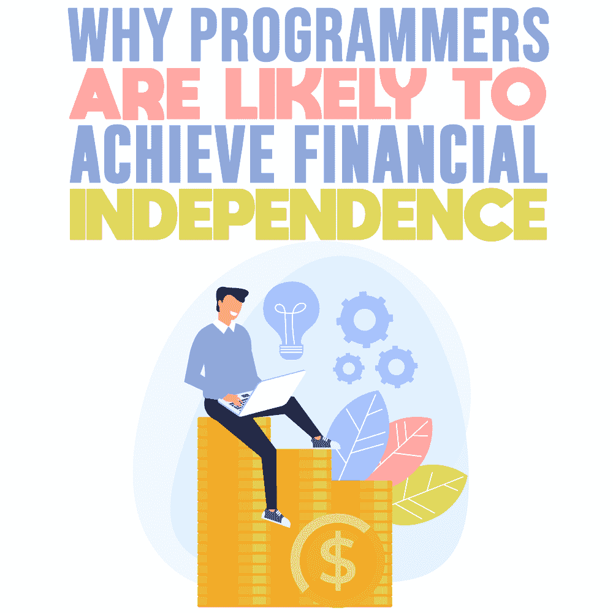
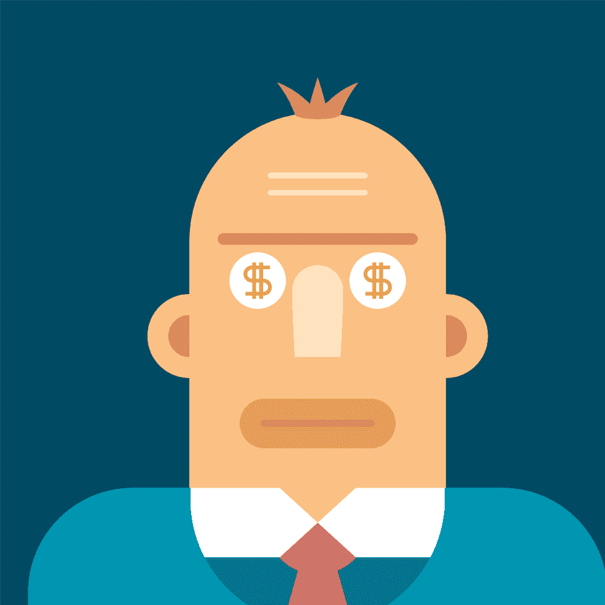

# 为什么程序员有可能实现财务独立

> 原文：<https://simpleprogrammer.com/programmer-financial-independence/>

The average salary of a programmer is about $85,000 a year. At first, you might not think that sounds so lucrative, considering obtaining a Bachelor of Science degree can range anywhere from about $35,000-$83,000 in tuition. Of course, that’s not including all of the other expenses and fees you rack up during college or training.

但是，即使是“新手”程序员也能相对较快地将他们的职业生涯转变为成功且有利可图的事情，这并不罕见。事实上，[成为一名程序员](https://www.howtofire.com/making-six-figures-at-24/)挣六位数是有可能的——即使你对这个领域还比较陌生！然而，达到这种成功水平需要奉献精神、努力工作和一点理财知识。

就像几乎任何其他职业一样，你每年赚多少钱并不重要，重要的是你如何处理它。理财很容易出错，尤其是因为第一次收到一大笔薪水令人兴奋！

然而，作为一名程序员，只要记住几个关键因素，你就可以快速实现财务自由，包括你性格中的一些方面，这些方面可能会自然而然地吸引你存钱并以正确的方式处理它。那么为什么[程序员这么快就更容易达到财务自由](https://thefrugalengineers.com/2019/08/23/why-do-so-many-engineers-retire-early/)呢？

## 是什么让程序员与众不同？

有一些关键的特征使程序员与众不同。首先，数字和数学有明显的联系。大多数参与编程的人都喜欢处理数字和找出解决方案。他们不怕跳出框框去思考问题，尤其是当结果对他们有利的时候。

想想一个几乎全球每个人都知道的程序员:马克·扎克伯格。这位脸书 CEO 在哈佛大学担任程序员时开创了一个全球现象。但是扎克伯格不是世界上最好的程序员。

当他创办脸书时，是什么让他脱颖而出，直到今天，是什么让他脱颖而出，是他坚持不懈、富有创造性、打破常规以取得成功的意愿。他的技能在某种程度上从程序员转向了商人，但这种结合显然对他很有效，他目前的净资产约为 670 亿美元。

尽管扎克伯格有一个伟大的想法和一点运气，但在大多数情况下，他表现出了大多数程序员往往都有的一些共同特征，包括:

*   乐观的态度
*   优秀的沟通技巧
*   极度专注
*   快速学习的能力
*   强大的时间管理和任务管理技能

所有这些共同的特质和能力让程序员在年轻时不仅获得了财务成功，还获得了财务自由。毕竟，当你处理这些数字，看到你有可能在 15 年内退休，而不是 40 年，你可能会更致力于实现这一目标。

如果你热爱自己的工作，为什么要提前退休呢？嗯，谁不想在自己还相对年轻的时候财务状况良好呢？一个巨大的压力来源将会从你的生活中消失。但是，即使你确实热爱你的工作，程序员面临的一些风险可能会促使你想早点退休。

首先，编码员很容易很快就精疲力竭。当你年轻并渴望在这个行业发展时，你可能不会介意长时间工作，并把你的一生都奉献给你的事业。然而，随着年龄的增长，你的优先事项可能会改变，尤其是如果你想有一个家庭，不想工作那么长时间。

此外，在做了几年程序员之后，你的简历和成就可能对雇主没有吸引力。他们会寻找受过新培训、对最新技术有新见解的新候选人。

虽然保持相关性很重要，但你可能无法永远跟上。现在努力工作并做出明智的财务决策可以帮助你在面对这些挑战之前达到财务自由。

## 更高的收入意味着更高的储蓄潜力

我们已经提到了这样一个事实，程序员可以轻松地一年赚六位数，而且他们可以在很短的时间内做到。如果你想体验财务自由，储蓄和赚钱一样重要。

虽然第一笔大额收入可能会令人兴奋，你可能会忍不住买更多的东西，但如果你真的想早点退休并获得财务保障，你必须考虑更长远的前景。

善于储蓄的人往往会遵循某些习惯。最重要的一点是能够区分他们想要的和他们需要的。我们都时不时地想要一些东西，有些人可能比其他人有更大的愿望清单。

下面是一些*需求的例子:*

*   房屋
*   食品
*   公用事业
*   可靠的运输

下面是一些*需求的例子:*

*   音乐和电视订阅
*   昂贵的外出之夜
*   杂货递送服务
*   亚马逊购买
*   最新技术(电话、电脑等。)
*   跑车

There’s nothing wrong with treating yourself with things that are within your budget, but if you truly want to be an expert saver, you’ll forego some of those excessive “wants” and focus on your needs right now and in the future. That will allow you to put more money away.

专业储蓄者也在他们的预算上勤奋工作。作为一名程序员，你可以在制定预算时利用你的数字运算知识。确保包括从你的典型生活费用到订阅服务等“额外费用”的一切。

如果你不确定如何开始做预算，试着关注生活中的三个主要支出类别:

*   **固定支出:**房租/房贷、车贷、贷款还款等。
*   **可变费用:**水电费、食物等。
*   **非必要性:**固定或可变费用之外的任何费用

从这三个类别开始，可以更容易地看到你的钱每个月都花在了哪里，以及你可以在哪些地方削减开支。你可以从那里开始做“子分类”,让你的预算更详细一点，但这将给你一个坚实的起点，让你对每个月的收入和支出有更多的了解。例如，你可以把预算分成“外出就餐”和“食品杂货”，而不是“食物”类似地，你可以把“交通”分成“汽车付款”和“汽油”

## 如何处理高收入

当你收到第一份大额支票时，很自然会看到你眼中的美元符号。如果这份工作来自你大学毕业后的第一份工作，并且你在学校的最后几年一直在努力奋斗，那就更是如此。

尽管挥霍金钱可能很有诱惑力，但这可能会导致后来的金融灾难，就像 2019 年创业公司 [MoviePass 发生的事情一样。相反，你必须很快学会如何处理高收入带来的责任。](https://techcrunch.com/2019/12/26/startups-lost-in-2019/)

在购买任何大宗商品之前，还清所有未偿债务是个好主意。如果你无法避免学生贷款债务危机，并且你有贷款要还，那就是你应该关注的地方。

即使你大学一毕业就赚了很多钱，还清债务也比让利息费用不断重复发生要好。如果你现在还清了，在未来的几年里，它们不会成为你的负担。

尽量避免让额外的贷款埋没自己。如果你有钱，用现金买东西，包括汽车，而不是融资。投资[低成本指数基金](https://simpleprogrammer.com/index-investing-for-programmers/)，不要试图择时入市。如果你想学习投资，最好的书是 J.L. Collins 的《T2 T3 简单致富之路 T4 T5》。

在你的财务计划中，你应该考虑投资。不要害怕用你的钱投资——尽早投资，经常投资。作为一名程序员，你知道如何做研究，所以要找到吸引你的投资机会，并努力去做。这是看到回报的最佳方式之一，也是处理高收入的绝佳方式。

还在为高收入感到不知所措吗？考虑以下建议，更轻松地管理你的钱:

*   建立一个应急基金，涵盖三到六个月的生活费用，除非绝对必要，否则不要动这笔基金。
*   买房的时候要小心。买一栋大房子可能很诱人，也许你能负担得起抵押贷款，但你必须考虑随之而来的一切，包括公用事业和税收。
*   利用财务团队。你不必自己管理你的钱。在这个行业有经验的人或那些“曾经在那里”的人可以成为你的主要资产，甚至可以帮助你为一个更安全的未来做出正确的投资。

## 数学吸引直觉思维者

对一些人来说，制定预算，计算储蓄的数字，再一次计算这些数字可能听起来有些吓人。但是编码人员往往活着就是为了解决像这样的复杂问题！这就是为什么六位数的收入和懂得如何与数字打交道会给你带来巨大的好处，让你更快实现财务自由。

思考你的财务前景与研究复杂的系统或方程式非常相似。你不能只关注眼前的事情。你还必须是一个前瞻性的思考者，考虑你未来 5 年、10 年或 20 年的财务状况。

你的预算是什么样的？事情会有怎样的变化？有很多因素需要考虑，包括潜在的加薪、债务减少以及消费习惯的改变。

如果你真的想更详细，更快地达到你的目标，你可以使用像火灾计算器这样的工具来确定你什么时候可以退休。

FIRE(财务独立提前退休)计算器可以帮助你计算出为了提前退休你需要存多少钱。当你根据自己的消费习惯知道自己需要多少钱时，你就降低了退休后没钱的风险，你仍然可以过得舒适。

火灾计算器使用一种叫做“25 法则”的东西来决定你需要多少投资才能退休。要自己算出来，只需计算退休期间你每年的开销，然后乘以 25。如果你计划退休后每年花费 40，000 美元，你需要存 1，000，000 美元才能退休。

虽然自己处理这些数字可能很有趣，但试试计算器，快速输入不同的事实和数字，确定你多快可以退休。如果你想全面了解如何跳入火中，可以看看克里斯·马穆拉、布拉德·巴雷特和乔纳森·门东萨写的《选择一:你的财务独立蓝图 》一书。

## 所有程序员都会达到财务自由吗？

人们很容易认为，任何有六位数收入和发展机会的职业都会让你很快实现财务自由。

And it is—but only if you make the right choices now to prepare for your best financial future. The reality is, it’s possible for anyone to reach financial freedom. Programmers have a slight edge thanks to their hard work ethic and their ability to work with numbers.

然而，如果你选择靠薪水生活，并且不采取必要的措施打破糟糕的消费习惯，你将无法实现财务自由，尤其是在年轻的时候。

美国的平均退休年龄是 62 岁。软件工程师和程序员的平均退休年龄是 35-40 岁。想象一下，提前 20 年退休，你可以用你的时间和生活做些什么。通过保护你的投资和现在做出更好的选择，你正在为你自己和你的家人在未来的许多年里过上舒适的生活做准备。

如果你是一名程序员，并且刚刚进入这个行业，请记住这些事实、数据和提示。他们可以帮助你走向财务自由，这样你就可以享受生活和随之而来的一切。与此同时，你将不再担心能否支付账单或为自己或家人提供食物。