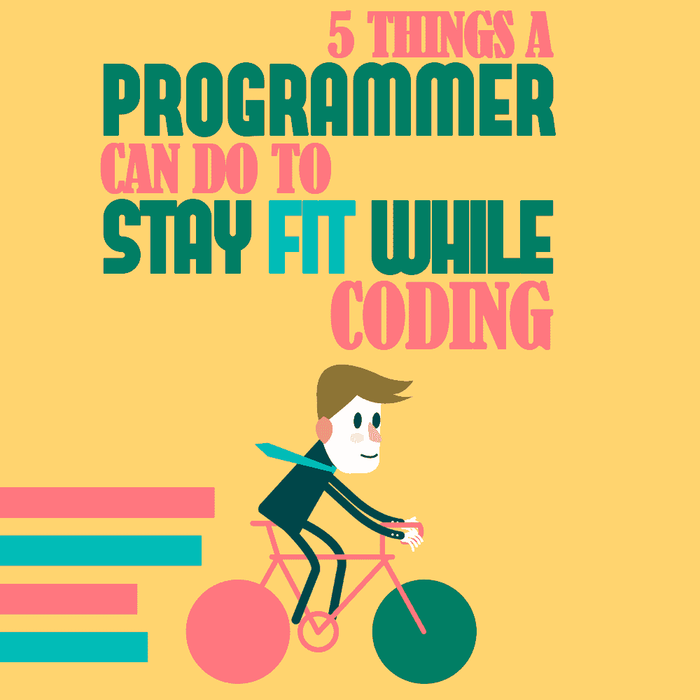
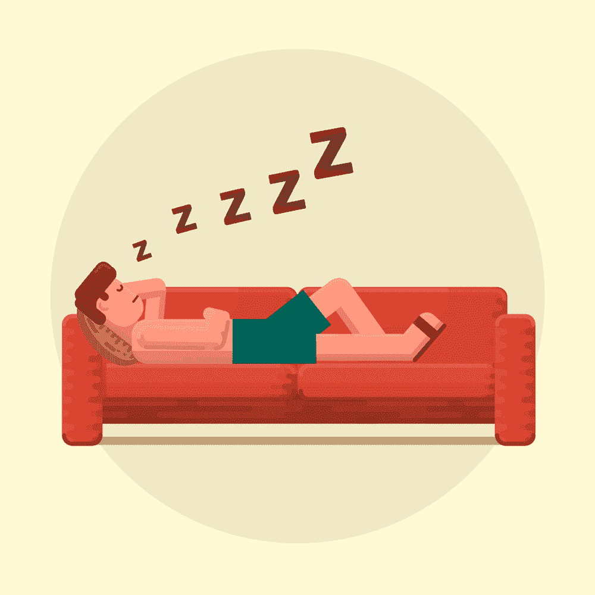

# 程序员在编码时可以做的保持健康的 5 件事

> 原文：<https://simpleprogrammer.com/programmer-fitness-tips/>

Programming is one of the most sought-after careers as the world rapidly moves to an exclusively digital age. Everything we have is becoming “smart,” and at the core of every such product is a set of programming code written by someone. Being that person often means you have to sit for long hours, [being productive and creating programs](https://simpleprogrammer.com/productivity-for-busy-developers/) for your clients.

从事这种工作的典型的一天包括许多坐着的时间，这对人的健康不利。程序员有时候会吃高热量低营养价值的食物，熬夜，这是适得其反的，至少从健康的角度来说是这样的。

但是，做程序员并不意味着要过不健康的生活。这里有一些最基本的[健身软技能提示，这样你就可以在编程](https://simpleprogrammer.com/soft-skills-for-programmers/)时保持健康。

## 定期锻炼

我猜你可能想知道为什么我们在谈论如此基本和明显的事情。嗯，事情是这样的:编程是人们经常忘记运动的重要性的工作之一，或者在某些情况下完全忽视整个想法，选择过一种不健康的、久坐的生活方式。

除了拥有积极的生活方式，别无选择，程序员也是如此。由于不可能在白天为身体活动创造时间，程序员可以寻找替代的解决方案。

最好的方法之一是早点开始你的一天，在上班前锻炼。你也可以选择一项你可以在当地体育馆进行的运动，比如游泳、羽毛球或网球——任何最适合你的运动。

虽然有一个适当的锻炼计划很重要，但程序员可以很容易地挤出一些活动，比如做俯卧撑、拉伸或每半小时在办公室走一小段路，以保持肌肉活跃。不过，将这与日常锻炼结合起来会更理想，而且会对你的健康大有裨益。

另一个增加白天活动量的好方法是骑自行车去上班(如果你不在家工作的话)。如果距离太远，可以考虑买一辆电动自行车，或者用[电动自行车改装套件](https://bestpicko.com/electric-bike-conversion-kit-reviews)改装你的普通自行车。

## 保持良好的姿势

经常可以看到程序员无休止地盯着电脑屏幕，瘫坐在椅子上。长时间弯曲背部不仅会导致暂时的疼痛，还会导致大量难以解决的背部相关问题。

为了避免这种情况，程序员应该在一天中保持笔直的姿势。购买一把姿势友好的椅子也很有帮助。除此之外，通常认为每半小时从椅子上站起来伸展一下全身是有益的。

你可以做很多不同的运动，比如向前折叠，猫牛，或者高跳板。你可以看看[这里](https://www.healthline.com/health/posture-exercises)提供的练习，获得详细的说明。

## 获得充足的睡眠

There is nothing more important in the world than getting a sufficient amount of [sleep](https://simpleprogrammer.com/sacrifice-sleep-can-work/) no matter what your profession is. However, this is something that is particularly ignored by programmers.

这种疏忽的原因通常是项目截止日期前的长时间，或者在休息前完成任务的冲动。漫长的夜晚导致工作日提前，这意味着程序员经常无法睡个好觉。

不要在办公桌前打盹，否则可能会引发其他可怕的问题，如高血压、心脏病和糖尿病，保持清醒和睡眠时间的平衡非常重要。

## 控制你的咖啡因摄入量

由于程序员经常倾向于编码马拉松和长时间工作，所以他们倾向于通过消耗大量的[咖啡](https://simpleprogrammer.com/caffeinated-coder-caffeine-good-bad/)来补充他们保持警觉的能力一点也不奇怪。虽然这可能被认为是一个屡试不爽的策略，但它并不是一个非常健康的策略。摄入过多的咖啡因会导致上瘾，这会导致一些非常严重的问题。

对咖啡上瘾的人经常发现，不喝一杯咖啡就很难集中精力做任何工作。这种程度的依赖可能很难管理，并且会对你的健康产生严重的负面影响。

如果你想清新一下，试试用冷水洗脸，或者散散步。你会惊讶于这些东西的有效性。

## 找时间做 AFK

AFK 是编码和游戏社区中一个众所周知的短语，它的意思是“远离键盘”整天坐在屏幕前意味着你会陷入单调的漩涡，这会影响你处理其他事情的能力。面临这一问题的人经常在交谈中失去思考过程，在执行日常任务时分心。

将所有的技术放在一边，让自己从所有的电子产品中解放出来，让自己放松一下，这是取得平衡的关键。花时间和你的朋友和家人在一起可以帮助你恢复精力和精神。社会化是这一过程的关键部分，而我们作为社会性动物，实际上依赖于它。

这项运动不仅会让你感觉更好，还会帮助你恢复精神和身体，通过出去散步或在公园或野餐点花些时间来接触大自然。

## 建立平衡的生活方式！

这里提供的所有技巧都被认为是在程序员的编码生活中达到完美平衡的关键。拥有这种平衡不仅对最大化你的表现至关重要，而且也能确保你对工作和生活保持快乐。

这里定义的很多步骤都是为了帮助你找到平衡。试试它们，如果它们对你有任何帮助，请告诉我们！