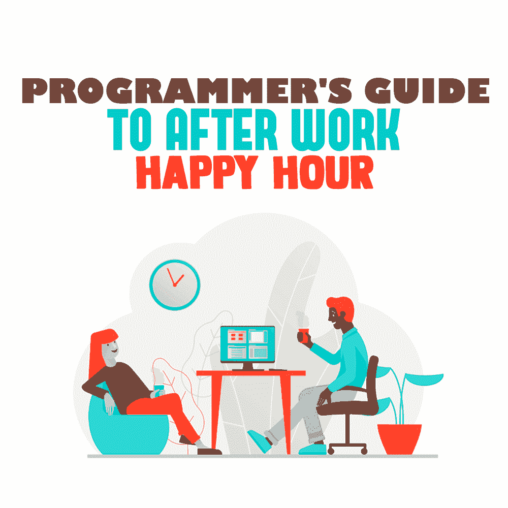

# 程序员下班后快乐时光指南

> 原文：<https://simpleprogrammer.com/programmer-happy-hour/>

<figure class="alignright is-resized">

</figure>

在编程社区，喝酒是普遍现象。在会议上有很多开放的酒吧，在编码社区也不乏本地欢乐时光聚会。还有什么比在快乐时光释放压力和与同事交往更好的方式呢，对吗？在那里，所有的饮料和小吃经常打折，而且价格不菲。

然而，你在工作相关场合的行为和饮酒会严重影响你的健康和职业形象。因此，程序员必须考虑他们在行业活动和非正式聚会中的饮酒行为。

对于程序员来说，监控你的健康状况是保持工作生活平衡的重要部分。[编码](https://simpleprogrammer.com/programmers-sedentary-lifestyle/)的久坐生活方式使得健康变得更加重要。欢乐时光旨在成为一段有趣的时光，但程序员们有很多要考虑的事情——从他们的健康到上级和同事在公司聚会后如何看待他们的行为。

了解快乐时光对你的身体、情绪和心理健康的副作用是很重要的。继续读下去，发现基本的生活窍门，让你在享受快乐时光的同时保持健康和知情。

## 为你的健康干杯！

科技行业的快乐时光文化在今天的工作环境中尤为贴切。许多科技公司利用快乐时光来鼓舞士气，改善协作办公文化。

因为快乐时光是建立在酒精的基础上的，你必须考虑经常饮酒的健康方面。经常饮酒有几个对健康有害的副作用，程序员特别容易受到这些副作用的影响。

程序员不仅是科技办公室文化的核心，而且他们通常在办公室过着久坐不动的生活，这使得过量饮酒的影响更加不健康。

疾病控制和预防中心(CDC)将[狂饮](https://www.cdc.gov/alcohol/fact-sheets/alcohol-use.htm)归类为女性一次喝下四杯或四杯以上，或者男性一次喝下五杯或五杯以上的酒精饮料。

根据疾病预防控制中心的数据，2006 年至 2010 年间，过量饮酒导致 88，000 人死亡。这些致命事件平均减少了人们 30 年的寿命。

此外，在 20 至 64 岁的成年人中，饮酒是十分之一死亡的原因。那一年酒精消费的估计成本是 2490 亿美元，或者说人们每喝一杯酒就要花费 2.05 美元。

酗酒将你置于直接的危险之中。它极大地增加了你发生车祸或跌倒的几率，并且是严重犯罪的主要促成因素，如杀人、家庭暴力、性侵犯和自杀。

经常狂饮还会导致慢性疾病，包括消化问题、心脏病、高血压、肝病和中风。

如果你一周去一两次这样的快乐时光，酒精就会累积起来。随着酒精带来的抑制力减弱，你往往会忘记自己喝了多少，或者屈服于同伴的压力，喝得更多。同辈压力可以有多种形式，包括欺凌，这不仅限于大学校园。最常被报道的欺凌行为之一是狂饮，工作场所有时也不能免于延续这种文化。

注意你消耗了多少，你出去享受快乐时光的频率有多高。记住，总有不喝酒的社交方式。你可以点不含酒精的饮料或低 ABV 的饮料。或者只吃炸薯条和鸡翅。

## 保持事情正确和紧密

在那些定期的欢乐时光聚会上喝的酒和你在健身房的时间之间有很强的相关性。酒精会削弱你的身体健康。然而，身体健康大大抵消了过量饮酒的不良副作用。

饮酒和健身是相互矛盾的。酒精会降低你达到健身目标的能力。比方说，那天下午你本来计划去健身房，但你却在快乐时光喝了四瓶啤酒。有规律的锻炼和健康的饮食是对抗酒精中毒和经常饮酒的不良健康影响的最好方法。

健康养生法对于那些大部分时间都坐在同一个位置上看着屏幕上的小文本的程序员来说尤为重要。定期锻炼被证明对保持视力、降低体脂和保持健康的心率有好处。

酒精都是空卡路里，饮酒者通常将这些空卡路里与含糖液体混合，以改善其味道。实际上，空卡路里和糖会抵消你在健身房获得的任何积极的收获。快乐时光的菜单几乎从来不包括丰盛的绿叶蔬菜沙拉或充满能量的水果盘。这种食物通常油腻、多脂，因此味道鲜美。

偶尔沉迷于这些美食是完全正常的，也是与同事社交的一部分。但重要的是，让一次性成为一次性，不要让不健康的饮食成为经常性的习惯。留意你摄入的食物，试着在本周晚些时候加入一项健身活动。

## 喝还是不喝？那要看情况

程序员需要考虑在公司活动中是否喝酒。在大多数公司活动中，都有喝酒的机会。尽管如此，许多专业人士怀疑在公司聚会上喝酒是否是个好主意。

大多数雇主都会强调理性饮酒的重要性，要么是为了保护员工，要么是为了公司。如果你决定喝酒，你需要考虑喝多少。在这里，了解你自己是很重要的。你需要诚实地评估不同量的酒精会如何影响你的行为。

<figure class="alignright is-resized">

</figure>

一两杯酒可能会让你放松。除此之外，酒精会开始损害你的说话能力。三四杯酒下肚后，你会进入一种陶醉状态，这可能会削弱你做出明智决定的能力。

这是人们在公司活动中开始做的事情，这些事情可能会回来困扰他们。记住，你可能会和你的经理和领导出去，你在快乐时光做的事情是不可原谅的。

避开关于工作项目的有争议或两极分化的谈话可能是个好主意。讨论新的行业趋势或编码技巧是非常好的，只要你记得保持你的专业性。

人们很容易沉浸在公司聚会的庆祝活动中，忘记自己喝了多少酒。为了防止这种情况，在你去参加活动之前，决定你的限制。这个决定会让你更难过度饮酒。

此外，不要在聚会前喝多了。通过在一个事件前喝酒，你正在削弱你集中注意力和做出正确决定的能力。你也让人们更容易变得过度陶醉。

## 值得思考的一点

酒精和以排外著称的行业文化可能是一个糟糕的组合。女性在科技领域已经面临着巨大的偏见，而且还在继续。根据麦肯锡的一项研究，在过去的 25 年里，女性在计算机领域的角色已经显著下降，这个问题对于有色人种女性来说更为突出。

在一个问题如此根深蒂固的行业，限制你在公司聚会上的饮酒量可能是一个非常好的主意。虽然融入企业文化很重要，但成为你希望在别人身上看到的改变也很重要。

人们通常会从众。如果同事看到你戒酒或限制饮酒，他们更有可能以你为榜样。

你在公司活动中喝酒时做出的糟糕决定可能会毁了你的编程生涯。如果一定要，问问自己“值得吗？”你今天做出的明智决定可能会帮助你为明天打下更坚实的基础。

科技公司在很大程度上营造了一种快乐时光文化，因为他们知道程序员正在从事艰难的项目，时不时地应该休息一下。因此，确保你利用这些机会好好休息一下，庆祝你个人和公司的成就，并帮助培养积极的工作文化。请记住，酒精确实会带来后果，考虑为自己的健康做好准备是很重要的。