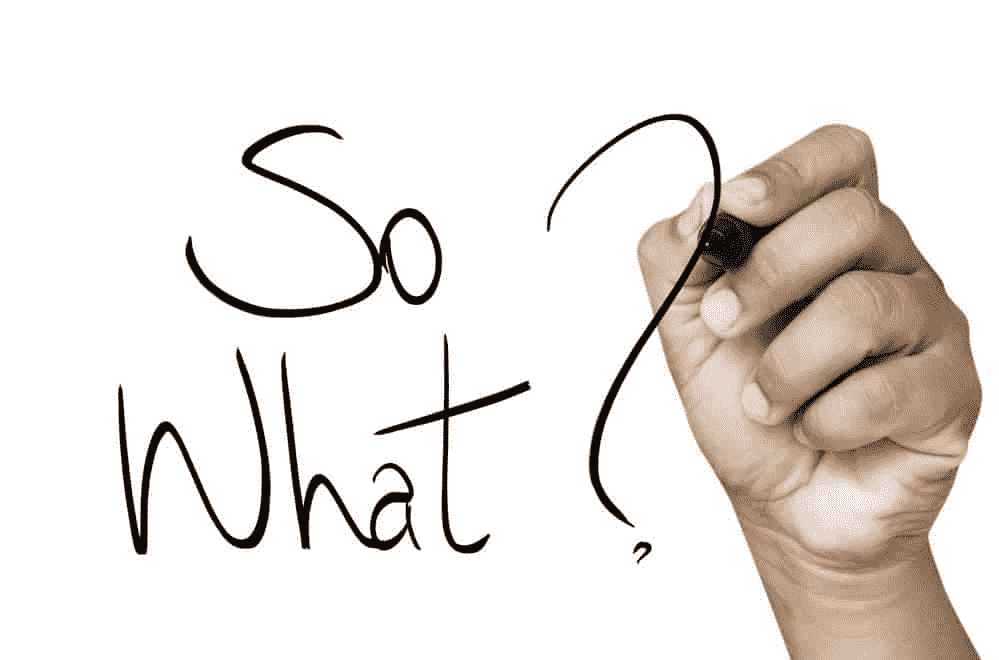
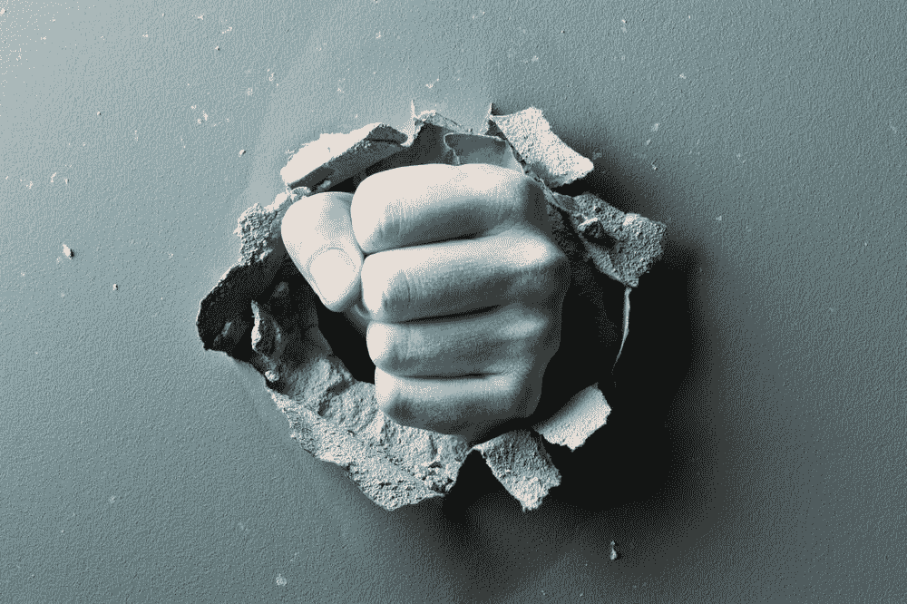
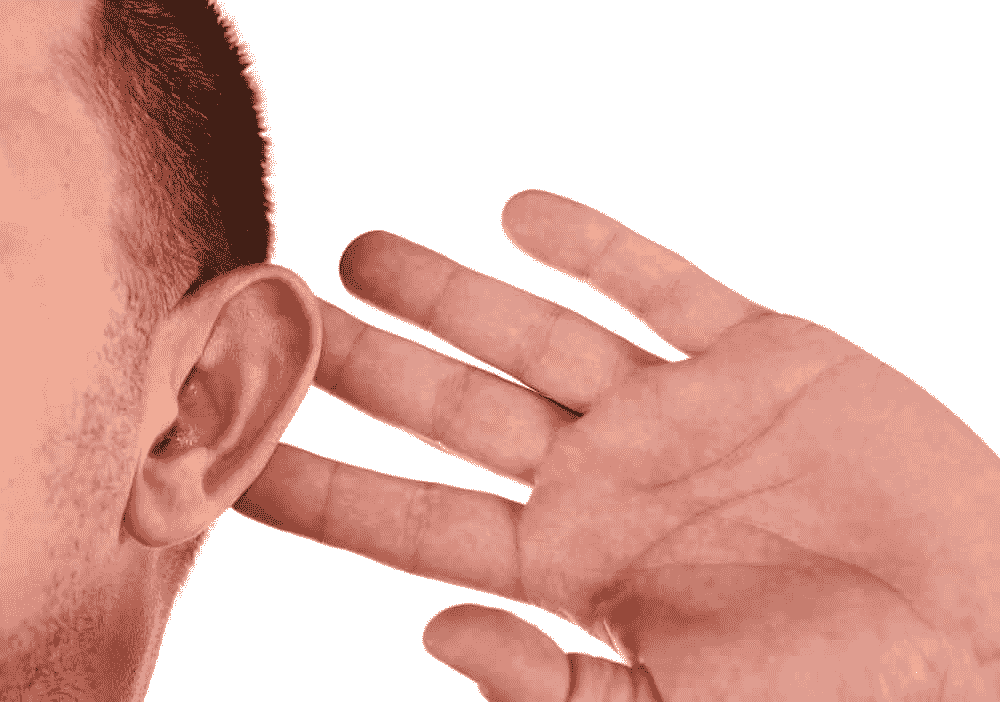

# 程序员和政治

> 原文：<https://simpleprogrammer.com/programmers-and-politics/>

我不得不承认，过了这么久，我还是不能理解为什么这么多本来很聪明的人通过在网上争论让自己看起来像个十足的白痴。

本周，我在看我的脸书视频——也许我不应该看，因为我忍不住看到一群白痴在和其他白痴争论。

不仅每个人都认为自己是对的，而且他们认为他们争论的问题实际上很重要。

别误会我的意思。有很多重要的问题，但大多数问题不会单独影响支持或反对它们的人——至少在日常生活中不会。

我们经常被诱惑去参与谈话或表达我们的观点——一种观点——因为我们觉得表达自己或让别人相信自己的观点很重要。但在现实中，即使我们成功了，对我们自己的生活也只有微不足道的影响。

另一方面，猜猜会对我们的生活产生什么样的*大影响？*

*   我们花在网上争论的时间本可以用来做更有成效的事情
*   我们花费的情感和身体能量为那些在大环境中并不重要的事情而苦恼
*   我们选择在情感问题上而不是逻辑问题上采取行动，从而毁掉或疏远了友谊和商业关系
*   我们自己的观点所留下的历史足迹，将来可能会改变，但现在已经是板上钉钉了

# 你为什么这么在意？

So there are injustices in the world—what a shocker.

你知道吗，这个世界是不公平的，在脸书问题上争论也不会让它变得公平。

我知道因为鲍勃说了一些种族主义的话，而玛丽是一个相信一堆谎言的偏执狂，这感觉就像整个世界都要毁灭了，但是告诉他们他们错了真的是你的工作吗？

他们会听吗？如果有，这又有什么关系呢？

我不是说我们不应该关心事情。我是说，我们应该通过投入实际的宝贵资源来关心事情，比如时间和金钱，而不仅仅是脸书的煽动性言论。

我看到许多原本聪明的人陷入了只能被描述为不必要的戏剧性事件。

突然之间，本应成为我们这个行业领导者的专业人士开始插手他们不属于的事情并诽谤他人。

同样，不要误解我——这个世界上有很多不好的和错误的事情，我们对它们都有不同的看法。但是这些事情中有多少真正影响到我们的日常生活呢？

有多少让你心烦意乱的事情会影响你的生活？

即使这些让你心烦意乱的事情确实影响到了你，你又何必在意你脸书朋友列表中的人是否与你想法不同或完全相反呢？

如果你，也许，[不那么在乎](https://simpleprogrammer.com/2015/06/25/i-literally-dont-give-a-shit/)，你的生活不是会好得多吗？

# 不仅仅是关心更少…

而是选择关心什么。

如果你选择对每一个感知到的偏见或社会不公做出反应，并对疏远他人的事情做出反应，你会发现自己成为一个痛苦、暴躁、悲观的人。

宽容不是爱或同意。而是让人们顺其自然，不要因此而骚扰他们。

我能想象到的最高形式的虚伪是对不宽容的人不宽容。

就像五十步笑百步。

如果你真的想练习宽容，就稍微练习一下“闭上你的臭嘴”

任何人最大的宽容就是闭上他们的嘴；当他们选择不做判断的时候。

如果你一方赢了你就欢呼，那你就是不宽容。

如果你一方输了，你就发牢骚，那你就不宽容。

如果你觉得有一面，那就是不宽容。

当你发布了那篇表明你是正确的或者其他人是如何愚蠢或错误的新闻文章的链接时，你已经决定放弃宽容，并朝着成为暴君的方向前进。

人们可以想他们想要的，人们可以成为他们想要的——他们甚至可以憎恨他们想要的——但是当你*决定你站在更高的道德立场上并与世界分享时，你已经放弃了要求宽容的权利。*

*也许宽容并不总是一件好事。也许有些事情我们不应该容忍。但是，即使这是真的，正确选择你的战斗也很重要。你应该经常问自己…*

# *这真的是我想死的那座山吗？*

**

*…because you may very well die on that hill.

流行的观点会很快对你不利，你写的话就像写在石头上一样。

不相信我？觉得我有点偏激？

问问麦卡锡主义的受害者就知道了，他们曾经可以接受甚至流行的政治观点突然变得对他们不利。

这个世界可能是个善变的婊子。有一天它会把你扛在肩上举起来，第二天它会把你摔在地上，在你的尸体上撒尿。

英雄和恶棍通常只能通过流行的观点来区分，所以在你把你的观点放到互联网永恒的、不可原谅的档案中之前，你应该仔细考虑一下——它可能会反咬你一口。

在你开口之前，在你输入评论窗口之前，问问你自己，再问一遍:这是我想死在上面的山吗？

真的值得在这里发表我的看法吗？

投入感情，潜在地疏远一群人，或者树敌，真的值得吗？

我真的想把这些话或我现在的观点载入史册吗？

永远是一个相当长的时间，但我们不再写一个可以粉碎不留痕迹的泥板。当你在网上写或发布一些东西时，它就永远存在了。

# 更广泛的教训

This isn’t just about expressing political opinion and religious views on Facebook. This same idea applies to all areas of your life, and especially your career.

是的，你可能会因为在社交网络上得罪了不该得罪的人而损害自己的职业生涯。

是的，你可以在公共场合做一个戏剧女王来摧毁你的个人品牌。

但是，工作环境中发生的小规模政治也会给你的职业生涯带来类似的破坏。

我看到太多的程序员在并不重要的事情上投入了太多的感情。

我，我自己，因为支持或反对一些技术或解决问题的方法而感到内疚，这些技术或方法真的一点也不重要——尤其是对我来说。

我犯了一个错误，卷入了办公室间的政治和讨论，我不好意思说我浪费了我的情感能量和时间。

在任何事情上，在生活中，如果我们能学会谨慎行事，我们往往会过得更好。

我们不必总是说出心中所想。

我们不必总是分享我们的观点。

事实上，我们并不总是必须有一个观点。

有时候，最好使用一些及时的判断，而不是形成一个观点，直到绝对必要的时候。

我想起了一个男人的故事，当有人问他是否会弹钢琴时，他回答说:“我不知道，我从来没试过。”

如果我们完全不对与我们无关的问题和事件做出判断，会怎么样？

如果我们只是静下心来，做我们的工作，忽略所有人试图引诱我们进入的情绪干扰，会怎么样？

我并不是说我完美——我远非如此——但是我知道的足够多，以至于意识到我从来没有看到互联网争论带来任何好处，只有坏处。

我也知道大多数办公室争论也是如此。很多时候，戏剧仅仅是为了戏剧而创作，而不是为了别的。

你是否会被周围的戏剧所吸引，这是你的选择。

You’ll often find, in your career and your life, that there are certain people who always seem to be at the center of drama, or are busy creating it.

这些人经常把自己画成受害者，你被拉进来是因为你同情他们。

但是不要被欺骗了。不要卷进来。

编程和政治不能混为一谈。

高效的程序员知道如何不惜一切代价避免戏剧性事件，对重要的事情保留他们的判断，并且只在他们不会被置若罔闻的论坛上表达那些判断。

如果你正在寻找额外的资源来帮助你停止过度关心，我推荐两本书:

*   **高效能人士的 7 个习惯——总体来说是一本好书，有着合理的原则，但专门论述专注于你自己的影响范围，而不是专注于你无法控制或无关紧要的事情。**
*   **[**现在的力量**](http://www.amazon.com/exec/obidos/ASIN/1577314808/makithecompsi-20)——有点怪书。我并不同意其中的所有内容，但其中有一些非常好的部分，即不关心正在发生的一切，而是专注于重要的事情。**
*   ****——一本关于关注重要事物的伟大著作。这一次真的让我苦苦思索。*****