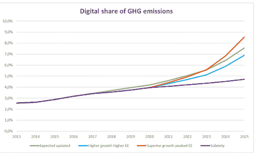

# 程序员变得更环保的 10 种方法

> 原文:[https://simple programmer . com/programmers-become-environmental-sustainable/](https://simpleprogrammer.com/programmers-become-environmentally-sustainable/)

简而言之，环境可持续性是以负责任的方式与环境互动的过程，以避免自然资源的退化或枯竭，从而保持长期的环境质量。环境可持续性既影响技术，也受技术影响。

程序员和他们创造和使用的技术正在威胁环境的可持续性，并对全球气候产生负面影响——这是人为气候危机过程的一部分。

然而，几乎没有程序员考虑他们对环境的影响。

根据最近的一份报告，2018 年互联网约占全球温室气体排放量的 3.8%，据预测，到 2040 年，信息和通信技术(ICT)行业的全球碳排放量将达到 T2 的 14%。

最近一项研究的下图显示了能源消耗的分布情况:

[来源](https://theshiftproject.org/wp-content/uploads/2019/03/Lean-ICT-Report_The-Shift-Project_2019.pdf)

大多数人很难想象这是真的，因为他们不认为互联网是一个实际的物理产品。然而，当涉及到碳排放等问题时，互联网应用程序可能会成为沉默的杀手，因为该行业主要是由化石燃料驱动的。

例如，如果一家公司的开发人员编写代码行消耗不必要的计算能力，那么这意味着他们不仅在燃烧现金，而且由于缺乏能源效率，他们还浪费了大量的化石燃料。具有讽刺意味的是，许多互联网公司都标榜自己是环保的。

当你这样想的时候，就很容易理解为什么提高硬件和软件的效率是程序员帮助减缓气候变化的努力的一部分。

好消息是，将环境可持续性融入到你的开发过程中是可能的。

有了这个好消息，让我们深入了解环境可持续性如何影响技术以及如何受技术影响，以及解决这个日益严重的问题的不同方法。

## 技术对气候变化的影响——程序员有责任吗？

技术作为一个整体正在对碳足迹做出巨大贡献。但是程序员在其中扮演什么角色呢？

在我们能够确定这个问题的答案之前，让我们先来看看科技究竟是如何影响气候变化的。

### 科技如何影响气候变化？

相比其他行业，比如制造业、食品、时尚等。信通技术行业的生态友好性还有许多不足之处。事实上，[一些研究表明](https://www.sciencedaily.com/releases/2021/09/210910121715.htm)ICT 可能比其他普遍认为的行业更成问题。

尽管它影响资源的方式有很多，但大多数人只是模糊地意识到它们。

例如，办公室中的设备，如服务器、台式机、笔记本电脑、电话等。需要源源不断的能源。此外，除了高水平的能源消耗，这些设备还会释放大量的 GHG 排放，尤其是在设备寿命的开始阶段，也就是正在建造的时候。

换句话说，你认为只是闲置不用的设备实际上是造成气候变化的重要原因。

此外，一些设备(尤其是服务器)会产生热量，需要额外的能量来冷却计算设备。以下是消耗不必要能源的方式，以及解决这些方式的一些想法:

*   **使用不可再生能源:**尽管微软、谷歌、印孚瑟斯等许多科技公司已经开始使用绿色能源来减少碳排放，但许多企业、住宅和大型数据仓库仍在使用不可再生能源。
*   **非环保升级:**许多程序员未能跟踪资源消耗，以确保所用软件是环保的。例如，他们为设备部署软件升级，导致电池消耗增加，表明升级本身可能不环保。
*   **使用不可持续的做法:**许多做法都会增加碳足迹。通过进行内部审计，组织可以评估开发人员在整个价值链中遵循的所有当前流程，以突出不可持续的做法，并采取必要的措施，如评估电源、关闭未使用的设备、优化数据中心等。
*   **缺乏运营效率:**寻找减少数据中心存储和电力使用的[方法](https://www.energystar.gov/products/16_more_ways_cut_energy_waste_data_center)非常重要。例如，您可以使用数据中心管理软件来提高运营效率和分析[瓶颈](https://assets.new.siemens.com/siemens/assets/api/uuid:b69931d9-aa96-4bee-9a00-61c786426f87/sie-us-si-rss-data-denters-five-bottlenecks-whitepaper-en.pdf)，并使用数据中心温度监控工具(如[智能温度控制](https://www.henkel-adhesives.com/us/en/insights/all-insights/blog/temperature-control-in-data-centers.html))来减少能源使用，方法是在达到正确的温度时关闭数据中心冷却设备。

这些只是技术影响气候变化的许多方式中的几个，以及程序员和他们的组织如何能够采用更好和更可持续的方法。

很明显，可持续发展和 It 往往是不一致的。例如，所有互联网搜索和电子邮件发送的主干服务器群占用了大量资源。此外，当笔记本电脑、手机和其他设备被制造或回收时，会消耗大量能源，这意味着成吨的温室气体(GHG)被释放到环境中。

这意味着，即使你认为你在帮助减少对环境的影响，你很可能仍然在制造环境问题。

在我们进入公司和程序员如何在 it 方面做出更可持续的决策之前，让我们看看程序员是如何具体促成技术领域缺乏环境可持续性的。

### 程序员扮演什么角色？

Programmers are the harbingers of technology and have unmatched authority in decisions. Of course, programmers aren’t fully responsible for all the carbon emissions arising from the tech industry, but they *are* at least partly responsible for things such as:

*   使用自动化技术进行[挖掘](https://www.rdoequipment.com/resources/blogs/what-is-automation-for-excavators-these-5-faqs-cover-the-basics-of-excavator-technology)，加工、提炼和分配由程序员编码的化石燃料，是对气候和环境产生负面影响的部分原因。尽管集成一个[自动化平台](https://hexomatic.com/automations)在所有情况下都是有益的，但公司应该尝试将它用于高优先级的业务任务。
*   此外，石油公司和其他从环境开发中获利的公司用来提取、传输、存储和分析数据的其他**技术由程序员编写。对于那些试图帮助创造一个更可持续的未来的人来说，这不应该是一个你愿意从事的行业。**
*   **未能将可持续性扩展至用户**。例如，程序员可以降低软件产品的能耗，从而简化[流程并提高性能](https://www.amazon.com/dp/1801813949/makithecompsi-20)。这通过减少故障和增加处理时间来提高效率。程序员还可以部署旨在增加内存消耗的软件升级，同时保持设备的速度，从而延长其寿命。

虽然程序员在这个过程中直接起着很小的作用，但他们可以根据自己所做的决定间接产生重大影响。正如今天许多企业所做的那样，程序员可以在采用可持续发展的同时，不断创新，走向更美好的明天。

因此，让我们来看看程序员们现在就可以实施的一些关注气候的技术解决方案。

## 关注气候的技术解决方案——程序员能做什么？

不可否认，技术对环境的影响正成为一个非常严重的问题。幸运的是，作为一名程序员，你可以做很多事情来帮助减少这些威胁，并潜在地保护全球生态系统免受气温上升、快速变化的气候模式以及由气候危机引起或加剧的超级风暴的影响。

你会在网上找到大量的资源，比如可持续软件工程的[原则](https://principles.green/)，它列出了定义、构建和运行可持续软件应用的最佳实践。其中包括让科技行业的每个人都有责任参与的事情:

*   **碳:**构建碳高效应用。
*   **电力:**建立[速度更快、请求更少的网站](https://wpastra.com/fastest-wordpress-themes/)有助于减少网络服务器所需的能量。
*   **碳强度:**打造碳强度最低的耗电 app。
*   **嵌入式碳:**构建硬件高效的应用。
*   **能量比例:**最大化硬件能效。
*   **联网:**减少数据需要通过网络传输的距离。
*   **需求塑造:**构建碳感知应用。
*   **衡量和优化:**专注于优化整个组织的整体碳效率。

为了帮助解决这些问题，这里有一些可能的解决方案，它们与程序员和其他参与构建、部署和管理应用程序的人相关。large-mobile-banner-2-multi-119 { border:无！重要；显示:屏蔽！重要；浮动:无！重要；行高:0；边距-底部:15px！重要；左边距:0！重要；右边距:0！重要；margin-top:15px！重要；最大宽度:100%！重要；最小高度:250px 最小宽度:250 像素；填充:0；文本对齐:居中！重要}

*   在数据仓库中使用太阳能、风能或地热能。这些替代能源有助于遵循数据中心最佳实践，例如利用外部空气冷却、自动控制灯光、安全等。并根据冷热温度分隔过道。
*   采取行动，运用你的编程技能来帮助科学家模拟气候危机的影响。
*   积极致力于**开发旨在减少气候危机和超级风暴影响的技术**。
*   拒绝为那些将世界引向生态灾难的公司编写代码或程序，比如石油公司和其他直接从最恶劣的环境开发中获利的公司。
*   **开发比特币和工作证明(PoW)加密货币的绿色替代品**。
*   使用类似于**绿色编码的实践来产生算法**来减少软件使用过程中的能源消耗，以此来扩展用户的可持续性。
*   筛选客户评论并分析相关评论以 **[发现任何隐藏的可持续发展问题](https://www.amazon.com/dp/1593279280/makithecompsi-20)。**例如，客户可能会在设备软件升级后谈论更高的电池消耗，这可能是表明升级不环保的信号。
*   **重新安置或协同定位服务器**以尽可能最大化数据中心的空间。这将显著降低您的能源和冷却成本。如果可能的话，你甚至可以考虑将你的服务迁移到气候更冷的地方，因为这将减少碳排放。
*   **迁移到云**，因为云能源因规模经济而被认为更高效。
*   **使用最先进的 IT 系统，**因为传统系统通常需要更多的电力。此外，它们的大尺寸通常意味着更多的热量输出，需要额外的冷却。作为一名希望促进可持续发展的程序员，您可以根据自己的需求确定最适用的解决方案，从而实现更高的节能效果。

### 扩展对话

Remember, it’s not only about the things you can do as an individual but also about spreading the word. This ensures that others around you are aware of sustainability problems and what can be done to mitigate them. Consider yourself not just a programmer but also a researcher and activist.

例如，你可以[教育你的客户](https://simpleprogrammer.com/improve-programmer-client-communication/)他们对可持续发展负责的不同方式。您可以通过以下几种方式与他人讨论如何推广绿色 IT:

*   将电脑设置为睡眠状态:关闭笔记本电脑或让电脑进入睡眠状态是用户降低能耗的一种方式。您可以设置显示器在 15 分钟不活动后关闭，硬盘甚至更快:五分钟不活动。
*   **升级到智能插线板**:智能插线板有助于减少电视、电脑和其他外围设备消耗的吸血鬼能量。
*   共享打印机:如果你不需要经常使用打印机，你可以考虑与谁共享，无论是在家里还是在办公室。
*   **远程工作:**如果你的日常通勤不包括步行或骑自行车，那么你可以考虑在家工作，作为一种帮助减少与通勤相关的 GHG 排放的方式。

教育的方法有很多，但要记住的最重要的一点是尽量让事情变得有趣和有娱乐性。

毕竟，气候危机和环境可持续性可能是沉重的话题，所以你可以请有经验的人用[图形设计软件](https://www.onehourprofessor.com/best-graphic-design-software/)来创建迷因、图像、信息图或其他视觉内容，以帮助你的客户更好地消化这些材料。

通过提高意识并教育其他人了解他们个人行为的影响，你可能会改变他们的心态和习惯，从而让更多的客户变得有环保意识。如今，许多专家可以在家工作，减少路上的汽车数量。消除数百万工人的日常通勤似乎是一个简单的气候胜利。

## 对人类未来的总结——最后看一下技术中的环境可持续性

技术是推动进步的强大力量，但作为程序员，我们不能忽视它对可持续性的不利影响。

无论你是从零开始编写网站代码，还是使用专业的网站建设者来帮助你的工作，编程、编码和设计的每一个行为都需要能量。

科技行业在不断增长和永无止境的循环中继续消耗和释放能源，这就是为什么对业内人士来说，采取可持续的做法以促进更绿色的未来变得更加重要。

许多大型组织已经开始了走向零网络环境的旅程，以此来改善环境。尽管如此，科技行业的生态友好性仍然远远不够，程序员必须遵循本文概述的最佳实践，尽自己的一份力量来避免气候灾难。

此外，为了应对气候危机，程序员可能不得不做出牺牲，比如接受较低的薪水，或者以他们通常不会做的方式自愿贡献自己的时间。

为了人类的未来，现在就由你来考虑采取积极的措施，帮助减少由当前气候危机引起的未来生态灾难的威胁。

*交给你了。你现在正在做什么来将环境可持续性融入到你的发展过程中，以此来帮助阻止气候变化？请在下面的评论中告诉我们！*