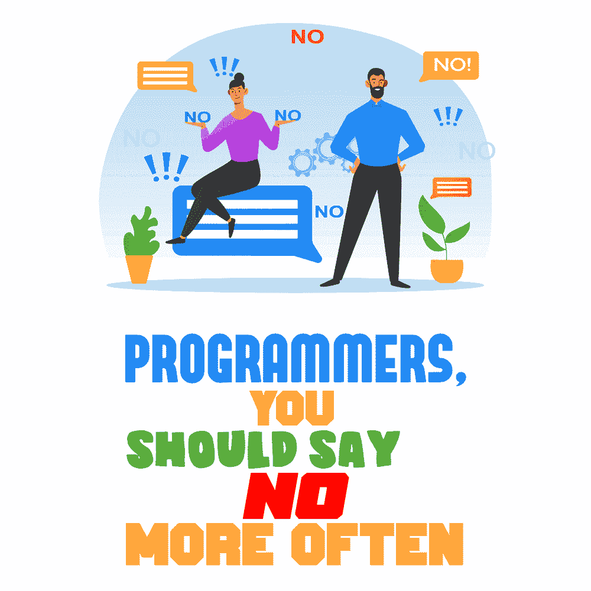

# 程序员，你应该经常说不

> 原文：<https://simpleprogrammer.com/programmers-boundaries/>

We’ve all heard those horror stories: a product manager dropping you a Slack message late on a Friday, saying that they desperately need a new drop-down menu added to the app for a client presentation. Or maybe your CEO has the brilliant idea that everything needs to “utilize blockchain” but can’t explain why. Maybe the newest junior developer doesn’t get that they need to read the documentation carefully and that they can’t just dive in and start coding without it.

在职业环境中，[说不会让人不舒服](https://simpleprogrammer.com/developer-workload/)，如果做得不好还会有后果。你要安抚老板，这会让你觉得拒绝任务会让你丢掉工作。又或许你潜意识里在工作中寻求认同。也许你只是想向自己证明些什么。

有时你只是太忙而没有时间思考和进行艰难的讨论。你可能积压了太多的吉拉门票，觉得没有时间讨论其他事情了。然后，你在没有充分考虑后果的情况下，逆直觉地对某事说“是”。

然而有时候，说不对你和你的组织都有好处。

通过告知利益相关者并对他们进行培训，随着时间的推移，他们可以更多地了解什么是可能的，什么是最佳实践。此外，练习说“不”可以改善你的心理健康，反过来，更快乐会让你更有效率。

在本帖中，我们将看看如何在这些小的不公平变成更大的问题之前将它们扼杀在萌芽状态。学会说不是任何成功职业生涯不可或缺的一部分，软件开发也不例外。

## 说不的成文程序

虽然你当然也应该考虑你自己的工作流程的情况，下面的过程将帮助你开始。

如果你不习惯设定界限，那么这可能会有点尴尬。即使你前几次推背做得很差，你也会在以后学习如何做得更好。过不了多久，你的自信就会建立起来，你会下意识地开始这样做。

### 了解你的周围环境，以便占上风

我们程序员倾向于过度关注代码库。这有时会让我们看不到周围正在发生的事情。有时候，很容易觉得管理层都是傻逼。

但更有成效的思考方式是，每个人都有不同的工作职责和技能。知道人们的思维方式不同是向能够说不并找出为什么这些问题首先出现迈出的一大步。问很多关于请求来自哪里的问题是有好处的，因为你可能会发现一些有用的东西。

这里有一个例子:我们的一个客户的营销团队来找我们要联系名单。这个要求是不合理的，因为我们的工作是构建与他们的数据库接口的应用程序，而不是处理 SQL 查询。为什么他们自己不能得到它？经过一番调查，发现另一家供应商完全搞砸了他们的关键任务平台的迁移。这使得该公司无法联系到他们的客户。哦！

这里的挑战是，说“是”意味着你创造了一条阻力最小的不可持续的道路。客户会没完没了地缠着我们要数据，这超出了我们的职权范围。但另一方面，说不可能会伤害我们的客户关系。找出供应商如何犯错的细节是我们说不的关键。我们说不的方式是在短期内提供帮助的同时，就更正确的行动方针与他们进行适当的磋商。

### 自信、实事求是、尊重他人

[说不](https://simpleprogrammer.com/saying-no-tech-industry/)不需要道歉。您有正当的理由这样做，并且您可能有多年的开发经验。当说不的时候，重要的是要自信并尊重地解释为什么这个要求不合理。尽可能用最不专业的方式解释这一点。

**很好的例子:**“我无法在这段时间内完成这项功能的实施。我需要问一些关于规格的附加问题。在此期间，还将采取相当多的额外步骤。我们能有更多的时间来做这件事吗？”

准备好此时你可能会听到的下一个问题。你可能会被问到你认为什么是合理的时间范围。不可否认，在你完成一半之前，很难估计一件事要花多长时间。因此，请注意这一点，不要害怕给出一个范围估计，也许是最好的情况和最坏的情况。

**不好的例子:**“让我用一种*甚至你*也能理解的方式来解释……”注意你对他人的看法会如何影响你的语言以及你如何与他们交谈。是的，我以前听过有人对产品经理这么说。

这位开发商过去曾公开抱怨说，他们认为总理是“一个白痴”。所以最终它滑了出来，这肯定伤害了关系，程序员没有成功说不的机会。最好是根本不要把人往坏处想。还记得我们说过的人有不同的长处吗？

### 提供备选方案

有时，由于时间限制，要求是不合理的。问，这需要马上发生吗？你能把其他的事情去优先化吗？这有助于确保你周围的人理解被感动的后果，并有助于防止这种情况在未来发生。

也可能存在请求在技术上不可行的情况。如果你不同意一个改变，或者如果这个特性请求是不可能的，你能提供一些在技术上更可行或者更好的东西吗？

### 定期练习

Practice *not saying yes* on a regular basis. Always buy yourself the time to get more information about the request. Instead, simply agree to *assess* every request and nothing more. Doing this should win you the respect of your colleagues, plus you will be seen as more consultative.

毕竟，谁不想成为他们组织的先知，在每一件与你有关的事情上被咨询呢？也许你不在乎这些，但这听起来比没完没了地被命令要好得多！

### 这与输赢无关

有时候说不会对你有利，但不是所有时候。记住，这不是输赢的问题。你不可能每次都能通过谈判获得积极的结果。重要的是，当别人向你提出要求时，你可以为他们的期望树立一个先例。

最终，学会说“不”是在教别人尊重你，因为你是公司不可或缺的一部分，而不是一个总是被胁迫接受不可能任务的人。

## 学会说不是心态的改变

一言以蔽之，这是一种心态和流程的转变。我鼓励您从更高的层面思考这些问题在您的组织中的起源。练习一个从不立即同意，而是同意评估请求的过程可以使体验更具协商性。它会让你在工作场所或客户那里赢得应有的尊重。

希望，作为副作用，你不会再感到在工作中失去控制。通过足够的练习来设定你的时间和精力的界限，你会在职业生涯中变得更加快乐和富有成效。