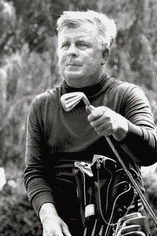
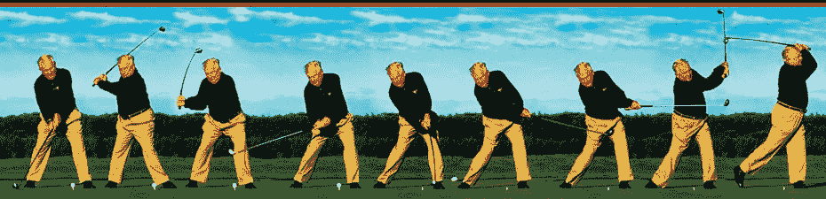
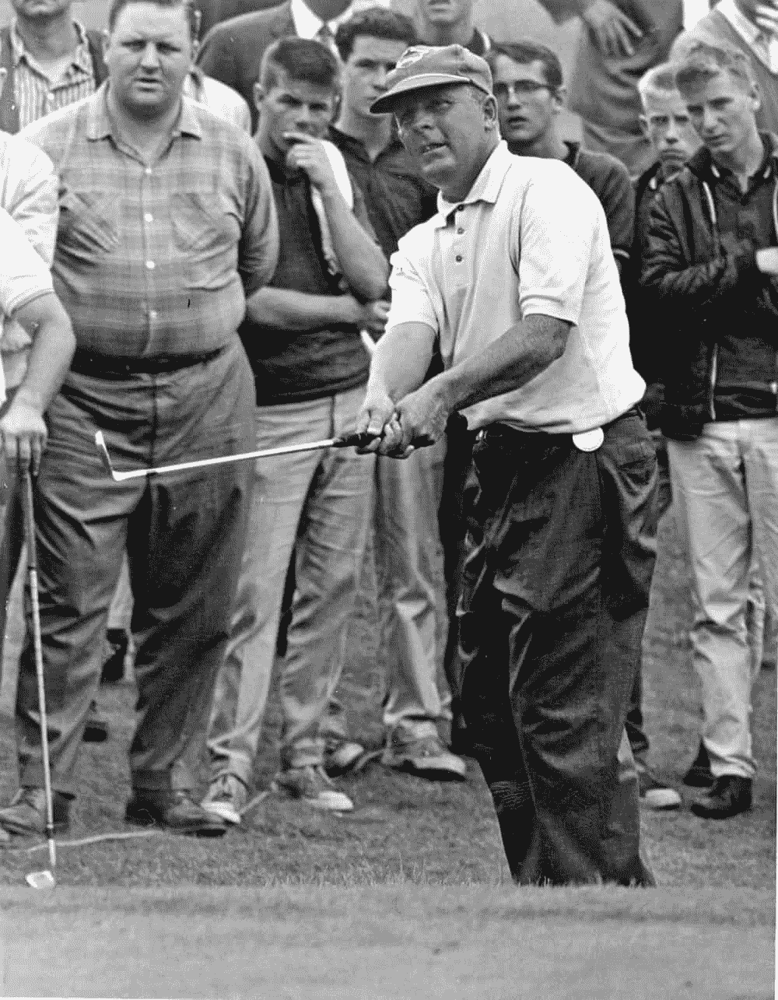

# 程序员能从高尔夫传奇人物默伊·诺曼身上学到什么

> 原文:[https://simple programmer . com/programmers-can-learn-golfing-legend-moe-Norman/](https://simpleprogrammer.com/programmers-can-learn-golfing-legend-moe-norman/)

如果我问你“谁是老虎伍兹？”你可能会告诉我，他是最近历史上最伟大的高尔夫球手，甚至可能是有史以来最伟大的。或者，你可能会提到他在过去十年之交的失宠。

不管怎样，不管你是不是高尔夫球迷，你都可能听说过他。也许你还听说过其他传奇高尔夫球手，如杰克·郭瑞华、本·霍根、格雷·普雷尔、桑姆·史立德或阿诺德·帕尔默。

这些都是非常熟练的高尔夫球手，他们不仅在他们的运动中拥有传奇的地位，而且在一定程度上也成为了名人。

也有很多程序员符合这种状态。我敢打赌你听说过比尔·盖茨、马克·扎克伯格和莱纳斯·托沃兹。虽然它们在编程界广为人知，但你不必成为一名程序员就能知道这些名字。

## 如果我问你“谁是默伊·诺曼？”

除非你是像我一样的铁杆高尔夫球迷，否则我打赌你会一脸茫然地盯着我。谁啊。

首先，让我分享一些莫伊一生中取得的成就:

*   创下了 33 项球场记录(一些消息来源甚至说他有超过 40 项)
*   17 洞一杆进洞
*   三次出手 59(一次用柏忌，62 岁！)
*   连续获得加拿大业余锦标赛冠军
*   赢得 55 场加拿大巡回赛
*   主宰了加拿大高级 PGA 锦标赛，从 1979-1985 年获胜，在 1986 年获得第二名，然后在 1987 年以 8 杆的优势获胜

除了达到这些里程碑之外，默伊·诺曼还获得了其他一些高尔夫大师的赞誉。med rectangle-4-multi-110 { border:none！重要；显示:屏蔽！重要；浮动:无！重要；行高:0；边距-底部:15px！重要；左边距:0！重要；右边距:0！重要；margin-top:15px！重要；最大宽度:100%！重要；最小高度:250px 最小宽度:250 像素；填充:0；文本对齐:居中！重要}

*   老虎伍兹:“只有两个球员真正拥有他们的挥杆——默伊·诺曼和本·霍根。”
*   汤姆·沃森:“我会告诉你一个比任何人都打得好的人。他的名字叫默伊·诺曼，在加拿大。”
*   桑姆·史立德:“他有最好的高尔夫球手。”
*   李·特雷维尼奥:“我不知道有哪个球员能像默伊·诺曼那样击球，只要把它打实，知道它要去哪里。”

高尔夫专业人士的赞誉更多，但大多数人仍然不知道 Moe 是谁。在这篇文章中，我将探究他是如何在精英高尔夫专业人士中获得如此传奇的地位，却从未突破到世界其他地方——甚至是普通的高尔夫社区。我还将从编程的角度看一下我们能从中学到什么。

## 为什么要在简单的程序员上谈论高尔夫球员？

我看到了高尔夫和编程之间的许多相似之处——这可能是我如此热爱两者的原因。例如，你可以在高尔夫球场上挣扎几个小时，感到沮丧和绝望。在一次精彩的恢复性击球后的满足感中，这一点很快就会被遗忘。类似地，一个难以捉摸的软件错误会让你陷入困境，引发一阵又一阵的谩骂和拳头挥舞。一旦你追踪到错误并修复它，那种痛苦的感觉就会被一种巨大的满足感所驱逐。

高尔夫和编程之间有更多的相似之处，所以我认为写一篇涉及两者的帖子会很有趣。如果你是编程类比的爱好者，我推荐 Saeed Gatson 关于软件开发人员能从 Arnold Schwarzenegger 那里学到什么的帖子，在这里，关于简单的程序员。赛义德在报道终结者的许多伟大事迹方面做得非常出色，我们可以向他学习。

像大多数成功的程序员一样，Moe 做了一些荒谬的事情来取得伟大的成果，我们可以模仿这些事情来帮助我们提高自己。

然而，也有许多事情阻碍了他，阻碍了他发挥自己的全部潜力。我们也可以从这些事情中学习！

## 默伊·诺曼做得好的地方

### 通过实验学习

约翰·桑梅兹提倡通过实验进行自学，这是真正掌握知识的关键。

诺曼证明了这样的策略是相当有效的。从 14 岁到 19 岁的青少年时期，莫伊几乎每天都在练习场寻找挥杆机会。

正是通过这五年的自学和实验之旅，他想出了看起来非常不寻常的挥杆动作。事实上，如果你将许多职业高尔夫球手的[挥杆动作中的优雅与莫伊的挥杆动作相比较，丑陋和怪异之类的词语就会浮现在你的脑海中。](https://youtu.be/YCsVU91Hyu4?list=PLkx_YwdxOhppCw9Gqa1wwmlZnp79Jdq3O)

然而，诺曼发现了一种隐藏的优雅。

他极宽的站姿提供了额外的稳定性和更少的活动部件。格雷·普雷尔曾经说过，“诺曼的挥杆动作比我见过的任何挥杆动作都少。”Moe 站得离球更远，让他的手臂有空间轻松清理臀部，而不需要在伸直前腿的同时向上压缩脊柱。

这基本上允许他有一个单一的平面挥杆，这意味着球杆杆身开始和结束在同一平面上。莫伊的挥杆对身体来说容易多了。

摘自:http://moenormangolf.com/

此外，这使得挥杆更具可重复性。在高尔夫球中，这是一致性的关键。诺曼赢得了绰号 Pipeline Moe，因为他能够通过一个容易重复的挥杆持续地将球击直。

作为一个例子，说明莫伊是如何始终如一的，用他可重复的，生物力学上合理的挥杆，让我告诉你一个他曾经做过的展览。在不到七个小时的时间里，莫伊完成了 1540 次击球。没有一次发球落在 30 码宽的着陆区之外(大约是球道平均宽度的大小)。你能想象击中 1000 个以上的驱动器而不错失目标吗？

我们能从中学到什么？

不要害怕挑战传统的方法和实验。

《依赖注入》一书的作者马克·西曼。网。AutoFixture 测试框架的创建者就是一个很好的例子。多年来，Mark 一直是面向对象编程(通过 C#)和测试驱动开发(TDD)方法的权威。然而，他最近开始重新思考他的立场，并认为 TDD 实际上对软件设计是有害的。他甚至称自己为 [TDD 变节者](http://blog.ploeh.dk/2010/12/22/TheTDDApostate/)，因为他相信如果你让测试影响你的设计决策，会导致[测试引发的损害](http://david.heinemeierhansson.com/2014/test-induced-design-damage.html)。

Seemann 已经花了很多时间通过 F#和 Haskell 来试验函数式编程范式，看看是否有更好的方法来设计和测试系统。他发现[功能设计在本质上是可测试的](http://blog.ploeh.dk/2015/05/07/functional-design-is-intrinsically-testable/)，防止测试导致的损坏。

他的实验不止于此。此外，他还进一步发现并[提倡](https://channel9.msdn.com/Events/FSharp-Events/fsharpConf-2016/Types-Properties-Software)具有强类型系统和强大推理的语言允许你用[类型驱动开发](http://blog.ploeh.dk/2015/08/10/type-driven-development/)来驱动你的设计。

从马克身上获得一些灵感。当你在玩一门语言或技术的时候，不管它对你来说是新的还是非常熟悉的，尝试一下都是可以的。遵循惯例通常是个好主意，但是如果你挑战现状，你可能会惊讶于你能做什么。

### 奉献是关键

默伊·诺曼致力于高尔夫运动(7 小时 1540 杆——谁会这样做？).

马尔科姆·格拉德威尔在他的优秀著作 *[离群值:成功的故事](http://www.amazon.com/exec/obidos/ASIN/0316017930/makithecompsi-20)* 中说，要精通任何事情，你需要投入 10，000 小时的练习。因此，显而易见，如果你致力于花更多的时间练习、学习和实验，你会更快地达到精通。这里没有魔法，只有简单的数学。

默伊·诺曼花了 5 年时间每天击打高尔夫球近 8 个小时，同时寻找挥杆机会。五年后，他在击球方面达到了精通。但是莫伊并没有就此罢休。在他的余生中，他要么在练习场练习，要么每天打 54 到 72 洞的高尔夫球。高尔夫是他的激情所在，所以奉献很容易。

这对软件开发者来说很关键。如果你想精通任何开发栈或编程语言，你需要投入时间。

如果是这样的话，朝九晚五的工作是不够的。

我不知道有哪个开发人员会花整整 8 个小时来编写代码。由于会议、同事的干扰等原因，你通常能在某一天抽出一半时间就已经很幸运了。

让我们来分解一下:

*   每天 10000 小时/ 4 小时编码= 2500 天。
*   算上节假日和周末，我们可以说每年工作 250 天。
*   每年 2500 天/ 250 天= 10 年。

10 年真正掌握任何给定的技术！在这段时间内，许多技术和框架都半途而废了(我说的是 Javascript 框架)。

如果你想缩短 10 年的时间跨度，你唯一真正的选择是每天投入更多的时间。在他的书中，马尔科姆·格拉德威尔谈到了比尔·盖茨在 1968 年如何使用一台高中电脑，他用这台电脑很快积累了 10000 小时的编程经验。他的情况很罕见，因为在那个时候使用电脑并不普遍。正是这个独特的机会和他巨大的奉献精神的结合，最终使比尔·盖茨走上了成为近代史上最有影响力的人之一的道路。

希望你对软件开发充满热情，这不仅仅是一份支付账单的无聊工作。在工作之外花些时间来激发这种激情。它可能会导致惊人的事情。

### 玩得开心

即使是最敬业的人也会时不时地感到精疲力竭。关键是要[挺过去](https://simpleprogrammer.com/2012/02/16/pushing-through-the-pain/)，因为那堵墙的另一边会非常有回报。防止精疲力尽的一个关键是确保你玩得开心。

Moe Norman played a lot of golf. *A lot.* How could he play so much and not get bored?

他做的一件事就是玩一些小游戏。例如，Moe 和他的朋友 George Knudson 经常一起练习。他们没有推杆。相反，他们记录球道击球，果岭击球和旗杆击球。每次你错过球道或果岭的费用是 20 美元，每打一次旗杆你会得到 100 美元。这让事情变得有趣，同时还提供了更多的掌握机会。

附带说明:Moe 一天打了 6 根旗杆，包括连续 3 根(都在 5 号铁杆之外)。

莫伊不仅仅是在练习中让事情变得有趣。他也喜欢在比赛和巡回表演中做一些有趣的事情。

有一次，莫伊和桑姆·史立德打高尔夫球。萨姆告诉莫伊，大约 240 码外有一条小溪穿过球道，太远了，不能把球击过去。

萨姆说莫伊应该躲在小溪边。莫伊回答说，他的目标是横跨小溪的那座桥。然后，他直接把球打到 240 码外的桥上。球冲过了桥，停在了小溪的另一边。

默伊·诺曼热爱高尔夫。

> “高尔夫不应该是工作。是为了开心。你会失去什么？一个糟糕的球，仅此而已。如果你丢了你的，从你的包里再拿一个出来打它。这就是游戏的意义，也是 55 年前我学到的第一件事:玩得开心。大多数高尔夫球手看不到光明的东西。他们看到的都是不好的事情。”

作为程序员，我们需要采取类似的态度。希望你成为一名程序员，因为你发现编程本身既有趣又令人兴奋。即便如此，为朝九晚五的开发人员工作，从事相同的项目或相同的技术有时会令人厌烦。

你需要想办法让事情变得有趣。有许多方法可以做到这一点:

*   玩游戏有助于提高你的编程技能。我更喜欢 [CodinGame](https://www.codingame.com/home) ，在这里你可以用各种编程语言解谜，或者参加竞赛挑战自己。
*   如果你喜欢幻想运动，也许你可以尝试数据分析，并编写一些工具来帮助你和你的朋友一起完成年度幻想选秀。
*   你也可以考虑开一个博客。以我个人的经验来看，这是一种帮助其他开发人员学习的有趣方式，同时也是对您知识的挑战。

无论您决定采用哪种方法，请记住编程应该是有趣且有益的。如果你没有，也许编程不适合你。

## 是什么阻碍了默伊·诺曼

尽管默伊·诺曼做了许多令人惊叹的事情，但许多人从未听说过他是有原因的。

### 窄焦点

默伊·诺曼是击球高手。许多人认为他可能是有史以来最伟大的前锋。然而，他把大部分时间花在击球上，花在比赛其他方面的时间少得多。其中一个大问题是。这是他比赛中最薄弱的部分。

莫伊也以玩得快而闻名。有时候和速度较慢的选手比赛，他会倒在地上装睡来开玩笑。这种快速的打球方式经常被解释为加速推杆。

在你做的任何事情中，找出你的弱点并努力改进它们是至关重要的。你不能只关注你的优势，只练习你已经擅长的。

迈克尔·乔丹和韦恩·格雷兹基都以攻击他们的弱点并试图将它们转化为优势而闻名。如果默伊·诺曼也这样做，他会做得更好。

当我谈到关注编程中的弱点时，我指的是几件事:

1.  尽管深入掌握一两种技术或编程语言很重要，但您还必须获得一些其他技术的可操作的、但更浅显的知识。
2.  如果你是一个优秀的面向对象开发人员，你应该学习另一种范式来扩展你思考问题和解决方案的方式。比如学习一门函数式编程语言。
3.  如果你擅长后端编程，那就去学做一个更好的前端程序员。

你明白了。专业化是好的，但如果你想做到最好，你也应该全面发展。

### 信心问题

在高尔夫球场上，诺曼非常自信，但并不傲慢。

有人曾引用他的话说:“如果他们在黑暗中进行比赛，我将是唯一一个能上场的人。我知道该往哪里走。”

尽管他对高尔夫球场充满信心，但众所周知，他有严重的自卑感、对抗问题和害怕被拒绝的 T2。这些问题有很多例子，最终是如此普遍，以至于他从来没有达到他应该达到的成功水平。

有一次，莫伊在赢得一场锦标赛后躲在一个锅炉房里，因为他想避开人们对他领取高尔夫奖杯的关注。

有一次，莫伊参加了 PGA 巡回赛，并且打得非常好。然而，他周围都是他敬仰的高尔夫球员，他觉得自己不属于这里。这一点，加上他在高尔夫球场上的愚蠢行为，当时许多严肃的高尔夫球手都看不起，导致了更衣室的对抗，最终结束了他在 PGA 巡回赛上的时间。

说到编程，信心问题也相当普遍。

我注意到在 Stackoverflow.com 网站上对新手程序员越来越消极的态度。不止我一个，从[这个帖子](http://meta.stackoverflow.com/questions/251758/why-is-stack-overflow-so-negative-of-late)和[这个](http://meta.stackexchange.com/questions/9953/could-we-please-be-a-bit-nicer-to-new-users)就可见一斑。虽然这种苛刻是不幸的，会把人拒之门外，但程序员最好还是脸皮厚一点，处理好拒绝和批评。

在任何职业中，都会有人告诉你该做什么，如何行动等等。不要害怕反击这种欺凌。只要确保你[以正确的方式](https://simpleprogrammer.com/2015/08/17/you-have-to-master-the-rules-before-you-can-break-the-rules/)去做。

## 软件开发是一个很棒的职业。

作为一名软件开发人员，你拥有的技能可以让你潜在地创造出许多人们想要或需要的美好事物。你们中的许多人都是技术高超的程序员，在某个领域有深厚的知识。

希望你能从默伊·诺曼的伟大和缺点中找到相似之处，学会充分挖掘你的潜力。确保你不仅发展了你的技术技能，还发展了你的软技能。

承担风险，记住[失败没关系](https://simpleprogrammer.com/2015/08/10/which-of-these-fears-is-holding-you-back/)。这是学习过程的一部分。玩，实验，享受乐趣。

在编程界或其他领域，你有什么想要分享的榜样吗？让编程保持有趣的有趣方法怎么样？请在评论中分享你的想法。