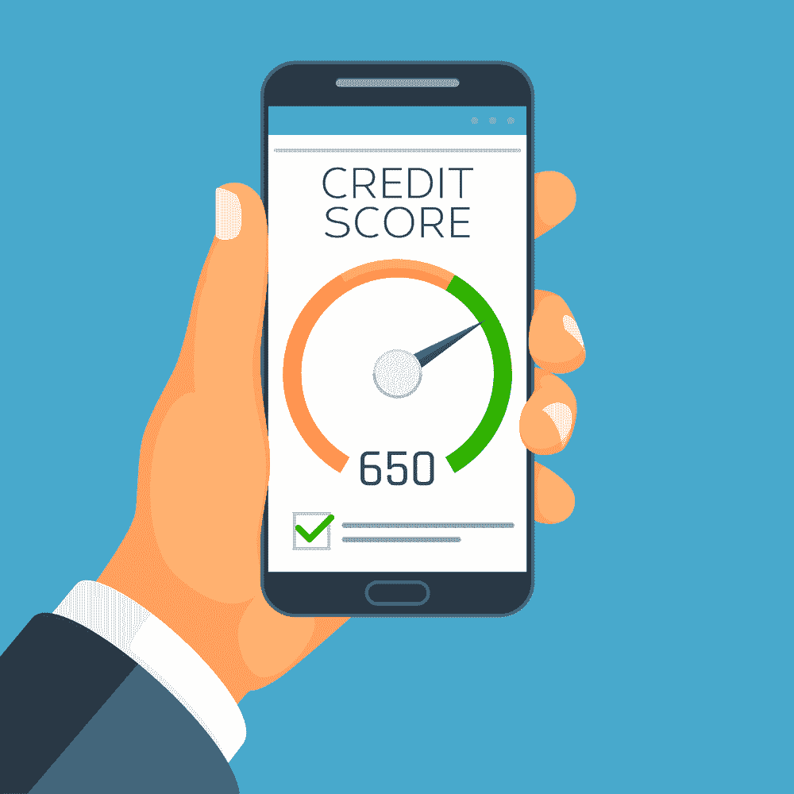

# 程序员指南建立你的信用评分

> 原文：<https://simpleprogrammer.com/programmers-credit-score/>

A **credit score** is an important financial metric to track. For programmers who love analysis and numbers, diving into how credit scores are calculated will likely be a fun exercise for you. For those not as interested, it’s still important to at least *understand* credit scores from a high level, which this guide will provide.

正如我们的[程序员指数投资指南](https://simpleprogrammer.com/index-investing-for-programmers/)中所强调的，高薪是确保你[财务自由的第一步](http://www.amazon.com/exec/obidos/ASIN/0525540881/makithecompsi-20)。然而，高工资并不能保证良好的信用评分，你不想错过一个好的分数提供的好处。

其中，良好的信用评分更容易获得贷款资格，获得较低的利率，获得现金返还奖励信用卡，甚至享受较低的汽车保险费。

作为一名程序员，你可能有很高的收入，并会购买昂贵的资产，如房子和汽车。也许你甚至在寻求贷款来建立自己的公司或设计你一直梦想创建的应用程序。拥有良好的信用评分可以确保你在获得贷款以实现这些目标时获得最好的利率。

在深入研究如何检查和建立你的信用评分之前，我们先来分析一下你的信用评分的细节。

## 信用评分是如何计算的

信用评分由五个部分组成，每个部分对您的总体评分的重要性有不同的权重:

1.  付款历史记录[35%]
2.  利用率[30%]
3.  信用历史的长度[15%]
4.  新信贷[10%]
5.  信贷类型[10%]

支付历史是你信用评分中最重要的组成部分，而新的信用和信用类型是最不重要的。以下是每个组件的简要定义:

1.  **还款历史**:在按时足额还款方面，你的可靠程度如何。
2.  **利用率:**你拥有的未偿债务与你拥有的可用信贷总额的比率。
3.  **信用历史的长度:**测量你的账户的年龄。
4.  **新信用:**查看近期内你新开账户的次数。
5.  **信贷种类:**你所拥有的债务种类(例如，信用卡、学生贷款和抵押贷款都是不同种类的债务)。

这五个部分被放在一起权衡，你会得到一个 300 到 850 的分数。分数越高越好。

以下是 Experian(一家著名的信用机构)如何给每一个分数打分:

*   800-850:异常
*   740-799:非常好
*   670-739:很好
*   580-669:尚可
*   300-579:非常差

如果你处于非常好或非常好的范围，那么你就处在一个好的位置，可能会获得高分的所有好处。

如果你是在非常差或公平的范围，你有一些工作要做，以建立你的信用评分到一个好的分数(或更好)。

## 如何检查你的信用评分

You have more than a few options to check your credit score.

最基本的选择是去 AnnualCreditReport.com 拿你的免费报告。这是一种屡试不爽的方法，但也相当老派。

如果你想在一个更现代和时尚的界面上看到你的分数，Credit Karma 和 Credit Sesame 都是很好的信用监测服务。

检查分数后最重要的事情是检查任何不寻常或虚假的活动。如果你发现有任何不正确的地方影响了你的分数，你可以反驳这些错误，把它们从你的记录中抹去。

## 建立信用评分的 5 种方法

检查完你的分数后，如果你发现自己有需要提高的地方，你仍然可以做一些事情来建立你的信用分数。

大多数高薪人士，包括程序员，已经有了良好的信用评分，尽管即使你现在有很高的信用评分，实施这五个信用建设技巧将有助于确保你的分数在未来保持很高。

**请注意:**像生活中的大多数事情一样，提高你的信用评分需要时间。你应该对任何承诺快速解决问题的人或公司持怀疑态度。

### 持续按时支付账单

如前所述，**支付历史**是计算你信用评分的最重要因素。让支付历史为你工作的最好方法是每月按时全额付清你的债务和贷款。

仅仅因为你用信用卡买了一台新的笔记本电脑或手机，并不意味着你应该推迟付款。

如果你已经有一张信用卡或贷款，那么这应该很容易。简单地按时偿还你的债务，一直如此。

如果你没有信用卡或贷款来建立支付历史，那么你可以开一张新的信用卡来帮助你。如果你目前的信用评分很低，你可能需要开一个安全的信用卡来开始建立你的信用。如果你已经有了不错的分数，那么你可以选择更高级的卡。

**行动:**按时足额还债。

### 提高您的信用利用率

信用利用是影响你信用评分的第二大因素。

通过**信用卡示例**可以最好地理解利用率:

假设你有一张信用卡。这张信用卡会给你一个[信用额度](https://www.juststartinvesting.com/how-to-increase-your-credit-limit/)，或者说在你开始还钱之前你一个月可以花的最大金额。

如果你的信用额度是 5，000 美元，而你每月通常花费 2，500 美元，那么你的信用额度使用率是 50%。

一个好的经验法则是保持你的信用利用率在 30%左右或更低。因此，如果你需要降低你的使用率，你可以要求提高信用额度，开一张有信用额度的新卡，或者干脆减少你的月支出。

**行动:**减少支出，要求提高信用额度，或者开一张新的信用卡。

### 避免打开太多卡片

新的信贷是一个小的，但重要的一部分，你的信用评分。

上面的一些建议涉及到开新的信用卡，但是重要的是要注意开新的信用卡会导致严格的信用检查。这只是一个银行或机构要求检查你目前的信用评分，以确保你是一个可靠的消费者之前，给你一笔贷款。

这种严格的信用检查会导致你的信用短期下降。

那是因为如果你去城里的每一家银行申请贷款，你会显得很绝望，这会引起一些怀疑。假设你要么是一个不负责任的消费者，要么是其他贷款人不断拒绝你。

所以最好在短时间内限制自己的信用被查的次数。

**行动:**六个月内尽量不要申请多张信用卡或贷款。

### 创造多样性

信用类型是另一个，较小的一块你的信用评分，但仍然很重要。

这里的一个警告是，你不应该进入新的债务只是为了创造你的信用报告的多样性。然而，如果你有学生贷款或抵押贷款，但没有信用卡，那么开一张新卡可以是一个聪明的方法，随着时间的推移，提高你的信用评分。

很高兴知道负债并不一定是件坏事。如果负责任地做，它实际上可以帮助你的信用评分。

**行动:**留意你信用评分上的债务和贷款类型。

### 不要关闭信用卡

Last, but not least, your credit length history is the third most important piece of your credit score. This looks at the age of your oldest credit account, the age of your newest account, and the average age of all accounts.

重要的是，你只开好的信用卡(避免那些不值得的信用卡)，这样你就不会在一张你最终关闭的信用卡上浪费一次严格的信用检查。

你还会想留意你有多少张有年费和没有年费的卡。年费信用卡在第一年可能很好，因为有注册奖金，但如果你在第二年关闭信用卡，那么你最终会从你的信用记录中消失——这将对你的分数产生负面影响。

你应该让你最老的卡是无年费卡，这样你就可以永远开着它，并且确保当你开新卡时，它是你会开一段时间的卡的良好组合。

**行动:**确保你最老的卡没有年费，并且不要太频繁地关闭太多的卡。

## 今天就提高你的信用评分

在你提高你的信用评分之前，重要的是你要知道它是什么，并确保它是准确的。

在此基础上，你可以采取[步骤来提高](http://www.amazon.com/exec/obidos/ASIN/1533667926/makithecompsi-20)构成你信用评分的五个组成部分中的每一个:

*   支付历史
*   利用
*   信用历史的长度
*   新信用
*   信贷类型

就像投资和预算一样，建立一个强大的信用评分是程序员在获得强大的财务基础时应该采取的重要步骤。无论你是想有一天建立自己的公司，还是只是享受你的编程工作，拥有一个强大的信用评分都是非常重要的。