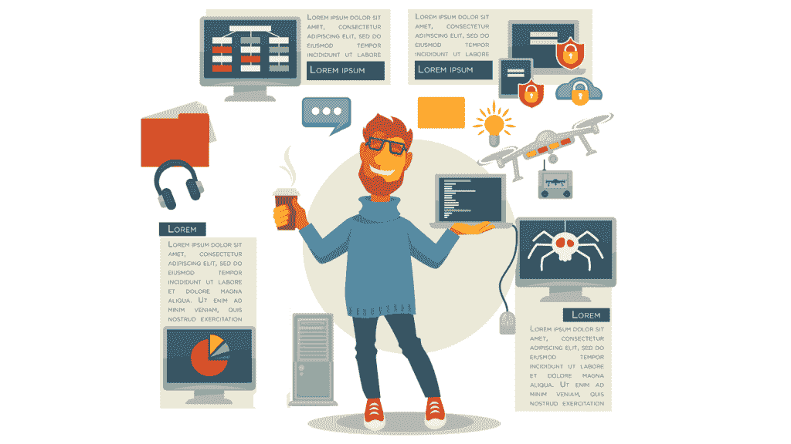
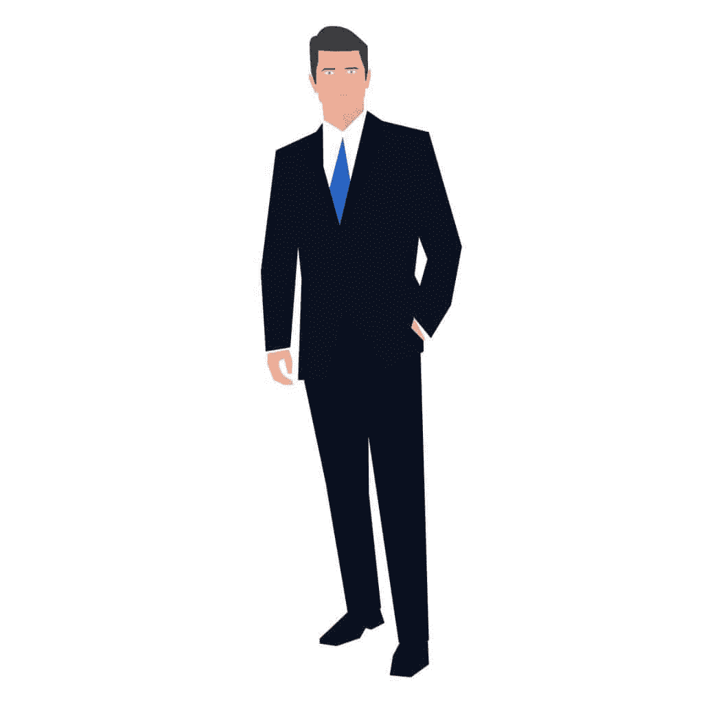

# 程序员上班应该如何着装？

> 原文：<https://simpleprogrammer.com/programmers-dress-at-work/>

软件开发团队，尤其是在西海岸，似乎拥有几乎所有职业中最宽松的着装规范。

我记得在一家小型创业公司工作，被介绍给一个不穿鞋的家伙。

一开始我以为是一次性的，也可能是他出于某种目的临时脱了鞋。

几个星期后，很明显，这家伙就是不穿鞋上班。

奇怪，但不令人震惊——对软件开发人员来说不是。

我在很多开发环境中，基本上都有着装规范。

没穿衬衫，没穿鞋？

好吧。不管你喜欢什么，只要不破坏建筑就行。

但是仅仅因为你想穿什么就可以穿什么，不是吗？

这是本章的问题。

虽然我也为自己穿得不够专业而感到内疚，但我对这个问题的回答是坚决不。

多年的经验和仔细的观察，以及我自己的失误，让我知道**你如何穿着以及你向世界展示的形象很重要——它们是[任何软件开发人员都应该注意的重要软技能](https://simpleprogrammer.com/soft-skills-for-programmers/)。**

即使你只是一只代码猴。

## 外表很重要

事情是这样的，我们都只是生活在芭比世界里的芭比女孩。

是真的，太棒了，我的男朋友…嗯…

嗯，你明白了。

关键是人们会，而且确实会通过你的外表来判断你。

我哪里知道？

嗯，[我曾经是一个超重的邋遢鬼，头发蓬乱，对服装风格没有 GQ 式的感觉](https://simpleprogrammer.com/wp-content/uploads/2016/04/john-sonmez-awkward-book.jpeg)，而[我曾经是一个穿着六块腹肌，漂白白牙的模特](https://spzone-simpleprogrammer.netdna-ssl.com/wp-content/uploads/2014/03/GoPhoto_0039_Scanned-Image-00039.jpg)。

(我实际上是在一家模特经纪公司工作。尽管我从未真正出名。不过，你可能在百货公司的秋季婚纱目录上见过我。)

在这两种情况下，我得到了不同的对待吗？你打赌！

我还是原来的我吗？

这是一个有争议的问题，因为**你的穿着实际上会影响你的行为**——但是，我们稍后会谈到这一点。

基本上，我是同一个人。

**[人人都有偏见。](https://www.youtube.com/watch?v=ssgQ5gzO76g)T3】**

每个人都有刻板印象。

我知道自由派媒体和街上一堆举着标语的人想让你相信这是一件糟糕又恐怖的事情，你应该为自己的所作所为感到羞耻，但事实并非如此。

事实是，我们刻板印象的能力是一种生存优势。T3】

我们的大脑可以观察表面的细节，快速评估情况，并做出可以挽救我们生命的快速判断。

我们不必坐下来思考我们刚刚从周边视觉中捕捉到的狮子看起来是饥饿、邪恶还是脸上带着和平的笑容，以及我们应该对此做些什么。

我们立刻意识到他看起来很危险，很有攻击性，我们可能不应该在附近逗留。

这种完全相同的机制告诉我们，走在街上，穿得破破烂烂，看起来像个流氓的家伙，可能不是停下来问路的最佳人选。事实上，也许我们来错了地方。

现在，我们会错吗？

是的。绝对的。

在许多情况下，我们的刻板印象是完全错误的，而且实际上对我们有害。

但事实是，作为人类，我们每天通过我们的感官接受如此多的输入，以至于我们不得不建立一些机制来做出快速判断，我们一直保持这种状态，直到它们被证明不是这样。

它让我们能够成功地驾驭我们的世界，而无需停下来思考我们看到或听到的每一件事。

我们甚至没有意识到我们正在做这件事。

问题是，一旦我们形成了一个快速的判断，就不那么容易消除了。

即使我们知道我们是通过封面来判断一本书，并受到刻板印象的影响，我们大脑的硬连线，绕过我们的分析思维，仍然完好无损，仍然向我们发送信号。

我为什么要告诉你这些？

我是不是想告诉你，你是一个种族主义者，一个刻板的、有偏见的人，我也是，这没关系吧？

不，一点也不。

我只是想让你**面对现实**以貌取人**是每个人都会做的事情**而我们只能部分控制。

因此，即使你希望自己的大脑和出色的编程技能受到重视，并且你认为除了能力之外的任何东西都不重要，但事实是你的长相和穿着确实很重要。你可以与之进行一场无望的斗争，也可以面对现实，学会面对现实。

相信我，作为一个喜欢穿短裤和人字拖的人，我支持你，但让我们一起面对现实，好吗？

## 服装上面两级

我能给你的关于如何在工作场所穿着尽可能成功的最简单、直接的建议是，简单地穿得比你现在的职位高两层。T3】

不要穿得像你老板那样，穿得像他老板那样。

虽然穿短裤和 t 恤上班是完全可以接受的，虽然这样做可能不会伤害你，但却非常、非常不可能对你有帮助。

有些人可能会抱怨，如果你在别人都穿得很随便的时候穿得很正式，但是有一种本能的、刻板的反应会影响这些人，而他们可能根本没有意识到这一点。

这就是为什么，不管你受到怎样的指责，你还是应该穿得正式一点。

一个人会说你穿得太正式了，衣服在这里并不重要，或者这个环境很悠闲，但他们仍然会认为你更专业，地位更高，不管他们在说什么。

还是不相信我？

试试这个心理实验。

想象一个穿着制服的警官。

现在想象一下这位警官在许多不同的语境和环境下，却依然穿着一身完整的警官制服。

无论你如何描绘他们，无论他们说什么或做什么，制服仍然会影响你对他们的看法。

你可以说没有，但确实有。

这就是为什么穿得比你现在的职位高两层是一个好的通用规则。

人们会像你看那个警察一样看你，不管他们多努力不去看。

“制服”将会借给你超越你目前水平的专业和地位。

## 跟着领导走

比你现在的职位高两级的是什么？

你怎么知道那看起来像什么？

如果你的职位上面没有两级呢？

当有疑问时，跟随领导。

看一看，观察一下管理你公司的管理团队或者首席执行官的穿着。

真正成功的高层人士穿什么样的服装？

尽可能地与他们的风格相匹配，这样看起来你就属于那里了。

记住感知和刻板印象是多么重要。

这里的想法是创造一个积极的刻板印象，让你被认为是一个比你现在地位更高的人。

当评估时间到了，或者高层管理人员试图找出谁该升到更高的职位时，你会看起来很适合这个职位。

想想当某人说某人“看起来像总统”是什么意思。

他们身上有某种特质，让他们看起来很像。

为你要试镜的角色着装。

最好的方法是看看谁已经进入角色，模仿他们的风格，在某种程度上，模仿他们的行为。

## 魅力和矛盾

仅仅因为你打算模仿上级的总体风格，并不意味着你不能也不应该加入自己的风格和个人天赋。

当我还是一名演员的时候，当我扮演某个角色有困难时，我的表演教练告诉了我一些我永远不会忘记的事情。

他说，“**你之所以看起来不地道，是因为人是矛盾的。**你不能只是装生气，你得同时又生气又开心。你必须悲伤，但又兴奋。真实的人，喜欢的人，都是矛盾的。”

我马上意识到他是对的。

我想如何通过同时表达两种看似相反或不相关的情绪来引出我所扮演角色中的矛盾，然后砰，就这样了。

我从这个想法中认识到的是 **[矛盾实际上可以帮助我们创造魅力。](https://www.youtube.com/watch?v=xoRXv9SZK7Q)T3】**

以我为例。

我真的不是你想象中的典型程序员。

我身高 6 英尺 3 英寸，体重 220 磅，大约有 8%的体脂。

我看起来像举重运动员或职业摔跤手，但我说话有点像哲学家或自助大师，我像程序员一样思考。

我有一堆不同的矛盾，这让我比我只是一个“所见即所得”的人有趣多了。

这有意义吗？

你可以将同样的想法应用到你的个人风格中，以增强你的魅力，这将使你更受欢迎，并最终在你的职业生涯和任何社会交往中更成功。

怎么会？

在某种程度上，穿着与你的自然外表相反。

比方说，你碰巧有一种天生的长相，看起来像会计师或精算师。

你有适合它的脸，你戴着眼镜，你有瘦瘦的胳膊，你的言谈举止非常保守，你的声音温柔而胆怯。

如果你穿一件普通的单口袋纽扣衬衫和一条休闲裤，你会看起来更像那个形象。

但是如果你纹了身会怎么样呢？

如果你留着带灵魂补丁的胡子，穿着一件皮背心和几双摩托车靴，会发生什么？

突然间你制造了一个矛盾。

当我看到你的时候，我还不太了解你。

你看起来有点像那个胆小的会计师，但你看起来像是会用链子打我的脸。

我需要知道你在做什么。

你……很有趣。

这是一个相当极端的例子，你可能不想走那么远，但我想确保你明白这个想法。

矛盾是好的。矛盾有意思。

**矛盾=魅力。**

(公平的警告。制造矛盾，有人会对你恨之入骨。它实际上与魅力领域相一致。越多人爱你，其他人就会越恨你。但是，总比完全不被注意好得多。)

仔细想想你的形象和特质，看看如何通过制造矛盾来抵消它们。

如果你有一种天生的令人害怕的行为方式，并且你被负面地定型为一个“暴徒”，不管公平与否，不要试图与之抗争。相反，反驳它。

穿着入时。

穿好西装去上班。

改进你的演讲，这样你就能雄辩地发言了。

让人们看到你时，不得不多看一眼，因为他们的刻板印象似乎被打破了。

## 穿衣服是为了…改变你的个性？

你的穿着会影响你的行为吗？

当然可以。

试着穿背心，反戴帽子，看看你的行为和感觉与穿燕尾服和戴礼帽有什么不同。

我们的穿着会影响我们对自己的看法，影响我们的行为，甚至会改变我们的性格。

这就是为什么当你感到沮丧时，穿着睡衣或运动裤闲逛是一个非常糟糕的主意。

只会让你更加沮丧。

想要在工作中表现得更专业？

穿得更专业。

即使着装规范规定你可以穿人字拖和短裤，而且你不在乎爬上公司的阶梯，你可能还是要考虑你的着装会如何影响你的感觉和行为。

## 状态符号

像昂贵的手表、名牌服装、昂贵的汽车等身份象征呢？？

这些事情真的有助于你在职业生涯中获得成功吗？

我对此深表怀疑。

老实说，我仍然这样认为，因为我认为对于大多数软件开发人员来说，玩地位符号游戏不是一项好的投资，但是我把你交给一个比我“富有”得多的人，他实际上已经验证了这个理论，Neil Patel。

看看他写的这篇名为"[的文章，我花了 162，301.42 美元买衣服，却赚了 692，500 美元。](https://www.quicksprout.com/2014/12/10/how-spending-162301-42-on-clothes-made-me-692500/)

在他的文章中，他继续说，在日常生活中，昂贵的衣服并不是非常有益的，但是在商务会议和网络中，似乎有很大的影响。

我认为这一个是非常情境化的，我不会在这里被带走。

不要背上沉重的债务，刷爆你的信用卡，抵押你的房子来获得一堆身份象征，认为这将是一个好的投资。

但一些财富或成功的关键指标可能是有益的。

对我来说，这个问题还没有定论。

我相信身份象征确实有用，但我不相信软件开发人员和其他科技专业人士的投资回报。

尽管我从一些高薪顾问那里听说，他们在客户会议上驾驶的汽车和穿着打扮可以极大地增加他们的业务——尤其是当他们与高层管理人员打交道时。

我的建议？

如果你要会见 Salesforce 或 IBM 的首席执行官，租一套昂贵的西装和一辆昂贵的汽车，你就可以不用每月付款。

## 如果我不在乎呢？

每当我谈到打扮，以及你应该如何打扮得比你现在的职位高两级时，总有人不可避免地说“我不在乎。”

我不在乎穿着来给人留下深刻印象。

我不在乎升职。

我不想当主管。

我只想做好我的工作，提高我作为程序员的技能，尽可能成功地编写代码。

好吧，如果你不在乎，那就不要。

我不会试图说服你。

我只是给你一些建议，告诉你如何利用人们对你的成见和看法。

你不必应用这个建议。

没有它你也可以完全成功。

你可以穿着短裤和 t 恤成为一名程序员，甚至可以晋升到高级开发职位。

所以，如果你真的不在乎，就不要。

我是认真的。

但如果你做到了，这是一个相当容易控制的成功要素，你可以很容易地将其应用到你的职业生涯中。

选择权在你。

* * *

