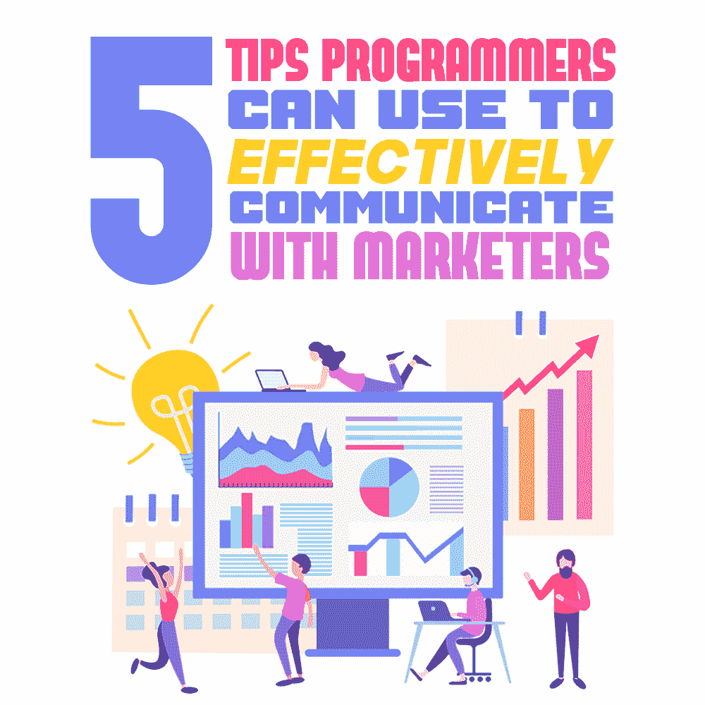

# 程序员可以用来与营销人员有效沟通的 5 个技巧

> 原文：<https://simpleprogrammer.com/programmers-effectively-communicate-with-marketers/>

Programmers are the gatekeepers of a digital product’s success. Although they are not responsible for the product’s live application, they are responsible for its blueprint. And for the project to be a success, they need to be able to communicate effectively with the marketing team in order to create a product that users love.

营销人员和程序员是大多数组织中的两个主要角色。他们也是各自领域的专家，对同行所面临的流程、能力或约束知之甚少。

这就是问题出现的地方。

大多数互联网专家都来自技术领域，这就是为什么他们和与许多不同渠道合作的营销人员之间经常出现脱节。程序员大多不懂营销策略。

另一方面，营销人员是从特定的镜头来看待事物的，他们不会说编程语言。

据网站设计机构称，由于两个团队之间存在巨大的沟通障碍，结果是设计不切实际，速度降低，实现不准确——所有这些都转化为项目失败。

幸运的是，程序员可以做很多事情来加强与营销人员的沟通，这样双方都可以受益。

请继续阅读，了解程序员可以用来有效地与营销沟通的五个技巧。但是首先，让我们来看看为什么程序员和营销人员之间的交流如此重要。

## 为什么有效沟通很重要？

对于营销人员和程序员来说，有效沟通非常重要，因为有越来越多的软件可以实现营销目标，保持竞争力，并满足日益精通技术的客户群的期望。

然而，对于非程序员来说，这似乎是一项艰巨的任务。这就是为什么对程序员来说，找到有效的沟通方式是很重要的:这样营销人员就可以获得信心，在软件方面做出明智的决定。

有效的沟通降低了关键细节在翻译中丢失的风险，并让营销人员更好地了解推动新技术合作的想法和关注点。

如今，营销软件的力量很大程度上在于它能够系统化客户体验的不同方面(以及内部营销运作)，允许营销人员大规模提供更多[量身定制的用户体验](https://simpleprogrammer.com/improve-ux-online-store/)。

但是，所有这些都需要规划和实现高级流程，这些流程被编码和配置到此类软件中。换句话说，营销和编程在不同类型的软件中结合在一起，包括用于以下目的的软件:

*   [营销自动化](https://www.founderjar.com/best-marketing-automation-software/)
*   管理内容营销渠道
*   运行[转换优化](https://blog.replug.io/conversion-rate-optimization/)实验
*   处理社交媒体互动

…等等。

这就是营销和编程这两个过程在这样的软件中共存的方式:

**营销:**该软件创建营销流程的布局，该布局由营销人员根据决策流程和步骤开发，用于向潜在客户提供理想的体验，并引导他们进入[营销/销售漏斗](https://diggitymarketing.com/digital-marketing-funnel/)中的适当阶段。

**编程:**软件——虽然以可视化的方式呈现了上面提到的细节——将过程结构化为计算机程序:If X，do Y，else do Z，等等。这是软件程序员在他们的工作中应用的思维类型。

这些过程配置可以包含在一个软件平台中，也可以跨多个软件产品，它们定义了不同的关键人员接触点。无论哪种方式，营销人员都必须找到将抽象概念转化为具体过程的方法来推进他们的营销使命，程序员可以通过有效的沟通来帮助增强这一点。

记住这一点，这里有一些程序员可以用来有效地与营销沟通的技巧。

## 创建清晰、共同的目标

Having clear, common objectives is crucial to the success of any project. For the most part, programmers and marketers have a common goal, which is to improve customer experience.

双方都同意，不同的客户接触点和互动对取得成功的业务成果至关重要。他们还同意，为了在各自的角色中取得成功，无缝合作至关重要。

为了成功地合作，他们需要明确的共同目标，这将允许他们实现促进业务目标的客户体验框架。

一旦每个人都在同一个页面上，即使过程可能不同，也更容易一起前进。

这里有一些提示可以帮助你设定明确的项目目标:

*   关注透明度:如果两个不同的团队将一起工作，每个人都必须知道他们将面临什么。建立清晰的沟通方式，让每个人都可以轻松地提出建议、提问和反馈。
*   设定 SMART 目标: SMART 代表具体、可衡量、可实现、相关、有时限。当你设定符合这些标准的具体目标时，它会创建一个清晰的路径，并使不同的团队更容易实现它们。
*   定期举行会议:这可以让你们一起计划，一起设定关键绩效指标和截止日期，这样你就可以考虑到程序员和营销人员的不同工作流程。
*   **为团队所有成员创建资源:**员工手册和其他资源对员工来说是无价之宝。他们可以定义目标、目的、策略、战术、指导方针以及团队成员有效合作所需的一切。你也可以使用[在线课程平台](https://www.onehourprofessor.com/best-online-course-platforms/)来创建视听材料，这比一大堆文本更吸引人。

## 弥合沟通鸿沟

有时候，营销人员认为他们在要求简单的增加，而实际上他们可能已经给程序员增加了几十个小时的工作量。其他时候，他们可能认为有些事情是不可能的，而实际上程序员只需要花几分钟就可以实现。

这就是为什么营销人员和程序员之间清晰的沟通是至关重要的，这样双方都能理解为了在规定范围内按时完成项目需要做些什么。

对于程序员来说，沟通是任何项目成功的最重要的因素之一。建立一个符合所有者要求的网站或应用程序，同时确保良好的用户体验(对于那些对 UI 有影响力的程序员)是至关重要的。

然而，如果程序员和营销人员之间的沟通不明确，事情可能会失败，这可能导致产品无法实现其主要目标。

由于营销人员和程序员对概念、术语和实现的复杂性有不同的理解，你必须找到有效沟通的方法。

弥合沟通差距时，请记住以下几点:

*   **相互尊重是关键:**沟通是双向的，弥合沟通鸿沟的第一步是表达尊重，双方都表明他们重视对方的工作。
*   **说出“是什么”和“为什么”:**在讨论新功能时，双方都要理解需要什么以及*为什么*有必要，这一点很重要。当营销人员传达他们请求背后的“为什么”时，程序员更有可能产生真正的影响。
*   **使用合适的工具:**有效和高效的沟通需要使用合适的沟通和协作工具。这对所有的合作项目都至关重要，设置技术工具将促进程序员和营销人员之间更好的沟通。

程序员可以使用许多工具与营销人员交流，反之亦然。要记住的一件事是，面部语言、声调和相关的交流要素确实很重要。寻找面对面交流的方法可以在克服书面交流的障碍方面创造奇迹。

其中之一是使用[网上研讨会软件](https://www.onehourprofessor.com/best-webinar-software-platforms/)创建可以与营销人员分享或直接见面的信息。然而，有时其他工具更适合这项工作。

例如，您可以使用聊天平台进行即时交流，使用数据/报告平台存储有价值的数据，使用文件共享平台让两个团队轻松访问信息，使用视频会议软件进行指导和会议，甚至使用[内部短信](https://www.textmagic.com/blog/guide-to-leveraging-internal-sms-communication/)快速整理任何问题，等等。

## 建立一种共享语言

另一种促进营销人员和程序员之间合作的有效方法是建立一种共享语言。这将改善跨部门的沟通，从而提高你的项目成功率。

为了让团队有效协作并为用户提供出色的数字体验，他们都需要了解产生所需解决方案所需的工作。

建立一种共同的语言使他们交流起来容易得多。程序员的语言是代码，但大多数营销人员对前端编程语言没有基本的了解。

幸运的是，市场营销人员和开发人员可以使用像 Basecamp 或 T2 Slack 这样的在线工具达成共识，这样他们就可以一起工作来创建满足用户需求的功能性应用程序。

诚然，这些工具不会帮助营销人员或程序员理解对方的所有术语和行话，但它将有助于促进一个环境，在这个环境中，多个团队成员可以协作，并帮助彼此澄清项目的需求。

这些工具将允许团队创建和应用共享的愿景，这反过来将为程序员提供构建应用程序的可靠蓝图。然而，沟通障碍总是会有的，重要的是要记住[完美是好](https://businessguru.co/perfect-is-the-enemy-of-good/)的敌人。

只要营销人员和程序员之间进行真正的尝试来相互理解，大多数沟通问题都会迎刃而解。

## 分享所有信息

Another way to help programmers communicate effectively with marketers is to share all information, including the [marketing plan](https://www.visme.co/marketing-plan/), as well as tracking the project development. This will ensure a seamless collaboration, which makes it an invaluable investment in the project’s success.

### 使用基于云的协作软件

各个团队的成员可以在一个可访问的平台上实时协作、共享信息、提问和提供反馈。

有了可靠的基于云的[协作工具](https://www.fylehq.com/blog/remote-collaboration-tools-small-businesses)，程序员和试图获取新信息的营销人员之间的来回通信将会减少，这最终会使满足截止日期和目标变得更加简单。

### 使用电子邮件平台

程序员和营销人员有效沟通的另一种方式是通过使用电子邮件通信的共享所有权。

两个团队都直接参与多个重要的客户沟通渠道，包括[营销电子邮件](https://blog.contentstudio.io/strategies-for-email-marketing/)、交易电子邮件、展示广告、短信等。您可以使用类似 Twilio 的工具，为每个渠道设计 API 和解决方案。

合适的电子邮件工具是使双方在所有电子邮件上更容易合作所需的单一解决方案。

## 使用数据驱动的见解来指导协作

我们生活在一个数字世界，成功是用数据来衡量的。程序员可能会为企业创造利用大数据的技术，但它也会反馈给他们，以产生业务成果并增强协作。

营销人员利用数据驱动的洞察力来更好地为他们的日常营销策略提供信息。还有[先进的自动化技术](https://www.g2.com/articles/artificial-intelligence-terms)，比如通话录音解决方案、[人工智能](https://simpleprogrammer.com/ai-technology-changing-the-future/)，机器学习等。，拓宽了数据收集范围。

存储和分析与客户与公司互动的*原因、*时间和*方式相关的大数据，以便营销人员能够更好地了解他们的行为并增强他们的体验，最终带来更好的业务成果。*

*关于程序员和营销人员之间的合作，可以利用数据提供有价值的见解，为现在和未来的产品开发提供信息。*

*这样，营销人员可以轻松获得无限的客户数据和反馈。然后他们可以将它传递给程序员和开发团队，他们将致力于改善用户体验和产品功能。*

*这种暗示令人震惊，当这两个团队一起工作并有效沟通时，他们所能取得的成就令人惊叹。*

## *不需要沟通障碍*

*现在你知道了——程序员可以用来与营销人员有效沟通的五个技巧。如你所见，不再需要忍受营销人员和程序员之间经常存在的沟通障碍。*

*通过付出一点额外的努力来实施这几个策略，你将能够增进你的工作关系；享受舒适、协作的专业环境；并从成功的项目中获得回报*

*你认为这些建议会帮助你更有效地与组织中的其他部门沟通吗？在下面的评论中分享你的想法吧！*