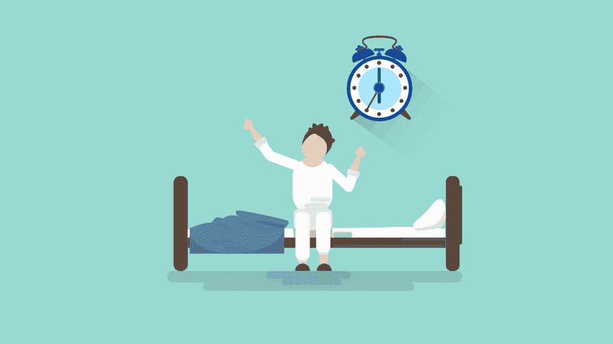
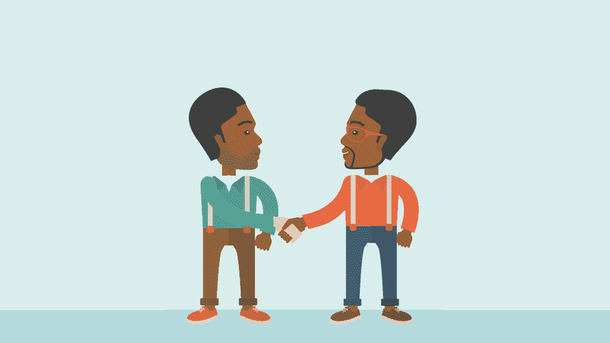

# 程序员的临床抑郁症

> 原文:[https://simple programmer . com/programmers-great-clinical-depression/](https://simpleprogrammer.com/programmers-great-clinical-depression/)

我有多年的临床抑郁症史，由几个不同的医学专家诊断。它在日常对话中不常出现，一般来说，我实际上没有任何症状。

但我的抑郁症挥之不去。当我没有花时间去努力保持良好的精神卫生时，它又回来了。有时候会变得很难看。谢天谢地，这种事已经好几年没发生在我身上了。但是这种情况有可能发生，所以我必须保持警惕。

你可能已经在想“我为什么要读一篇关于临床抑郁症的帖子？这个博客关注的是编程，而不是精神障碍。”

我可以简单地回答这个问题:**程序员的生活方式极大地增加了临床抑郁症的可能性。**

## 抑郁症可以吸它

无论如何，我对这一点毫不怀疑。抑郁症是恶魔的产物。

来自抑郁的轻蔑的可怕使邪恶的有形性看起来格外真实。

抑郁症骗你。它告诉你，你不值得，这个世界讨厌你，如果你不在了，每个人都会过得更好。

那是脱下被子起床的日子。有时，抑郁甚至会削弱行动的意愿。

抑郁症让你觉得想要结束自己的生命。因为你觉得你无法逃避它——无论你走到哪里，它都站在那里嘲笑你，告诉你你是一个多么糟糕的人。

然而，奇怪的是，在大多数情况下(包括我的)，生活方式的选择可以帮助它从完全消耗变成容易忽视。

## 抗抑郁药程序员的生活方式

当我第一次开始与我自己的临床抑郁症作斗争时，我的心理学家向我推荐了一个重要的资源，这本书是这样的: [*《抑郁症治疗:不用药物战胜抑郁症的 6 步计划》*](http://www.amazon.com/exec/obidos/ASIN/B0097DHV94/makithecompsi-20)[Stephen s . Ilardi 博士](https://psych.ku.edu/stephen-s-ilardi)。

这 6 个组件包括:

1.  获得足够的阳光
2.  获得充足的睡眠
3.  进行足够的锻炼
4.  集中精力从你的饮食中获取足够的ω-3 脂肪酸
5.  社交(不只是在脸书！)
6.  避免沉思

## 获得足够的阳光

到户外直接获得阳光是很重要的。

这是被锁在里面连续编码几个小时的程序员经常会遇到的问题。即使你在一个有很多玻璃的建筑里工作，并且在工作时得到阳光，未经过滤的阳光真的很重要。即使是最好的窗户也会过滤掉一些自然光谱。

建议建议每周三次，每天至少花 15 分钟在明亮的直射阳光下。

当我们每天花几分钟在户外时，会发生一些事情。

首先，我们的身体能够更好地调节自然进入血液的褪黑激素的数量。这让我们在就寝时间昏昏欲睡。这是件好事。

其次，它帮助我们的身体产生、调节和吸收[血清素](http://www.webmd.com/depression/features/serotonin)。从化学角度来说，我们大脑处理血清素的方式直接影响了我们战胜抑郁思维的能力。虽然我不太了解血清素在我们大脑中的变化，但没有它，我们不会感到快乐。

太多的程序员在没有窗户的立方体农场里工作。让它成为一个有目的的外出点。日光灯和其他人工光源都不能解决这个问题。

## 去睡觉

我们基因组中的大量证据表明，自从我们发出咕噜声、挠腋窝、不穿太多衣服遮盖身体部位以来，我们并没有真正改变多少。没错。我说的是穴居人。

你知道当太阳落山时穴居人做什么吗？他们去睡觉了。没有光源，打猎就不那么容易了。

调节良好的生理节奏对大脑再生有很大帮助。它帮助我们重建脑细胞，并有效地利用血清素。

当你走到外面，让你的大脑正确地制造褪黑激素时，听它。当你的大脑说去睡觉…去睡觉！

程序员在这方面有一个独特的问题，这个问题真的把我们搞得一团糟。当我们整天盯着电脑屏幕时，我们得到了太多含有蓝色光谱波长的光。

有一件事可以帮助我确定我没有欺骗我的大脑？我使用一个色调调整程序，比如 [f.lux](https://justgetflux.com/) ，来红移我设备上的屏幕。蓝光抑制了我们大脑对褪黑激素做出适当反应的自然能力。所以，调低蓝光，调高红光，让你的大脑认为你的笔记本电脑是一堆篝火。

此外，不要熬夜阅读或处理有趣的副业。虽然我们都知道解决一个计算问题有多棒——但有时我们更擅长解决这些问题，如果我们[只是睡一觉](https://simpleprogrammer.com/2016/06/16/sacrifice-sleep-can-work/)。

还有——这是个大问题，可能会让你生气，**把电视或电脑从你的卧室里拿出来**。曾经有一位伟大的医生告诉我“卧室是用来睡觉和做爱的。句号。”这是你可以带到银行去的建议！如果你把外部性带入卧室，睡眠卫生是超级难实现的。

一般来说，你真的想每晚至少睡 7.5 个小时。任何东西少了，睡眠的恢复和恢复作用就不能完成任务。

现在最酷的事情是[智能手表](https://simpleprogrammer.com/2016/02/08/pebble-steel-review/)让跟踪睡眠变得非常容易。虽然我没有任何确凿的证据证明这些数据有多准确，但我可以告诉你，我的 Pebble 在帮助我确保获得正确的睡眠时间方面做了非常出色的工作。

## 汗

理想的情况是，在你晒太阳的同时流汗。

如果你使用番茄工作法(你应该这样做),那么在 15 分钟的休息时间里流汗。在你的办公室外面走几圈。

对我来说，散步帮助我清理蜘蛛网，重新专注于手头的下一个任务，并感到重新充满活力，再次集中注意力。

让心率达到心血管“出汗”范围确实有帮助。

当我们的身体得到锻炼时，我们会产生一种叫做内啡肽的东西。这是世界上最好的自然高潮，因为我们天生就想保持身体健康。但是作为程序员，我们有时会在椅子上坐太久。

我们旧石器时代的祖先依靠汗水和健康。否则剑齿虎先生早就把它们当饭吃了。

### 流汗胜过压力

如果你已经进行了一场激烈的谈话，你可以做的最重要的事情之一就是去散步。

我们的情绪——以及抑郁——都与我们体内的激素水平有直接联系。又回到那些穴居人身上。当我们作为穴居人感到压力时，通常是因为我们快要死了。

现在压力的作用有点不同了。但是我们的身体仍然依赖于我们获得内啡肽来抵消压力产生的皮质醇激素。

从极度紧张的情况或谈话中恢复过来的最好方法是快走。让你的心率加快一点。你内心的穴居人会为此感谢你的。

### 出汗会影响睡眠——小心

内啡肽往往会欺骗我们的大脑，认为现在不是睡觉的好时候。当我们住在洞穴里的时候，内啡肽通常发生在我们刚刚在白天出去打猎的时候，或者当某种食肉动物扑向我们的时候。这意味着在脑内啡泛滥的情况下睡觉是非常困难的。

确保在锻炼和睡觉之间至少留出一个小时(最好是几个小时)。一旦内啡肽消退，褪黑激素的作用甚至会比它们没有出现时更好。

## 摄入足够的ω-3 脂肪酸

我们大脑的灰质使用一种非常重要的化学物质作为在那里发生的所有其他事情的基础。

ω-3 脂肪酸构成了我们用来思考的大部分物质。

不幸的是，美国生产的大多数食物都严重缺乏ω-3 脂肪酸。

我每天都服用鱼油补充剂，因为我现在不擅长正确饮食。我知道很多程序员认为快餐是一个可以接受的食物群体。我向你保证，快餐严重缺乏 Omega-3 脂肪。

如果你足够幸运(或专注)以自由放养的牛肉和野生捕获的鱼为蛋白质来源，这对你来说不是问题。

谷物喂养的食物往往会导致不均衡的欧米伽-3:欧米伽-6 含量。

有趣的是，你吃的欧米伽-6 的数量对大脑健康并不重要(尽管它可能会堵塞你的动脉)。只要你把你的欧米伽-3 摄入量提高，它更多的是关于比率而不是原始量。

## 与真实的、活生生的人类交谈

我参加了几个不同的 [Slack](https://slack.com/) 团队。Slack 绝对是团队协作和想法分享的绝佳工具。

这是保持项目联系的好方法。但这也是一种脱离人性的好方法。

脸书、推特、Instagram、Slack 和所有其他让我们这些专注于屏幕的人与人联系的平台实际上都有一个极其严重的缺点。

人类需要人际关系。穴居人在一起生活、一起成长、一起养家、一起狩猎、一起死亡的部落中茁壮成长。

我们的大脑渴望人际交往。对于大多数程序员来说，这似乎很难。我认识的大多数程序员通常性格内向，倾向于独处，避免真正的人与人之间的直接交流。如果没有别的，当你正在处理一段困难的代码或者第 80 次测试时，你真的不能花很多时间和别人交谈。

生活中有人类是很重要的。否则，在这段低迷时期，你的支持网络似乎是有限的。

## 别在自己身上拉屎

这最后一个对我来说是最难的。每当我不小心在路上拦住了别人，或者做出一些其他社交上尴尬的失礼行为，我都会为此自责很久。

很难不去想一个情况。尤其是因为我是程序员，所以我拿工资去思考。一直都是。

编程是一个非常主观的职业，涉及大量的同行评审时间。这也包括我必须不断地解释为什么某些概念必须适用，以及为什么团队指定的标准很重要。

但是，如果我的抑郁症没有得到控制，我会经常担心侮辱团队成员；或者我是否在那次糟糕的交通中搞砸了。

给你一个提示——我的同事一直在进步。到目前为止，我从未造成交通事故或任何明显的道路愤怒。

伊拉迪博士的书建议为他所谓的沉思设置一个真实的计时器。如果 10 分钟后你还不能对一个消极的想法得出有意义的*可行的*结论，是时候关闭这个想法了。

我们是程序员。我们有很多其他的事情可以投入大量的脑力。自我厌恶真的不应该是其中之一。

## 药学帮助

我不擅长大脑化学。或者化学，真的。但是，我知道大脑中的化学反应会极大地影响抑郁。

我的超级棒的家庭医生向我介绍了一种相对较新的诊断，[mth fr 基因的基因突变](https://ghr.nlm.nih.gov/gene/MTHFR)。

点击链接。我保证这个缩写不是我编的。这是母亲的基因。

这种基因的突变会降低大脑自然产生 L-甲基叶酸还原酶的能力。

这可能导致抑郁症的易感性，因为这种化学物质的减少对大脑中的连锁反应非常重要，使血清素正常工作。

所以，我开了几个药方来帮忙。一种叫德普林，另一种是低剂量的利莎普。

如果我在坚持抗抑郁药程序员生活方式的六个步骤方面做得非常非常好，我可能会放弃 Lexapro。但是，就目前而言，它仍然是我政权的一部分。可能在可预见的未来，直到我的孩子长大一点，我在管理时间方面变得更好。

否则，我知道我没有做好我应该做的。我不想再那么沮丧了。永远不会。

## 战胜抑郁让我更强大

我重申——我必须保持警惕，以确保我可以称我的抑郁症为“被打败”它永远不会真正消失。我每天都要打败它。

你可能想知道标题，以及为什么我把“伟大”这个词包括在内。

让抑郁变得伟大的是努力与让抑郁变得更糟的事情做斗争。事实上，我比开始变得抑郁之前更有能力完成任务。

以对抗抑郁的方式生活大大提高了我的信心。

尽管我绝不是良好饮食和锻炼习惯的缩影，但我知道良好的饮食生活方式(注意——这并不意味着节食)和规律的锻炼制度会有很大的不同。它给我留下了更多快乐的日子和更少压力的日子。

精神健康和身体健康有着极其紧密的直接联系。

## 好好照顾自己

抑郁症迫使我改善我的身体健康和精神卫生，但现在我有了一个伟大的，永远存在的动力，不要忘记它。

这就是抑郁症的伟大之处。抑郁不是好事。事实上，我讨厌它。

但是，抑郁症总是提醒我要照顾好自己。太棒了。这有点像我自己的内部问责系统。

如果我不照顾好自己，我的抑郁症就会复发。这就是全部了。

我有动力照顾好自己。

希望读完这篇文章后——它能帮助你理解为什么自我保健如此重要，却又如此容易被忽视，尤其是对我们这些程序员来说。你也会有动力。

我们都应该感觉很棒；最重要的是，成为伟大的人。