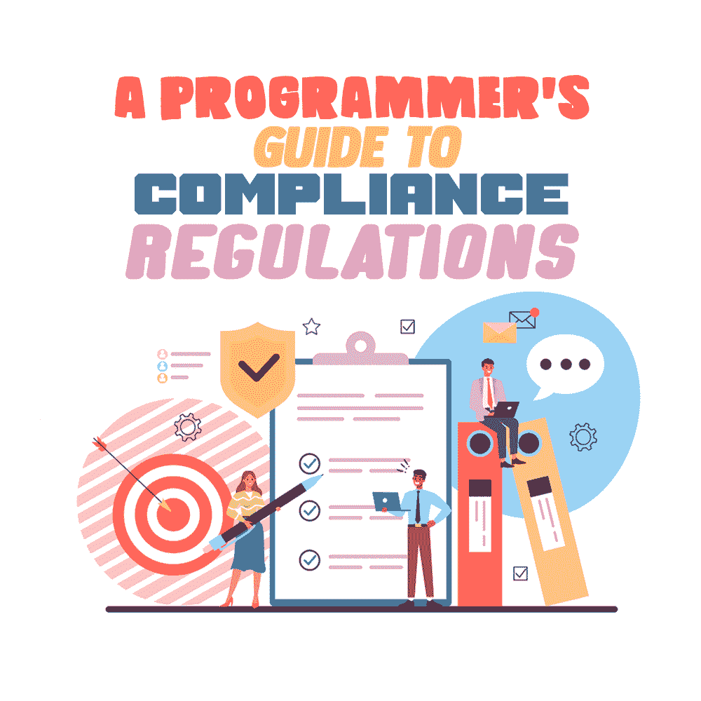

# 符合性规则的程序员指南

> 原文：<https://simpleprogrammer.com/programmers-guide-compliance-regulations/>

An important part of the planning phase of the [software](https://simpleprogrammer.com/guide-secure-software/) development life cycle is understanding what regulations will apply to your software. If you are an independent programmer looking to build your own [startup](https://simpleprogrammer.com/not-start-startup-as-a-programmer/), you need to understand these regulations so you can avoid heavy fines, criminal lawsuits, or a potential suspension of your business.

如果你为一家公司工作，这将帮助你构建符合设计的应用程序。这样，您和您的主管将节省大量的时间，因为您不必回头对应用程序的第一个版本进行同样多的更改。

请记住，您是作为业务的一部分工作的，因此理解您编写的软件的业务需求将有助于使您成为更有价值的程序员。根据您在世界的哪个地方，您的客户在哪里，以及您的应用程序将用于哪个行业，这将影响管理您的应用程序必须如何处理消费者信息的法规。

如果你不知道这些[法律](https://www.amazon.com/dp/1439806926/makithecompsi-20)或者你没有遵守，你和你的公司可能会面临罚款、潜在的牢狱之灾，并且你可能会被强制停业，直到你遵守为止。

现在，在一个应用程序的生命周期开始时，改变处理信息的方式是相对容易的，但是如果你有成百上千的用户，你必须回头去解决这些问题，那就困难得多了。

在这篇文章中，我提供了一个程序员在构建应用程序时需要了解的一些主要行业规则的列表。这不是一个详尽的列表，但由于具有国际管辖权，这些法规影响了大量企业。

此外，我还纳入了影响大量北美(美国和加拿大)和欧洲企业的法规。如果你想了解更多会影响到你的业务，可以考虑按你的所在地、你的行业和你的预期客户所在地进行搜索，这样你就可以找到所有适用的法规。您可以点击任何法规的名称，查看该法规的详细分类。

## 支付卡行业数据安全标准(PCI-DSS)

[该法规](https://www.securitymadesimple.org/cybersecurity-blog/how-to-be-pci-dss-compliant)影响全球所有接受或处理信用卡或接受、传输或存储持卡人信息的公司。一旦发生数据泄露，所有这些公司都直接对信用卡公司和处理交易中涉及的资金的银行负责。

这意味着您的合规要求的细节以及您收到的任何罚款/处罚将受到您使用的信用卡公司的影响。你可以在这里阅读关于一家零售商通过 PCI-DSS 从 Visa 收到 1320 万美元的罚款。持卡人信息包括持卡人姓名、到期日期、磁条数据、主账号(PAN)和卡 pin。

PCI-DSS 合规性要求合规性证明、季度网络扫描和经批准的 PCI 评估。如果你是一名独立的程序员或在一家小公司工作，你需要进行内部和外部漏洞扫描，这将测试你的应用程序和网络的安全级别。

如果扫描发现任何严重的安全漏洞，您将需要修复它们，以便通过这部分的符合性测试。如果你是一名程序员，你的责任就是确保你的应用程序能够通过漏洞扫描，但是如果你是一名独立的程序员，你将被要求完成一份[合规证明](https://www.pcisecuritystandards.org/document_library)。

这意味着，除了证明符合 PCI-DSS 之外，如果您每年的交易量超过 600 万次，还需要进行外部审计。如果你有更少，你可以完成一份[自我评估](https://www.pcisecuritystandards.org/pci_security/completing_self_assessment)问卷。

## 健康保险流通与责任法案(HIPAA)

[HIPAA](https://www.securitymadesimple.org/cybersecurity-blog/introduction-to-hipaa-compliance) was passed by Congress in 1996\. The privacy aspect of HIPAA is overseen and enforced by the U.S. Department of Health and Human Services (HHS) office. HIPAA affects all companies that collect or process any protected health information (PHI) from U.S. citizens, as well as these companies' business partners.[ ](https://www.hhs.gov/hipaa/for-professionals/privacy/special-topics/de-identification/index.html)

[PHI](https://www.hhs.gov/hipaa/for-professionals/privacy/special-topics/de-identification/index.html) 是由相关实体或业务伙伴以任何形式或通过任何媒介持有或传输的任何个人可识别健康信息。未能满足 HIPAA 合规性可能导致每次违规或每次记录罚款 100 至 50，000 美元。

最高罚款为每年 150 万美元，但根据违规的严重程度，你也可能面临牢狱之灾。总部位于田纳西州的管理公司 CHSPSC 因五项违规行为，包括违反 600 多万条记录，收到了 HIPAA 历史上最大的一笔 230 万美元的罚款。

一些被认为是 PHI 的项目包括患者姓名、电话号码、地理位置、社会保险号和生物标识符。如果您的应用程序将用于医疗保健行业，HIPAA 将是一个需要理解的重要法规。

HIPAA 合规性有三个组成部分:保护消费者权利的隐私规则，规定公司必须如何保护消费者信息的安全规则，以及规定不合规后果的执行规则。为了遵守这一法规，如果您打算将用户的信息用于除治疗、支付或医疗保健操作以外的任何用途，获得用户的同意是非常重要的。

此外，HIPAA 安全规则要求您具备特定的安全功能，例如唯一用户标识、加密和解密以及正确的用户身份验证。你可以在这里找到需求[的完整列表。](https://www.securitymadesimple.org/cybersecurity-blog/hipaa-security-rule-explained)

## 个人信息保护和电子文档法案(PIPEDA)

[该监管要求](https://www.securitymadesimple.org/cybersecurity-blog/a-guide-to-pipeda-compliance-for-canadian-businesses)适用于在加拿大收集个人信息的私营部门组织。其目的是确保在商业活动中保护个人信息。

例如，它要求公司以清晰易懂的方式向用户传达他们收集信息的目的，以便人们知道他们注册的目的。不遵守 PIPEDA 可能导致高达 100，000 美元的罚款，在严重的情况下，如果您试图隐瞒您的违规行为或强迫员工违规，可能会被监禁。

PIPEDA 由加拿大隐私专员办公室监管。合规性要求您遵循以下 10 项公平原则，这些原则适用于个人信息的收集、使用和披露以及个人信息的访问。

*   责任——您必须承认遵守这些原则的责任，并指定专人对此负责。
*   识别目的——你从用户那里收集的每一条信息都必须有明确的目的。
*   同意—您必须获得用户的同意才能为特定目的收集信息。如果你收集了信息并想在以后用它做新的事情，你必须得到新的同意。
*   限制收集—信息收集必须限于贵公司确定的目的。
*   限制使用、披露和保留—只能出于收集目的披露个人信息，并且只能根据实现该目的的需要保留个人信息。
*   准确性—个人信息必须尽可能保持最新。允许用户根据需要更新他们的信息。
*   安全措施—相对于信息的敏感程度，个人信息应该受到安全措施的保护。
*   公开性——您必须让公众能够方便地获得有关您保护个人信息的政策和实践的详细信息。
*   个人访问—个人应该能够访问其完整的数据档案(您收集的关于他们的所有信息)，并能够质疑该信息的准确性。这应该是免费的，并在 30 天内完成的请求。
*   挑战合规性——个人应该能够挑战您的企业是否遵守这些原则，并让直接负责您公司合规性的人员来解决这个问题(规则 1)。

## 通用数据保护条例(GDPR)

GDPR 是欧盟制定的隐私法。GDPR 是一系列关于处理消费者信息的法规。

它会影响所有位于欧盟或从任何欧盟居民处收集信息的公司，无论该公司在哪个国家开展业务。它的重点是让公司负责保护客户的信息，并让客户更好地控制他们的私人信息。

GDPR 由信息专员办公室( [ICO](https://ico.org.uk/about-the-ico/who-we-are/) )监管，这是一个独立的英国机构，旨在维护信息权利。未能遵守这些要求可能导致高达 2000 万欧元或高达违规公司年收入 4%的罚款，以较高者为准。

对于较轻的违法行为，罚款将减半，为 1000 万欧元或高达年收入的 2%。为了与 GDPR 兼容，程序员应该注意六个要点。

*   您必须获得收集信息的许可，并允许人们随时撤销该许可。
*   您必须让消费者能够免费请求他们的完整数据配置文件(您拥有的关于他们的所有信息)，并且必须允许他们更新这些信息。
*   用户必须有能力从您这里获得他们的信息，并在其他地方使用。
*   及时的违规通知:您有 72 小时的时间通知任何受影响的用户。
*   被遗忘的权利:用户有权要求删除你关于他们的任何信息。
*   隐私设计:您的应用程序必须在应用程序和与之相关的任何系统中构建良好的安全实践。

## 了解这些规则，就不会惹上麻烦

Having a good understanding of regulatory requirements will benefit you whether you are an independent programmer looking to create a company or if you are a salaried employee building software for a company.

监管要求在每种情况下都是不同的，基于位置、消费者的位置和给定的行业。常见要求包括内置安全功能、收集用户同意以及尽可能匿名个人信息。

不遵守这些法规可能会导致您在应用程序发布后花费大量时间对其进行修改，支付高额罚款，在最糟糕的情况下，您的业务可能会被暂停，甚至可能被监禁。

作为一名程序员，如果你花时间熟悉影响你的法规要求，你将大大增加你对你工作的任何公司的价值，你将为你的经理节省大量的时间和麻烦，他们会因此而喜欢你。