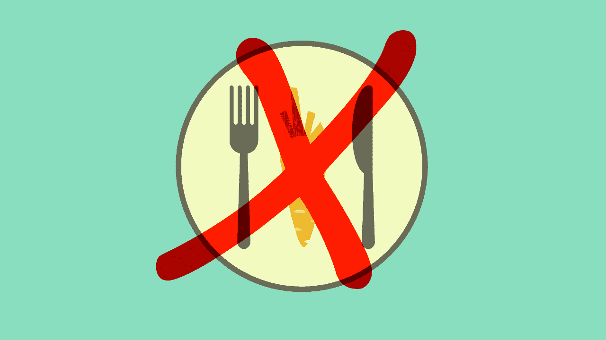
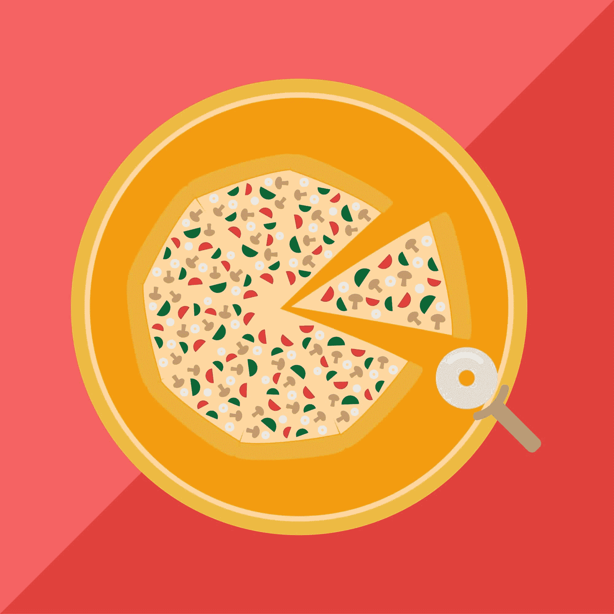

# 程序员禁食指南

> 原文：<https://simpleprogrammer.com/programmers-guide-fasting/>

从历史上看，斋戒是一种宗教努力，一种表明你愿意为崇拜你的神而牺牲的努力。许多宗教剧本认为过度放纵是一种罪恶，放弃食物被交织到献祭宗教仪式的织锦中。

现在，过度放纵是西方世界的惯例。我们不断被吃到饱、名厨的完美、糕点店的诱惑和深夜无批判的油腻外卖诱惑。肥胖症的流行，二型糖尿病人数的大幅上升，冠心病，中风和癌症，都是这种过度放纵，这种过度，这种无节制的症状。

幸运的是，禁食的想法已经在运动员和首席执行官们的胃和头脑中复苏。这是现代暴食的反文化——可以说是有史以来最健康的[反叛。](https://simpleprogrammer.com/2017/04/28/cooking-at-home/)

然而，尽管比禁食的支持者安静得多，还是有反对者和反对者否认这些研究的功效或它们与人类的相关性。那么斋戒真的如人们所说的那样吗？禁食对程序员有什么好处，如果有的话？

在这篇文章中，我将引导你了解[禁食的科学及其对认知和生理的潜在益处](http://www.amazon.com/exec/obidos/ASIN/150110201X/makithecompsi-20)，这对任何程序员来说都是无价的。然后我会带你完成一些简单的禁食方式，这样你就可以马上开始并获得成功。别担心，我一定会指出潜在的陷阱。

## 什么是禁食？

禁食是指在不同的时间内自愿禁食食物或饮料。

有两种主要类型的禁食:连续和间歇。持续禁食是指任何需要连续几天不间断禁食的饮食。间歇性禁食是指在一段时间的禁食和非禁食之间转换的任何饮食。

## 热量限制和间歇禁食的研究

研究禁食对身体的影响始于 20 世纪初，康乃尔大学的 Clive McCay 发表了一篇论文，表明限制老鼠的热量摄入使它们的寿命延长了惊人的 20-50 %,同时降低了癌症发病率。很酷，是吧？

随后的研究表明，连续和间歇的热量限制在延长寿命方面产生了类似的结果。

然而，间歇性禁食在延迟导致死亡的疾病和紊乱的发作方面具有更大的功效。糖尿病、高血压和心脏病的发病率显著降低，同时炎症标记物得到改善，心脏更年轻、更有弹性(所以现在我们都知道 Sia 是一种间歇性的更快。5 分如果你得到那个参考)。

甚至可能与程序员和我们给予认知的优先权更相关:间歇性禁食被证明可以保持学习和记忆功能，同时增加注意力。

国家老龄研究所神经科学实验室主任马克·p·马特森和他的同事发现，间歇性禁食可以保护神经元免受各种破坏性压力。该小组确定，间歇性禁食可以预防中风，并减缓通过基因改造模仿阿尔茨海默病症状的小鼠的认知衰退。

“但我不是一只老鼠！”老鼠赛跑的人说。耐心点，我们快到了。大多数关于禁食的研究都是在动物身上进行的，而不是在人身上。这个事实意味着在这一点上需要一定程度的推理。

## 恶作剧

让我们来看看与我们有 99%相同 DNA 的灵长类动物——恒河猴。20 世纪 80 年代，两项针对恒河猴的研究检验了减少 30%卡路里对健康的影响。研究得出结论，热量限制(CR)猴子的寿命并不比对照组长，但 CR 组更健康——体重更轻，胆固醇和甘油三酯水平更低，葡萄糖、癌症、糖尿病和心脏病的水平略低。

## 跟我直说吧，医生

尽管我非常重视硬数据，但科学对我们生物学的理解还有很长的路要走。因此，我不认为你应该盲目地等待科学给你放行，然后在你的生活中实施某些饮食习惯。

而是成为一个实验者；生物破解你自己的身体。通过你自己的反复试验和对数据点(体脂、胰岛素水平、血压、心率等)的全面收集。)，你将开始看到你对哪些食物反应良好，你需要多少睡眠才能达到最佳表现，以及你需要多久训练一次。

不要低估常识的作用。直觉上，说食物——不管是好的还是坏的——导致消化系统工作是正确的。如果我们摄入了过多的食物，我们的消化系统就会比需要的更努力，没有时间恢复。任何持续的身体压力都可能导致疾病、紊乱或死亡。

我相信，作为程序员，你理解细微的差别和形成观点时仔细检查的需要。因此，尽管关于禁食功效的科学目前还没有定论，但我建议你先看看禁食对你有什么影响，然后再下结论。

从以上对猴子的研究推断，很可能人类不会因为禁食而延长寿命。然而，我们很可能会看到身体多余脂肪的减少，以及总体健康和健康寿命(一个人生命中健康、有功能的几年)的改善。

2007 年，Mattson 发表了一项临床研究，显示了 9 名超重哮喘患者在两个月内几乎每隔一天禁食一次，哮喘症状和各种炎症体征迅速显著缓解。

当然，对于那些饮食有问题的人来说，禁食的好处是显而易见的:坏东西越少=越健康。此外，作为程序员，我们过着相对久坐的生活，这意味着我们应该寻找简单的健康秘诀，就像我们可以通过禁食获得的一样。

## 限制热量还是间歇性禁食？

T2】

限制卡路里禁食要求参与者在长期内限制 15%的卡路里。限制热量对健康的益处已经在几项人体研究中显示出来，最突出的是冲绳百岁老人研究。

### 冲绳“实验”

研究人员发现，在日本冲绳岛，每 10 万人中就有 50 人活到百岁，这个数字是美国寻找长生不老药的人数的五倍之多:

*   与美国人相比，冲绳人的冠心病死亡率低 80%，癌症发病率低 40%
*   健康的老年冲绳人消耗的热量比美国农业部推荐的体重标准少 11-15%。
*   身体质量指数成年人的平均年龄是 21 岁，而美国是 29 岁
*   没有遵循热量限制饮食的冲绳人在所有年龄段都有较高的 BMI，同时也有较高的二型糖尿病和心脏病发病率。这一发现在很大程度上排除了遗传因素是冲绳人长寿的原因。

*注:本研究不是对照临床试验，因此这些结果的意义仍有争议。

尽管可能对健康有益，但大多数人仍在与这些限制作斗争。在西方世界的大部分地区，一顿饭就能让你超过每日热量限制。

然而，间歇(非连续)禁食是一种更灵活的禁食形式，因此也更容易管理。事实上，你已经每天禁食了。你睡觉的时候不吃东西(除非你是那种吃东西睡觉的人！)而且醒了就开斋。

此外，在前农业时代([旧石器时代](https://www.britannica.com/topic/history-of-Europe))期间，食物是通过采集、狩猎和捕鱼获得的，人们没有稳定可靠的食物来源，所以他们醒着的时候也禁食。

南加州大学(USC)的研究人员对 71 名成年人进行了一项研究，发现一个月间歇禁食五天(这五天消耗 750 到 1100 卡路里)可以减少心血管风险因素、炎症、腰围和全身脂肪，同时保持肌肉质量。听起来对我来说是一笔好交易！

考虑到所有这些，我推荐程序员进行间歇性禁食，而不是热量限制。毕竟，担负着解决复杂问题的繁重认知任务的大脑对能量的需求是非常高的。因此，选择一个不会像热量限制那样长时间抑制认知的方案是至关重要的。你会惊讶于你的身体适应得有多快，在你之前吃东西的时候停止分泌饥饿激素。

### 间歇性禁食的类型

间歇禁食没有一个放之四海而皆准的方法。对一个人有用的不一定对下一个人有用。生活方式的选择和身体组成等因素会影响任何一种治疗方案对个体的有效性。

记住这一点，通读以下间歇性禁食的形式，并排除那些根据你的时间表/性格无法控制的形式。然后测试剩下的。测试可以尽可能详尽，也可以尽可能简单。你可能觉得认识到你的身体/精神对禁食的反应就足够了。或者你可能会决定建立一些电子表格，检查许多不同的健康指标(体重、体脂、血压、胰岛素水平)并跟踪心理表现(大脑游戏、智商测试和心理健康测试)。选择权在你。

**5:2 饮食法:**一周五天尽情地吃，剩下的两天减少 65-80%的卡路里。我有朋友提倡这种方法，因为他们一周有两天时间相对自由，我的意思是他们没有工作计划，也没有什么计划，因为他们没有精力。不是我喜欢的:我一周工作七天，业余时间都是业余爱好，所以这种方法让我完全无能为力。但是，在两种情况下，这种策略可能最适合您:

1.  你周一到周五工作。在这种情况下，你将不得不放弃周末的早午餐/饮料。
2.  你可以在很少或没有食物的情况下很好地工作——我仍然对我的程序员朋友在产生漂亮优雅的代码时可以靠很少的食物生存感到困惑。在这种情况下，你有可能在工作日禁食。

**隔日禁食:**非进食日通常由一餐组成，约为每日推荐卡路里消耗量的 65%至 80%。我发现这种方式更具挑战性。但不要让这阻止你！你可能会发现减少一餐的热量会让你有更多的时间专注于伟大的工作。

定期禁食:不是每周禁食，而是每月一次、一年两次或一年一次。通常这些斋戒会持续至少五天。我发现使用“模拟禁食饮食”来逐渐减少禁食期间的能量摄入有助于你的身体调整。这是我坚持的禁食类型。如果你发现禁食时你的认知速度变慢了，我推荐这个方法。一年中划出几次时间，在那里你很少或没有编程要做，很少有人要招待，让自己放松到快节奏。

**限时喂食:**这里没有热量限制。相反，进食被限制在每天 8、10 或 12 小时的时间内。这是最受欢迎的，也可以说是最容易管理的间歇禁食形式，被运动员、健美运动员和[约翰·桑梅兹](https://www.youtube.com/watch?v=UAScRmlcHaE)等使用。研究表明，使用频率是习惯成功的一大预测因素。因此，实施一些你可以设定并忘记的事情，比如限时喂养，很可能会增加长期实施的成功率。

### 何时不使用间歇禁食

如果出现以下情况，您可能需要避免间歇性禁食:

*   [你怀孕了](http://www.drsarasolomon.com/intermittent-fasting-fertility/)
*   您患有或曾经患有饮食失调症
*   你遭受慢性压力
*   你睡眠不好

### 间歇性禁食:警告

通常，真相被议程、教条、认知偏见和信仰体系所玷污。这种扭曲可以在间歇性禁食、抗氧化剂、姜黄甚至大麻中看到。一旦你看不到颜色，一旦某样东西对你来说是非黑即白，你就不再推理了。

不要成为银弹异端的牺牲品。间歇性禁食可能是你上升到编程世界上层的一个独特工具，但它不是确保你上升到顶端的唯一工具——这样的工具并不存在。作为程序员，我们的灵活性确保了我们的生存，适应技术的变化和对特定语言的需求是必不可少的。将这种灵活性融入到我们与健康的关系中是非常重要的。

利用整体方法:经常锻炼，吃好，睡足，冥想和社交。在这里实施帕累托原则(大约 80%的结果来自 20%的原因)是一个好主意。仅仅因为你禁食并不意味着当你吃东西的时候，你是用一个不检点的垃圾桶来吃的。

记住这一点，让我们深入到作弊日的刺激世界。

## 禁食和欺骗日

披萨平面彩色矢量 EPS10

在健身社区中，有几乎无穷无尽的人宣扬间歇性禁食让你在非禁食日(通常称为欺骗日)可以舒适地吃任何你想吃的东西，无论你想吃多少。

YouTube 视频和 Instagram 帖子显示，披萨、汉堡、饼干、巧克力、冰淇淋和酒的铺张浪费……这份清单还在继续，到目前为止，你会反胃。**这种**奢侈的摆摊就是**你**能拥有的！他们说。这和 abs 宙斯会嫉妒。太棒了。他们有他们的蛋糕，也在吃它。

有趣的是，在 Freedland ( *前列腺癌前列腺疾病*2010；13:350–5)关于间歇性禁食对小鼠前列腺癌生长的影响，在非禁食日过度进食的小鼠的存活率没有任何提高，肿瘤生长延迟也没有减少。

“欺骗日”这个词与禁食有着负面的联系。重要的是要小心我们的用词，因为它们会影响我们的决定。想想“作弊日”,你就会准备好与系统博弈——在这种情况下，就是**你的**系统。相反，简单地认为它们是“补货日”。换句话说，这些天不是大吃大喝的借口，它们只是又一个吃的日子。你可以有策略地利用补货日参加工作餐/饮料。

在我看来，禁食，或任何饮食或健身制度，应该主要是为了健康和延长寿命。现代社会注重表面的权宜之计，导致短暂的美丽和痛苦的生活。

## 快想想，人类！

总之，禁食背后有大量的研究表明它在动物身上产生健康和认知益处的功效。许多研究也指出了禁食对人类的有效性，然而，到目前为止，还没有一项研究是全面的或结论性的。

因此，当决定是否禁食时，我们必须做出判断，考虑潜在的回报和风险。而且，只要你避免营养不良，健康成年人的潜在风险实际上是不存在的(许多研究支持这一观点)。

我们坚持的固定工作方式是许多健康问题的前兆。作为程序员，我们被要求为复杂的问题寻找新的创新的、优雅的解决方案。解决问题是我们活着的目的。如果你曾经感到昏昏欲睡，浮肿，发炎，或者你正在努力减掉腹部脂肪，禁食可能是解决你复杂问题的最佳方案。

在这里，就像在程序员生活的许多领域一样，测试是至关重要的。找到适合你的方法。如果斋戒对你不起作用或者你不喜欢，你随时可以回到斋戒前的生活。假设你保持健康的营养输入，这是一个非常低风险的饮食模式。

我认为将禁食纳入你的生活是合乎逻辑的，只是看看你的感觉如何。你可能会对结果感到惊讶！