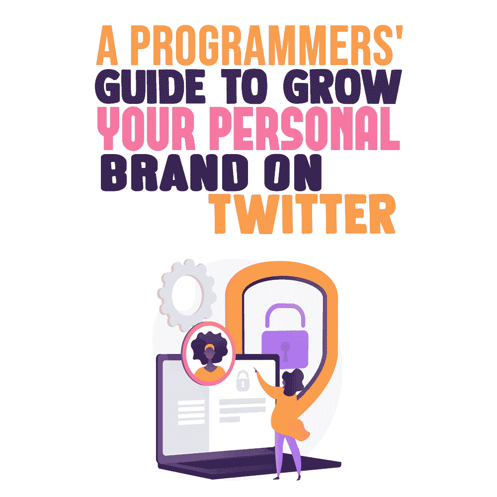
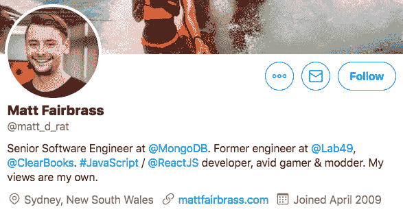
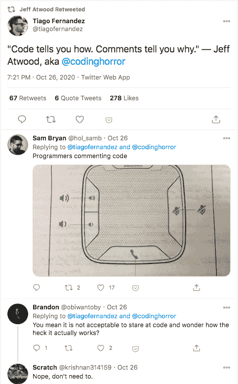
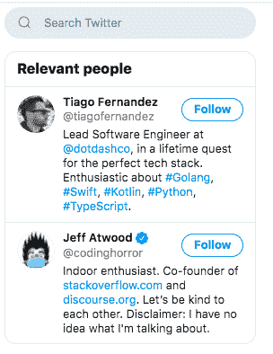
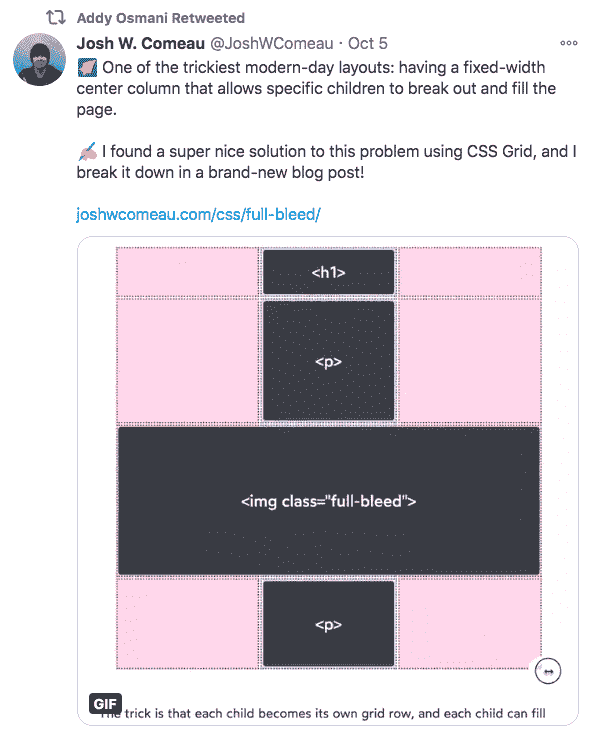
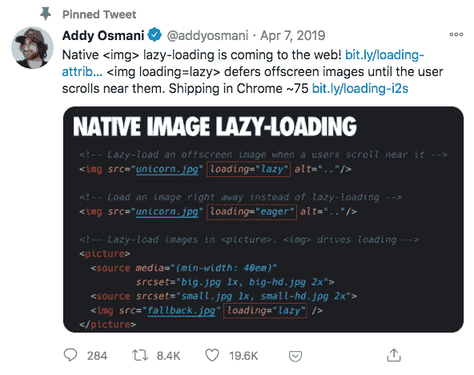

# 在 Twitter 上发展个人品牌的程序员指南

> 原文：<https://simpleprogrammer.com/programmers-guide-personal-brand-twitter/>

Personal branding is the latest buzz. Everyone is talking about building a personal brand and how it is helping them. Well, there is definitely truth to that.

作为一名程序员，你的个人品牌就像你在网络世界发布的简历或作品集。任何想雇佣你、为你工作或以任何方式与你交往的人，都会根据你的个人品牌来评判你。

拥有一个强大的个人品牌将建立你作为一个熟练程序员的声誉(最好是在你的领域)，帮助你获得知名度，并为你打开新的、令人兴奋的机会。

保持一个强大的个人品牌也将有助于你建立关系网，跟上最新的行业趋势。它会留下一个强大的思想领导力的痕迹，人们以后会参考。

作为一个程序员，个人品牌是你必须关注的。句号。你越早开始越好。你来到这里的事实表明你对建立你的个人品牌感兴趣。还有什么比 Twitter 更好的开始方式呢！

作为开发者，Twitter 是建立个人品牌的最强大的平台之一。内容很短，所以你可以快速接触到更多的人，而且你可以在你的领域内保持最新的行业趋势。

关注或联系他人没有任何限制，标签可以极大地提升你的影响力，最重要的是，你可以直接接触到许多程序员同事、思想领袖和业内有影响力的决策者。

如果你热衷于作为一名程序员在 Twitter 上建立一个强大的、有影响力的个人品牌，那么继续读下去，学习一些实际可行的策略。

## 定义你的品牌和编程定位

定义你的品牌是你在编程领域建立个人品牌的第一步。没有它，你就不知道朝哪个方向前进。

问自己这些问题:

*   你希望你的品牌是什么样的？
*   你希望别人如何感知你？
*   你希望在哪些编程领域和技术技能上出名？
*   你的价值主张是什么？与你的程序员同事相比，你有什么独特之处？
*   你未来的目标和抱负是什么？

基于你对这些问题的回答，你会对你作为开发者的理想个人品牌有一个大致的了解。你不必过度思考你的想法；现在弄错了也没关系。你可以随时改变方向。

但是为什么你需要一个利基来发展你在 Twitter 上的个人品牌呢？因为当你把自己的品牌和定位定义下来，你会得到更多的关注。

Twitter 上有很多程序员。然而，专门从事你的编程领域的人是很少的。因此，在 Twitter 上，你更有可能成为你所在领域的强有力的思想领袖。

有很多方法可以在 Twitter 上展示你的专长。你可以把它添加到你的个人简历中，也可以在你的推文中使用特定的标签。另外，你可以创建和分享与你的编程领域相关的内容。

尝试去超级利基与你的品牌。当你是一个多面手程序员时，你会面临很多竞争和更低的可见度。即使你擅长很多事情，也要坚持一个你擅长的领域。

例如，你可以说你是一名“PHP 开发人员”，而不是说“开发人员”或者，不要说“前端开发者”，你可以围绕“React JS developer”建立你的品牌。

[来源](https://twitter.com/matt_d_rat)

## 优化您的 Twitter 个人资料

你的 Twitter 个人资料将成为你个人品牌化整个过程的亮点。如果你弄错了这一点，其他一切都没多大关系。以下是一些需要记住的事情:

*   为你的个人资料图片添加清晰、专业的头像。个人资料照片是你留下良好第一印象的机会。因此，避免宠物照片、分散注意力的背景或你的网站标志。相反，要给人一种自信和友好的印象。
*   添加一张封面照片，为你的品牌增加可信度。例如，您可以添加一张您在会议上发言的照片、一张展示您编程技能的图片、一段您的网站、您获得的奖项或任何相关和有趣的东西。
*   优化你的简历。风趣地谈论你的爱好是很好的，但是主要集中在你的编程技能上。例如，如果你专攻 VueJs，那就在你的简历中提及。记住 Twitter 也是一个搜索引擎，所以当人们搜索“VueJs 开发者”时，你的个人资料就会弹出来。
*   **添加一个链接**。你可以链接到你的[个人博客](https://simpleprogrammer.com/blog-as-a-programmer/)或网站。

## 追随思想领袖，与他们交流

Twitter 上到处都是超级有影响力的人和决策者。无论你的个人品牌目标是什么，抓住顶级编程影响者的注意力都是好的。

从在 Twitter 上关注这些领导人开始。通过这样做，你不仅可以了解最新的行业新闻，还可以对这些人发布的内容类型以及领导者如何与他们的受众互动有一个大致的了解。比如，他们会分享代码片段、最新的行业更新或专家编码技巧吗？

接下来，定期与他们接触。评论他们的帖子。转发他们的帖子，并在转发的同时分享你的见解。

你也可以在你的推文上标记这样的领导人，同时分享一些与他们相关的内容。如果你的内容足够有趣，你甚至可能会得到他们的转发或提及，这对于你作为开发者的知名度来说是非常好的。

记得要真实地参与。不要为了评论而评论。如果你不同意某人，你也可以陈述。这种参与将向人们展示你也是一个领导者，而不仅仅是你编程领域的追随者。

[来源](https://twitter.com/tiagofernandez/status/1320724636078845952)

## 建立你的关系网

除了追随和接触领导，你还应该和与你有共同兴趣的程序员伙伴联系。

当你分享你的专业知识时，你需要在你的推文和内容上获得正确的牵引力。找到活跃在 Twitter 上的人总是很重要的，他们会与你分享编程技能，并有可能参与你的内容。

除了你的同事和你在现实生活中认识的人，你可以在 Twitter 搜索中找到更多的人。或者，你可以找到和你做类似事情的人，比如从事其他程序员的岗位。

每当你遇到这样的人，跟随他们，与他们交往。转发他们的内容。喜欢并评论他们的推文。您还可以通过向他们发送个性化信息来开始对话。

这样，人们会开始注意到你的个人品牌。他们会了解你的专业领域，最终会对你形成看法。有些人可能想更多地了解你的个人品牌。

这为你作为程序员的未来打开了一个全新的机会。人们会向你寻求建议，给你提供令人兴奋的机会，邀请你去社区，等等。这就是你个人品牌成长的方式。

## 发布有价值的内容

创建和管理与编码相关的有价值的内容将是人们如何将你的个人品牌视为一个可靠的开发者的主要决定因素，这就是为什么这是[个人品牌](https://www.amazon.com/dp/1949036758/makithecompsi-20)最重要的部分。如果你没有时间做这个，那么个人品牌不适合你。

### 策划有价值的内容

与创建和共享原创内容相比，管理内容是一种更简单的方式。你可以通过转发他人的推文或分享你每天遇到的伟大的、有价值的内容来策划有价值的内容，例如[有用的编码技巧](https://simpleprogrammer.com/learn-to-code-faster/)或[即将推出的适合你的工具](https://simpleprogrammer.com/12-front-end-tools-web-development/)。

[来源](https://twitter.com/JoshWComeau/status/1313089907968049158)

例如，如果你在 YouTube 上看到一个很棒的关于编程的教程，你可以和你的 Twitter 用户分享。您还可以共享博客帖子、时事通讯、图像、信息图表和任何其他有用的资源。

### 创造原创的、有价值的内容

虽然管理他人的内容很好，但你也应该发布原创内容。所以，开始在推特上谈论与你的领域相关的编程、想法和技巧，或者任何日常经历。

记得在可联系性上打高分。如果更多的人能认同你的内容，你会得到更多的参与。

您还可以共享您创建的任何其他原创内容。例如，如果你有一个发布博客文章和编码教程的网站，那么你可以和你的 Twitter 用户分享它们。

你还可以创建和分享其他有趣的内容形式，比如与编程相关的插图和信息图——特别是因为带有图片的推文往往会获得 150%的转发量。

你可以使用[免费的可编辑信息图模板](https://mindthegraph.com/templates)创建原创信息图，并在 Twitter 上分享。

记住，通过你的内容为别人的生活增加价值或者解决痛点才是关键。这些小块的内容，当组合在一起时，会给你的个人品牌增加更多的可信度，人们会开始认为你是你的编程领域的专家。

[来源](https://twitter.com/addyosmani/status/1114777583302799360)

## 研究你的标签

标签是非常强大的工具，可以提高你的参与度，增加你在 Twitter 上的知名度。标签起源于 2007 年的 Twitter，从那以后，它们被其他各种平台所采用。

不幸的是，很多人仍然认为标签只是为了好玩。如果是这样的话，那么你就不会在市场上看到这么多的标签搜索工具了。

标签是对社交媒体平台上的内容进行分类的一种方式。这意味着通过使用标签，人们可以找到、关注和消费他们感兴趣的内容。因此，通过正确使用标签，您可以获得可见性，并将您的影响力扩展到对编程感兴趣的新受众。

例如，如果你用标签 *#phpdeveloper* 发推文，关注这个标签的人会在他们的 feed 中看到你的帖子。这是发展你个人品牌的绝佳方式。

使用任何随机的标签都是可行的。但是如果你更有策略，你会得到更好的结果。事实上，你的推文和内容甚至可能会传播开来！

你可以使用 [Hootsuite](https://signupnow.hootsuite.com/) 、 [Hastagify.me](https://hashtagify.me/hashtag/Halloween) 、 [RiteTag](https://ritetag.com/) 或 [All Hashtag](https://www.all-hashtag.com/) 等工具为你的推文找到合适的标签。你也可以看看其他开发者的推文，看看他们在用哪些标签。

记得尝试你的标签。对别人有效的不一定对你有效。所以，改变你的标签，看看哪一个能给你最好的参与度。还有，坚持 Twitter 上的两三个标签；不要过度使用它们。

## 保持一致并进行实验

最后，就像其他事情一样，作为程序员，一致性是建立个人品牌的关键。为了你的未来，每天抽出点时间。

不要认为 Twitter 只是一个社交媒体渠道。Twitter 的意义远不止于此。如果你每天花几分钟时间活跃在平台上，你作为一名程序员的未来会完全不同。

另一件要记住的事情是多做实验，保持开放的心态。质疑常规。尝试不同形式的内容，比如幽默。试着每天带些新东西到餐桌上。经常创建令人兴奋的内容，让程序员社区感到惊讶。

Twitter 最棒的一点是你可以查看分析，比如浏览量、个人资料点击量和扩展量。您不需要任何其他工具来查看它们。这些分析有助于你了解什么类型的节目内容最能引起你的 Twitter 受众的共鸣。

## 在 Twitter 上发展你的个人品牌，确保你未来成为一名顶级程序员

个人品牌不仅仅是顶级企业家和行业精英的专利。作为一名程序员，无论你的目标是什么，你都需要发展你的个人品牌。

发展品牌的关键是脱颖而出，保持独特，增加价值——同时保持真实。不要假装你不是的东西。

现在轮到你了。作为一名专业程序员，现在就开始使用 Twitter 来发展你的个人品牌，你将在未来几年收获它的好处。