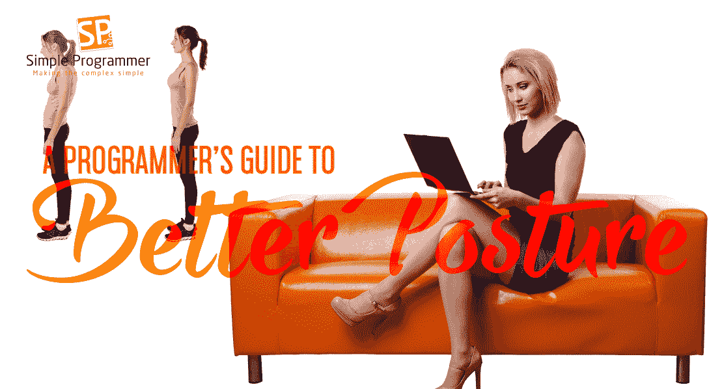

# 程序员更好姿势指南

> 原文：<https://simpleprogrammer.com/programmers-guide-to-better-posture/>

作为程序员，长时间呆在电脑前是我们的工作。如果你和我们一样，你坐在那里的时间越长，你的姿势就变得越糟糕。在没有意识到的情况下，你开始伸长脖子，把脸靠近屏幕。你耸起肩膀，瘫坐在椅子上。

尽管我们在开始一天的工作时可能是出于好意，但我们很容易忘记自己的姿势。不幸的是，不良的姿势会导致脊柱健康不佳和一系列持续的颈部和背部疼痛。

## 问题是

那么，在电脑前工作到底是什么导致了颈部和背部疼痛呢？

由于不良姿势和没有背部支撑而导致的弯腰驼背会给背部肌肉带来真正的压力，并对脊柱造成压力。在持续的压力下，你不良的姿势实际上会导致脊柱的解剖结构发生变化，最终增加血管和神经收缩的几率。严重的肌肉、椎间盘和关节问题加剧了这些问题。

除了慢性颈部和背部疼痛之外，这些脊柱变化还会导致头痛、疲劳、呼吸问题，甚至对一些主要器官造成损害，这可能会影响身体功能，如肠道和膀胱控制。

## 狐狸

有几种方法可以改善你的脊柱健康，但是让我们从对你的工作空间做一些简单的改变开始。

作为一名程序员，你可能一天要在办公桌前连续工作几个小时，这意味着你的桌面需要设置成功。从你的椅子到桌子的高度和屏幕的位置都会影响你的姿势。

[无论你是在家工作还是在咖啡馆](https://simpleprogrammer.com/2014/03/19/hate-job-wish-work-anywhere-world/)工作，你的办公桌和椅子的比例都可能会失调。理想情况下，你需要坐在一把椅子上，让你的肩膀放松并向后拉，保持前臂与地板平行的姿势。如果你把手伸向键盘或者耸起肩膀，你就会知道你的设置错了。

虽然站立式办公桌是获得更好姿势的绝佳选择，但我们中的许多人仍然想坐着。在这种情况下，找到合适的椅子是当务之急。合适的椅子应该有一个舒适的坐垫，有足够低的扶手，当你的肩膀完全放松时，可以让你的肘部保持 90 度。它还应该是高度可调的，所以你可以调整它相对于你的桌子的高度。

当你坐在椅子上时，你的脚应该平放在地板上。选择一把能够支撑腰部的椅子，以减轻腰部的压力。拥有一个旋转或旋转的也是值得的，因为它可以减少伸手拿东西或四处走动对你身体的压力。

一旦你有了一把顶级的椅子，确保你的桌面和屏幕的高度是正确的。我们在使用电脑时犯的最大错误之一就是把显示器放得太低，以至于我们最终会伸长脖子，向下看，并因此向前弯腰。

您的显示器或笔记本电脑屏幕应该在您的视线范围内，无需调整您脖子的正常位置。笔记本电脑支架和竖板是支撑屏幕的好方法，而且非常实惠。不要误以为更大的显示器就不需要竖板了。桌面显示器虽然通常较大，但高度不一定合适。可能需要将它放在架子、盒子甚至书本上，以获得合适的高度。

如果你用的是笔记本电脑的支架，那么你需要一个外接键盘和鼠标垫。正确安排键盘和鼠标垫的人机工程学是简单的。只需将键盘直接放在自己面前，鼠标垫离得足够近，这样就不必伸出手臂去够了。随着时间的推移，即使是像伸手拿鼠标垫这样小而持续的动作也会导致脊柱不适。

## 舒缓的伸展

If your back and neck are starting to feel sore and achy, there are a few stretches you can do to alleviate the pain.

下蹲是一种最简单也是最基本的方法，可以减轻你下背部的压力，打开你的身体。双脚平放在地板上，双腿分开略宽于臀部，下蹲。尽量下沉，如果需要的话，抓住墙或椅子来平衡自己。保持你的脸向前和向后伸直，你的膝盖和脚踝最初可能会有感觉，但随着时间和练习，你会发现它不仅对你的背部，而且对你的整个身体都有舒缓作用。

你可以做的另一个伸展运动包括使用泡沫背块。在笔记本电脑前度过漫长的一天后，躺在地上，在你的脊椎底部放一个木块。这个姿势打开了你的下脊柱节段，有助于将脊髓液重新分配回你的椎间盘。

此外，使用泡沫背垫有助于缓解因肩膀前倾引起的上背部疼痛。这个姿势将你的肩膀向后拉，扭转你可能一直坐着的驼背姿势。

试着每小时将这些动作融入你的日常生活，这样你就不会整天保持同一个静止的姿势。每 20 分钟活动一下是最理想的，你会惊讶地发现，更有规律地活动会让你的脊椎感觉更舒服。

## 主动背部护理

保持正确的姿势，创造一个符合人体工程学的工作空间，每小时活动一次，这对保持脊柱健康至关重要。虽然我们可能无法控制每天花在屏幕前的时间，但我们可以控制是否让它压垮我们的背。

积极关注你的脊柱健康，避免长期的颈部和背部疼痛。如果你已经使用了其中的一些技术，我们很想听听结果。[实施这些改变](https://simpleprogrammer.com/2010/08/24/programmer-fitness-journey-a-lifestyle-change-not-a-diet/)对你的脊椎压力有明显的影响吗？请在评论区分享您的更改，让我们知道。