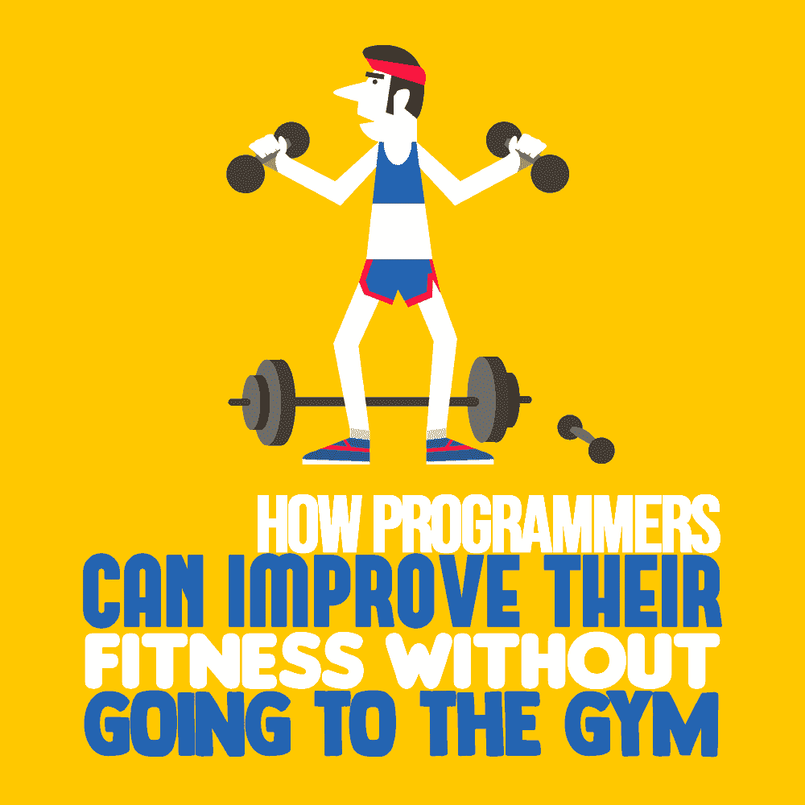

# 程序员如何在不去健身房的情况下提高体能

> 原文：<https://simpleprogrammer.com/programmers-improve-fitness/>

You don’t need to hit the weights or jump on the treadmill to improve your fitness. I’m not even going to ask you to change [your diet.](https://simpleprogrammer.com/programmer-fitness-journey-a-lifestyle-change-not-a-diet/) Your life is busy. The backlog is full, and you want to focus on development. Adding another activity is the last thing you want to do.

幸运的是，不需要做任何剧烈的改变就可以很容易改善你的健康。对你的日常编程程序做一些小小的修改就能让世界变得不同。

缺少时间经常被作为不锻炼的理由。如果我们的工作压力很大，有很多事情要做，我们可能会觉得自己负担不起锻炼。但是缺乏活动会降低你的生产力，增加你的压力，导致抑郁。不花时间去锻炼，你会加剧时间紧张的问题。

最重要的是不要让你的文本编辑器把你困在办公桌后面。脱离，即使只有几分钟，对健康也有一定的好处。去厨房再喝一杯咖啡的缓慢旅程并没有拖你的后腿，而是改善了你的状况。站起来盯着窗外？全部阳性。

有了这些建议，你可以在从事程序员工作的同时轻松提高自己的健康水平。

## 站起来，伸展你的身体，让你更健康

在我们开始走路之前，我想谈谈对我们许多人来说更容易的事情:站起来。

很容易忘记时间，连续几个小时盯着源代码。我们可能深陷某个问题，或者在技术论坛上进行漫长的知识搜索。这种流动甚至可以超越我们的内在需求，比如喝水和使用浴室。不知何故，我们完全有能力坐着不健康的时间。

然而，事情并不一定是那样的。我也是一名程序员，但我很少一次坐着超过 30 到 60 分钟，而且，在一天中，我有很多非坐着的时间。不过，我仍然很现实；我的大部分时间都是坐着度过的，但它被显著地分解了。养成站着的习惯并保持高效和流畅并不需要太多努力。

从日常通勤的火车或公共汽车开始。考虑站着而不是坐着。即使感觉不像是一项活动，它也在改善你的健康。众所周知，长时间坐着会增加死亡率，所以抓住一切机会站起来。

一开始你可能不喜欢它，你会发现你的身体有点抱怨。这些都是一些事情正在改变的好迹象。

想想你一天工作中能忍受的所有方式。如果你在打电话，站起来说话。确保你的站立会议实际上是站着进行的。尽量让所有简短的临时会议都不用椅子。如果你有问题要问同事，不要发信息，而是站起来问他们。只要一分钟或几秒钟都没关系。站立对健康有积极的好处。

如果你想尝试，试试可转换的站立式书桌；它们鼓励站立，[减少疼痛](https://www.ncbi.nlm.nih.gov/pubmed/23057991)，并且[可以摆脱疲劳和不适](https://www.ncbi.nlm.nih.gov/pubmed/25168375)。也许你坐着的时候编码效果最好，但是你可以把你的笔记本电脑放在更高的地方进行其他活动，比如阅读电子邮件。试着坐在瑜伽球上，或者在椅子上放一个摇摆垫球。

所有这些小变化都是低强度的，但是给你的身体带来了大量的额外运动。交替站立和坐着会改善你的健康，尤其是如果你超重的话。

试试办公室瑜伽。做一个简短的搜索，看看你可以在办公桌后或工作时在走廊上做的许多伸展和运动。

你是否担心这看起来如何，或者尴尬？不幸的是，这是我们需要改变的社会形象。活跃而非不活跃应被视为常态。但这真的是个问题吗？如果你的同事站起来开始拉伸，你会怎么想？一点同龄人的压力可能有助于开启一种趋势。这将会产生一个健康的办公室，把地位作为他们文化的一部分。

无论如何，即使是一点点轻微的社交不适，也远胜于长期久坐可能导致的糖尿病、中风、心脏病和其他一系列疾病。

一开始，你可能没有做办公室瑜伽的意愿，但无论如何都要站起来。仅仅是打断你坐着的行为就对健康有积极的影响。

## 再走一步，开始走

我们都得有自己的位置。我们如何到达那里会对我们的健康产生重大影响。

每天多走路可以帮助你减轻体重，锻炼肌肉，提高认知能力。散步是一种低冲击的运动，对身体几乎没有压力。它不需要特殊的设备，不需要热身，不需要计划，而且对我们大多数人来说，它没有缺点。

我们大多数人住得离工作地点不够近，不能步行去上班。但是考虑早点下车，或者把车停在更远的地方。你不需要走一个小时到办公室，但是增加 5 到 10 分钟是有益的。

此外，该策略通过创建更大的目的地区域来改善您的交通选择。在某些情况下，这可以减少到达办公室的时间。

For days you work at home, or for those of us mainly coding remotely, there are even more options. You could take a walk at lunch or to the store. Getting outside is important. But there’s plenty of beneficial housework to do as well. Many chores, like cleaning, doing the laundry, or vacuuming, can be done in short increments and spread throughout the day. These get you moving, which is as good as walking.

午餐是另一个给你的时间表增加一些散步的好机会。避免订外卖，如果天气允许，去外面吃。最好带一份午餐或者买一些能让你边走边吃的东西。

如果你必须坐着，那就找一个足够远的地方，然后在那里吃饭。有树的地方很好，因为自然已经被证明能让我们更快乐。午餐是一个很好的时间来改变我们的风景，并从坐着休息一段时间。

散步有许多心理上的好处。它让你平静下来，减轻压力，并给你再次处理代码所需的清晰思路。一项研究甚至显示，只要步行 12 分钟，这些益处就会发生。

如果你正在解决一个讨厌的 bug 或者一些代码让你感到沮丧，出去走走可能是解决这个问题的最好方法。这绝不是懈怠或不敬业。恰恰相反。我们拥有的最好的工具不是我们的集成开发环境(IDE)，而是我们的大脑。而刷新那个工具，我们的头脑，是面对困难时高度理性的选择。另外，我们甚至可以在不积极思考问题的情况下解决问题。

如果你想更进一步，考虑[间歇性禁食](https://simpleprogrammer.com/programmers-guide-fasting/)。这是改善你生活方式的下一个最简单的选择。这很容易实现，间歇禁食可以复合步行的好处。

## 每一小步都会改善你的健康

通常，如果我们认为我们没有时间做任何有意义的事情，我们就会失去做事情的信心。这就像那些我们害怕处理的错误，因为我们相信它们会花太长时间。我们认为那些小小的伏案瑜伽，或者在办公楼周围散步，是没有用的。这与事实相去甚远。

少量的活动有积极的效果。甚至像每三个小时走五分钟这样简单的事情也能降低心血管风险并提高认知能力。

有证据表明，任何量的活动都有帮助，效果是累积的。就像清理代码一样，一次一行。没有必要担心短时间内无效；取而代之的是，尽可能的多花些时间。美国心脏协会在这一点上也很有信心，指出一天中所有这些小运动量累积起来就是 T1。

站起来本身是有益的。你做得越频繁越好。如果这是你现在能做到的，那就顺其自然吧。如果你觉得出去走走很困难，不要气馁。无论你做什么都会改善你的处境。

也许，随着时间的推移，你会发现增加更多的活动更容易。你将很快[感受到那些精神和身体休息的好处](https://simpleprogrammer.com/get/mini-habits)。

现在，站起来，走向最近的人，请他们站起来，谈论这篇文章。这确实会改善你的健康。