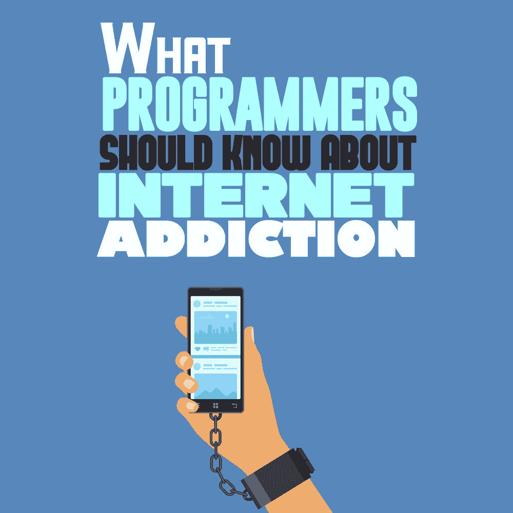
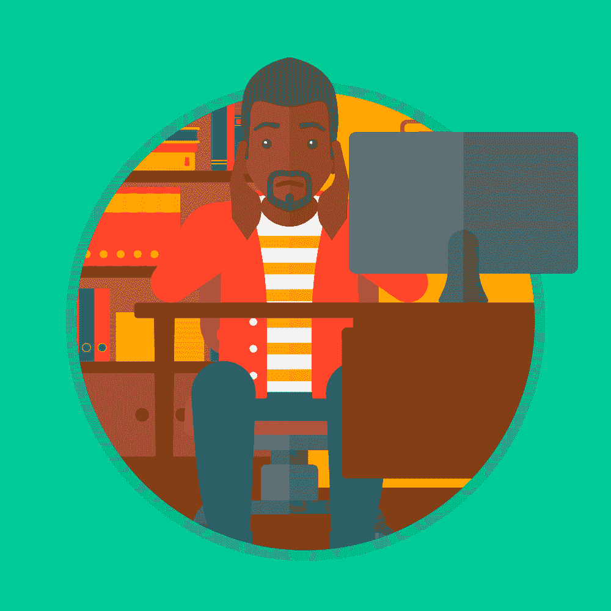

# 关于网瘾，程序员应该知道什么

> 原文：<https://simpleprogrammer.com/programmers-internet-addiction/>

Virtually anyone can develop an internet addiction, but programmers have some extra challenges in this area. After all, if you do most of your work online, you can’t exactly avoid using the internet.

如果你浏览关于网瘾的在线问卷，你可能会发现很多问题没有帮助。像“你每天上网超过六个小时吗？”不为你工作。当然你每天花在网上的时间超过六个小时。这是你的工作。你必须做像[学习编码语言](https://edabit.com/?ref=johnsonmez2)和回复客户邮件这样的事情。

对于一个程序员来说，一个对互联网使用上瘾的人可能看起来和不在这个领域工作的人有点不同。通过学习如何发现上瘾的迹象，你可以保护自己或在必要时寻求帮助。这篇文章深入探讨了网瘾和程序员的具体情况。

## 成瘾和多巴胺

网络成瘾和其他成瘾一样，涉及多巴胺。多巴胺是一种奖励化学物质，能带来满足感和幸福感。

作为一种奖励化学物质，多巴胺的作用是让你重复一种行为。这就是为什么像吃饭和锻炼这样的活动也会产生多巴胺:多巴胺释放的感觉很好，所以你更有可能重复导致它的行为。

虽然大脑自然产生多巴胺，但成瘾劫持了这一过程。例如，收到电子邮件或社交媒体通知的“叮”声会引发多巴胺释放。当有人点击电子邮件或通知时，产生的多巴胺会发出非常强烈的“重复这个动作”的信息。对于程序员来说，这可能会让他们在计划软件开发项目、推销自己或做其他重要任务时分心。

## 人们是如何沉迷于网络的

所有这些如何应用于互联网的使用？嗯，现在的大部分互联网都是为了让人上瘾而设计的。如果你给网站编程，你已经知道网站所有者希望人们不断返回。越多人点击他们的网站，点击产生的收入就越多。网站使用增加多巴胺的“奖励”，如明亮的颜色，以确保人们多次返回。

想想社交媒体，它在你每次滚动时提供图像、通知和新信息。所有这些都会激发多巴胺的产生，从而鼓励你再次登录。对许多人来说，这种循环导致上瘾。

## 程序员网瘾的征兆

所有这些对程序员来说意味着什么？很多人上网很容易，但是程序员要比大多数人花更多的时间上网。

虽然其他人可能可以利用互联网休息，但程序员很难脱身，因为他们的生计需要他们在场。当然，当你已经在线时，点击你最喜欢的娱乐网站或社交媒体应用程序就太容易了。如果你担心网络成瘾，看看下面讨论的迹象。

### 不编程或不在线时，你会感到焦虑

想象一下和一些朋友去餐馆吃饭。你们都决定在整个用餐过程中关掉手机，这样你们就可以不受干扰地享受彼此交谈的乐趣。这顿饭持续了大约一个小时。这个想法让你感觉如何？

一想到这个，你会感到不安或焦虑吗？你担心你可能无法专注于谈话吗？也许你担心错过重要信息，或者你想知道如果有人试图伸出手会发生什么。

如果你有网瘾，那么当你不上网时，你可能只能专注于上网。离开它太久可能会产生一种焦虑或恐慌感，把你拉回来一次又一次地使用互联网。网络成瘾在这方面很像尼古丁成瘾。网络“渴望”可以像吸烟一样让人分心。

### 你强制检查非编程网站

我们大多数人每天都会查看社交媒体和其他网站。这种习惯并不总是表明上瘾。然而，重要的是你为什么登录。

当你不工作的时候，你上网是因为你想上网吗？或者你上网是因为你觉得有必要？如果不上网，你会觉得“不对”或“关”吗？你可能没有意识到为什么你一开始会检查某些网站。当你发现自己整天都在拜访他们时，问问自己是什么促使你这么做的。

上瘾让一种物质或行为感觉更像是一种“需要”，而不是“想要”。如果你需要登录，即使你没有编程，你可能有网瘾。上网的冲动会让你远离当下，影响你与朋友和家人的互动。

### 你对互联网的使用影响了你的编程和生活

Internet addiction can impact all areas of your life. Has your internet use gotten in the way of your day-to-day tasks?

例如，想想你的[软件开发生涯](https://www.amazon.com/dp/0999081411/makithecompsi-20)。如果你有网瘾，你可能会在项目上落后，因为你把工作时间花在了非工作网站上。或者你可能会因此失去注意力并犯错误，这可能会妨碍 T2 获得一份有利可图的职业。

在你的非工作时间，你可能已经注意到与朋友和家人保持联系变得更加困难。你可能也对不涉及互联网的休闲活动失去了兴趣。

### 您有成瘾或其他精神健康疾病史

上瘾是复杂的，它会造成伤害。检查你的设备的冲动会增加你的焦虑，阻止你享受这一刻，并阻止你参加你本来会喜欢的活动。有些人比其他人更容易受到伤害。不仅仅是上瘾行为本身。成瘾有几个因素，包括:

*   遗传学——像许多其他健康状况一样，上瘾通常是家族遗传。
*   压力(Stress)—当有压力时，人们经常从上瘾的行为和物质中寻求安慰。
*   **大脑化学**——同样，成瘾通过接管大脑的多巴胺系统而起作用。
*   **环境** —熟悉的环境会让人陷入旧习惯，包括上瘾的习惯。
*   **生活环境** —上瘾通常与创伤和苦难有着紧密的联系。

如果你或你的任何家庭成员都有滥用药物的经历，你可能也容易网瘾。同样，如果你有另一种心理健康状况，你也可能有更高的风险。

### 你永远不会觉得你有足够的时间上网，即使是在编程一整天之后

成瘾使得节制几乎不可能，这包括网络成瘾。如果你曾经试图为自己设定屏幕时间限制，你可能会遇到这个问题。很多人发现他们指定的屏幕时间永远都觉得不够。不管他们花多少时间滚动，他们觉得他们需要更多。

试着从手机或电脑上查看你的屏幕时间。数字看起来准确吗？无意识的滚动会让时间感觉更快。例如，与有意阅读一篇文章不同的是，无意识地滚动可能看起来只是几分钟，即使它需要更长的时间。再次强调，留意你为什么上网可以帮助你获得一些清晰的概念，并建立更好的习惯。

## 如何预防网瘾

谢天谢地，网瘾是可以预防的。当你平衡工作和个人互联网使用时，试着结合以下策略。

*   **使用问责制**——让一个朋友或家庭成员和你一起检查你的互联网习惯。
*   **屏蔽诱惑性网站** —如果你经常在工作时访问社交媒体和娱乐网站，试着在你的工作电脑上屏蔽这些网站。
*   **设置无屏幕时间** —指定禁止使用屏幕的时间。例如，你可以练习周末不看屏幕，或者你可以在午餐前远离社交媒体。
*   **为应用程序设置时间限制** —大多数智能手机都允许用户为特定的应用程序设置时间限制。决定哪些应用程序占用你的大部分时间，并让你的手机在你达到极限时提醒你。

## 网瘾何时寻求帮助

然而，也许你已经尝试了以上所有的建议，但是并没有取得多大的成功。如果是这样的话，那么要明白你不是唯一一个遇到这个问题的人。

大脑的奖励系统是一个强大的东西。它负责一些最重要的人类行为。网瘾看似简单，但请记住，它涉及一个高度复杂的系统。因为它涉及到 T2 习惯和大脑化学物质，你可能需要一些帮助来克服你的上瘾。

如果可能的话，向顾问或治疗师询问你的选择。像认知行为疗法和支持团体这样的方法可以起到很大的作用。对于一些人来说，药物治疗可能会有所帮助，尤其是当成瘾伴有抑郁症等共病时。

网瘾不一定要占据你的生活，哪怕你是做程序员的。当然，作为一名程序员，网瘾对你来说可能会变得比一般人群更复杂。你可以采取措施保护自己，防止上瘾，甚至治疗你的网瘾，如果你已经有了网瘾的话。通过寻求帮助，你可以开始重新控制你的时间和注意力。