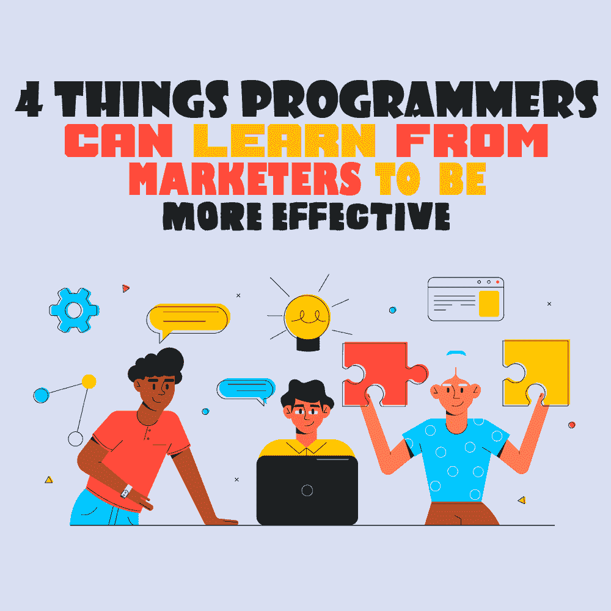

# 程序员可以从营销人员那里学到更有效的 4 件事

> 原文：<https://simpleprogrammer.com/programmers-learn-from-marketers/>

According to estimates from experts, there will be over [28.7 million](https://www.daxx.com/blog/development-trends/number-software-developers-world) programmers in the world by 2024.

这意味着，作为一名程序员，在这样一个竞争激烈的数字环境中，你需要想办法让自己对观众更有效。

这就是个人品牌的用武之地。

个人品牌的概念本质上和企业品牌是一样的。它包括向人们展示你是谁，你对什么有热情，以及是什么让你与你所在领域的其他程序员不同。

在这篇文章中，我将介绍个人品牌的本质以及它如何应用于程序员。通过这种方式，你可以最大限度地发挥你作为专业人士的影响力和价值，并改善你的职业前景。

## 你为什么要维护你的个人品牌？

你的品牌是别人而不是你持有的一种情感感知。它描述了他们与你关系的经历。个人品牌化可以定义为一个持续的、一致的过程，无论是在线还是离线，将自己作为一个产品或品牌进行展示或营销。

简而言之，这是你与众不同的本质。

虽然你个人可能不需要[渠道管理策略](https://businessguru.co/channel-management/)来与他人联系，但始终如一地维护你的个人品牌是很重要的。

你会问，为什么这很重要？

作为一名程序员，有多种原因让你需要关注你的个人品牌。其中包括:

*   协助[找工作](https://www.myjobsearch.com/find-a-job/)
*   提高你在行业中的信誉和权威
*   传播你的影响力，增加你的价值
*   指导其他开发人员
*   作为自由职业者获得更多的合同
*   让用户发现你或你的企业

请记住，你的技能对你的品牌至关重要，因为它们将证明你的专业知识，并帮助你变得更加有效。

我建议你使用[技术技能测试](https://devskiller.com/talentboost/)网站，这样潜在客户可以了解你在他们寻找的领域有多精通。

既然你已经理解了什么是个人品牌，以及为什么它对想要变得更有效率的[程序员来说至关重要](https://simpleprogrammer.com/programming-efficiently/)，让我们来看看你可以开始建立一个强大品牌的不同方法，这将推动你的业务和职业向前发展。

## 定义你的目标受众

由于你的[个人品牌](https://www.amazon.com/dp/906369315X/makithecompsi-20)涉及你做出的承诺和你对所提供服务的期望，因此确定你的目标受众至关重要，这样你就可以向*相关*客户推销自己。

在很大程度上，成功的程序员是那些“适应环境”的人利基仅仅是一个专业化或一个更大的市场，你的特定服务的重点更小的子集。

例如，你可以选择 NoSQL 数据库作为你的专业领域。或者，也许你决定成为一名 JavaScript 大师，这样你就被认为是该领域的权威或开发专家。

通过细分并尽可能具体地说明你的服务是什么，作为程序员，你可以建立一个更强大、更令人难忘的品牌。然后，你将能够确定向哪些人(也就是你的目标受众)推销你的服务，并创建特定的信息，将你的核心竞争力有效地传达给他们。

## 树立你的形象

在明确了谁是你的目标受众之后，成为一名更有效的程序员的下一步是在网络空间建立你的存在。您可以通过许多不同的方式提出索赔，包括:

*   [建立自己的博客](https://www.onehourprofessor.com/start-blog/)
*   在 GitHub 上创建作品集
*   活跃在 LinkedIn 和 Twitter 上
*   创建一个 YouTube 频道( [Movavi](https://www.movavi.com//) 是一个简单的视频编辑器，适合初学者，如果你需要的话)
*   在权威网站上创建高价值的客座博客内容

这样做有助于为今后的进一步扩张打下基础，这就是为什么它是建立个人品牌的整个过程中最重要的部分之一。

在各种平台上设置个人资料时，如网站、社交媒体、论坛等。记住你的目标受众的当前体验，这样你就可以用他们能理解的方式与他们交流，无论是专业的商业交流还是编程术语。

换句话说，确保你有效地传达了你所做的承诺和你对服务的期望。

## 起草一份令人信服的使命陈述

一个没有信息的品牌是不会有所成就的，因为它没有试图传达任何信息。

要成为一名更有效的程序员，你需要一条信息，告知潜在客户你的品牌是什么，并概述你的品牌将实现的一系列承诺和期望。

这就是为什么你建立一个稳固品牌的下一步是起草一份令人信服的使命陈述:一份简短的陈述，解释为什么你或你的组织存在。它概述了您的总体目的和目标、您提供的服务类型以及您的主要市场。

为了帮助你构思一个强有力的信息，问自己以下问题:

*   作为一名程序员，你提供了什么独特的价值？这将使你从其他程序员中脱颖而出，让你的听众记住你。
*   你想突出什么技术技能或创造性专长？这将有助于向他人传达你的权威和专业知识，展示你最强的技能。
*   为什么有人会雇佣你(或你的公司)做这份工作？这将有助于他人了解你将为他们的公司带来的独特价值，以及你是如何帮助他们找到问题解决方案的最佳人选。

底线是，精心制作你的使命宣言是你应该认真对待的事情，因为它是你品牌的主要组成部分。

## 推出您的活动

当你完成上述步骤后，就该展开一项与你的目标一致的活动了。

这里的目标是通过内容创作和利用社区和活动的力量成为权威。或者，如果你遇到一门你真正喜欢的课程，并认为其他人会从中受益，[考虑使用 PLR 方法](https://www.problemio.com/udemy/white-labeling-or-buying-udemy-courses.html)向其他人推销。

First, you need to [start creating high-value content](https://simpleprogrammer.com/wordpress-developer-blog-consistently/) that exposes your passion for programming. And don't worry, you don't have to be the best in your field, with years of experience under your belt, in order to be able to share your knowledge. There will always be a lot of people who are less experienced than you and are happy to have found your advice.

此外，如果你有时间，你也可以创建一些免费的工具，如密码生成器、URL 解码器或浏览器更新工具。

这样，你可以展示你的专业技能，让人们使用你的东西并与他人分享，这将增加你的品牌曝光率。

除了创建和分享高质量的内容以及免费工具来提高您作为程序员的可信度和权威，您还应该专注于加入社区、参加活动以及与有共同兴趣的志趣相投的人建立联系。

这个想法是让你的声音在那里，帮助人们了解你有什么技能，并在一致的基础上向他们提供价值。

无论是线上还是线下，这些类型的互动可以极大地提高你的品牌知名度。

如果你想更进一步，并在这个过程中开发超级粉丝，把你的观众带到一个页面，在那里你使用这里的一个电子邮件平台收集他们的电子邮件地址[。](https://www.onehourprofessor.com/best-email-marketing-software-services/)

一旦你收集了他们的电子邮件地址，你就可以设置电子邮件自动化来自动发展这些关系，并建立有意义的联系，这是你永远无法通过博客或 YouTube 上的评论系统实现的。

## 个人品牌有助于你脱颖而出

照顾好你的个人品牌有助于你从其他程序员中脱颖而出。如果做得正确，你的个人品牌将反映你的背景、技能、优势和独特性。

然而，建立个人品牌并不是你需要过多考虑的事情。只需专注于做一些小事，就能始终如一地建立和强化你的形象。

这包括与*和*联系，定期在你的博客、社交媒体或论坛上吸引你的观众。

随着时间的推移，这将帮助你[建立一个引人注目的品牌](https://www.amazon.com/dp/0593084314/makithecompsi-20),让你成为一名更有效的程序员。

轮到你了。你目前使用什么策略来帮助你改善你的业务或职业成果？在下面的评论中分享你的想法吧！